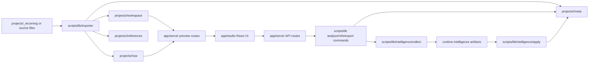

# Canvas Helper Architecture

## What This Repo Is

Canvas Helper is a local-first course-content workbench. It imports Canvas-generated HTML or bundle folders, preserves a raw baseline, creates an editable workspace copy, serves both views locally in Studio, and runs Node-based project commands for analyze, refs, export, packaging, and handoff support.

## Why Local-First

- project data lives on disk under `projects/<slug>/...`
- preview routes serve local files directly
- Node handles filesystem operations and command execution
- the browser is a local operator shell, not the system of record
- the workflow must stay usable without hosted infrastructure

## System Diagram

## High-Level Boundaries

### Frontend

- location: `app/studio/`
- responsibility: UI state, controls, preview composition, command output display
- not responsible for: filesystem access, route logic, path validation, or direct command spawning

### Local Server

- location: `app/server/`
- responsibility: API endpoints, preview handlers, request parsing, path validation, command bridge, session-log writes
- not responsible for: frontend rendering or project transformation logic

### Scripts / Engine

- location: `scripts/`
- responsibility: import, analyze, refs, export, packaging, rehydrate, smoke verification
- not responsible for: browser UI behavior

### Project Data

- location: `projects/<slug>/...`
- `raw/`: immutable imported baseline
- `workspace/`: editable output
- `meta/`: manifests, logs, prompt-pack, session log, optional policy overrides
- `references/`: raw support files plus extracted text
- `exports/`: generated output only

## Intelligence Model

The intelligence system is split into explicit layers:

- `collect/`: always-on signal gathering and persistence
- `apply/`: optional influence on prompt-pack generation and recommendations
- `config/`: policy defaults, flag resolution, and mode handling

### Modes

- `off`: no learner collection, no learner application
- `collect`: collection only, no learner application
- `apply`: collection plus learner application in prompt-pack and recommendation flow

### Precedence

1. CLI override
2. `LEARNER_MODE` environment variable
3. project policy override
4. repo default policy
5. built-in safe default (`collect`)

## Core vs Experimental

### Core

- import
- analyze
- refs extraction
- Studio preview
- local command execution
- Brightspace export/package
- prompt-pack generation
- memory ledger and pattern-bank collection

### Policy-Controlled

- intelligence influence on prompt packs
- recommendation steering

## Learner-mode Resolution

Precedence for the effective learner mode is explicit and deterministic:

1. CLI flag (`--learner-mode`)
2. `LEARNER_MODE` environment variable
3. project policy
4. repo default policy (`config/intelligence.json`)
5. safe default in `scripts/lib/intelligence/config/defaults.ts`

## Placement Rules for New Code

- If it renders UI, it belongs in `app/studio/`
- If it handles HTTP-like requests or preview file serving, it belongs in `app/server/`
- If it mutates project files or runtime artifacts, it belongs in `scripts/`
- If it learns from project history, it belongs in `scripts/lib/intelligence/collect/`
- If it changes how intelligence influences current work, it belongs in `scripts/lib/intelligence/apply/`
- If it changes policy or defaults, it belongs in `scripts/lib/intelligence/config/`

## Reasoning Rules for New Agents

- Start with the owning boundary, not the nearest file.
- Preserve local-first behavior.
- Keep Node as the engine and the browser as the local shell.
- Prefer explicit modules over hidden cross-layer coupling.
- Treat `raw/` and `exports/` as protected artifacts.
