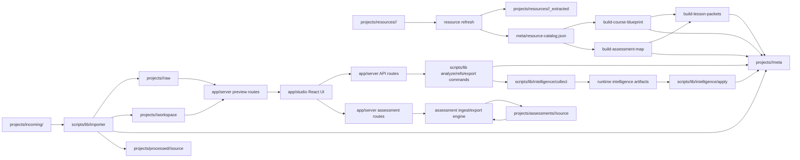

# Canvas Helper Architecture

## What This Repo Is

Canvas Helper is a local-first course-content workbench. It imports Canvas-generated HTML or bundle folders, preserves a raw baseline, creates an editable workspace copy, serves both views locally in Studio, and runs Node-based project commands for analyze, refs, export, SCORM packaging, and handoff support.

## Why Local-First

- project data lives on disk under `projects/<slug>/...`
- preview routes serve local files directly
- Node handles filesystem operations and command execution
- the browser is a local operator shell, not the system of record
- the workflow must stay usable without hosted infrastructure

## System Diagram

## High-Level Boundaries

### Frontend

- location: `app/studio/`
- responsibility: UI state, controls, preview composition, command output display
- not responsible for: filesystem access, route logic, path validation, or direct command spawning

### Local Server

- location: `app/server/`
- responsibility: API endpoints, preview handlers, request parsing, path validation, command bridge, session-log writes
- not responsible for: frontend rendering or project transformation logic

### Scripts / Engine

- location: `scripts/`
- responsibility: import, analyze, refs, export, packaging, rehydrate, smoke verification
- not responsible for: browser UI behavior

### Project Data

- location: `projects/<slug>/...`
- `raw/`: immutable imported baseline
- `workspace/`: editable output
- `meta/`: manifests, logs, prompt-pack, session log, optional policy overrides, and derived planning artifacts such as `resource-catalog.json`, `course-blueprint.json`, `assessment-map.json`, and `lesson-packets/`
- `projects/resources/<slug>/`: raw support files plus extracted text
- `projects/assessments/<assessment-slug>/`: global assessment-library items (`source/`, `assessment.project.json`, `import-result.json`, `exports/brightspace/`)
- `exports/`: generated output only

### Intake and Resources

- `projects/incoming/`: one-shot import queue for HTML files and bundle folders
- `projects/processed/<slug>/source/`: latest kept import snapshot for that project
- `projects/resources/<slug>/`: canonical original reference files
- `projects/resources/<slug>/_extracted/`: generated extracted text for Studio and prompt-pack flows

Studio and the watcher both use the same local refresh engine. The `Refresh Intake` button runs a one-shot scan through the local server. The long-running watcher scans both `incoming` and `resources` with the same lock file so the two entry points do not collide.
If a canonical `projects/<slug>/` root is missing required manifest/raw/workspace artifacts but `projects/processed/<slug>/source/` still exists, project discovery re-imports from that processed snapshot to restore the canonical project automatically.

## Intelligence Model

The intelligence system is split into explicit layers:

- `collect/`: always-on signal gathering and persistence
- `apply/`: optional influence on prompt-pack generation and recommendations
- `config/`: policy defaults, flag resolution, and mode handling

### Modes

- `off`: no learner collection, no learner application
- `collect`: collection only, no learner application
- `apply`: collection plus learner application in prompt-pack and recommendation flow

### Precedence

1. CLI override
2. `LEARNER_MODE` environment variable
3. project policy override
4. repo default policy
5. built-in safe default (`collect`)

## Core vs Experimental

### Core

- import
- analyze
- refs extraction
- assessment-library ingest (PDF/DOCX), validation, and Brightspace CSV export
- resource classification and chunk indexing
- course blueprint generation
- assessment mapping
- lesson packet generation
- Studio preview
- local command execution
- Brightspace export/package
- SCORM 2004 / 1.2 package export with suspend-data bridge
- prompt-pack generation
- memory ledger and pattern-bank collection

### Policy-Controlled

- intelligence influence on prompt packs
- recommendation steering

## Learner-mode Resolution

Precedence for the effective learner mode is explicit and deterministic:

1. CLI flag (`--learner-mode`)
2. `LEARNER_MODE` environment variable
3. project policy
4. repo default policy (`config/intelligence.json`)
5. safe default in `scripts/lib/intelligence/config/defaults.ts`

## Placement Rules for New Code

- If it renders UI, it belongs in `app/studio/`
- If it handles HTTP-like requests or preview file serving, it belongs in `app/server/`
- If it mutates project files or runtime artifacts, it belongs in `scripts/`
- If it learns from project history, it belongs in `scripts/lib/intelligence/collect/`
- If it changes how intelligence influences current work, it belongs in `scripts/lib/intelligence/apply/`
- If it changes policy or defaults, it belongs in `scripts/lib/intelligence/config/`

## Planning Layer

- `refs` remains the explicit resource-ingest step, but now produces classified resource metadata in `meta/resource-catalog.json` and chunk manifests under `projects/resources/<slug>/_extracted/`
- `blueprint` builds `meta/course-blueprint.json` from outline resources first, then aligns performance demand to assessment resources
- `assessment-map` builds `meta/assessment-map.json` from assessment resources with task demands, verbs, failure points, and prerequisite knowledge
- `lesson-packets` builds `meta/lesson-packets/*.json` as the main lesson-construction unit, linking outcomes, assessments, misconceptions, practice, readiness evidence, and targeted source locators
- `prompt-pack.md` should prioritize blueprint, assessment map, and lesson packets above reference excerpts

## Assessment Library Flow

- Studio `Assessment Library` mode calls local server routes under `/api/assessments`
- API surface:
  - `GET /api/assessments`
  - `POST /api/assessments/import`
  - `GET /api/assessments/:slug`
  - `PUT /api/assessments/:slug`
  - `DELETE /api/assessments/:slug`
  - `POST /api/assessments/:slug/export/brightspace`
- The server persists artifacts to `projects/assessments/<assessment-slug>/...` as the system of record
- PDF ingest uses `scripts/lib/pdf-text.ts` for native-first extraction with OCR fallback, then deterministic question extraction under `scripts/lib/assessments/`
- DOCX ingest and Brightspace export remain deterministic and filesystem-backed (no browser localStorage repository)

## Reasoning Rules for New Agents

- Start with the owning boundary, not the nearest file.
- Preserve local-first behavior.
- Keep Node as the engine and the browser as the local shell.
- Prefer explicit modules over hidden cross-layer coupling.
- Treat `raw/` and `exports/` as protected artifacts.
