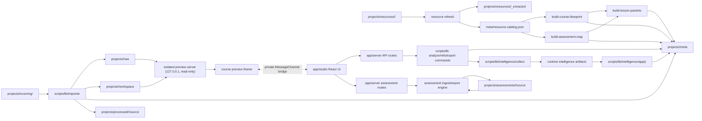

# Canvas Helper Architecture

## What This Repo Is

Canvas Helper is a local-first post-generation course-content workbench. It imports course artifacts (including external first-pass outputs), preserves a raw baseline, creates an editable workspace copy, serves both views locally in Studio, and runs Node-based commands for normalization, analysis, references, export, packaging, and handoff support.

Its production pipeline is:
`import -> normalize -> edit -> expand -> integrate -> export`.

Official workflows:
- `conversion`
- `generated-course`
- `injection/integration`

## Why Local-First

- project data lives on disk under `projects/<slug>/...`
- preview routes serve local files directly
- Node handles filesystem operations and command execution
- the browser is a local operator shell, not the system of record
- the workflow must stay usable without hosted infrastructure

## System Diagram

```mermaid
flowchart LR
  A["projects/incoming/<bundle-or-html>"] --> B["scripts/lib/importer"]
  A2["projects/resources/<slug>/<file>"] --> R["resource refresh"]
  A3["projects/assessments/<assessment-slug>/source"] --> AS["assessment ingest/export engine"]
  B --> C["projects/<slug>/raw"]
  B --> D["projects/<slug>/workspace"]
  B --> E["projects/<slug>/meta"]
  B --> P["projects/processed/<slug>/source"]
  R --> F["projects/resources/<slug>/_extracted"]
  R --> RC["meta/resource-catalog.json"]
  RC --> CB["build-course-blueprint"]
  RC --> AM["build-assessment-map"]
  CB --> LP["build-lesson-packets"]
  AM --> LP
  CB --> E
  AM --> E
  LP --> E
  D --> PV["isolated preview server (127.0.0.1, read-only)"]
  C --> PV
  PV --> PF["course preview iframe"]
  PF <-. "private MessageChannel bridge" .-> H["app/studio React UI"]
  H --> I["app/server API routes"]
  I --> J["scripts/lib analyze/refs/export commands"]
  H --> IA["app/server assessment routes"]
  IA --> AS
  AS --> A3
  J --> E
  J --> K["scripts/lib/intelligence/collect"]
  K --> L["runtime intelligence artifacts"]
  L --> M["scripts/lib/intelligence/apply"]
  M --> E
```

## High-Level Boundaries

### Frontend

- location: `app/studio/`
- responsibility: UI state, controls, preview composition, command output display
- not responsible for: filesystem access, route logic, path validation, or direct command spawning
- shared e2e selectors (`data-testid`) for core Studio interactions live here

The teacher-facing release manifest lives in `app/studio/src/lib/studio-release-notes.ts` and powers the modal **What’s new** view. Inspection draft state and async cancellation live in `useInspectionDraft`; Review Set item creation, persistence, packet generation, screenshot ownership, and capture are exposed to `App.tsx` only through `lib/review-workbench.ts`. Compatibility aliases may remain at subsystem boundaries, but all Studio retention, screenshot, bridge, and packet ceilings originate in `app/shared/studio-quality.ts`, where UTF-8 bytes and JavaScript code units are named separately.

### Local Server

- location: `app/server/`
- responsibility: API endpoints, preview handlers, request parsing, path validation, command bridge, session-log writes
- not responsible for: frontend rendering or project transformation logic

Studio API routes and course preview routes have separate browser origins. The preview server is a separately allocated loopback port that serves only `GET`/`HEAD` preview assets, the early-injected preview bridge, and capability-scoped legacy runtime dependencies. Every course URL is prefixed by a random capability bound to one exact project/root. A workspace capability may additionally read only that same project's declared `raw` or `extracted` reference roots; raw/reference capabilities cannot cross into a workspace, and no capability can cross projects. Unscoped paths are denied. The live-preview CSP permits presentation-only HTTPS styles, fonts, images, media, and frames so the authored course remains visually faithful. Approved legacy dependencies are syntax-rewritten through a same-origin runtime relay instead of adding `https:` to `script-src`. The relay accepts exact versioned library/path/query families, binds declared and transitively discovered sources to the current preview capability, sends no credentials, revalidates bounded redirects, accepts only JavaScript MIME types, caps global cold-fetch concurrency and each response, times out cold fetches, keeps a bounded memory cache with capability-neutral transformed ESM templates, and pins known unversioned Tailwind, Babel, Lucide, React, and ReactDOM URLs. Local JavaScript is parsed only through 512 KiB and otherwise served byte-for-byte; approved relayed ESM is parsed only through 2 MiB and larger modules are rejected. Local/reference `HEAD` exits before file reads or transformation, relay `HEAD` is cache-only, and capability-tokenized response bodies are never cached. Arbitrary external scripts, form submissions, and nonlocal browser data connections remain blocked. The server exposes no Studio APIs, `display-capture` is denied through Permissions Policy, the allowed Studio parent is pinned through `frame-ancestors`, and contained real paths remain mandatory. Studio never reads a preview DOM. Embedded scroll, inspect, and selection events travel through a bounded private `MessageChannel` that is re-established after each frame load. Full preview uses a trusted Studio-origin host around the isolated course iframe. One-time bootstrap and session-only rejoin tokens keep its channel private while allowing the host to reconnect after Studio reload; the untrusted course never receives the Studio channel or opener.

Selected HTML pages now pass a server-side preflight before Studio mounts their iframe. The preflight accepts only an exact capability-scoped URL on the current isolated loopback origin, resolves it through the same contained preview paths, and reports bounded categories without exposing absolute paths: ready, missing or empty page, missing local script or stylesheet, unsupported remote runtime, unsupported page, or unreadable page. It recognizes static HTML, local runtimes, and only the exact remote runtime families already accepted by `preview-runtime-relay.ts`; adding a runtime requires updating that allowlist and its security tests rather than weakening CSP. Preflight success is not treated as proof that a JavaScript app rendered. The private bridge separately observes course-owned text or visual content and emits a bounded `preview-health` state; Studio converts an empty runtime, bridge timeout, or bounded runtime diagnostic into a teacher-facing recovery surface with Retry, page choice, collapsed details, and a sanitized `preview-issue-v1` Codex packet. Headless screenshot capture does not feed this live state: blocked external media or scripts during network-disabled capture are intentional secure-capture fallbacks, not learner-preview defects.

### Scripts / Engine

- location: `scripts/`
- responsibility: import, analyze, refs, export, packaging, rehydrate, smoke verification
- not responsible for: browser UI behavior

Export target orchestration now lives under `scripts/lib/exports/`, while target-specific runtime bridges stay beside their owning protocol modules such as `scripts/lib/scorm.ts` and `scripts/lib/google-hosted.ts`.

English course-family conversion lives under `scripts/lib/english-unit/`. `EnglishCourseManifestV1` inventories shared archives and allowed units; `EnglishUnitRecipeV2` holds durable unit decisions; `EnglishActivityProfileV1` selects content-specific activity renderers. Course intake, safe staged workspace promotion, and verification remain filesystem scripts rather than Studio state.

The English factory owns only declared generated workspace paths. Recipes and `workspace/components/**` / `workspace/assets/custom/**` are preserved authoring sources. All profiles use the shared Evidence Bank API from `scripts/lib/next-step-course-shell.ts`, while activity-local response storage remains separate from deliberate Evidence Bank contributions.

### Project Data

- location: `projects/<slug>/...`
- `raw/`: immutable imported baseline
- `workspace/`: editable output
- `meta/`: manifests, logs, prompt-pack, session log, optional policy overrides, benchmark selection (`benchmark-selection.json`), authoring overrides (`authoring-preferences.json`), deviation reports (`deviation-report.json`, `deviation-report.md`), and derived planning artifacts such as `resource-catalog.json`, `course-blueprint.json`, `assessment-map.json`, and `lesson-packets/`
- `projects/resources/<slug>/`: raw support files plus extracted text
- `projects/assessments/<assessment-slug>/`: global assessment-library items (`source/`, `assessment.project.json`, `import-result.json`, `exports/brightspace/`)
- `exports/`: generated output only

`projects/<slug>/meta/project.json` is the source-of-truth manifest contract for active authoring state.
Migrated active projects should explicitly declare:
- project/workflow classification (`projectType`, `preferredWorkflows`)
- canonical source-of-truth (`canonicalEntry`, `canonicalSources`)
- regeneration contract (`generatedOutputs`, `regenerateCommand`) where needed
- integration provenance (`injectedComponents`, `importedFirstPassOrigin`)
- lifecycle/export posture (`authoringStatus`, `exportTargets`, `referenceOnly`)
- explicit Studio authoring ownership (`authoring.driverId` plus `authoring.studioEditing.enabled`) for editable projects, with optional `familyId`, source-resource IDs, focused quality profile, Rename, and image-upload capabilities; unclassified inferred projects remain visibly `not-onboarded`
- a versioned `authoring.editabilityContract` for every newly created or newly activated active course; `studio-routine-content-v1` binds the course to complete learner inventory, rendered 90% block/text floors, promised category/capability floors, and a reversible public-route lifecycle rather than granting editability by flag

Net-new learner courses authored from scratch in Codex use `npm run course:create`. `scripts/lib/codex-course.ts` stages and validates the complete project before atomically promoting it, refuses overwrite, and emits the `codex-studio-direct-v1` manifest contract. Its canonical workspace HTML/CSS is Direct source; its raw copy is baseline/reference only. The starter keeps routine teacher-editable content in source HTML, marks synchronized title surfaces, and assigns durable edit keys so Studio can expose the safe visual boundary immediately. Imported and factory-owned course families continue through their own intake/build contracts.

Existing catalogs use `npm run course:onboard -- --all`. `scripts/lib/course-onboarding.ts` classifies every project directory, normalizes portable source declarations, and writes changed manifests as one rollback-safe batch. Every enabled candidate must pass the same doctor after the write before the fixed project-discovery signal is emitted. A second audit must be retain-only. Direct and supported English/Social factories retain their owning boundaries; `legacy-snapshot-v1` preserves a current workspace when the historical builder inputs are incomplete or nonportable and quarantines that replacement builder. Package-only directories are reported by `course:list -- --all` without fabricating a manifest or editable source.

### Compact Course Authoring Context

The `course:doctor`, `course:list`, and `context:project` commands form a read-only safety layer for active migrated course work. Their implementation lives in `scripts/lib/course-authoring/`.

- `course:doctor` reads the manifest without rehydrating a project, validates canonical paths against the current checkout, rejects traversal and symbolic-link escapes, and reports legacy absolute paths as normalized repo-relative values without rewriting metadata.
- `course:list` runs the same doctor-backed resolver before showing a readiness state: `direct-ready`, `factory-ready`, `snapshot-ready`, `proposal-only`, `blocked`, `reference-only`, or `package-archive`. It never equates lifecycle `active` or the presence of an export with permission to edit or rebuild.
- `context:project` runs only after the doctor passes and emits a compact source-of-truth brief capped at 5,000 UTF-8 bytes. It excludes whole blueprints, resource catalogs, and prompt-pack bodies.
- English factory projects are classified from the staging/build contract: `meta/english-unit.json`, `workspace/components/**`, and `workspace/assets/custom/**` are editable; factory-owned workspace output remains protected. The doctor also checks that the recipe's Brightspace and teacher archives exist as real files rather than unresolved LFS pointers. A rollback-safe factory transaction covers generated workspace output, resource-library `teacher/**` and `_extracted/**` files, and generated metadata; recipes, prompt packs, custom components, raw imports, and resource `_sources/**` remain outside its write set.
- Social related-issues projects remain proposal/rebuild-only by default. A project becomes Studio factory-ready only when its manifest explicitly declares `social-related-issues-v1`, checksum-backed `authoring.sourceResourceIds`, and `authoring.studioEditing.enabled: true`. The doctor fails if a declared source is missing, an unresolved LFS pointer, or has drifted. The Social builder stages a whole workspace, replays course-only Studio overrides, and promotes only a valid entrypoint; it never writes `raw/**` or `meta/project.json`.
- Preserved legacy snapshots declare their current workspace files as the protected baseline and expose `meta/studio-edits.json` as the Studio-owned edit input, even before that file exists. Apply materializes the overrides into declared pages and validates the real learner result; Undo fingerprints and restores the same boundary. The snapshot adapter never calls the quarantined legacy builder.
- Studio deliberately has no model-provider integration. Annotate and Review Set are read-only handoff surfaces. The separate Edit workflow may write only an explicitly onboarded direct source or supported owning factory override through the transactional server boundary described below. The Inspector resolves only `exact`, `bounded`, or `unknown` source ownership from repository-side metadata and caps its Review Set V3 packet at 7.5 KB with repo-relative targets only. Selected preview text is labeled as untrusted course content, and unsafe local paths are omitted.

### Studio Inspector and screenshot boundary

The Inspector receives only opaque preview facts (temporary node ID, safe visible text, semantic label, and viewport geometry). The server derives edit targets, contributor paths, and rebuild commands from the selected project's declared authoring driver. A direct static workspace may additionally receive an exact current source line and a bounded surrounding excerpt; generated Social and English workspaces deliberately do not. That excerpt is local visual evidence only and never enters a copied handoff. A generated workspace is therefore never promoted into a primary source just because it is visible in the preview.

The visible Inspector is intentionally a teacher-facing annotation surface rather than a source dashboard. **Annotate** activates a blue mode bar and accepts an element click, a dragged rectangle, or keyboard traversal across mapped course content; keyboard entry temporarily focuses otherwise noninteractive mapped elements without changing their source markup. A drag becomes source-backed only when its endpoints share one unambiguous mapped owner; an ambiguous area remains visual-only and cannot be saved as if its start element owned the region. The rail shows the selected course text, one change note, optional screenshot controls, and a Review Set of at most five items with up to three screenshots each. Notes and screenshot references are editable. Source files, ownership labels, build commands, packet text, and bounded preview diagnostics are not rendered in that rail. The repository-side resolver still derives and revalidates those facts, and the Review Set packet still carries the safe repo-relative route Codex needs. The doctor-derived `GET /api/projects/<slug>/authoring-brief` route remains available to repository tooling but is not part of the default annotation UI.

Studio quality limits live in `app/shared/studio-quality.ts`. The shared contract separates expected local response budgets (two-second preview readiness, 500 ms visibly committed selection feedback, and 2.5-second capture result including the current-selection refresh) from longer hard recovery deadlines, and it owns the bounded browser-workbench project/session/item/screenshot retention limits. The client dispatches local `canvas-helper:studio-performance` events for regression tests without transmitting telemetry. Preview source decoration is cached only by exact path, mtime, and size in a 24-entry in-memory LRU; source changes always force reparse. Preview hover work is animation-frame coalesced, Canvas Helper overlays are excluded from course-index invalidation, mapped-node and keyboard candidate indexes are cached per page, late course mutations invalidate scroll discovery, and the runtime health observer disconnects after the first meaningful-content report while retaining a final bounded health check. An intake mutation always forces a new project-list request after the mutation completes.

Opening a workspace preview uses a separate trusted host tab with the course in a cross-origin iframe. The host bridge exposes the same blue **Annotate** mode, shared Review Set workflow, and **Return to Studio**; it never adds those controls inside the course document. Full-preview capture, save, note-edit, remove, clear, copy, cross-page **Show**, and return actions travel over the standalone private channel. A bounded rejoin token lets an already-open host reconnect after Studio reload, while a confirmed focus acknowledgement prevents **Show** from claiming success before the saved page, course query/hash state, and node are present. Course navigation invalidates any active unsaved selection. A connected return focuses the existing Studio session and closes the auxiliary preview. Studio remains the sole Review Set owner, performs every source resolution and revalidation, and sends only bounded item summaries plus the prepared packet back to the connected preview. A strict version-6 Studio-local record keeps the active set for seven days across reloads and fails visibly without crashing when browser storage is denied; the preview itself receives no persistent Review Set storage, filesystem access, or direct source-writing authority.

Optional screenshot annotation is deterministic and never requests desktop or tab sharing. Studio sends a bounded source-mapped selection to same-origin `POST /api/inspection/capture`. The server validates the exact capability-scoped `127.0.0.1` workspace-preview path, launches a headless Playwright page at the saved viewport, restores window and container scroll, blocks outside HTTP requests, all WebSockets, WebRTC peer connections, service workers, and dedicated/shared workers, then verifies those guards in the main document and every runnable local, `about:`, `data:`, or `blob:` child frame. Empty, uncommitted, and browser-generated blocked-error frames are skipped because they cannot run course code and are already isolated by the capture network policy. It rechecks the full page identity—including course query and hash state—plus fresh selected-element geometry before returning one marked viewport PNG. Capture is globally serialized; disconnect or the hard twenty-second deadline releases the slot even if capture work ignores abort, and a browser that finishes launching late is closed. `POST /api/inspection/screenshots` validates PNG signature, byte size, dimensions, the exact session/project/item/node owner, and a separate screenshot identity before writing atomically to the ignored `.runtime/studio-review-sets/<session>/` cache. Per-item/session limits are backed by a 150-file and 100 MiB global cache ceiling. Screenshot `GET`, verify, and `DELETE` all require that exact ownership tuple, so a safe-looking path or item-ID prefix cannot display, attach, or delete another annotation's evidence. Review Set V3 text contains only safe repo-relative screenshot paths—never pixels, base64, blob URLs, or absolute local paths—and labels screenshot pixels as untrusted course evidence. The internal Studio persistence record is independently versioned and strictly rehydrates only matching request/resolution identities. Both persisted metadata and cached sessions use a seven-day retention boundary.

### Intake and Resources

- `projects/incoming/`: one-shot import queue for HTML files and bundle folders
- `projects/processed/<slug>/source/`: latest kept import snapshot for that project
- `projects/resources/<slug>/`: canonical original reference files
- `projects/resources/<slug>/_extracted/`: generated extracted text for Studio and prompt-pack flows
- `projects/resources/social30-1-related-issues/resource-manifest.json`: the Social 30 related-issues source index. It may temporarily point at a kept `projects/processed/**/source/` snapshot with `availability: "snapshot-backed"`, but the builder still verifies the file's SHA-256 before use.
- `projects/<science-slug>/meta/science-pilot.json`: a planning-only Science course contract created by `intake:science-pilot`. It names checksum-copied source archives, the representative-unit boundary, a science learner-loop candidate, and required decisions. It begins `blocked` with `proposal-only-v1`; no generic Science factory or learner workspace is created until that pilot is approved.

Studio and the watcher both use the same local refresh engine. The `Refresh Intake` button runs a one-shot scan through the local server. The long-running watcher scans both `incoming` and `resources` with the same lock file so the two entry points do not collide.
If a canonical `projects/<slug>/` root is missing required manifest/raw/workspace artifacts but `projects/processed/<slug>/source/` still exists, project discovery re-imports from that processed snapshot to restore the canonical project automatically.

## Intelligence Model

The intelligence system is split into explicit layers:

- `collect/`: always-on signal gathering and persistence
- `apply/`: optional influence on prompt-pack generation and recommendations
- `config/`: policy defaults, flag resolution, and mode handling

Authoring preference enforcement is now part of the intelligence boundary:

- repo defaults: `config/authoring-preferences.json`
- project overrides: `projects/<slug>/meta/authoring-preferences.json`
- gate engine: `scripts/lib/intelligence/apply/deviation-gate.ts`
- resolver: `scripts/lib/intelligence/config/authoring-preferences.ts`
- outputs: per-project deviation reports in `meta/`

### Benchmark-Driven Generation

Approved generation patterns now live in `scripts/lib/benchmarks/`:

- `registry/`: benchmark records promoted from approved projects
- `recipes/`: reusable lesson and activity recipe definitions
- `load.ts`: deterministic JSON loading for registry assets
- `project-selection.ts`: project-level benchmark selection resolution from `projects/<slug>/meta/benchmark-selection.json`

This layer sits above observational intelligence and below project converters:

- pattern bank and memory ledger remain observational
- benchmark registry becomes the authoritative reuse layer for generation
- prompt packs can surface selected benchmark context
- converters such as `hss1010` can resolve benchmark + recipes intentionally instead of inferring style from memory alone

### Modes

- `off`: no learner collection, no learner application
- `collect`: collection only, no learner application
- `apply`: collection plus learner application in prompt-pack and recommendation flow

### Precedence

1. CLI override
2. `LEARNER_MODE` environment variable
3. project policy override
4. repo default policy
5. built-in safe default (`collect`)

## Core vs Experimental

### Core

- import
- analyze
- refs extraction
- assessment-library ingest (PDF/DOCX), validation, and Brightspace CSV export
- resource classification and chunk indexing
- course blueprint generation
- assessment mapping
- lesson packet generation
- Studio preview
- local command execution
- Brightspace export/package
- SCORM 2004 / 1.2 package export with suspend-data bridge
- Google-hosted export with Firebase Auth / Firestore resume bridge
- Apps Script export with a Drive-backed HtmlService web-app package for Google Sites embedding
- prompt-pack generation
- memory ledger and pattern-bank collection
- benchmark registry and recipe-driven generation selection
- Playwright-based Studio e2e automation with contract-driven project checks

## E2E Automation Layer

Browser automation is implemented as a small platform layer under `e2e/`:

- `e2e/playwright.config.ts`: shared runner and local Studio web-server boot
- `e2e/specs/core-project-contract.spec.ts`: reusable core checks
- `e2e/lib/load-project-contract.ts`: contract loading/validation
- `e2e/lib/project-open.ts`: common Studio project-open flow
- `e2e/lib/studio-fixtures.ts`: project-independent fixture descriptors for cross-project Studio behavior
- `e2e/playwright.release.config.ts`: release-only configuration with an owned port, no reused server, and `forbidOnly`

Project-specific expectations are declarative:

- `projects/<slug>/meta/e2e-contract.json`

Contract files define which checks are enabled for that project (mode toggles, navigation, quiz behaviors, fallback expectations) so coverage depth can vary by project without bespoke test sprawl.

Default command paths:

- platform smoke: `npm run test:e2e:smoke`
- project contract gate: `npm run test:e2e:project -- --project <slug>`
- complete Studio release gate: `npm run test:studio-release`

The release command is implemented by `scripts/run-studio-release.ts` and `scripts/lib/studio-release.ts`. It invokes only checked-in dependency entrypoints, owns a fresh loopback port, runs focused contracts, the production build, all inspection E2E, platform smoke, and the strict neutral fixture contract in that order, propagates the first failing exit code, and writes `.runtime/studio-release-report.json` with the branch, commit, dirty-tree status, and a deterministic SHA-256 fingerprint of the exact Studio source bytes that were tested. It fails if those source bytes change during the run. Ordinary developer E2E may still reuse its configured server; release E2E may not.

Studio project discovery treats declared raw/workspace entrypoints as authoritative and uses recursive HTML discovery only as a bounded convenience. It skips asset trees and duplicate copied resource directories and caps total entries, entries per directory, and traversal depth. This prevents unrelated archives or filesystem-copy artifacts from blocking `/api/projects`; legitimate deep pages should be declared through project metadata instead of relying on an unbounded scan. Successful Codex creation, import, and transactional catalog onboarding update the ignored fixed signal declared in `app/shared/project-discovery.ts`; the Studio server converts that signal into a bounded HMR event, and the project hook forces a fresh list request. This lets new or newly onboarded projects appear while Studio remains open without watching every course asset recursively. Manifest changes use the same event. Release provenance likewise records directory-level untracked status while the independent source fingerprint still reads every in-scope Studio byte.

## Studio Direct Editing

Studio direct editing is a server-owned transactional workflow, separate from annotation and Review Set handoffs:

- Browser/server-safe contracts and validators live in `app/shared/course-editing.ts`.
- Target resolution, element-level rebasing, apply/rename/upload orchestration, checkpoint, and drift-safe Undo live in `app/server/lib/course-editing.ts`; HTTP handlers live in `app/server/routes/course-edits.ts`.
- The isolated preview response embeds a bounded server-authored page map keyed only by opaque inspection node IDs. `app/server/preview-bridge-runtime.ts` compares its source signatures with the rendered DOM, shows non-overlapping editable outlines and action labels, distinguishes runtime-owned/unsupported content with a dashed annotation-only state, and performs proximity-limited container targeting. The map is informational; click resolution and apply remain server-authoritative.
- Read-only breadth measurement lives under `scripts/lib/course-editability/` with shared schemas in `app/shared/course-editability.ts`. Each adapter owns its learner page/route/state inventory. A fresh isolated Chromium context enumerates rendered semantic units, then source identity and the production Resolve path determine whether each unit is editable. Runtime-only units remain in the denominator. Incomplete inventory, browser-state writes, truncation, hard limits, or repository residue produce null coverage; the report never enables editing.
- New-course acceptance lives in `scripts/lib/new-course-readiness.ts` and `scripts/verify-new-course-readiness.ts`. Its Git comparison starts no earlier than the inception recorded by `config/studio-editability-policy-v1.json`, so the current legacy catalog is grandfathered without being mislabeled and the bootstrap remains valid across merge/squash histories. It enforces every new active manifest, every non-active→active or safe-adapter onboarding transition, and all later project/resource changes to a governed course. The exact-head job in `.github/workflows/new-course-readiness.yml` runs static ownership/doctor checks, the rendered census, then a real HTTP Apply/reload/Undo pilot and uploads both reports. Generic imports are blocked until this gate passes.
- Live draft presentation is server-normalized and session ordered. `app/server/lib/course-edit-preview.ts` owns canonical preview sessions and monotonic revisions, while `app/server/preview-bridge-runtime.ts` renders an inert host overlay without changing learner DOM identity, attributes, listeners, forms, or storage. `app/server/lib/course-edit-preview-assets.ts` holds fully decoded image bytes in bounded memory and serves capability-scoped preview URLs; only Apply may materialize those bytes into canonical resources/workspace files.
- Durable atomic writes, the atomic complete-owner cross-process lock, write-set fingerprints, terminal cleanup states, and crash-recovery journal live in `app/server/lib/course-edit-transaction.ts`.
- Isolated browser postconditions and edited-target accessibility heuristics live in `app/server/lib/course-edit-render-validation.ts`; bounded full image decoding and dimension checks live in `app/server/lib/course-edit-image.ts`.
- Stable generated-course edit identities, sanitization, approved style tokens, and stored course-only overrides live in `scripts/lib/course-editing/`.
- Studio state and per-course draft persistence live in `app/studio/src/hooks/useCourseEditing.ts` and `app/studio/src/lib/course-edit-storage.ts`.
- Full Preview shares the same in-memory and persistent draft owner through the bounded private bridge; it never owns a second source state and never receives local file paths.

Only a passing `course:doctor` project with a declared supported adapter and explicit `authoring.studioEditing.enabled` flag is editable. `course:list` reports unclassified inferred projects as `not-onboarded` and output-only directories as `package-archive`. Direct projects write exact declared canonical workspace files. English and Social factories store course-only overrides under `projects/<slug>/meta/studio-edits.json`, replay the overrides through staged rebuilds, and regenerate the workspace. Legacy snapshots use the same override concept against a preserved workspace baseline without invoking an unsafe historical builder. Generated HTML owned by an active factory, raw imports, runtime bundles, and exports remain noncanonical.

An onboarded direct project that still retains a legacy full-regeneration script must prove that the script cannot silently erase canonical Studio work. The Mental Health pilot's builder stops before writing when it finds applied `data-canvas-helper-edit-id` markers; only its explicit `--allow-studio-edit-overwrite` operator flag permits intentional full regeneration. Equivalent protection is required before another legacy direct builder is onboarded.

One apply request is transactional: preflight and label every draft, re-resolve opaque identities, rebase only when the selected element digest is unchanged, sanitize delta-only operations, acquire a per-course filesystem lock, fingerprint and checkpoint the complete write set, durably journal each phase, update canonical inputs, and run one bounded rebuild if required. Lock acquisition publishes a complete fsynced owner record with one atomic no-replace operation; two processes cannot observe an ownerless active claim. Generated checkpoints include builder-owned English resource directories. Builder process groups receive bounded TERM/KILL shutdown so descendants cannot mutate files during recovery. Recovery compares every current path with the recorded before and after states: exact and pathwise known-partial Studio states can roll back, while any unknown external state is preserved under a `manual-recovery` journal. Terminal committed/rolled-back states make checkpoint cleanup retry-safe.

Generated-directory rollback reconciles checkpoint files inside the existing root instead of removing and renaming the whole watched directory. This keeps the directory identity stable for macOS Documents/File Provider synchronization and avoids asynchronously recreated ` 2` conflict copies. Recovery is idempotent, so an interrupted reconciliation remains journal-recoverable.

After filesystem validation, an isolated Playwright page loads the finished learner route with a bounded 30-second navigation allowance and verifies the requested DOM/attribute/style result after bounded local page settlement. The larger bound covers the catalog's multi-thousand-element legacy pages. This proves the observed local result, not later lazy, navigation-, visibility-, or interaction-triggered runtime behavior. The same pass applies edited-target visibility, image decoding/alt, control-name, nonempty-heading, and approximate text-contrast checks; it is not page-wide WCAG acceptance. Failure restores the checkpoint. Undo first fingerprints the whole post-batch boundary and refuses after any newer work; it never restores merely because a checkpoint exists. Checkpoints, status, locks, and journals live only in ignored `.runtime/studio-edit-*` directories.

Draft persistence is separately versioned from Review Set persistence. Drafts retain their complete server-issued baseline, have no time-based expiry, warn before bounded project eviction, and support strict JSON backup/restore. The first in-place text editor supports source-safe headings, paragraphs, list items, and captions; it shares one controller with editable Review & Apply and sends the proposed text through the read-only server normalizer before Save. Embedded Studio renders its sanitized standard `contenteditable` layer in the Studio parent. Full Preview renders the equivalent layer in its trusted Studio-origin host, above—not inside—the isolated learner iframe. Paste, drop, and browser formatting are filtered to plain text, and the server normalizer remains authoritative. Both forms receive only bounded opaque identity, geometry, and safe presentation values; neither changes the learner element, listeners, forms, completion state, or browser storage. A startup guard keeps Full Preview clicks off the learner until its nested inspection shield has acknowledged the selected mode; the keyboard guard exempts only the trusted host text editor so that its typing, Escape, and Cmd/Ctrl+Enter never reach the learner. One exclusive visual lease prevents a parent caret, standalone caret, and inert child preview from overlapping. Sandboxed visual comparisons retain accessible text captions. Ambiguous identical repeated elements remain Annotation only until their canonical builder supplies a durable `data-canvas-helper-edit-key`; ordinal fallback identities are never replayed across rebuilds. Image uploads fully decode bounded PNG/JPEG/GIF bytes, store full-digest content-addressed originals under `projects/resources/<slug>/studio-assets/`, and materialize retry-safe builder copies under `workspace/assets/custom/studio/`. Rename is a dedicated checkpointed operation over marked HTML title surfaces, project metadata, stored course metadata, and declared runtime string markers.

Edit discovery and edit authority are intentionally separate. The page map makes the supported boundary visible before selection, but a stale or forged map can never authorize a write. Unsupported selections can be transferred into Annotate without losing their current opaque selection; Review Set remains the workflow for layout, runtime, activity, assessment, and other unmapped changes.

Preview presentation is likewise not write authority. The browser sends the opaque target and proposed bounded patch to Normalize Preview. The server re-resolves current identity, applies the same sanitizer/no-op rules used by Apply, and returns a canonical patch digest plus render-only representation. Save persists that canonical draft. Apply re-runs normalization against current source and rejects a mismatched digest. Clear closes the preview generation permanently, so late or reordered bridge messages cannot revive it. An active embedded or Full Preview caret is released before a page, mode, project, or viewport transition. Opening Full Preview from an active embedded caret transfers that same durable target to the trusted standalone host as soon as it is ready; a direct click in Full Preview can also acquire its own standalone host caret. Screenshot and Review Set evidence actions are unavailable while either unapplied interactive overlay is visible.

Export freshness is evidence, not a mutable boolean. `scripts/lib/course-editing/export-freshness.ts` fingerprints a target-specific input graph—the target identity, canonical workspace, normalized manifest, Studio title/edit metadata, package dependency files, and recursive local exporter implementation dependencies—together with each produced artifact. Every exporter records that evidence after successful output. Relevant input or artifact drift makes only the matching target stale. Brightspace directory/package, Google Hosted, Apps Script, HTML, SCORM 2004, and SCORM 1.2 are separate evidence targets.

The filesystem lock is a cooperative repository-writer protocol. Direct adapters reread each source immediately before atomic replacement, but Node does not expose a portable conditional filesystem replace. A non-cooperating writer can still race inside that final read-to-rename interval; manual editors, Git operations, Codex changes, and standalone builders must not run concurrently with Studio Apply unless they participate in the same lock. This unsupported boundary is distinct from Undo and recovery, which fail closed once drift is observable.

### Policy-Controlled

- intelligence influence on prompt packs
- recommendation steering

## Learner-mode Resolution

Precedence for the effective learner mode is explicit and deterministic:

1. CLI flag (`--learner-mode`)
2. `LEARNER_MODE` environment variable
3. project policy
4. repo default policy (`config/intelligence.json`)
5. safe default in `scripts/lib/intelligence/config/defaults.ts`

## Export Targets

- Brightspace folder/package: copies the workspace for LMS upload and optional zip packaging.
- SCORM 2004 / 1.2: copies the workspace, injects `scripts/lib/scorm.ts`, and emits LMS packages plus manifests.
- Google Hosted: copies the workspace, injects `scripts/lib/google-hosted.ts`, and emits a Firebase Hosting bundle under `projects/<slug>/exports/google-hosted/`.
- Apps Script: reuses the standalone HTML bundle, emits a thin `Code.gs` HtmlService shell, writes Drive-backed course assets under `projects/<slug>/exports/apps-script/drive-assets/`, and can inject a `google.script.run` autosave bridge for tracked `localStorage` keys.
- Single HTML: inlines local assets into one deliverable for static/offline handoff.

All conversion/export/deploy flows now run an authoring deviation preflight. Blocking deviations fail fast and write report artifacts before exiting.

The Apps Script path stops at deterministic package generation. Apps Script project creation, Drive upload, asset-index setup, web-app deployment, and Google Sites embedding remain explicit post-export operator steps outside the repo.

The Google-hosted path stops at deterministic bundle generation. Firebase deployment, project selection, auth domain setup, and Firestore rules remain explicit post-export operator steps outside the repo.

Google-hosted deploy metadata lives per slug in `projects/<slug>/meta/google-hosted.deploy.json`. Local deploy orchestration belongs in `scripts/`, not Studio, so a Windows launcher or CLI script can scan deployable slugs without depending on Studio UI logic. The intended long-term shape is one Firebase project per subject and one Hosting site per module slug.

Exports now avoid implicit intelligence regeneration. Export commands copy the workspace, generate delivery artifacts, and only mark the workspace approved in project manifest state. Prompt-pack, pattern-bank, and other intelligence artifacts refresh through their explicit commands.

## Placement Rules for New Code

- If it renders UI, it belongs in `app/studio/`
- If it handles HTTP-like requests or preview file serving, it belongs in `app/server/`
- If it mutates project files or runtime artifacts, it belongs in `scripts/`
- If it learns from project history, it belongs in `scripts/lib/intelligence/collect/`
- If it changes how intelligence influences current work, it belongs in `scripts/lib/intelligence/apply/`
- If it changes policy or defaults, it belongs in `scripts/lib/intelligence/config/`
- If it defines approved generation benchmarks or recipes, it belongs in `scripts/lib/benchmarks/`

## Planning Layer

- `refs` remains the explicit resource-ingest step, but now produces classified resource metadata in `meta/resource-catalog.json` and chunk manifests under `projects/resources/<slug>/_extracted/`
- `blueprint` builds `meta/course-blueprint.json` from outline resources first, then aligns performance demand to assessment resources
- `assessment-map` builds `meta/assessment-map.json` from assessment resources with task demands, verbs, failure points, and prerequisite knowledge
- `lesson-packets` builds `meta/lesson-packets/*.json` as the main lesson-construction unit, linking outcomes, assessments, misconceptions, practice, readiness evidence, and targeted source locators
- `prompt-pack.md` should prioritize blueprint, assessment map, and lesson packets above reference excerpts
- when a project opts into a benchmark, prompt-pack should surface the selected benchmark, source-support mode, and recipe set explicitly

## Course Conversion Pipeline (HSS1010)

- conversion modules live in `scripts/lib/conversion/`
- current conversion entrypoint is `scripts/convert-hss1010.ts` (`npm.cmd run convert:hss1010 -- --project hss1010`)
- pipeline responsibilities:
  - parse source chunks (`parseSource.ts`)
  - extract structured course and assessment models from legacy workspace HTML (`normalizeBlocks.ts`)
  - build source mapping (`buildSourceMap.ts`)
  - generate coverage audit (`auditCoverage.ts`)
  - render section-tab workspace shell/runtime (`renderCourse.ts`, `renderAssessment.ts`, `hss1010.ts`)
- generated project artifacts are written to `projects/<slug>/meta/` and `projects/<slug>/workspace/data/`

## Assessment Library Flow

- Studio `Assessment Library` mode calls local server routes under `/api/assessments`
- API surface:
  - `GET /api/assessments`
  - `POST /api/assessments/import`
  - `GET /api/assessments/:slug`
  - `PUT /api/assessments/:slug`
  - `DELETE /api/assessments/:slug`
  - `POST /api/assessments/:slug/export/brightspace`
- The server persists artifacts to `projects/assessments/<assessment-slug>/...` as the system of record
- PDF ingest uses `scripts/lib/pdf-text.ts` for native-first extraction with OCR fallback, then deterministic question extraction under `scripts/lib/assessments/`
- DOCX ingest and Brightspace export remain deterministic and filesystem-backed (no browser localStorage repository)

## Reasoning Rules for New Agents

- Start with the owning boundary, not the nearest file.
- Preserve local-first behavior.
- Keep Node as the engine and the browser as the local shell.
- Prefer explicit modules over hidden cross-layer coupling.
- Treat `raw/` and `exports/` as protected artifacts.
