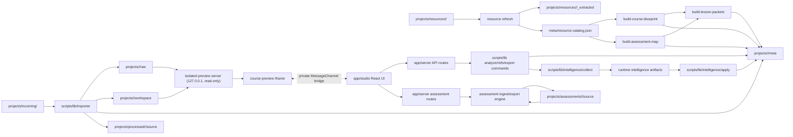

# Canvas Helper Architecture

## What This Repo Is

Canvas Helper is a local-first post-generation course-content workbench. It imports course artifacts (including external first-pass outputs), preserves a raw baseline, creates an editable workspace copy, serves both views locally in Studio, and runs Node-based commands for normalization, analysis, references, export, packaging, and handoff support.

Its production pipeline is:
`import -> normalize -> edit -> expand -> integrate -> export`.

Official workflows:
- `conversion`
- `generated-course`
- `injection/integration`

## Why Local-First

- project data lives on disk under `projects/<slug>/...`
- preview routes serve local files directly
- Node handles filesystem operations and command execution
- the browser is a local operator shell, not the system of record
- the workflow must stay usable without hosted infrastructure

## System Diagram

```mermaid
flowchart LR
  A["projects/incoming/<bundle-or-html>"] --> B["scripts/lib/importer"]
  A2["projects/resources/<slug>/<file>"] --> R["resource refresh"]
  A3["projects/assessments/<assessment-slug>/source"] --> AS["assessment ingest/export engine"]
  B --> C["projects/<slug>/raw"]
  B --> D["projects/<slug>/workspace"]
  B --> E["projects/<slug>/meta"]
  B --> P["projects/processed/<slug>/source"]
  R --> F["projects/resources/<slug>/_extracted"]
  R --> RC["meta/resource-catalog.json"]
  RC --> CB["build-course-blueprint"]
  RC --> AM["build-assessment-map"]
  CB --> LP["build-lesson-packets"]
  AM --> LP
  CB --> E
  AM --> E
  LP --> E
  D --> PV["isolated preview server (127.0.0.1, read-only)"]
  C --> PV
  PV --> PF["course preview iframe"]
  PF <-. "private MessageChannel bridge" .-> H["app/studio React UI"]
  H --> I["app/server API routes"]
  I --> J["scripts/lib analyze/refs/export commands"]
  H --> IA["app/server assessment routes"]
  IA --> AS
  AS --> A3
  J --> E
  J --> K["scripts/lib/intelligence/collect"]
  K --> L["runtime intelligence artifacts"]
  L --> M["scripts/lib/intelligence/apply"]
  M --> E
```

## High-Level Boundaries

### Frontend

- location: `app/studio/`
- responsibility: UI state, controls, preview composition, command output display
- not responsible for: filesystem access, route logic, path validation, or direct command spawning
- shared e2e selectors (`data-testid`) for core Studio interactions live here

### Local Server

- location: `app/server/`
- responsibility: API endpoints, preview handlers, request parsing, path validation, command bridge, session-log writes
- not responsible for: frontend rendering or project transformation logic

Studio API routes and course preview routes have separate browser origins. The preview server is a separately allocated loopback port that serves only `GET`/`HEAD` preview assets and the early-injected preview bridge. It has no Studio APIs, denies `display-capture` through Permissions Policy, pins its allowed Studio parent through `frame-ancestors`, validates contained real paths, and returns 404 for every other route. Studio never reads a preview iframe DOM; scroll, inspect, and selection events travel through a bounded private `MessageChannel` that is re-established after each frame load.

### Scripts / Engine

- location: `scripts/`
- responsibility: import, analyze, refs, export, packaging, rehydrate, smoke verification
- not responsible for: browser UI behavior

Export target orchestration now lives under `scripts/lib/exports/`, while target-specific runtime bridges stay beside their owning protocol modules such as `scripts/lib/scorm.ts` and `scripts/lib/google-hosted.ts`.

English course-family conversion lives under `scripts/lib/english-unit/`. `EnglishCourseManifestV1` inventories shared archives and allowed units; `EnglishUnitRecipeV2` holds durable unit decisions; `EnglishActivityProfileV1` selects content-specific activity renderers. Course intake, safe staged workspace promotion, and verification remain filesystem scripts rather than Studio state.

The English factory owns only declared generated workspace paths. Recipes and `workspace/components/**` / `workspace/assets/custom/**` are preserved authoring sources. All profiles use the shared Evidence Bank API from `scripts/lib/next-step-course-shell.ts`, while activity-local response storage remains separate from deliberate Evidence Bank contributions.

### Project Data

- location: `projects/<slug>/...`
- `raw/`: immutable imported baseline
- `workspace/`: editable output
- `meta/`: manifests, logs, prompt-pack, session log, optional policy overrides, benchmark selection (`benchmark-selection.json`), authoring overrides (`authoring-preferences.json`), deviation reports (`deviation-report.json`, `deviation-report.md`), and derived planning artifacts such as `resource-catalog.json`, `course-blueprint.json`, `assessment-map.json`, and `lesson-packets/`
- `projects/resources/<slug>/`: raw support files plus extracted text
- `projects/assessments/<assessment-slug>/`: global assessment-library items (`source/`, `assessment.project.json`, `import-result.json`, `exports/brightspace/`)
- `exports/`: generated output only

`projects/<slug>/meta/project.json` is the source-of-truth manifest contract for active authoring state.
Migrated active projects should explicitly declare:
- project/workflow classification (`projectType`, `preferredWorkflows`)
- canonical source-of-truth (`canonicalEntry`, `canonicalSources`)
- regeneration contract (`generatedOutputs`, `regenerateCommand`) where needed
- integration provenance (`injectedComponents`, `importedFirstPassOrigin`)
- lifecycle/export posture (`authoringStatus`, `exportTargets`, `referenceOnly`)
- optional explicit authoring ownership (`authoring.driverId`, `authoring.familyId`, source-resource IDs, and a focused quality profile) for newly onboarded projects; legacy projects remain visibly marked as inferred until migrated

### Compact Course Authoring Context

The `course:doctor`, `course:list`, and `context:project` commands form a read-only safety layer for active migrated course work. Their implementation lives in `scripts/lib/course-authoring/`.

- `course:doctor` reads the manifest without rehydrating a project, validates canonical paths against the current checkout, rejects traversal and symbolic-link escapes, and reports legacy absolute paths as normalized repo-relative values without rewriting metadata.
- `course:list` runs the same doctor-backed resolver before showing a readiness state: `direct-ready`, `factory-ready`, `proposal-only`, or `blocked`. It never equates lifecycle `active` with permission to edit or rebuild.
- `context:project` runs only after the doctor passes and emits a compact source-of-truth brief capped at 5,000 UTF-8 bytes. It excludes whole blueprints, resource catalogs, and prompt-pack bodies.
- English factory projects are classified from the staging/build contract: `meta/english-unit.json`, `workspace/components/**`, and `workspace/assets/custom/**` are editable; factory-owned workspace output remains protected. The doctor also checks that the recipe's Brightspace and teacher archives exist as real files rather than unresolved LFS pointers. A rollback-safe factory transaction covers generated workspace output, resource-library `teacher/**` and `_extracted/**` files, and generated metadata; recipes, prompt packs, custom components, raw imports, and resource `_sources/**` remain outside its write set.
- Social related-issues projects are proposal/rebuild-only. Their `authoring.sourceResourceIds` resolve through the checksum-verified `projects/resources/social30-1-related-issues/resource-manifest.json`; the doctor fails if that declared source is missing, an unresolved LFS pointer, or has drifted from its checksum. The Social builder stages a whole workspace and only promotes it after a valid HTML entrypoint exists, writing at most `workspace/**`, `meta/social-build.json`, and `meta/conversion-notes.md`; it never writes `raw/**` or `meta/project.json`.
- Studio deliberately has no model-provider integration or automatic source-write path. Its role is local preview, source-of-truth visibility, and safe handoff into an explicit Codex task; actual course edits remain in the declared canonical source or owning rebuild flow. The Inspector resolves only `exact`, `bounded`, or `unknown` source ownership from repository-side metadata and caps its copied packet at 5 KB with repo-relative targets only.

### Studio Inspector and screenshot boundary

The Inspector receives only opaque preview facts (temporary node ID, safe visible text, semantic label, and viewport geometry). The server derives edit targets, contributor paths, and rebuild commands from the selected project's declared authoring driver. A generated Social or English workspace is therefore never promoted into a primary source just because it is visible in the preview.

Optional screenshot annotation uses the Studio document's explicit `getDisplayMedia` permission flow. The isolated preview is denied that capability. Studio captures one approved frame, immediately stops all tracks, crops the working image to the selected preview frame, keeps it only in memory, and does not put pixels, object URLs, or image data into the copied Codex packet. The teacher must explicitly download or discard the image.

### Intake and Resources

- `projects/incoming/`: one-shot import queue for HTML files and bundle folders
- `projects/processed/<slug>/source/`: latest kept import snapshot for that project
- `projects/resources/<slug>/`: canonical original reference files
- `projects/resources/<slug>/_extracted/`: generated extracted text for Studio and prompt-pack flows
- `projects/resources/social30-1-related-issues/resource-manifest.json`: the Social 30 related-issues source index. It may temporarily point at a kept `projects/processed/**/source/` snapshot with `availability: "snapshot-backed"`, but the builder still verifies the file's SHA-256 before use.
- `projects/<science-slug>/meta/science-pilot.json`: a planning-only Science course contract created by `intake:science-pilot`. It names checksum-copied source archives, the representative-unit boundary, a science learner-loop candidate, and required decisions. It begins `blocked` with `proposal-only-v1`; no generic Science factory or learner workspace is created until that pilot is approved.

Studio and the watcher both use the same local refresh engine. The `Refresh Intake` button runs a one-shot scan through the local server. The long-running watcher scans both `incoming` and `resources` with the same lock file so the two entry points do not collide.
If a canonical `projects/<slug>/` root is missing required manifest/raw/workspace artifacts but `projects/processed/<slug>/source/` still exists, project discovery re-imports from that processed snapshot to restore the canonical project automatically.

## Intelligence Model

The intelligence system is split into explicit layers:

- `collect/`: always-on signal gathering and persistence
- `apply/`: optional influence on prompt-pack generation and recommendations
- `config/`: policy defaults, flag resolution, and mode handling

Authoring preference enforcement is now part of the intelligence boundary:

- repo defaults: `config/authoring-preferences.json`
- project overrides: `projects/<slug>/meta/authoring-preferences.json`
- gate engine: `scripts/lib/intelligence/apply/deviation-gate.ts`
- resolver: `scripts/lib/intelligence/config/authoring-preferences.ts`
- outputs: per-project deviation reports in `meta/`

### Benchmark-Driven Generation

Approved generation patterns now live in `scripts/lib/benchmarks/`:

- `registry/`: benchmark records promoted from approved projects
- `recipes/`: reusable lesson and activity recipe definitions
- `load.ts`: deterministic JSON loading for registry assets
- `project-selection.ts`: project-level benchmark selection resolution from `projects/<slug>/meta/benchmark-selection.json`

This layer sits above observational intelligence and below project converters:

- pattern bank and memory ledger remain observational
- benchmark registry becomes the authoritative reuse layer for generation
- prompt packs can surface selected benchmark context
- converters such as `hss1010` can resolve benchmark + recipes intentionally instead of inferring style from memory alone

### Modes

- `off`: no learner collection, no learner application
- `collect`: collection only, no learner application
- `apply`: collection plus learner application in prompt-pack and recommendation flow

### Precedence

1. CLI override
2. `LEARNER_MODE` environment variable
3. project policy override
4. repo default policy
5. built-in safe default (`collect`)

## Core vs Experimental

### Core

- import
- analyze
- refs extraction
- assessment-library ingest (PDF/DOCX), validation, and Brightspace CSV export
- resource classification and chunk indexing
- course blueprint generation
- assessment mapping
- lesson packet generation
- Studio preview
- local command execution
- Brightspace export/package
- SCORM 2004 / 1.2 package export with suspend-data bridge
- Google-hosted export with Firebase Auth / Firestore resume bridge
- Apps Script export with a Drive-backed HtmlService web-app package for Google Sites embedding
- prompt-pack generation
- memory ledger and pattern-bank collection
- benchmark registry and recipe-driven generation selection
- Playwright-based Studio e2e automation with contract-driven project checks

## E2E Automation Layer

Browser automation is implemented as a small platform layer under `e2e/`:

- `e2e/playwright.config.ts`: shared runner and local Studio web-server boot
- `e2e/specs/core-project-contract.spec.ts`: reusable core checks
- `e2e/lib/load-project-contract.ts`: contract loading/validation
- `e2e/lib/project-open.ts`: common Studio project-open flow

Project-specific expectations are declarative:

- `projects/<slug>/meta/e2e-contract.json`

Contract files define which checks are enabled for that project (mode toggles, navigation, quiz behaviors, fallback expectations) so coverage depth can vary by project without bespoke test sprawl.

Default command paths:

- platform smoke: `npm run test:e2e:smoke`
- project contract gate: `npm run test:e2e:project -- --project <slug>`

### Policy-Controlled

- intelligence influence on prompt packs
- recommendation steering

## Learner-mode Resolution

Precedence for the effective learner mode is explicit and deterministic:

1. CLI flag (`--learner-mode`)
2. `LEARNER_MODE` environment variable
3. project policy
4. repo default policy (`config/intelligence.json`)
5. safe default in `scripts/lib/intelligence/config/defaults.ts`

## Export Targets

- Brightspace folder/package: copies the workspace for LMS upload and optional zip packaging.
- SCORM 2004 / 1.2: copies the workspace, injects `scripts/lib/scorm.ts`, and emits LMS packages plus manifests.
- Google Hosted: copies the workspace, injects `scripts/lib/google-hosted.ts`, and emits a Firebase Hosting bundle under `projects/<slug>/exports/google-hosted/`.
- Apps Script: reuses the standalone HTML bundle, emits a thin `Code.gs` HtmlService shell, writes Drive-backed course assets under `projects/<slug>/exports/apps-script/drive-assets/`, and can inject a `google.script.run` autosave bridge for tracked `localStorage` keys.
- Single HTML: inlines local assets into one deliverable for static/offline handoff.

All conversion/export/deploy flows now run an authoring deviation preflight. Blocking deviations fail fast and write report artifacts before exiting.

The Apps Script path stops at deterministic package generation. Apps Script project creation, Drive upload, asset-index setup, web-app deployment, and Google Sites embedding remain explicit post-export operator steps outside the repo.

The Google-hosted path stops at deterministic bundle generation. Firebase deployment, project selection, auth domain setup, and Firestore rules remain explicit post-export operator steps outside the repo.

Google-hosted deploy metadata lives per slug in `projects/<slug>/meta/google-hosted.deploy.json`. Local deploy orchestration belongs in `scripts/`, not Studio, so a Windows launcher or CLI script can scan deployable slugs without depending on Studio UI logic. The intended long-term shape is one Firebase project per subject and one Hosting site per module slug.

Exports now avoid implicit intelligence regeneration. Export commands copy the workspace, generate delivery artifacts, and only mark the workspace approved in project manifest state. Prompt-pack, pattern-bank, and other intelligence artifacts refresh through their explicit commands.

## Placement Rules for New Code

- If it renders UI, it belongs in `app/studio/`
- If it handles HTTP-like requests or preview file serving, it belongs in `app/server/`
- If it mutates project files or runtime artifacts, it belongs in `scripts/`
- If it learns from project history, it belongs in `scripts/lib/intelligence/collect/`
- If it changes how intelligence influences current work, it belongs in `scripts/lib/intelligence/apply/`
- If it changes policy or defaults, it belongs in `scripts/lib/intelligence/config/`
- If it defines approved generation benchmarks or recipes, it belongs in `scripts/lib/benchmarks/`

## Planning Layer

- `refs` remains the explicit resource-ingest step, but now produces classified resource metadata in `meta/resource-catalog.json` and chunk manifests under `projects/resources/<slug>/_extracted/`
- `blueprint` builds `meta/course-blueprint.json` from outline resources first, then aligns performance demand to assessment resources
- `assessment-map` builds `meta/assessment-map.json` from assessment resources with task demands, verbs, failure points, and prerequisite knowledge
- `lesson-packets` builds `meta/lesson-packets/*.json` as the main lesson-construction unit, linking outcomes, assessments, misconceptions, practice, readiness evidence, and targeted source locators
- `prompt-pack.md` should prioritize blueprint, assessment map, and lesson packets above reference excerpts
- when a project opts into a benchmark, prompt-pack should surface the selected benchmark, source-support mode, and recipe set explicitly

## Course Conversion Pipeline (HSS1010)

- conversion modules live in `scripts/lib/conversion/`
- current conversion entrypoint is `scripts/convert-hss1010.ts` (`npm.cmd run convert:hss1010 -- --project hss1010`)
- pipeline responsibilities:
  - parse source chunks (`parseSource.ts`)
  - extract structured course and assessment models from legacy workspace HTML (`normalizeBlocks.ts`)
  - build source mapping (`buildSourceMap.ts`)
  - generate coverage audit (`auditCoverage.ts`)
  - render section-tab workspace shell/runtime (`renderCourse.ts`, `renderAssessment.ts`, `hss1010.ts`)
- generated project artifacts are written to `projects/<slug>/meta/` and `projects/<slug>/workspace/data/`

## Assessment Library Flow

- Studio `Assessment Library` mode calls local server routes under `/api/assessments`
- API surface:
  - `GET /api/assessments`
  - `POST /api/assessments/import`
  - `GET /api/assessments/:slug`
  - `PUT /api/assessments/:slug`
  - `DELETE /api/assessments/:slug`
  - `POST /api/assessments/:slug/export/brightspace`
- The server persists artifacts to `projects/assessments/<assessment-slug>/...` as the system of record
- PDF ingest uses `scripts/lib/pdf-text.ts` for native-first extraction with OCR fallback, then deterministic question extraction under `scripts/lib/assessments/`
- DOCX ingest and Brightspace export remain deterministic and filesystem-backed (no browser localStorage repository)

## Reasoning Rules for New Agents

- Start with the owning boundary, not the nearest file.
- Preserve local-first behavior.
- Keep Node as the engine and the browser as the local shell.
- Prefer explicit modules over hidden cross-layer coupling.
- Treat `raw/` and `exports/` as protected artifacts.
