# Canvas Studio: Usability Evolution, Feature Audit, and Roadmap

- Snapshot date: 2026-08-11
- Repository: `canvas-helper`
- Current branch: `codex/studio-roadmap-phases`
- Precision-shell baseline: `741b5282` (`feat(studio): establish precision review shell`)
- Core review-loop implementation: `ccdb916d` (`feat(studio): complete core review loop`)
- Project-continuity implementation: `cddc6142` (`feat(studio): add project continuity workspace`)
- Review-workbench implementation: `a7501627` (`feat(studio): add bounded review workbench`)
- Pre-publish baseline commit: `24a32079` (`feat(studio): include screenshots in review handoff`)
- Intended reader: ChatGPT Pro / Terra Max acting as an independent product, usability, architecture, and security auditor
- Primary subject: Canvas Studio itself—not the design or readiness of any particular course

> Audit visibility warning: the implementation described here was developed after baseline commit `24a32079` and is published on `codex/studio-roadmap-phases`. An auditor using the GitHub connector must still state the exact branch and commit it can inspect. If the connector does not include precision-shell commit `741b5282`, it is seeing a stale baseline and must not treat this document's current-state claims as independently verified.

## Purpose

This document explains how Canvas Studio has changed since its first version, how it is used now, what each major feature accomplishes, where the experience still creates friction, and what should be built next.

It is deliberately a product and usability audit. Individual courses are relevant only as varied test material. They are not the organizing structure of this document and should not drive course-specific Studio behavior.

The central product question is:

> How can Canvas Studio make visual course review and Codex-directed revision faster, clearer, more persistent, and more precise than using the Codex in-app browser alone?

## Product position

Canvas Studio should remain a local-first visual review and production handoff environment.

Its job is to let a teacher:

1. find and open any project;
2. compare a reference with the editable result when comparison is useful;
3. inspect the learner experience at realistic sizes;
4. enter one obvious annotation mode;
5. collect several notes and screenshots in a persistent Review Set;
6. copy one concise handoff into Codex;
7. let Codex resolve the correct source, make the change, rebuild, and verify it;
8. return to the same page and confirm the result.

Studio should not become:

- an embedded AI assistant that requires a separate API;
- a browser developer-tools clone;
- a wall of file paths, selectors, diagnostics, and command output;
- a direct editor for generated course output;
- a cloud account or collaboration platform;
- an unlimited screenshot archive;
- a replacement for Codex's repository access and implementation ability.

## The primary user journey

```mermaid
flowchart LR
  A["Open Studio"] --> B["Choose a project"]
  B --> C["Review in Focus or Split view"]
  C --> D["Turn on Annotate"]
  D --> E["Select an element or area"]
  E --> F["Add a plain-language note"]
  F --> G["Save screenshots and annotations"]
  G --> H["Review and organize the set"]
  H --> I["Copy Review Set for Codex"]
  I --> J["Codex edits the verified source"]
  J --> K["Return to the same preview and verify"]
```



The interface should optimize this loop. Anything that does not directly support it should be secondary, collapsible, or absent.

## How Studio evolved

### 1. Local reference/workspace shell

The first Studio established the most important architectural decision:

- imported material remained preserved as a reference;
- active work happened in a separate workspace;
- projects stayed on disk;
- Studio displayed the work but did not become the source of truth.

The initial UI was functional but technical. It exposed project metadata, local paths, command output, and multiple panels because the product was still proving its operating model.

**Lasting value:** a teacher can compare what arrived with what is being produced without losing the imported baseline.

### 2. A calmer course-first interface

The next iteration made the preview more important than the surrounding application:

- redundant project navigation was removed;
- Reference and Workspace became stable pane identities;
- Focus and Split layouts were introduced;
- desktop, tablet, and mobile preview widths were added;
- zoom and fit controls were added;
- pane controls and output became collapsible;
- scroll position was preserved more reliably;
- the visual shell became quieter so the course remained dominant.

**Usability lesson:** repeated names, file paths, and technical cards compete with the content the teacher is actually trying to judge.

### 3. Repeatable local operation

Studio gained launchers, refresh behavior, project verification, and command support. These additions made the local environment repeatable rather than dependent on remembering terminal steps.

The command layer remains useful, but it should stay behind the teacher-facing review experience. The teacher's main path is visual review; commands are an implementation detail and a recovery tool.

**Usability lesson:** operational reliability matters, but operational controls should not dominate the screen.

### 4. Assessment Library as a separate workflow

Assessment import, validation, normalization, and export were added in their own top-level area.

This proved that Studio can host more than one production workflow, provided each workflow has a clear purpose and does not crowd the primary course-review surface.

**Usability lesson:** distinct jobs should have distinct modes. They should not be mixed into one overloaded dashboard.

### 5. Embedded Assistant experiment

An API-backed assistant was tested inside Studio. It could choose a model, load large project contexts, and generate or apply changes.

It was removed because:

- it required API credentials that were not part of the actual workflow;
- it duplicated the stronger Codex environment;
- it encouraged large context payloads;
- it made source ownership less clear;
- it added UI without improving the teacher's most common task.

**Product decision:** Studio should prepare precise evidence for Codex, not contain a weaker second assistant.

### 6. Source-aware, token-efficient handoff

Repository-side source resolution and bounded project context were developed so Codex could work from a precise handoff instead of loading the full repository, every Markdown file, all generated output, and all resource catalogs.

The teacher should not need to understand these mechanics. Studio can collect technical evidence in the background, and the copied handoff can carry it to Codex.

**Product decision:** hide technical complexity in the interface while preserving it in the implementation packet.

### 7. Codex-like Annotate mode

The unused assistant area was replaced with a direct annotation workflow:

- one clear **Annotate** action;
- a blue mode bar that indicates the temporary interaction state;
- hover and selection feedback inside the preview;
- element selection and drag-to-select area capture;
- a plain-language teacher note;
- a clear **Done** action and `Escape` exit;
- course interaction blocked only while annotation mode is active.

**Usability gain:** annotation feels like a temporary mode, not a permanent developer panel.

### 8. Persistent Review Set

Annotations became a collection rather than a one-off copy action:

- up to five active annotations;
- editable teacher notes;
- remove and clear controls;
- **Show** to return to the saved element and page;
- one bounded handoff for Codex;
- project and source checks before copy;
- persistence across reloads for seven days;
- continuity between embedded and full preview.

**Usability gain:** the teacher can finish reviewing before interrupting the flow to ask Codex for changes.

### 9. Multiple screenshots and full-preview parity

Screenshot capture was added without relying on the operating-system screen picker:

- up to three screenshots per annotation;
- course-only capture rather than the full Studio chrome;
- blue marker treatment matching the selected target;
- thumbnail bank and larger preview;
- capture before or after saving a note;
- individual screenshot removal;
- screenshot paths included in the copied handoff;
- the same review collection available in full preview;
- a clear path back to Studio.

**Usability gain:** visual evidence stays attached to the related note instead of becoming a separate, manually organized pile.

### 10. Project-independent preview hardening

Studio had to display projects created with different eras of tools and runtime assumptions. The preview system was strengthened so approved legacy dependencies can render inside an isolated environment without turning Studio into an unrestricted web browser.

The user-facing goal is simple:

> A supported project should either render correctly or show a clear recovery message. It should never fail as a silent blank page or a mangled layout.

This work was tested against a varied set of legacy and modern project structures. Those projects are evidence for the universal preview layer, not special cases in the Studio interface.

### 11. Precision review workstation visual foundation

The Studio shell was rebuilt around the proven review workflow instead of styled as a collection of equally weighted cards:

- one matte global header now separates **Courses** and **Assessments** as product-level workspaces;
- project search, including `Command/Ctrl + K`, is available without opening another panel;
- course, page, Focus/Split, Original/Current, device, zoom, Annotate, Full preview, Review Set, and Tools now form one contextual control layer;
- Focus is the clean default and pane-level controls stay hidden until requested;
- the annotation state keeps one compact blue mode bar and a solid inspector rather than translucent floating panels;
- operational commands moved behind **Tools**, leaving the course as the dominant surface;
- unfinished annotation drafts survive leaving annotation mode and a temporary visit to Assessments;
- neutral surfaces, restrained borders, one blue action color, limited radii, and low shadows replace gradients, glass effects, oversized pills, and decorative blur;
- responsive toolbars wrap before labels become truncated, and scrolling controls no longer cover course interactions.

The redesign intentionally does not restyle course content inside the isolated iframe. Studio is a professional review frame around each course, not a universal theme imposed on learner artifacts.

**Usability gain:** Studio now reads as a focused desktop review product while retaining the exact persistence, screenshot, source-safety, and Codex handoff system already proven underneath it.

## Current feature inventory

| Feature | What it does for the teacher | Current strength | Remaining friction |
| --- | --- | --- | --- |
| Local launcher | Starts the Studio and preview services | Keeps work local and avoids cloud setup | Service failure and restart state could be explained more clearly |
| Project picker | Opens a project workspace | One shared Studio works across the repository | A long flat list is increasingly difficult to scan |
| Focus view | Gives one preview maximum space | Best mode for concentrated review | The last-used view and sizing should feel more consistently remembered |
| Split view | Compares Reference and Workspace | Preserves a high-value before/after workflow | Matching pages and scroll positions can be clearer |
| Reference pane | Shows imported or extracted source material | Keeps original context available without editing it | Source/root terminology can still feel technical |
| Workspace pane | Shows the active learner-facing result | Makes the current artifact the visual center | The word Workspace does not explain source ownership by itself |
| Device widths | Previews desktop, tablet, and mobile layouts | Fast responsive checks without browser resizing | Controls consume space and need stronger keyboard behavior |
| Zoom and Fit | Makes large pages usable inside the shell | Supports both overview and close inspection | Fit state and manual zoom transitions can be surprising |
| Open preview | Opens a larger, distraction-free preview | Better for long pages and authentic interaction | It must always retain page, Review Set, and annotation continuity |
| Return to Studio | Rejoins the main review workspace | Preserves the side-by-side advantage | Return state should be unmistakable after reloads or reconnects |
| Annotate mode | Temporarily converts the preview into a selection surface | Direct and familiar; close to Codex Browser behavior | Mode state and keyboard help can be more discoverable |
| Element selection | Anchors a note to a precise course element | Gives Codex much better evidence than prose alone | Dynamic pages can make anchors stale after rebuilds |
| Area selection | Captures a visual region when one element is insufficient | Useful for layout and spacing problems | Retake and crop behavior could be more fluid |
| Teacher note | Records the desired change in ordinary language | Keeps intent under teacher control | Focus, priority, and completion state are not yet structured |
| Review Set | Banks several observations before handoff | The strongest improvement over one-at-a-time annotation | One active unnamed set limits longer review sessions |
| Screenshot bank | Stores several images with each annotation | Keeps visual proof connected to intent | Reordering, retaking, and comparing images can improve |
| Show | Returns to an item's exact page and target | Makes a saved set useful for re-review | Stale anchors need a clearer recovery path |
| Persistence | Keeps the set through reload and preview transitions | Better continuity than the in-app browser | Intentional project switching still needs a friendlier model |
| Copy Review Set for Codex | Produces one bounded implementation packet | Saves tokens and carries repository evidence invisibly | Copy success, packet size, and screenshot availability could be clearer |
| Assessment Library | Handles a separate assessment-production workflow | Demonstrates clean mode separation | Its navigation should remain visibly separate from course review |

## What is working especially well

### The teacher can stay in review mode

Studio no longer requires the teacher to stop after every observation, locate a file, or write a technical explanation. Notes and screenshots can be collected first and handed off together.

### Full preview and embedded preview share one review state

The larger preview is not a disposable second experience. Saved annotations, screenshots, selected page, and return behavior are designed to survive movement between the two surfaces.

### The Review Set is more useful than raw annotation output

Codex Browser provides an excellent lightweight annotation interaction. Studio adds a persistent bank around that interaction, which is the main opportunity to become better than the in-app browser for sustained course work.

### Technical context travels without filling the interface

Codex needs the page, selected element, project identity, source ownership clues, screenshot paths, rebuild route, and verification command. The teacher generally needs only the selected area, note, screenshot, and saved-item count.

The system should continue to preserve both views of the same review:

- **Teacher view:** simple, visual, and plain-language.
- **Codex handoff:** precise, bounded, source-aware, and safe.

### The workflow does not require another AI subscription or API key

Studio remains useful because it organizes evidence for the Codex environment the teacher already uses. Removing the embedded assistant made the product simpler and aligned it with the real workflow.

### Preview safety and compatibility are mostly invisible

Isolation, capability-scoped URLs, source bounds, screenshot ownership, runtime allowlists, and network restrictions are valuable because they allow the simple interaction to work safely. They should remain implementation guarantees, not permanent dashboard content.

## What still feels harder than it should

### 1. Finding the right project

A long project dropdown does not scale. Studio needs search, recent projects, favorites, and useful grouping without becoming tied to particular subject names.

### 2. Knowing the current state at a glance

Focus/Split, Reference/Workspace, Annotate on/off, Review Set visibility, selected page, device size, zoom, and full-preview connection are all legitimate states. Their hierarchy can be clearer so the teacher never has to inspect several controls to understand what Studio is doing.

### 3. Understanding temporary feedback

Capture, save, show, copy, reconnect, and failure messages need one deterministic status system. A successful action should not be overwritten by an older message arriving late.

### 4. Switching projects without anxiety

The current safety warning prevents accidental loss, but a stronger model would keep a separate temporary Review Set for each project. Switching projects could then be safe by default rather than destructive by default.

### 5. Organizing a longer review

Five annotations keep a Codex packet bounded, but they do not cover every extended review. Studio needs named local review sessions or a simple queue of bounded sets—not one unlimited packet.

### 6. Recovering from a changed page

After Codex rebuilds a course, a saved element anchor may no longer resolve exactly. Studio should explain that the page changed, return to the nearest valid location, keep the teacher note and screenshots, and offer **Relink** rather than silently failing.

### 7. Handling preview failure in plain language

Blank pages and broken layouts are not acceptable failure states. Studio should distinguish:

- project not found;
- page not found;
- unsupported runtime;
- blocked external dependency;
- resource missing;
- preview service disconnected;
- page loaded but produced no visible interface.

The teacher should see a concise explanation and the next useful action. Detailed diagnostics can remain behind **Details** or in the Codex packet.

### 8. Making screenshots feel immediate

Capture is intentionally secure and may take time. The interface should show a clear capture-in-progress state, allow cancellation, distinguish retryable remote-media gaps, and make retake/remove actions effortless.

### 9. Keyboard and accessibility completeness

The essential review loop should work without a mouse:

- enter and exit Annotate;
- move between selectable elements;
- save a note;
- capture a screenshot;
- move through the Review Set;
- return to a saved target;
- copy the handoff.

Focus order, screen-reader labels, contrast, reduced motion, and zoom behavior need an explicit acceptance pass.

### 10. Maintaining the feature safely

The Studio application and preview server have accumulated substantial state and compatibility logic. The product can stay visually simple only if implementation responsibilities are separated enough to prevent regressions in annotation, persistence, preview, and capture.

## Usability principles for future work

### Course first

The preview should occupy most of the screen. Studio chrome should help orient the teacher and then recede.

### One obvious primary action

During review, the primary action is **Annotate**. During annotation, it is **Save to Review Set**. With saved items, it is **Copy Review Set for Codex**.

### Plain language in Studio, precision in the packet

Do not expose selectors, node hashes, repository paths, driver classifications, CSP details, or rebuild commands by default. Preserve them where Codex can use them.

### Mode consistency

Annotate should look and behave the same in embedded and full preview. A temporary mode should always have a visible way to exit.

### Persistence without surprise

Reloading, opening full preview, returning to Studio, or briefly losing the server should not erase review work. Destructive actions should be explicit and recoverable where practical.

### Bounded handoffs

More review capacity should come from multiple organized sets, not one enormous context packet. Screenshots remain local files and should not be copied as base64.

### Universal behavior

Studio features should be based on project contracts and preview capabilities, not subject-specific branches or one-off interface rules.

### Honest failure

If Studio cannot preview, capture, restore, or resolve something, it should say so directly and preserve the teacher's work.

### No automatic source guesses

A visual selection explains intent; it does not prove which repository file should be edited. Codex must verify canonical ownership before changing anything.

## Features and patterns intentionally rejected

- **Embedded API assistant:** duplicates Codex, requires credentials, and increases context use.
- **Always-visible source file lists:** useful to an implementer, distracting to the teacher.
- **Always-visible preview health dashboard:** failure details should appear when needed, not occupy permanent review space.
- **Developer selector dumps in the UI:** technical evidence belongs in the handoff.
- **Automatic editing from a selected element:** unsafe when the visible page is generated.
- **Unlimited active annotations or screenshots:** undermines token efficiency and local cache limits.
- **Base64 screenshots in copied text:** makes handoffs unnecessarily large.
- **Cloud persistence as the default:** adds accounts, privacy, syncing, and operational complexity without solving the local workflow.
- **Course-specific Studio controls:** make the product brittle and hard to reuse.
- **A full redesign:** the core interaction model is sound; the next gains come from refinement, recovery, and organization.

## Architecture supporting the experience

| Layer | Responsibility | Why it matters to usability |
| --- | --- | --- |
| Studio UI | Project selection, layouts, annotation state, Review Set, and teacher feedback | Keeps the workflow understandable and persistent |
| Isolated preview | Renders and interacts with course pages without giving them control of Studio | Allows realistic review without sacrificing safety |
| Local server | Serves approved paths, captures screenshots, resolves evidence, and runs bounded commands | Hides repository and browser complexity from the teacher |
| Project metadata and source contracts | Declare canonical sources, generated output, rebuild, and verification | Lets Codex edit the right place after a simple visual request |
| Codex | Investigates ownership, implements changes, rebuilds, and verifies | Keeps intelligence and repository mutation in the environment designed for it |

The teacher-facing interface should not mirror this architecture. It should translate it into a small number of dependable actions.

## Current verification evidence

The current local implementation has been exercised through:

- 52 focused Studio inspection, preview, screenshot, packet, and security tests;
- a successful Studio production build;
- 18 focused end-to-end annotation tests;
- platform and project-contract smoke tests;
- live checks of embedded and full-preview annotation;
- persistence through reload, preview opening, preview exit, and page restoration;
- several screenshots attached to one annotation and copied as local paths;
- a compatibility matrix spanning varied project structures and active pages;
- adversarial review of capability scope, network boundaries, screenshot ownership, message ordering, runtime relay limits, and copied-packet safety.

This is strong regression evidence. It is not a guarantee that every current or future page can never fail. The correct product promise is that supported pages render, and unsupported or broken pages fail visibly and recoverably.

## Product roadmap

### Phase A — Publish and freeze the verified baseline

Goal: make the audited implementation visible and reproducible before adding more features.

- review the dirty working tree by ownership;
- commit only the intended Studio, server, test, and documentation changes;
- push the branch;
- rerun the focused test and browser gates from the published commit;
- have ChatGPT Pro confirm the exact branch and commit before auditing;
- record accepted red-team findings and final decisions.

Exit condition: local, GitHub, and auditor evidence all describe the same implementation.

### Phase B — Polish the core review loop

Goal: make the common path feel as direct as Codex Browser while retaining Studio's persistence advantages.

- **Completed foundation:** matte global navigation, a contextual course toolbar, course-first Focus default, explicit Courses/Assessments separation, consolidated responsive controls, Review Set count, hidden operational tools, and a compact annotation mode bar;
- **Completed continuity:** stopping annotation or visiting Assessments pauses an unfinished draft instead of silently deleting it;
- **Completed mode parity:** embedded and full preview share one unmistakable Annotate state and the same Review Set actions;
- **Completed feedback model:** progress, success, warning, and failure use one teacher-facing status surface;
- **Completed ordering safety:** action sequence IDs prevent older asynchronous full-preview results from replacing newer outcomes;
- **Completed recovery:** the most recent annotation save or removal can be undone from Studio or full preview;
- **Completed per-project layout memory:** Focus/Split, device size, zoom, and Review Set visibility restore separately for each project;
- **Completed capture states:** capture, retry, cancellation, and completion are explicit for draft and saved-item screenshots;
- **Completed exit coverage:** **Done**, `Escape`, and **Return to Studio** are covered by end-to-end tests.

Exit condition: a new user can complete the full review-to-copy journey without seeing instructions about repository files or development terminology.

Status: complete in `ccdb916d`, with 52 focused tests, 18 annotation E2E tests, the platform smoke, the strict project contract, and the Studio production build passing.

### Phase C — Improve project finding and continuity

Goal: keep Studio fast as the project library grows.

- **Completed project finder:** search by course title or slug, use `⌘/Ctrl+K`, and open a result without navigating away from Studio;
- **Completed recents and favorites:** browser-local, bounded, project-neutral lists are visible in the same finder;
- **Completed metadata grouping:** course selectors group by declared project type and show declared authoring status instead of subject-name rules;
- **Completed per-project continuity:** the last HTML page, scroll state, Focus/Split choice, device, zoom, and Review Set visibility restore per project;
- **Completed Review Set isolation:** each project owns a separate temporary Review Set and screenshot session, so switching projects no longer clears unrelated review work;
- **Completed reconnect state:** preview startup has bounded retry, an explicit unavailable state, and a teacher-facing reconnect action;
- **Completed New Project entry:** the global header and course finder open the existing local intake scan in a short guided panel;
- **Completed initialization safety:** Studio waits for the project catalogue before applying a fallback, preventing reload from overwriting the remembered project.

Exit condition: switching among active projects is quick and does not risk losing unrelated review work.

Status: complete in `cddc6142`, with 54 focused Studio tests, 22 annotation E2E tests, the platform smoke, the strict project contract, and the Studio production build passing.

### Phase D — Turn Review Set into a stronger local workbench

Goal: support longer reviews without creating oversized Codex prompts.

- **Completed named sessions:** each project can keep up to eight named local Review Sets, with one active set and the others queued;
- **Completed bounded operations:** annotations can be duplicated, moved, or merged only when the five-item and packet-byte limits remain valid;
- **Completed ordering:** annotations and their screenshots can be reordered without losing note or source evidence;
- **Completed organization:** optional short labels and normal, high, or low priority travel with the item and its handoff;
- **Completed readiness states:** every item reports ready, stale, needs relinking, needs a screenshot, or needs a note in plain language;
- **Completed handoffs:** the active set can be copied for Codex, downloaded as readable Markdown, or backed up and restored through strictly validated JSON;
- **Completed capacity feedback:** Studio shows the active packet's item count and byte size before copy;
- **Completed local ownership:** queued sets share one bounded project screenshot session, and restored screenshot paths must pass project, session, annotation, and node ownership checks.

Exit condition: the teacher can review a large body of work in several small, organized implementation batches.

Status: complete in `a7501627`, with 55 focused Studio tests, 23 annotation E2E tests, the platform smoke, the strict project contract, and the Studio production build passing.

### Phase E — Strengthen annotation precision and recovery

Goal: keep saved evidence useful after navigation and rebuilds.

- clearer hover target and selected-target treatment;
- keyboard selection path;
- retake and replace screenshot;
- optional crop after secure capture;
- detect changed or missing anchors;
- return to the nearest valid page location;
- offer **Relink selection** while preserving the original note and screenshots;
- distinguish element, area, interaction, content, and responsive-layout concerns using plain labels;
- add a completed/resolved state after Codex changes are verified.

Exit condition: a Review Set remains understandable even when the underlying page changes.

### Phase F — Make preview failures recoverable

Goal: remove silent blank or mangled experiences.

- preflight the selected page before presenting it as ready;
- detect empty output and common runtime failures;
- show a short teacher-facing explanation;
- keep technical diagnostics behind **Details** and in the Codex packet;
- add **Retry**, **Open another page**, and **Copy issue for Codex** actions;
- document safe support for additional runtime families through explicit allowlists and tests;
- distinguish secure-capture media fallbacks from actual course defects.

Exit condition: every supported preview either renders or provides a useful recovery route.

### Phase G — Accessibility, responsive behavior, and performance

Goal: make the complete review workflow dependable across input methods and screen sizes.

- keyboard-complete annotation and Review Set operation;
- visible and logical focus management;
- screen-reader labels and status announcements;
- color-contrast and reduced-motion checks;
- narrow-screen layout that does not hide the exit or save actions;
- large-page and large-project performance profiling;
- lazy thumbnail loading and bounded local cache behavior;
- explicit performance budgets for preview start, selection feedback, and capture status.

Exit condition: the essential workflow passes an accessibility review and remains responsive with realistic project and screenshot counts.

### Phase H — Maintainability and release discipline

Goal: keep a simple interface from resting on fragile implementation coupling.

- split large Studio state domains into focused hooks and components;
- isolate preview compatibility, capture, persistence, and packet generation behind tested contracts;
- keep one shared definition for limits and bridge messages;
- expand project-independent fixtures instead of adding course-specific branches;
- add release notes and a concise in-product **What's new** view;
- maintain focused E2E gates for every critical interaction state.

Exit condition: new Studio features can be added without destabilizing preview, annotation, persistence, or capture.

## Recommended order

The recommended order is:

1. publish and independently audit the current baseline;
2. polish the core review interaction;
3. add project search and per-project continuity;
4. improve Review Set organization;
5. strengthen stale-anchor and preview-failure recovery;
6. complete accessibility and performance work;
7. refactor only where tests show the product boundary is stable.

The visual foundation is now established. Do not replace it with another broad redesign or a new embedded AI feature. Continue refining the proven center: preview, annotate, collect, hand off, verify.

## Product acceptance criteria

Canvas Studio should be considered successful when:

- the course remains the dominant visual surface;
- the teacher can enter and exit annotation mode without explanation;
- an annotation can contain a note and several screenshots;
- saved items survive reload, full-preview transitions, and temporary disconnection;
- switching projects does not destroy another project's review work;
- all technical evidence is hidden by default but preserved for Codex;
- copied packets stay bounded and identify every local screenshot path;
- a saved item can return to its page or explain clearly why it cannot;
- a supported page renders, while a failure produces an explicit recovery state;
- the full workflow works with keyboard navigation and accessible feedback;
- Studio behavior does not depend on the subject or title of a course;
- Codex verifies canonical source ownership before making any change.

## Questions for an independent audit

The auditor should answer these questions directly:

1. Is Review Set the correct central object for the product?
2. Does the current interaction preserve the ease of Codex Browser annotation?
3. Does Studio now offer a meaningful advantage through persistence, grouping, screenshots, and side-by-side review?
4. Which visible controls or terms still require repository knowledge?
5. Is the main journey obvious without onboarding text?
6. Are state changes, progress, success, and failure communicated consistently?
7. Is per-project persistence the correct next improvement?
8. Are the current annotation and screenshot bounds appropriate for token-efficient work?
9. What would make screenshot capture feel more immediate without weakening its security model?
10. How should stale selections be recovered after Codex rebuilds a page?
11. Which accessibility failures would block daily use?
12. Which proposed features should be removed because they add complexity without helping the central journey?
13. What is the smallest roadmap that would make Studio clearly better than Codex Browser for this teacher's ongoing workflow?

## Repository material the auditor should inspect

At minimum:

- `app/studio/src/App.tsx`
- `app/studio/src/components/Topbar.tsx`
- `app/studio/src/components/AnnotationModeBar.tsx`
- `app/studio/src/components/ReviewSetPanel.tsx`
- `app/studio/src/components/ScreenshotAnnotation.tsx`
- `app/studio/src/hooks/useScreenshotAnnotation.ts`
- `app/studio/src/lib/review-set.ts`
- `app/studio/src/lib/review-set-storage.ts`
- `app/studio/src/styles.css`
- `app/shared/inspection.ts`
- `app/shared/preview-bridge.ts`
- `app/server/standalone-preview-host.ts`
- `app/server/preview-bridge-runtime.ts`
- `app/server/lib/preview-capture.ts`
- `app/server/lib/review-screenshots.ts`
- `e2e/specs/inspection.spec.ts`
- `docs/plans/2026-08-09-studio-annotation-workflow-v3.md`
- this document

The auditor should use individual projects only to test whether Studio remains universal. It should not organize the product audit around the content or readiness of those projects.

## Copy-ready ChatGPT Pro / Terra Max audit prompt

```text
Act as an independent product, usability, architecture, and security auditor for Canvas Studio in the canvas-helper repository.

Before judging the implementation:
1. State the exact repository, branch, and commit you can inspect through GitHub.
2. Compare them with the snapshot information in docs/plans/2026-08-11-canvas-studio-evolution-and-roadmap.md.
3. If GitHub does not contain the local Studio changes described there, label those claims UNVERIFIED rather than pretending the remote code proves them.

Audit Canvas Studio itself. Do not organize the review around Social, English, CALM, Forensics, Science, or any other particular course. Individual projects may be used only as varied regression fixtures for a universal Studio experience.

The primary user is a teacher who develops and reviews courses in Codex. The core journey is:
launch Studio -> choose a project -> review in Focus or Split -> open Annotate -> select an element or area -> add a note and screenshots -> save several items -> move between embedded and full preview without losing them -> review/edit the set -> copy one bounded handoff for Codex -> return and verify the change.

Audit these dimensions:
- visual hierarchy and course-first layout;
- discoverability and plain-language terminology;
- consistency between embedded and full preview;
- annotation-mode entry, feedback, and exit;
- screenshot capture, organization, and recovery;
- Review Set persistence, editing, grouping, and copy behavior;
- project finding and project-switch continuity;
- loading, success, warning, failure, and reconnect states;
- keyboard accessibility, screen-reader behavior, contrast, and responsive use;
- token efficiency and whether technical evidence stays out of the teacher UI while remaining available to Codex;
- safe source-of-truth resolution;
- preview and screenshot security boundaries;
- maintainability risks that could create user-facing regressions.

Treat these as settled constraints unless repository evidence shows they are unsafe:
- no embedded API assistant;
- no automatic editing from a visual selection;
- no unrestricted preview or capture endpoint;
- no wildcard iframe messaging or direct cross-origin DOM inspection;
- no base64 screenshots in the copied handoff;
- no always-visible source-path or developer-diagnostic panels;
- no subject-specific Studio behavior;
- no cloud account requirement;
- generated output is not automatically an editable source.

Run two explicit passes:

GREEN TEAM
- identify what is already strong and should be protected;
- make the best case for the current product direction;
- propose the smallest high-leverage improvements.

RED TEAM
- try to break the main user journey;
- identify confusing states, unnecessary controls, data-loss paths, accessibility failures, security regressions, scaling problems, and roadmap bloat;
- challenge whether each proposed feature genuinely improves the teacher's daily workflow.

Then reconcile both passes. Continue until both teams agree on every must-fix issue. If a subjective preference remains unresolved, label it as a preference rather than pretending there is objective consensus.

Required output:
1. Exact branch and commit inspected.
2. One-paragraph product verdict.
3. The five strongest current usability decisions.
4. The five largest current points of friction.
5. Must-fix issues before calling the current baseline stable.
6. A Keep / Improve / Remove table for existing features.
7. A prioritized roadmap with Now, Next, Later, and Do Not Build.
8. Acceptance tests for the complete teacher journey.
9. Security or source-of-truth concerns that affect usability.
10. Final green-team verdict.
11. Final red-team verdict.
12. A consensus decision list with no unresolved must-fix disagreement.

Take a position. Do not provide a generic brainstorm, recommend another assistant, or bury the decision in possibilities.
```

## Verification commands for the current implementation

```bash
npm run test:studio-inspection
npm run build:studio
npx playwright test -c e2e/playwright.config.ts e2e/specs/inspection.spec.ts
npm run test:e2e:smoke
npm run test:e2e:project -- --project e2e-fixture
```

Repository-wide typecheck currently includes unrelated historical diagnostics. It should be compared against the established baseline rather than treated as the only release gate for focused Studio work.

## Final recommendation

Keep the current architecture and interaction model. Make Review Set the center of the product, keep Annotate visually simple and consistent in both preview modes, preserve technical precision only in the Codex handoff, and invest next in project finding, per-project persistence, deterministic feedback, stale-selection recovery, accessible keyboard use, and honest preview failures.

That path improves the way the teacher already works. It does not require a new assistant, a new course-specific builder UI, or a new platform.
