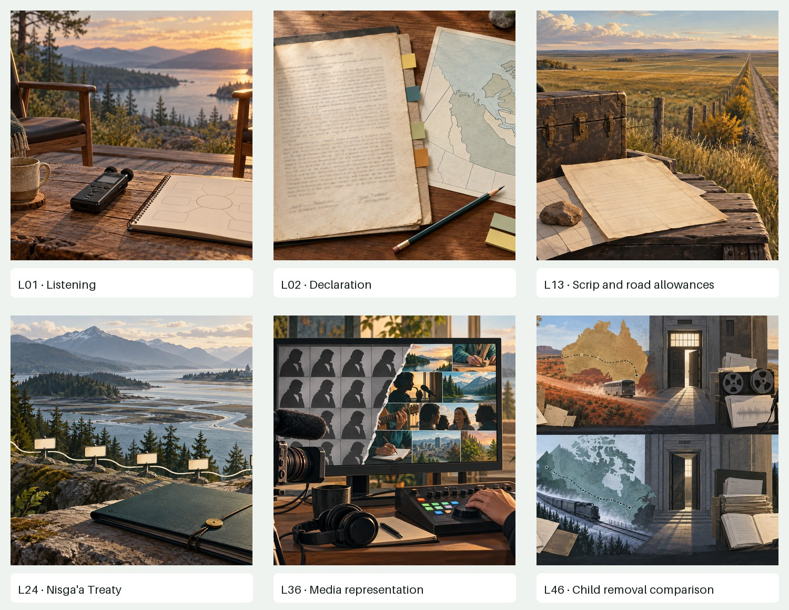
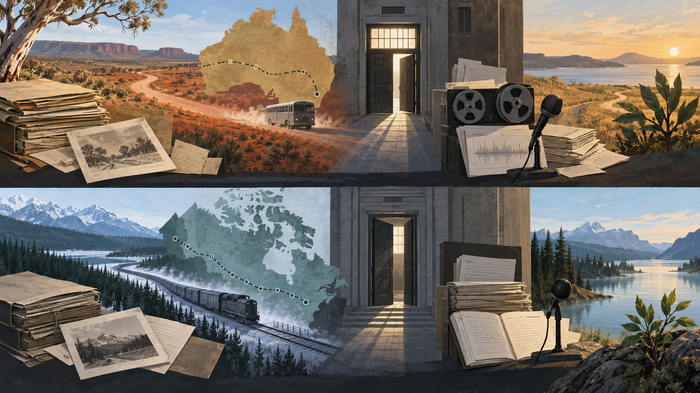

# AB30 six-lesson visual calibration

Status: **generated for comparison; not integrated into the learner course**

These six B candidates test one shared illustration language. Compare them with source option A and repo-native teaching visual C. The lead recommendation below is an instructional and cultural-safety review, not teacher approval.

## L01 · Oral Tradition: Listening, Knowledge, and Evidence

- **A · source option:** No direct-fit textbook image
- **B · generated option:** `generated-calibration/L01-listening-generated-b.png`
- **C · teaching visual:** Story-detail and teaching organizer
- **Lead review:** Strong atmosphere and a clear listening cue. The scenic setting should remain supplementary and should not imply a named community or ceremony.
- **Recommendation:** Use B as a restrained opening visual and C for the actual student activity.

## L02 · Nations, Peoples, and the Dene Declaration

- **A · source option:** Textbook printed p. 3: declaration-context visual
- **B · generated option:** `generated-calibration/L02-declaration-generated-b.png`
- **C · teaching visual:** Real declaration passage with student-facing annotation
- **Lead review:** Good document-analysis composition. Because the page is invented and blurred, it cannot replace the actual Dene Declaration passage.
- **Recommendation:** Use A and C for teaching; B can support the opening but must remain labelled as illustration.

## L13 · Métis Experiences: Red River, Scrip, and Road Allowances

- **A · source option:** Textbook printed p. 55: Métis scrip certificate
- **B · generated option:** `generated-calibration/L13-scrip-road-allowance-generated-b.png`
- **C · teaching visual:** Survey-grid and road-allowance evidence map
- **Lead review:** The retained v2 removes the first draft’s patterned textile and pseudo-document markings. The road, grid, trunk and blank forms now carry the concept without imitating cultural design.
- **Recommendation:** Use A and C for evidence; B is suitable as an opening illustration after the targeted correction.

## L24 · A Triumph for All: Gosnell and the Nisga'a Treaty

- **A · source option:** Textbook printed pp. 109–110: Dr. Joseph Gosnell and Nisga’a longhouse
- **B · generated option:** `generated-calibration/L24-nisgaa-treaty-generated-b.png`
- **C · teaching visual:** Petition-to-treaty timeline
- **Lead review:** Visually polished but too generic; the invented civic building and blank timeline markers can imply a real location. This candidate demonstrates why a sourced portrait and accurate timeline teach this lesson better.
- **Recommendation:** Prefer A and C. Hold B unless the civic-building ambiguity is resolved.

## L36 · Screens and Punchlines: Media, Humour, Identity

- **A · source option:** Textbook printed p. 169: APTN programming image
- **B · generated option:** `generated-calibration/L36-media-representation-generated-b.png`
- **C · teaching visual:** Media-analysis organizer for voice, pattern and control
- **Lead review:** Clear contrast between repeated flat representation and many community-controlled perspectives. It is visually engaging at wrapped-figure size.
- **Recommendation:** B is a strong opener; pair it with A and C rather than using it as evidence.

## L46 · Child Removal in Australia and Canada

- **A · source option:** No direct-fit textbook image for the comparison
- **B · generated option:** `generated-calibration/L46-child-removal-generated-b.png`
- **C · teaching visual:** Two sourced, parallel policy timelines
- **Lead review:** Sober and visually strong, but the bus, train, map routes and institutional doors could be read as factual details. A source-built timeline is safer and more accurate for the lesson.
- **Recommendation:** Use C as the primary teaching visual. Keep B as review-only unless its symbolic routes are explicitly framed.

## Decision gate

Approve the shared illustration language, revise it, or reject it. Then choose A, B or C lesson by lesson. No image should enter the learner course until its exact placement, caption/alt text and evidence role are approved.
