# Integrated visual review: L01–L45

This is the teacher comparison sheet for the **45 newly generated lesson visuals**. Each record shows the integrated image, lesson placement and exact generation prompt. Open the learner lesson for the final text-and-image composition.

- Generator: OpenAI built-in image generation
- Placement: after each lesson's first explanation, paired with the related text on desktop and stacked on narrow screens
- Role: orientation and concept support; never documentary evidence
- Existing visuals preserved: L46–L50, two images per lesson

## L01 — Oral Tradition: Listening, Knowledge, and Evidence

<table><tr><td width="42%">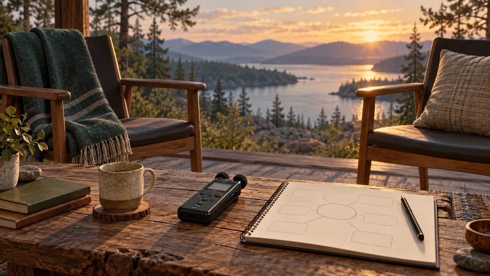</td><td><strong>Lesson ID</strong> <code>t1-l01-oral-tradition</code>  <strong>Asset</strong> <code>./assets/course-visuals/generated/L01-t1-l01-oral-tradition.webp</code>  <strong>Size</strong> 1200 × 676px  <strong>Prompt</strong> Contemporary Canadian high-school editorial illustration, quiet documentary-inspired realism, warm natural light, restrained spruce green, teal, charcoal and ochre palette, clean composition, authentic materials and geography, designed to sit inside a readable lesson rather than function as a poster. a careful listening workspace with two empty chairs angled toward one another, a small audio recorder, a notebook with an unfilled story-detail organizer, and warm natural light; the scene suggests listening, memory, and responsibility without depicting a ceremony or a named community. No words or labels, no border, no infographic text, no watermark. Do not imitate an Indigenous artist or style. Do not invent a named person, Nation, community, ceremony, regalia, sacred object, historical event, or official document. Avoid feathers, dreamcatchers, beadwork patterns, medicine wheels, tipis, and other generic pan-Indigenous decoration unless a reviewed source requires the actual object. </td></tr></table>

## L02 — Nations, Peoples, and the Dene Declaration

<table><tr><td width="42%">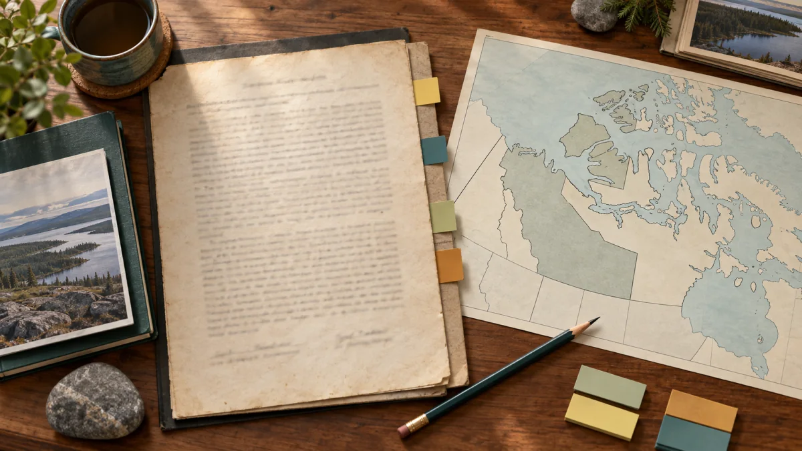</td><td><strong>Lesson ID</strong> <code>t1-l02-nations-peoples</code>  <strong>Asset</strong> <code>./assets/course-visuals/generated/L02-t1-l02-nations-peoples.webp</code>  <strong>Size</strong> 1200 × 676px  <strong>Prompt</strong> Contemporary Canadian high-school editorial illustration, quiet documentary-inspired realism, warm natural light, restrained spruce green, teal, charcoal and ochre palette, clean composition, authentic materials and geography, designed to sit inside a readable lesson rather than function as a poster. a document-analysis workspace with an archival declaration page, a simple Northwest Territories map outline, removable annotation tabs, and a pencil; no readable invented wording, no official logo, no people. No words or labels, no border, no infographic text, no watermark. Do not imitate an Indigenous artist or style. Do not invent a named person, Nation, community, ceremony, regalia, sacred object, historical event, or official document. Avoid feathers, dreamcatchers, beadwork patterns, medicine wheels, tipis, and other generic pan-Indigenous decoration unless a reviewed source requires the actual object. </td></tr></table>

## L03 — Rights: Making the Important Distinctions

<table><tr><td width="42%">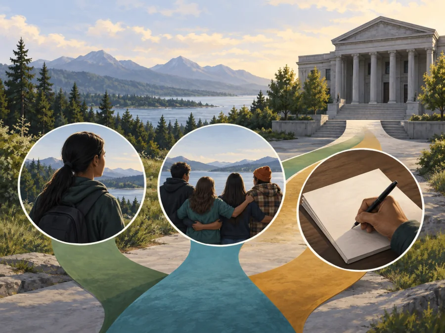</td><td><strong>Lesson ID</strong> <code>t1-l03-rights-distinctions</code>  <strong>Asset</strong> <code>./assets/course-visuals/generated/L03-t1-l03-rights-distinctions.webp</code>  <strong>Size</strong> 900 × 675px  <strong>Prompt</strong> Contemporary Canadian high-school editorial illustration, quiet documentary-inspired realism, warm natural light, restrained spruce green, teal, charcoal and ochre palette, clean composition, authentic materials and geography, designed to sit inside a readable lesson rather than function as a poster. three distinct but related civic pathways represented by a person icon, a people/community circle, and a treaty document, converging beside a courthouse; no labels, flags, logos, or cultural motifs. No words or labels, no border, no infographic text, no watermark. Do not imitate an Indigenous artist or style. Do not invent a named person, Nation, community, ceremony, regalia, sacred object, historical event, or official document. Avoid feathers, dreamcatchers, beadwork patterns, medicine wheels, tipis, and other generic pan-Indigenous decoration unless a reviewed source requires the actual object. </td></tr></table>

## L04 — Independence, Interdependence, and Worldview

<table><tr><td width="42%">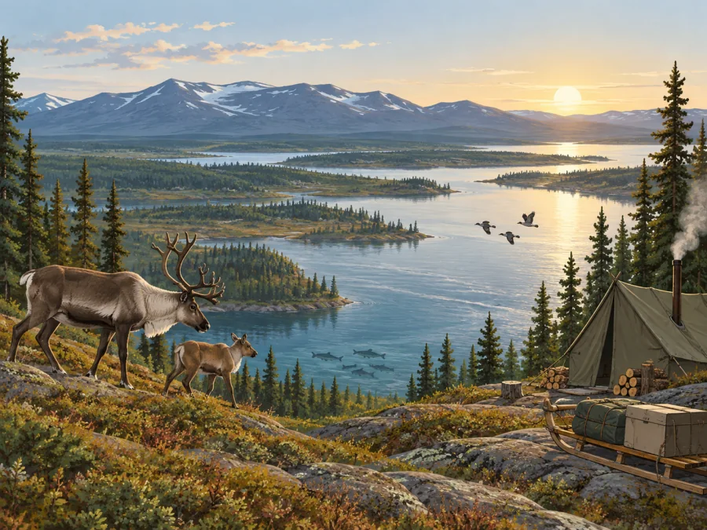</td><td><strong>Lesson ID</strong> <code>t1-l04-worldview</code>  <strong>Asset</strong> <code>./assets/course-visuals/generated/L04-t1-l04-worldview.webp</code>  <strong>Size</strong> 900 × 675px  <strong>Prompt</strong> Contemporary Canadian high-school editorial illustration, quiet documentary-inspired realism, warm natural light, restrained spruce green, teal, charcoal and ochre palette, clean composition, authentic materials and geography, designed to sit inside a readable lesson rather than function as a poster. a northern landscape shown as an interconnected system of water, animals, travel routes, shelter, and family responsibility; contemporary educational editorial illustration, no people, no cultural symbols. No words or labels, no border, no infographic text, no watermark. Do not imitate an Indigenous artist or style. Do not invent a named person, Nation, community, ceremony, regalia, sacred object, historical event, or official document. Avoid feathers, dreamcatchers, beadwork patterns, medicine wheels, tipis, and other generic pan-Indigenous decoration unless a reviewed source requires the actual object. </td></tr></table>

## L05 — Early Treaties and Relationships Among Nations

<table><tr><td width="42%">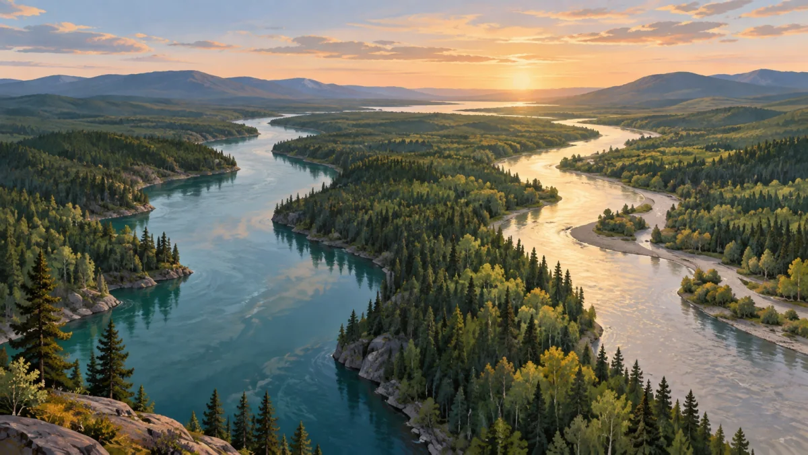</td><td><strong>Lesson ID</strong> <code>t1-l05-early-treaties</code>  <strong>Asset</strong> <code>./assets/course-visuals/generated/L05-t1-l05-early-treaties.webp</code>  <strong>Size</strong> 1200 × 676px  <strong>Prompt</strong> Contemporary Canadian high-school editorial illustration, quiet documentary-inspired realism, warm natural light, restrained spruce green, teal, charcoal and ochre palette, clean composition, authentic materials and geography, designed to sit inside a readable lesson rather than function as a poster. two parallel river routes viewed from above, separate and equal with a shared horizon, created as a neutral metaphor for coexistence; no beadwork, wampum, cultural patterns, ships, or canoes. No words or labels, no border, no infographic text, no watermark. Do not imitate an Indigenous artist or style. Do not invent a named person, Nation, community, ceremony, regalia, sacred object, historical event, or official document. Avoid feathers, dreamcatchers, beadwork patterns, medicine wheels, tipis, and other generic pan-Indigenous decoration unless a reviewed source requires the actual object. </td></tr></table>

## L06 — Colonization, the Royal Proclamation, and Confederation

<table><tr><td width="42%">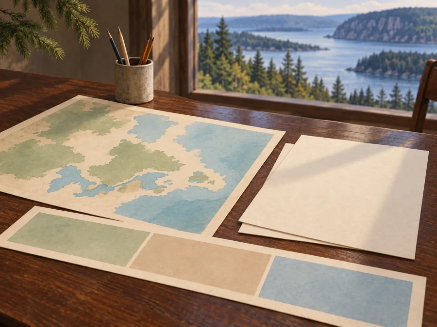</td><td><strong>Lesson ID</strong> <code>t1-l06-colonization-proclamation</code>  <strong>Asset</strong> <code>./assets/course-visuals/generated/L06-t1-l06-colonization-proclamation.webp</code>  <strong>Size</strong> 900 × 675px  <strong>Prompt</strong> Contemporary Canadian high-school editorial illustration, quiet documentary-inspired realism, warm natural light, restrained spruce green, teal, charcoal and ochre palette, clean composition, authentic materials and geography, designed to sit inside a readable lesson rather than function as a poster. an archival research table with a period map, a sealed but unreadable proclamation page, and a timeline strip moving from 1763 toward Confederation; no invented legible text or people. No words or labels, no border, no infographic text, no watermark. Do not imitate an Indigenous artist or style. Do not invent a named person, Nation, community, ceremony, regalia, sacred object, historical event, or official document. Avoid feathers, dreamcatchers, beadwork patterns, medicine wheels, tipis, and other generic pan-Indigenous decoration unless a reviewed source requires the actual object. </td></tr></table>

## L07 — Numbered Treaties: Purposes, Language, and Understandings

<table><tr><td width="42%">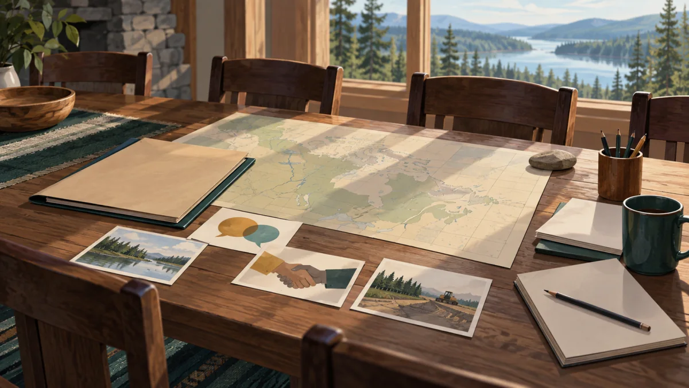</td><td><strong>Lesson ID</strong> <code>t1-l07-numbered-treaties</code>  <strong>Asset</strong> <code>./assets/course-visuals/generated/L07-t1-l07-numbered-treaties.webp</code>  <strong>Size</strong> 1200 × 676px  <strong>Prompt</strong> Contemporary Canadian high-school editorial illustration, quiet documentary-inspired realism, warm natural light, restrained spruce green, teal, charcoal and ochre palette, clean composition, authentic materials and geography, designed to sit inside a readable lesson rather than function as a poster. an overhead treaty-study table with multiple empty chairs, a map grid, an unsigned document folder, and evidence cards for spoken promises, written terms, and later implementation; no people or legible text. No words or labels, no border, no infographic text, no watermark. Do not imitate an Indigenous artist or style. Do not invent a named person, Nation, community, ceremony, regalia, sacred object, historical event, or official document. Avoid feathers, dreamcatchers, beadwork patterns, medicine wheels, tipis, and other generic pan-Indigenous decoration unless a reviewed source requires the actual object. </td></tr></table>

## L08 — Treaty Promises and Implementation in Alberta

<table><tr><td width="42%">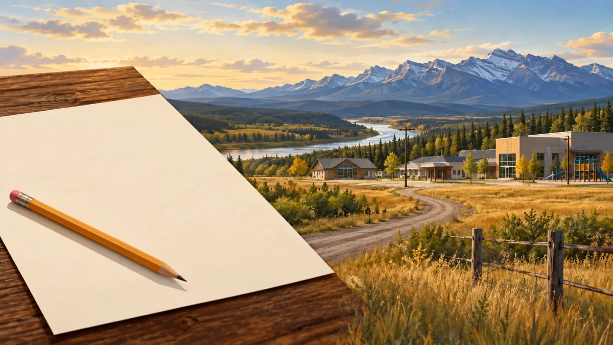</td><td><strong>Lesson ID</strong> <code>t1-l08-treaty-promises-alberta</code>  <strong>Asset</strong> <code>./assets/course-visuals/generated/L08-t1-l08-treaty-promises-alberta.webp</code>  <strong>Size</strong> 1200 × 676px  <strong>Prompt</strong> Contemporary Canadian high-school editorial illustration, quiet documentary-inspired realism, warm natural light, restrained spruce green, teal, charcoal and ochre palette, clean composition, authentic materials and geography, designed to sit inside a readable lesson rather than function as a poster. a historical document transitioning into a present-day Alberta landscape and community service buildings, showing the distance between written promise and implementation; no readable text, people, flags, or logos. No words or labels, no border, no infographic text, no watermark. Do not imitate an Indigenous artist or style. Do not invent a named person, Nation, community, ceremony, regalia, sacred object, historical event, or official document. Avoid feathers, dreamcatchers, beadwork patterns, medicine wheels, tipis, and other generic pan-Indigenous decoration unless a reviewed source requires the actual object. </td></tr></table>

## L09 — Geography, Resources, and Forms of Governance

<table><tr><td width="42%">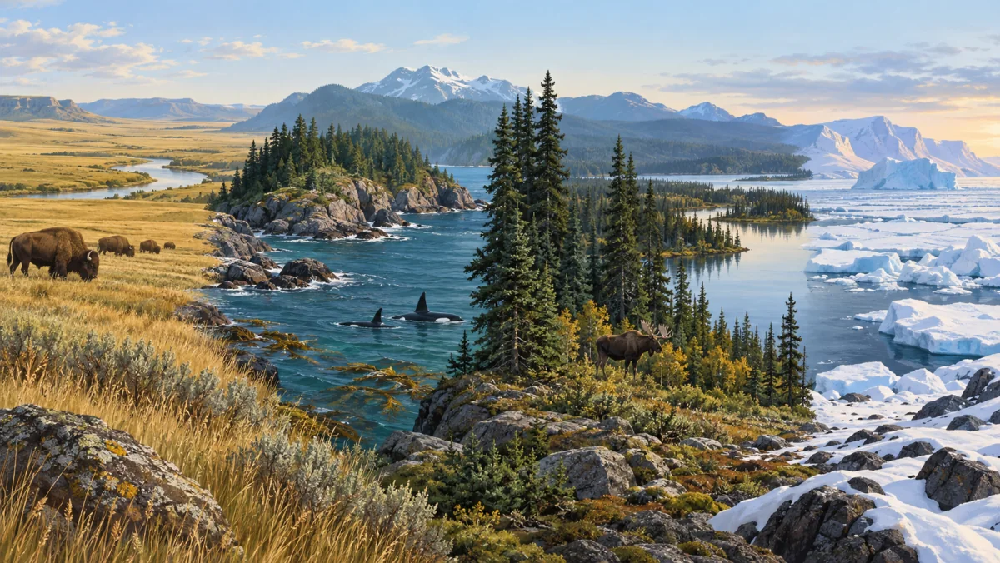</td><td><strong>Lesson ID</strong> <code>t1-l09-geography-governance</code>  <strong>Asset</strong> <code>./assets/course-visuals/generated/L09-t1-l09-geography-governance.webp</code>  <strong>Size</strong> 1200 × 676px  <strong>Prompt</strong> Contemporary Canadian high-school editorial illustration, quiet documentary-inspired realism, warm natural light, restrained spruce green, teal, charcoal and ochre palette, clean composition, authentic materials and geography, designed to sit inside a readable lesson rather than function as a poster. four connected Canadian ecological bands—plains, coast, subarctic forest, and arctic coast—shown with the natural resources and travel conditions each environment makes possible; no people or cultural stereotypes. No words or labels, no border, no infographic text, no watermark. Do not imitate an Indigenous artist or style. Do not invent a named person, Nation, community, ceremony, regalia, sacred object, historical event, or official document. Avoid feathers, dreamcatchers, beadwork patterns, medicine wheels, tipis, and other generic pan-Indigenous decoration unless a reviewed source requires the actual object. </td></tr></table>

## L10 — Land, Law, and Knowledge in Community Accounts

<table><tr><td width="42%">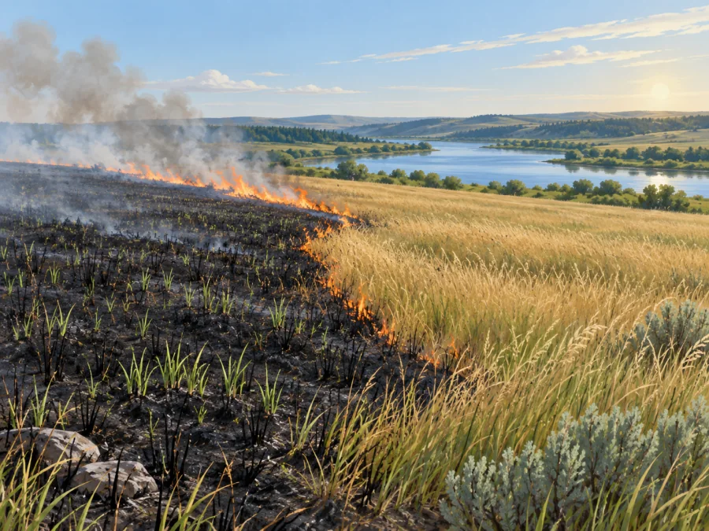</td><td><strong>Lesson ID</strong> <code>t1-l10-land-law-knowledge</code>  <strong>Asset</strong> <code>./assets/course-visuals/generated/L10-t1-l10-land-law-knowledge.webp</code>  <strong>Size</strong> 900 × 675px  <strong>Prompt</strong> Contemporary Canadian high-school editorial illustration, quiet documentary-inspired realism, warm natural light, restrained spruce green, teal, charcoal and ochre palette, clean composition, authentic materials and geography, designed to sit inside a readable lesson rather than function as a poster. a carefully managed grassland burn beside an unburned control area, with water, wind direction, and regrowth visible; educational environmental illustration, no people, buildings, or cultural motifs. No words or labels, no border, no infographic text, no watermark. Do not imitate an Indigenous artist or style. Do not invent a named person, Nation, community, ceremony, regalia, sacred object, historical event, or official document. Avoid feathers, dreamcatchers, beadwork patterns, medicine wheels, tipis, and other generic pan-Indigenous decoration unless a reviewed source requires the actual object. </td></tr></table>

## L11 — Métis Governance, Leadership, and Elders

<table><tr><td width="42%">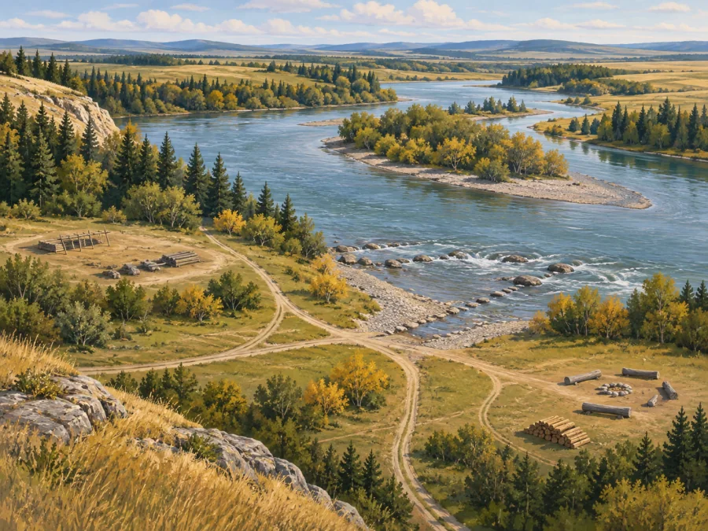</td><td><strong>Lesson ID</strong> <code>t1-l11-metis-governance-elders</code>  <strong>Asset</strong> <code>./assets/course-visuals/generated/L11-t1-l11-metis-governance-elders.webp</code>  <strong>Size</strong> 900 × 675px  <strong>Prompt</strong> Contemporary Canadian high-school editorial illustration, quiet documentary-inspired realism, warm natural light, restrained spruce green, teal, charcoal and ochre palette, clean composition, authentic materials and geography, designed to sit inside a readable lesson rather than function as a poster. a prairie river crossing and seasonal gathering place shown with route lines, shared work areas, and decision points; no people, historical reenactment, tipis, flags, or cultural decoration. No words or labels, no border, no infographic text, no watermark. Do not imitate an Indigenous artist or style. Do not invent a named person, Nation, community, ceremony, regalia, sacred object, historical event, or official document. Avoid feathers, dreamcatchers, beadwork patterns, medicine wheels, tipis, and other generic pan-Indigenous decoration unless a reviewed source requires the actual object. </td></tr></table>

## L12 — Different Historical Relationships: First Nations and Inuit

<table><tr><td width="42%">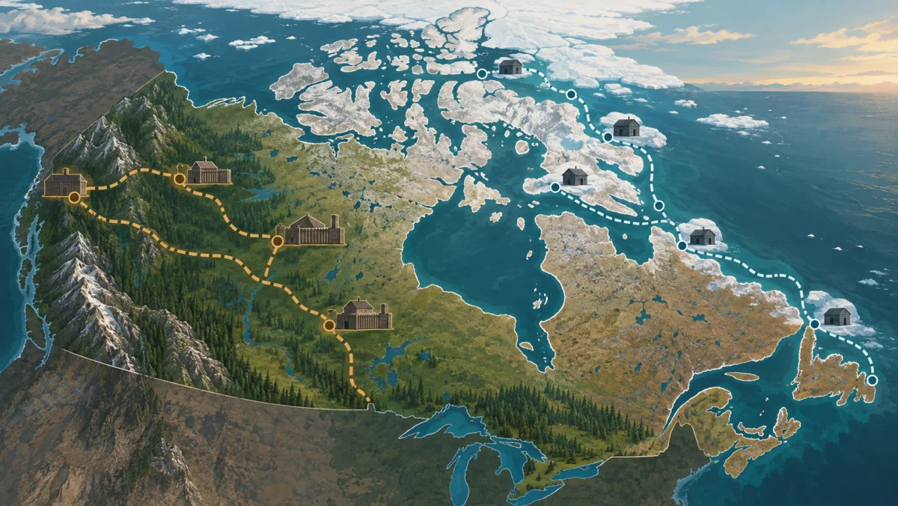</td><td><strong>Lesson ID</strong> <code>t1-l12-first-nations-inuit-relations</code>  <strong>Asset</strong> <code>./assets/course-visuals/generated/L12-t1-l12-first-nations-inuit-relations.webp</code>  <strong>Size</strong> 1200 × 676px  <strong>Prompt</strong> Contemporary Canadian high-school editorial illustration, quiet documentary-inspired realism, warm natural light, restrained spruce green, teal, charcoal and ochre palette, clean composition, authentic materials and geography, designed to sit inside a readable lesson rather than function as a poster. a restrained northern map comparing two different colonial policy routes and their consequences, using land, distance, and administration symbols; no reenactment, people, flags, or invented community names. No words or labels, no border, no infographic text, no watermark. Do not imitate an Indigenous artist or style. Do not invent a named person, Nation, community, ceremony, regalia, sacred object, historical event, or official document. Avoid feathers, dreamcatchers, beadwork patterns, medicine wheels, tipis, and other generic pan-Indigenous decoration unless a reviewed source requires the actual object. </td></tr></table>

## L13 — Métis Experiences: Red River, Scrip, and Road Allowances

<table><tr><td width="42%">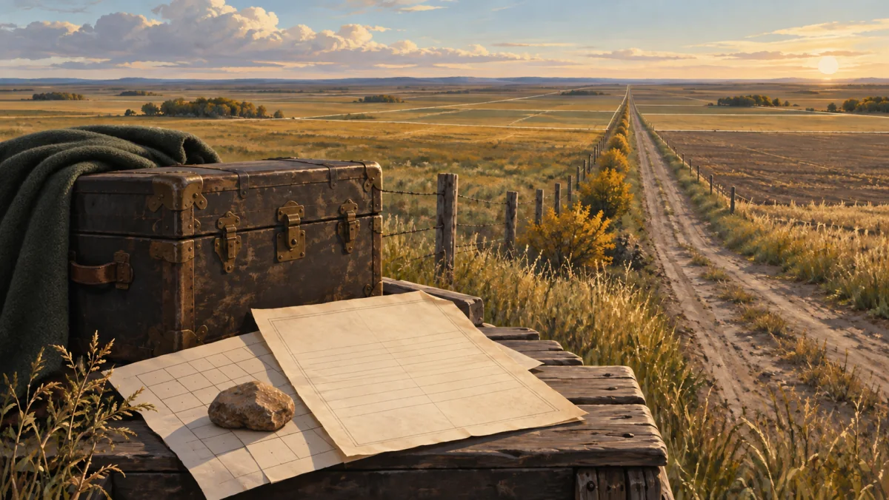</td><td><strong>Lesson ID</strong> <code>t1-l13-scrip-road-allowances</code>  <strong>Asset</strong> <code>./assets/course-visuals/generated/L13-t1-l13-scrip-road-allowances.webp</code>  <strong>Size</strong> 1200 × 676px  <strong>Prompt</strong> Contemporary Canadian high-school editorial illustration, quiet documentary-inspired realism, warm natural light, restrained spruce green, teal, charcoal and ochre palette, clean composition, authentic materials and geography, designed to sit inside a readable lesson rather than function as a poster. a prairie road allowance beside a surveyed township grid, with an unreadable land certificate and a family travel trunk; no people, logos, flags, or decorative Métis motifs. No words or labels, no border, no infographic text, no watermark. Do not imitate an Indigenous artist or style. Do not invent a named person, Nation, community, ceremony, regalia, sacred object, historical event, or official document. Avoid feathers, dreamcatchers, beadwork patterns, medicine wheels, tipis, and other generic pan-Indigenous decoration unless a reviewed source requires the actual object. </td></tr></table>

## L14 — The Indian Act: Purpose and Machinery

<table><tr><td width="42%">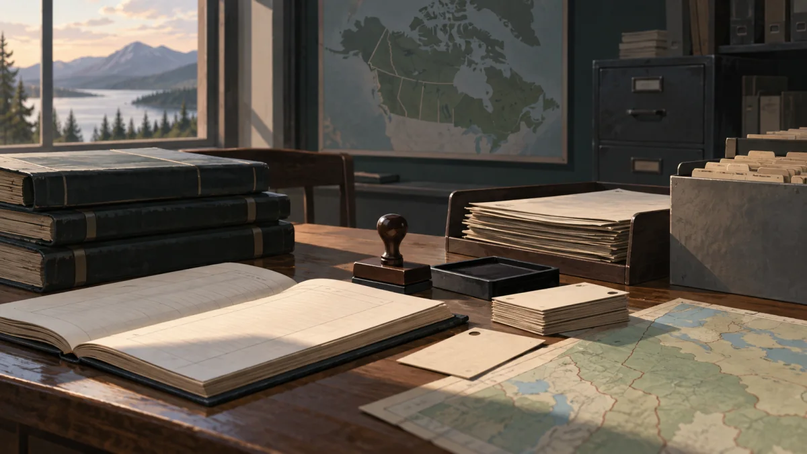</td><td><strong>Lesson ID</strong> <code>t1-l14-indian-act</code>  <strong>Asset</strong> <code>./assets/course-visuals/generated/L14-t1-l14-indian-act.webp</code>  <strong>Size</strong> 1200 × 676px  <strong>Prompt</strong> Contemporary Canadian high-school editorial illustration, quiet documentary-inspired realism, warm natural light, restrained spruce green, teal, charcoal and ochre palette, clean composition, authentic materials and geography, designed to sit inside a readable lesson rather than function as a poster. a stark archival desk with government ledgers, boundary maps, permit cards, stamps, and institutional files arranged as a system of control; no readable text, people, schoolchildren, or reenactment. No words or labels, no border, no infographic text, no watermark. Do not imitate an Indigenous artist or style. Do not invent a named person, Nation, community, ceremony, regalia, sacred object, historical event, or official document. Avoid feathers, dreamcatchers, beadwork patterns, medicine wheels, tipis, and other generic pan-Indigenous decoration unless a reviewed source requires the actual object. </td></tr></table>

## L15 — Resistance and the 1951 Revisions

<table><tr><td width="42%"></td><td><strong>Lesson ID</strong> <code>t1-l15-resistance-1951</code>  <strong>Asset</strong> <code>./assets/course-visuals/generated/L15-t1-l15-resistance-1951.webp</code>  <strong>Size</strong> 900 × 675px  <strong>Prompt</strong> Contemporary Canadian high-school editorial illustration, quiet documentary-inspired realism, warm natural light, restrained spruce green, teal, charcoal and ochre palette, clean composition, authentic materials and geography, designed to sit inside a readable lesson rather than function as a poster. civic steps with petition folders, blank protest placards, and a dated timeline moving from restriction toward revision; no slogans, readable text, flags, logos, or identifiable people. No words or labels, no border, no infographic text, no watermark. Do not imitate an Indigenous artist or style. Do not invent a named person, Nation, community, ceremony, regalia, sacred object, historical event, or official document. Avoid feathers, dreamcatchers, beadwork patterns, medicine wheels, tipis, and other generic pan-Indigenous decoration unless a reviewed source requires the actual object. </td></tr></table>

## L16 — Modern Policy, Band Councils, and Devolution

<table><tr><td width="42%"></td><td><strong>Lesson ID</strong> <code>t1-l16-policy-councils-devolution</code>  <strong>Asset</strong> <code>./assets/course-visuals/generated/L16-t1-l16-policy-councils-devolution.webp</code>  <strong>Size</strong> 900 × 675px  <strong>Prompt</strong> Contemporary Canadian high-school editorial illustration, quiet documentary-inspired realism, warm natural light, restrained spruce green, teal, charcoal and ochre palette, clean composition, authentic materials and geography, designed to sit inside a readable lesson rather than function as a poster. two connected meeting tables, one federal administrative and one community-led, with service, budget, law, and accountability folders moving between them; no people, flags, logos, or readable text. No words or labels, no border, no infographic text, no watermark. Do not imitate an Indigenous artist or style. Do not invent a named person, Nation, community, ceremony, regalia, sacred object, historical event, or official document. Avoid feathers, dreamcatchers, beadwork patterns, medicine wheels, tipis, and other generic pan-Indigenous decoration unless a reviewed source requires the actual object. </td></tr></table>

## L17 — Land-Based Knowledge and Constitutional Recognition

<table><tr><td width="42%">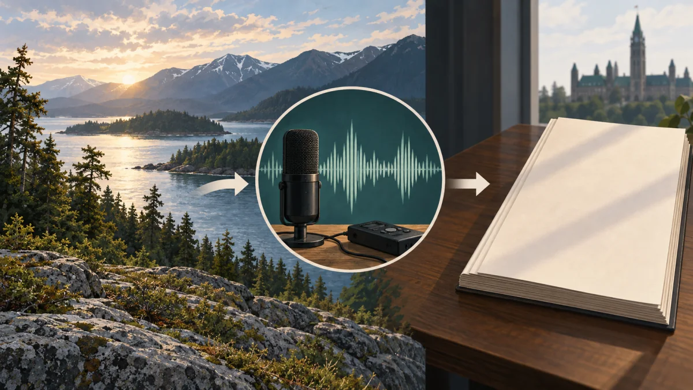</td><td><strong>Lesson ID</strong> <code>t1-l17-land-knowledge-constitution</code>  <strong>Asset</strong> <code>./assets/course-visuals/generated/L17-t1-l17-land-knowledge-constitution.webp</code>  <strong>Size</strong> 1200 × 676px  <strong>Prompt</strong> Contemporary Canadian high-school editorial illustration, quiet documentary-inspired realism, warm natural light, restrained spruce green, teal, charcoal and ochre palette, clean composition, authentic materials and geography, designed to sit inside a readable lesson rather than function as a poster. three linked evidence panels showing a lived landscape, a recorded oral account waveform, and a constitutional page, with arrows showing how recognition is argued; no people or readable legal wording. No words or labels, no border, no infographic text, no watermark. Do not imitate an Indigenous artist or style. Do not invent a named person, Nation, community, ceremony, regalia, sacred object, historical event, or official document. Avoid feathers, dreamcatchers, beadwork patterns, medicine wheels, tipis, and other generic pan-Indigenous decoration unless a reviewed source requires the actual object. </td></tr></table>

## L18 — Constitutional Negotiations and National Organizations

<table><tr><td width="42%">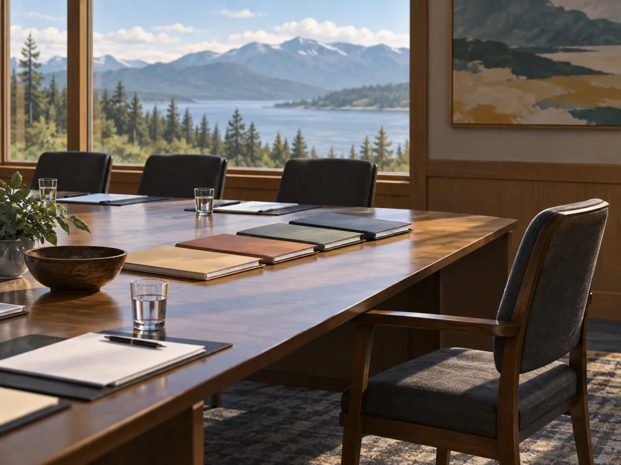</td><td><strong>Lesson ID</strong> <code>t1-l18-constitutional-negotiations</code>  <strong>Asset</strong> <code>./assets/course-visuals/generated/L18-t1-l18-constitutional-negotiations.webp</code>  <strong>Size</strong> 900 × 675px  <strong>Prompt</strong> Contemporary Canadian high-school editorial illustration, quiet documentary-inspired realism, warm natural light, restrained spruce green, teal, charcoal and ochre palette, clean composition, authentic materials and geography, designed to sit inside a readable lesson rather than function as a poster. a constitutional negotiation table with empty chairs, a dated sequence of document folders, and one unresolved place at the table; no people, flags, logos, or readable text. No words or labels, no border, no infographic text, no watermark. Do not imitate an Indigenous artist or style. Do not invent a named person, Nation, community, ceremony, regalia, sacred object, historical event, or official document. Avoid feathers, dreamcatchers, beadwork patterns, medicine wheels, tipis, and other generic pan-Indigenous decoration unless a reviewed source requires the actual object. </td></tr></table>

## L19 — Aboriginal Title, Treaties, and Land-Related Constraints

<table><tr><td width="42%">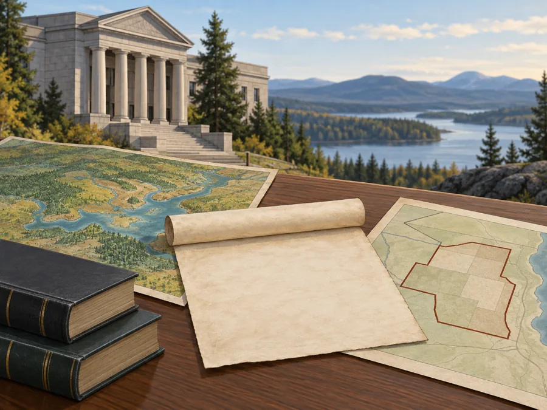</td><td><strong>Lesson ID</strong> <code>t1-l19-title-treaties-constraints</code>  <strong>Asset</strong> <code>./assets/course-visuals/generated/L19-t1-l19-title-treaties-constraints.webp</code>  <strong>Size</strong> 900 × 675px  <strong>Prompt</strong> Contemporary Canadian high-school editorial illustration, quiet documentary-inspired realism, warm natural light, restrained spruce green, teal, charcoal and ochre palette, clean composition, authentic materials and geography, designed to sit inside a readable lesson rather than function as a poster. a courthouse, a longstanding land-use map, a treaty document, and a reserve boundary plan presented as four pieces of evidence that must not be collapsed; no readable text or people. No words or labels, no border, no infographic text, no watermark. Do not imitate an Indigenous artist or style. Do not invent a named person, Nation, community, ceremony, regalia, sacred object, historical event, or official document. Avoid feathers, dreamcatchers, beadwork patterns, medicine wheels, tipis, and other generic pan-Indigenous decoration unless a reviewed source requires the actual object. </td></tr></table>

## L20 — Harvesting Rights, Section 35, and Careful Claims

<table><tr><td width="42%">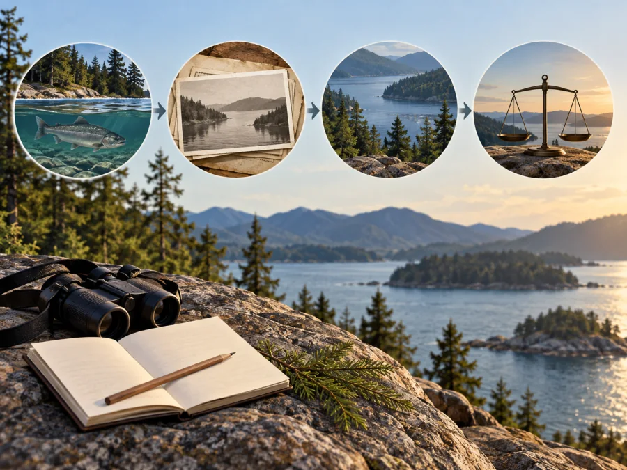</td><td><strong>Lesson ID</strong> <code>t1-l20-harvesting-rights</code>  <strong>Asset</strong> <code>./assets/course-visuals/generated/L20-t1-l20-harvesting-rights.webp</code>  <strong>Size</strong> 900 × 675px  <strong>Prompt</strong> Contemporary Canadian high-school editorial illustration, quiet documentary-inspired realism, warm natural light, restrained spruce green, teal, charcoal and ochre palette, clean composition, authentic materials and geography, designed to sit inside a readable lesson rather than function as a poster. a legal reasoning path linking a harvesting practice, historical continuity, community connection, and a bounded conclusion; neutral symbols, no people, logos, flags, or cultural motifs. No words or labels, no border, no infographic text, no watermark. Do not imitate an Indigenous artist or style. Do not invent a named person, Nation, community, ceremony, regalia, sacred object, historical event, or official document. Avoid feathers, dreamcatchers, beadwork patterns, medicine wheels, tipis, and other generic pan-Indigenous decoration unless a reviewed source requires the actual object. </td></tr></table>

## L21 — Rebuilding Self-Government: Goals and Negotiations

<table><tr><td width="42%">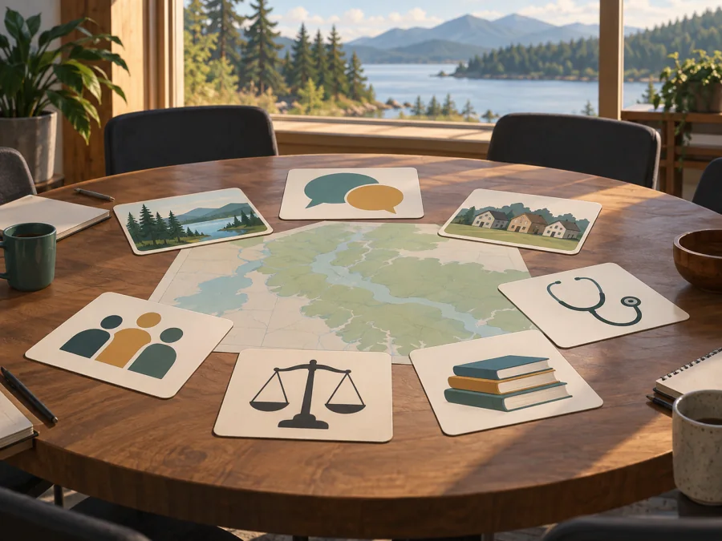</td><td><strong>Lesson ID</strong> <code>t1-l21-rebuilding-goals</code>  <strong>Asset</strong> <code>./assets/course-visuals/generated/L21-t1-l21-rebuilding-goals.webp</code>  <strong>Size</strong> 900 × 675px  <strong>Prompt</strong> Contemporary Canadian high-school editorial illustration, quiet documentary-inspired realism, warm natural light, restrained spruce green, teal, charcoal and ochre palette, clean composition, authentic materials and geography, designed to sit inside a readable lesson rather than function as a poster. a community planning table with lands, language, housing, health, education, justice, and accountability cards arranged around a shared decision space; no people, readable text, flags, or logos. No words or labels, no border, no infographic text, no watermark. Do not imitate an Indigenous artist or style. Do not invent a named person, Nation, community, ceremony, regalia, sacred object, historical event, or official document. Avoid feathers, dreamcatchers, beadwork patterns, medicine wheels, tipis, and other generic pan-Indigenous decoration unless a reviewed source requires the actual object. </td></tr></table>

## L22 — Comparing Models of Self-Government

<table><tr><td width="42%">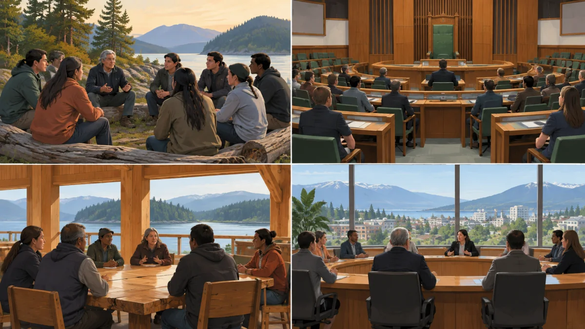</td><td><strong>Lesson ID</strong> <code>t1-l22-models</code>  <strong>Asset</strong> <code>./assets/course-visuals/generated/L22-t1-l22-models.webp</code>  <strong>Size</strong> 1200 × 676px  <strong>Prompt</strong> Contemporary Canadian high-school editorial illustration, quiet documentary-inspired realism, warm natural light, restrained spruce green, teal, charcoal and ochre palette, clean composition, authentic materials and geography, designed to sit inside a readable lesson rather than function as a poster. four equal governance diagrams distinguished by participants, territory, authority, and accountability, laid out without a hierarchy; no text, flags, people, or ranking cues. No words or labels, no border, no infographic text, no watermark. Do not imitate an Indigenous artist or style. Do not invent a named person, Nation, community, ceremony, regalia, sacred object, historical event, or official document. Avoid feathers, dreamcatchers, beadwork patterns, medicine wheels, tipis, and other generic pan-Indigenous decoration unless a reviewed source requires the actual object. </td></tr></table>

## L23 — Theme 1 Synthesis and Fresh Evidence Check

<table><tr><td width="42%"></td><td><strong>Lesson ID</strong> <code>t1-l23-synthesis</code>  <strong>Asset</strong> <code>./assets/course-visuals/generated/L23-t1-l23-synthesis.webp</code>  <strong>Size</strong> 1200 × 676px  <strong>Prompt</strong> Contemporary Canadian high-school editorial illustration, quiet documentary-inspired realism, warm natural light, restrained spruce green, teal, charcoal and ochre palette, clean composition, authentic materials and geography, designed to sit inside a readable lesson rather than function as a poster. three distinct streams representing relationship, recognition, and governance joining into one evidence-based conclusion, with room for student-added examples; no cultural patterns, people, flags, or text. No words or labels, no border, no infographic text, no watermark. Do not imitate an Indigenous artist or style. Do not invent a named person, Nation, community, ceremony, regalia, sacred object, historical event, or official document. Avoid feathers, dreamcatchers, beadwork patterns, medicine wheels, tipis, and other generic pan-Indigenous decoration unless a reviewed source requires the actual object. </td></tr></table>

## L24 — A Triumph for All: Gosnell and the Nisga'a Treaty

<table><tr><td width="42%">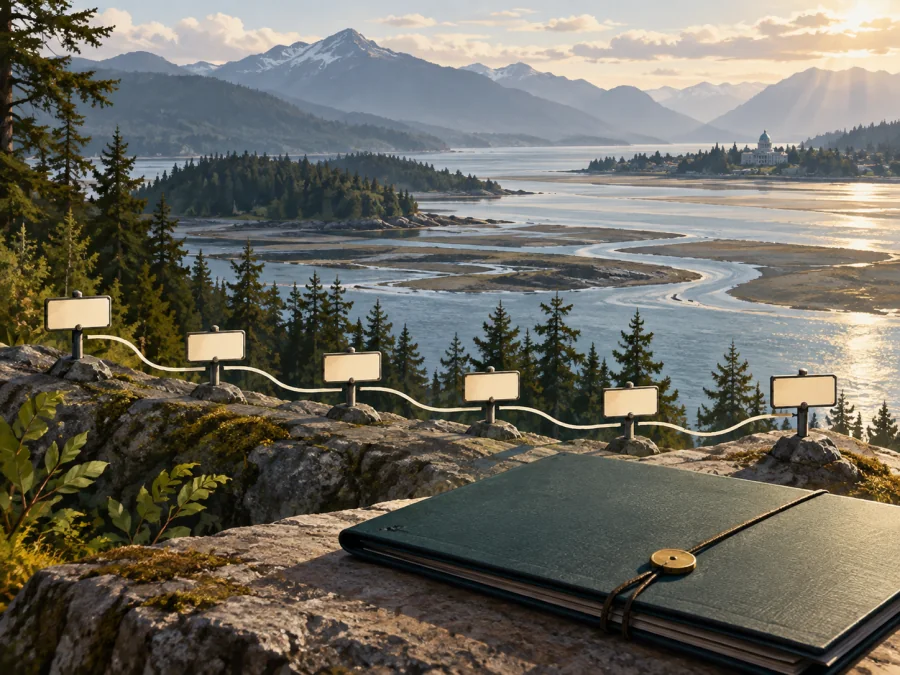</td><td><strong>Lesson ID</strong> <code>t2-l01-why-land-matters</code>  <strong>Asset</strong> <code>./assets/course-visuals/generated/L24-t2-l01-why-land-matters.webp</code>  <strong>Size</strong> 900 × 675px  <strong>Prompt</strong> Contemporary Canadian high-school editorial illustration, quiet documentary-inspired realism, warm natural light, restrained spruce green, teal, charcoal and ochre palette, clean composition, authentic materials and geography, designed to sit inside a readable lesson rather than function as a poster. a northwest coast estuary, a civic building in the distance, a treaty folder, and a long timeline from petition to agreement; no people, logos, flags, longhouse imitation, or named-site claim. No words or labels, no border, no infographic text, no watermark. Do not imitate an Indigenous artist or style. Do not invent a named person, Nation, community, ceremony, regalia, sacred object, historical event, or official document. Avoid feathers, dreamcatchers, beadwork patterns, medicine wheels, tipis, and other generic pan-Indigenous decoration unless a reviewed source requires the actual object. </td></tr></table>

## L25 — Six Ways to Value Land

<table><tr><td width="42%">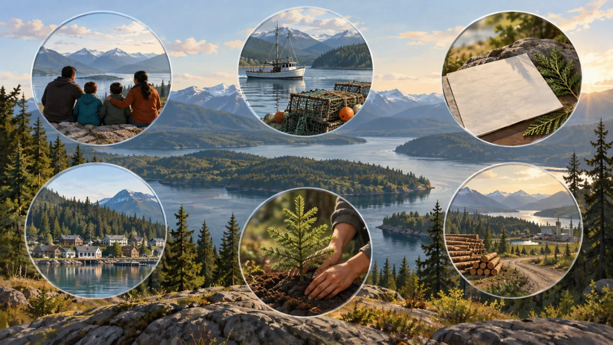</td><td><strong>Lesson ID</strong> <code>t2-l05-land-values</code>  <strong>Asset</strong> <code>./assets/course-visuals/generated/L25-t2-l05-land-values.webp</code>  <strong>Size</strong> 1200 × 676px  <strong>Prompt</strong> Contemporary Canadian high-school editorial illustration, quiet documentary-inspired realism, warm natural light, restrained spruce green, teal, charcoal and ochre palette, clean composition, authentic materials and geography, designed to sit inside a readable lesson rather than function as a poster. one landscape viewed through six transparent lenses for family, livelihood, law, community, responsibility, and economic value; no text, people, cultural symbols, or ranking. No words or labels, no border, no infographic text, no watermark. Do not imitate an Indigenous artist or style. Do not invent a named person, Nation, community, ceremony, regalia, sacred object, historical event, or official document. Avoid feathers, dreamcatchers, beadwork patterns, medicine wheels, tipis, and other generic pan-Indigenous decoration unless a reviewed source requires the actual object. </td></tr></table>

## L26 — From Petitions to Policy: The Calder Case

<table><tr><td width="42%"></td><td><strong>Lesson ID</strong> <code>t2-l02-two-kinds-of-claims</code>  <strong>Asset</strong> <code>./assets/course-visuals/generated/L26-t2-l02-two-kinds-of-claims.webp</code>  <strong>Size</strong> 1200 × 676px  <strong>Prompt</strong> Contemporary Canadian high-school editorial illustration, quiet documentary-inspired realism, warm natural light, restrained spruce green, teal, charcoal and ochre palette, clean composition, authentic materials and geography, designed to sit inside a readable lesson rather than function as a poster. a petition folder moving through research, court review, policy change, and negotiation as a clear four-stage educational diagram; no readable text, people, flags, logos, or verdict claim. No words or labels, no border, no infographic text, no watermark. Do not imitate an Indigenous artist or style. Do not invent a named person, Nation, community, ceremony, regalia, sacred object, historical event, or official document. Avoid feathers, dreamcatchers, beadwork patterns, medicine wheels, tipis, and other generic pan-Indigenous decoration unless a reviewed source requires the actual object. </td></tr></table>

## L27 — The Claims Machine: Offices, Reports, and Proof

<table><tr><td width="42%">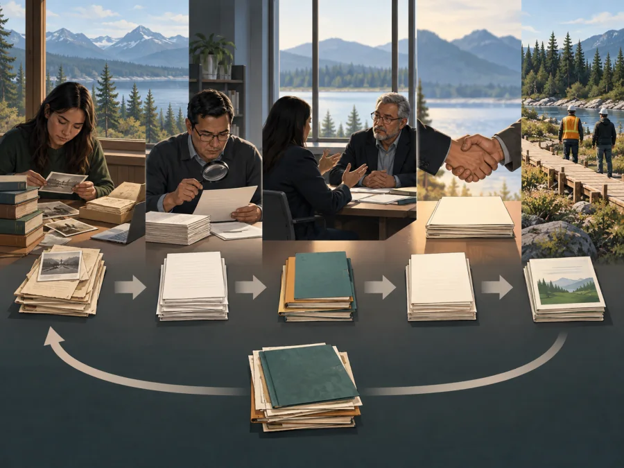</td><td><strong>Lesson ID</strong> <code>t2-l06-claims-machine</code>  <strong>Asset</strong> <code>./assets/course-visuals/generated/L27-t2-l06-claims-machine.webp</code>  <strong>Size</strong> 900 × 675px  <strong>Prompt</strong> Contemporary Canadian high-school editorial illustration, quiet documentary-inspired realism, warm natural light, restrained spruce green, teal, charcoal and ochre palette, clean composition, authentic materials and geography, designed to sit inside a readable lesson rather than function as a poster. a sequence of evidence files moving through research, validation, negotiation, settlement, and implementation, with a loop for unresolved claims; no readable text, people, flags, or logos. No words or labels, no border, no infographic text, no watermark. Do not imitate an Indigenous artist or style. Do not invent a named person, Nation, community, ceremony, regalia, sacred object, historical event, or official document. Avoid feathers, dreamcatchers, beadwork patterns, medicine wheels, tipis, and other generic pan-Indigenous decoration unless a reviewed source requires the actual object. </td></tr></table>

## L28 — Specific Claims and the Bigstone Cree

<table><tr><td width="42%">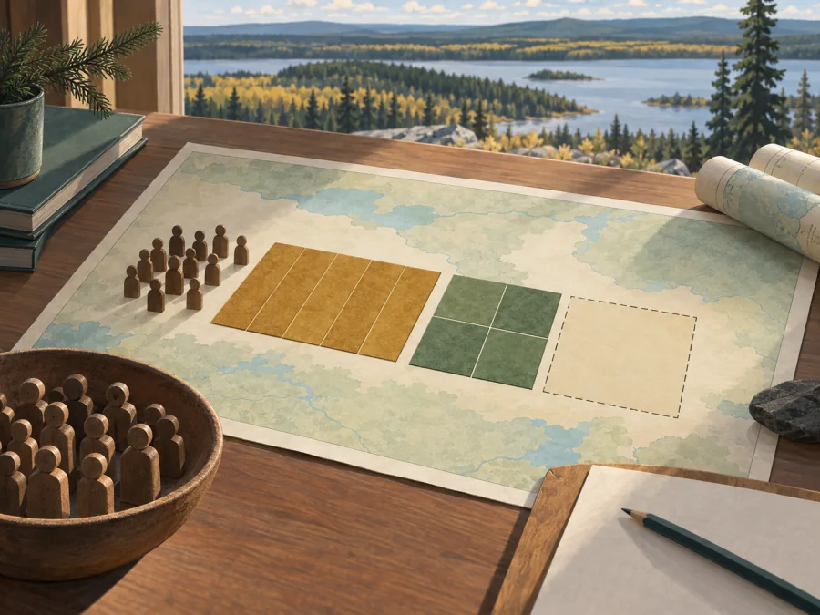</td><td><strong>Lesson ID</strong> <code>t2-l07-bigstone-specific</code>  <strong>Asset</strong> <code>./assets/course-visuals/generated/L28-t2-l07-bigstone-specific.webp</code>  <strong>Size</strong> 900 × 675px  <strong>Prompt</strong> Contemporary Canadian high-school editorial illustration, quiet documentary-inspired realism, warm natural light, restrained spruce green, teal, charcoal and ochre palette, clean composition, authentic materials and geography, designed to sit inside a readable lesson rather than function as a poster. a survey map showing population count, promised acreage, delivered parcels, and a visible gap, using unlabeled measurement blocks; no people, flags, logos, or invented place names. No words or labels, no border, no infographic text, no watermark. Do not imitate an Indigenous artist or style. Do not invent a named person, Nation, community, ceremony, regalia, sacred object, historical event, or official document. Avoid feathers, dreamcatchers, beadwork patterns, medicine wheels, tipis, and other generic pan-Indigenous decoration unless a reviewed source requires the actual object. </td></tr></table>

## L29 — When Talks Fail: Paths to Resolution

<table><tr><td width="42%">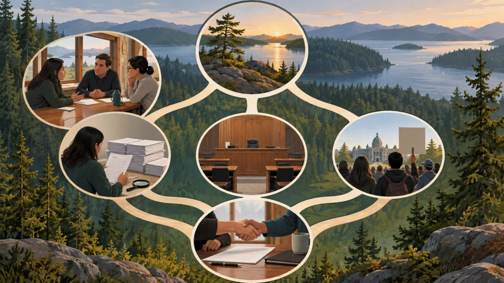</td><td><strong>Lesson ID</strong> <code>t2-l08-paths-resolution</code>  <strong>Asset</strong> <code>./assets/course-visuals/generated/L29-t2-l08-paths-resolution.webp</code>  <strong>Size</strong> 1200 × 676px  <strong>Prompt</strong> Contemporary Canadian high-school editorial illustration, quiet documentary-inspired realism, warm natural light, restrained spruce green, teal, charcoal and ochre palette, clean composition, authentic materials and geography, designed to sit inside a readable lesson rather than function as a poster. a claim branching into negotiation, commission review, court action, public advocacy, and settlement, with paths reconnecting rather than ranking; no readable text, people, flags, or logos. No words or labels, no border, no infographic text, no watermark. Do not imitate an Indigenous artist or style. Do not invent a named person, Nation, community, ceremony, regalia, sacred object, historical event, or official document. Avoid feathers, dreamcatchers, beadwork patterns, medicine wheels, tipis, and other generic pan-Indigenous decoration unless a reviewed source requires the actual object. </td></tr></table>

## L30 — Métis and Non-Status Claims

<table><tr><td width="42%">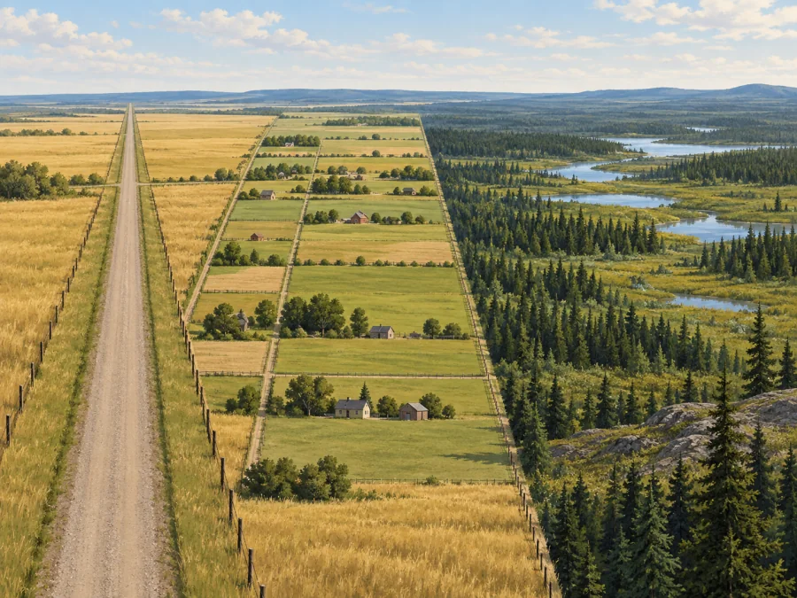</td><td><strong>Lesson ID</strong> <code>t2-l03-metis-non-status-claims</code>  <strong>Asset</strong> <code>./assets/course-visuals/generated/L30-t2-l03-metis-non-status-claims.webp</code>  <strong>Size</strong> 900 × 675px  <strong>Prompt</strong> Contemporary Canadian high-school editorial illustration, quiet documentary-inspired realism, warm natural light, restrained spruce green, teal, charcoal and ochre palette, clean composition, authentic materials and geography, designed to sit inside a readable lesson rather than function as a poster. a prairie road allowance, a Métis settlement land grid, and provincial Crown-land boundaries shown as three distinct legal-geographic arrangements; no people, flags, logos, or decorative cultural motifs. No words or labels, no border, no infographic text, no watermark. Do not imitate an Indigenous artist or style. Do not invent a named person, Nation, community, ceremony, regalia, sacred object, historical event, or official document. Avoid feathers, dreamcatchers, beadwork patterns, medicine wheels, tipis, and other generic pan-Indigenous decoration unless a reviewed source requires the actual object. </td></tr></table>

## L31 — A New Era and the First Modern Treaty

<table><tr><td width="42%">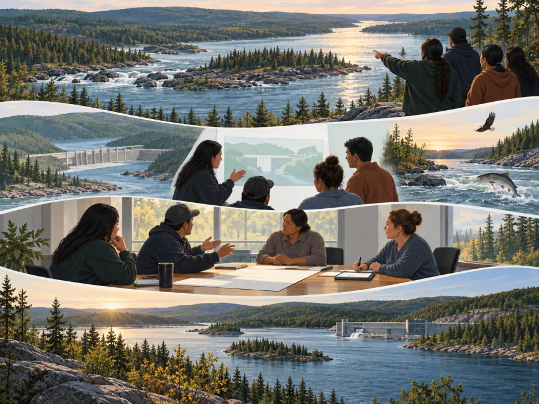</td><td><strong>Lesson ID</strong> <code>t2-l09-first-modern-treaties</code>  <strong>Asset</strong> <code>./assets/course-visuals/generated/L31-t2-l09-first-modern-treaties.webp</code>  <strong>Size</strong> 900 × 675px  <strong>Prompt</strong> Contemporary Canadian high-school editorial illustration, quiet documentary-inspired realism, warm natural light, restrained spruce green, teal, charcoal and ochre palette, clean composition, authentic materials and geography, designed to sit inside a readable lesson rather than function as a poster. a northern river system with a proposed hydroelectric change, community response, negotiation table, and agreement outcome arranged as a timeline; no people, dams copied from a named site, flags, or logos. No words or labels, no border, no infographic text, no watermark. Do not imitate an Indigenous artist or style. Do not invent a named person, Nation, community, ceremony, regalia, sacred object, historical event, or official document. Avoid feathers, dreamcatchers, beadwork patterns, medicine wheels, tipis, and other generic pan-Indigenous decoration unless a reviewed source requires the actual object. </td></tr></table>

## L32 — The North and West Settle

<table><tr><td width="42%">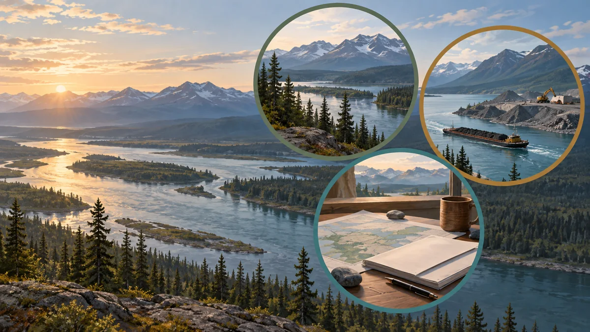</td><td><strong>Lesson ID</strong> <code>t2-l10-north-and-west</code>  <strong>Asset</strong> <code>./assets/course-visuals/generated/L32-t2-l10-north-and-west.webp</code>  <strong>Size</strong> 1200 × 676px  <strong>Prompt</strong> Contemporary Canadian high-school editorial illustration, quiet documentary-inspired realism, warm natural light, restrained spruce green, teal, charcoal and ochre palette, clean composition, authentic materials and geography, designed to sit inside a readable lesson rather than function as a poster. a northern river and mountain region shown with three distinct negotiation areas, land, resource, and governance layers; no people, flags, logos, or invented place names. No words or labels, no border, no infographic text, no watermark. Do not imitate an Indigenous artist or style. Do not invent a named person, Nation, community, ceremony, regalia, sacred object, historical event, or official document. Avoid feathers, dreamcatchers, beadwork patterns, medicine wheels, tipis, and other generic pan-Indigenous decoration unless a reviewed source requires the actual object. </td></tr></table>

## L33 — Nunavut: A Public Government, An Inuit Future

<table><tr><td width="42%">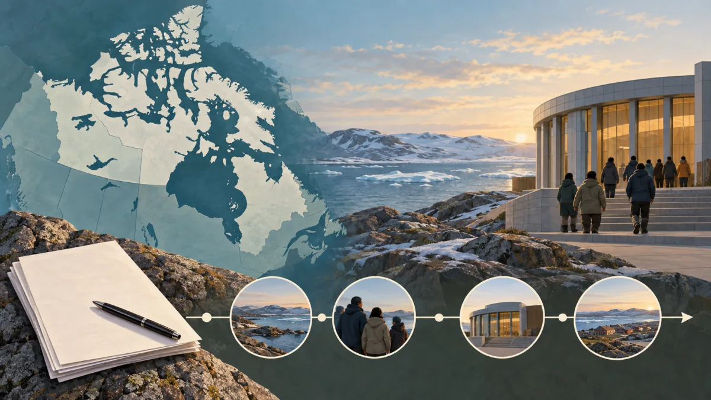</td><td><strong>Lesson ID</strong> <code>t2-l04-resolving-claims</code>  <strong>Asset</strong> <code>./assets/course-visuals/generated/L33-t2-l04-resolving-claims.webp</code>  <strong>Size</strong> 1200 × 676px  <strong>Prompt</strong> Contemporary Canadian high-school editorial illustration, quiet documentary-inspired realism, warm natural light, restrained spruce green, teal, charcoal and ochre palette, clean composition, authentic materials and geography, designed to sit inside a readable lesson rather than function as a poster. an arctic coastline map beside a public assembly building silhouette and a timeline from land claim to territorial government; no flags, people, logos, or imitation of a named building. No words or labels, no border, no infographic text, no watermark. Do not imitate an Indigenous artist or style. Do not invent a named person, Nation, community, ceremony, regalia, sacred object, historical event, or official document. Avoid feathers, dreamcatchers, beadwork patterns, medicine wheels, tipis, and other generic pan-Indigenous decoration unless a reviewed source requires the actual object. </td></tr></table>

## L34 — Mirrors and Walls: Dumont and Cultural Barriers

<table><tr><td width="42%">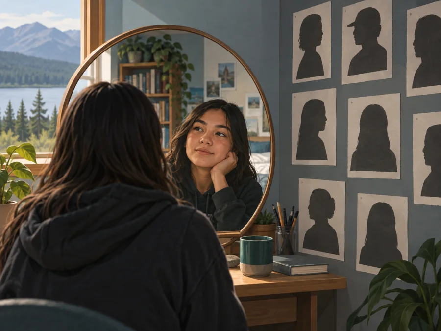</td><td><strong>Lesson ID</strong> <code>t3-l01-stereotypes-media</code>  <strong>Asset</strong> <code>./assets/course-visuals/generated/L34-t3-l01-stereotypes-media.webp</code>  <strong>Size</strong> 900 × 675px  <strong>Prompt</strong> Contemporary Canadian high-school editorial illustration, quiet documentary-inspired realism, warm natural light, restrained spruce green, teal, charcoal and ochre palette, clean composition, authentic materials and geography, designed to sit inside a readable lesson rather than function as a poster. a mirror reflecting a complex contemporary person while a wall beside it carries repeated simplified silhouette cutouts, illustrating representation versus stereotype; no cultural dress, logos, or identifiable people. No words or labels, no border, no infographic text, no watermark. Do not imitate an Indigenous artist or style. Do not invent a named person, Nation, community, ceremony, regalia, sacred object, historical event, or official document. Avoid feathers, dreamcatchers, beadwork patterns, medicine wheels, tipis, and other generic pan-Indigenous decoration unless a reviewed source requires the actual object. </td></tr></table>

## L35 — Words That Wound: Discrimination, Columbus, Littlechild

<table><tr><td width="42%">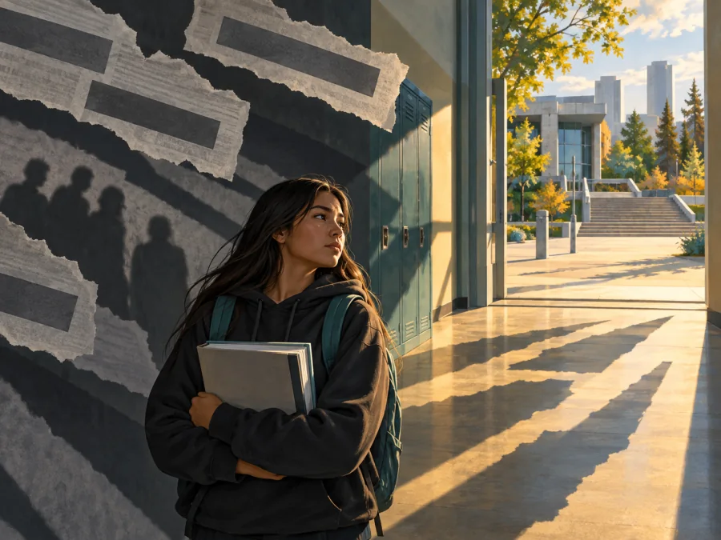</td><td><strong>Lesson ID</strong> <code>t3-l05-words-that-wound</code>  <strong>Asset</strong> <code>./assets/course-visuals/generated/L35-t3-l05-words-that-wound.webp</code>  <strong>Size</strong> 900 × 675px  <strong>Prompt</strong> Contemporary Canadian high-school editorial illustration, quiet documentary-inspired realism, warm natural light, restrained spruce green, teal, charcoal and ochre palette, clean composition, authentic materials and geography, designed to sit inside a readable lesson rather than function as a poster. torn newspaper headline shapes casting long shadows across a school corridor and civic space, showing how repeated language affects opportunity; no legible slurs, people, logos, flags, or cultural motifs. No words or labels, no border, no infographic text, no watermark. Do not imitate an Indigenous artist or style. Do not invent a named person, Nation, community, ceremony, regalia, sacred object, historical event, or official document. Avoid feathers, dreamcatchers, beadwork patterns, medicine wheels, tipis, and other generic pan-Indigenous decoration unless a reviewed source requires the actual object. </td></tr></table>

## L36 — Screens and Punchlines: Media, Humour, Identity

<table><tr><td width="42%"></td><td><strong>Lesson ID</strong> <code>t3-l06-screens-punchlines</code>  <strong>Asset</strong> <code>./assets/course-visuals/generated/L36-t3-l06-screens-punchlines.webp</code>  <strong>Size</strong> 900 × 675px  <strong>Prompt</strong> Contemporary Canadian high-school editorial illustration, quiet documentary-inspired realism, warm natural light, restrained spruce green, teal, charcoal and ochre palette, clean composition, authentic materials and geography, designed to sit inside a readable lesson rather than function as a poster. a media screen split between a flat repeated stereotype silhouette and a community-controlled camera, microphone, and editing console showing many perspectives; no people, logos, film characters, or cultural motifs. No words or labels, no border, no infographic text, no watermark. Do not imitate an Indigenous artist or style. Do not invent a named person, Nation, community, ceremony, regalia, sacred object, historical event, or official document. Avoid feathers, dreamcatchers, beadwork patterns, medicine wheels, tipis, and other generic pan-Indigenous decoration unless a reviewed source requires the actual object. </td></tr></table>

## L37 — Breaking Barriers: Recognition and Response

<table><tr><td width="42%">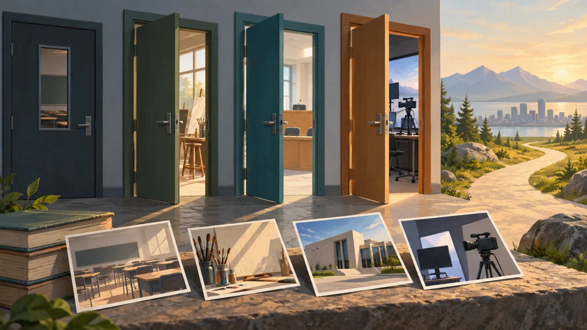</td><td><strong>Lesson ID</strong> <code>t3-l02-breaking-barriers</code>  <strong>Asset</strong> <code>./assets/course-visuals/generated/L37-t3-l02-breaking-barriers.webp</code>  <strong>Size</strong> 1200 × 676px  <strong>Prompt</strong> Contemporary Canadian high-school editorial illustration, quiet documentary-inspired realism, warm natural light, restrained spruce green, teal, charcoal and ochre palette, clean composition, authentic materials and geography, designed to sit inside a readable lesson rather than function as a poster. a series of closed and opening doors across education, arts, public service, and media, with evidence cards showing recognition and response; no people, logos, flags, or cultural decoration. No words or labels, no border, no infographic text, no watermark. Do not imitate an Indigenous artist or style. Do not invent a named person, Nation, community, ceremony, regalia, sacred object, historical event, or official document. Avoid feathers, dreamcatchers, beadwork patterns, medicine wheels, tipis, and other generic pan-Indigenous decoration unless a reviewed source requires the actual object. </td></tr></table>

## L38 — Reserve Life: Draw and Drag

<table><tr><td width="42%">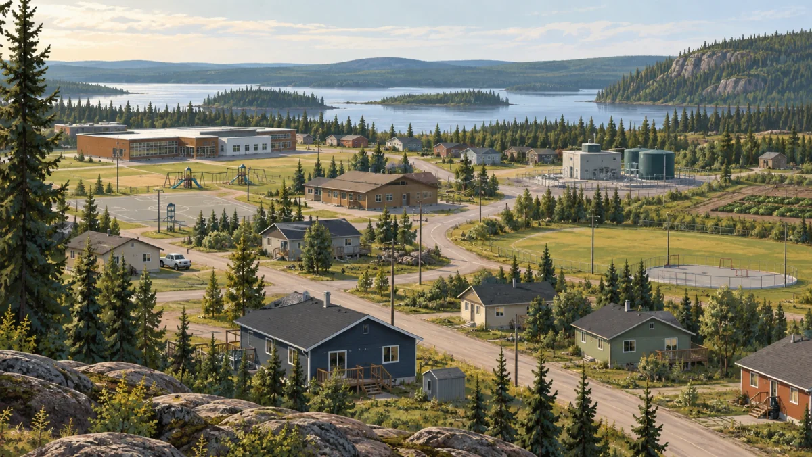</td><td><strong>Lesson ID</strong> <code>t3-l03-community-life</code>  <strong>Asset</strong> <code>./assets/course-visuals/generated/L38-t3-l03-community-life.webp</code>  <strong>Size</strong> 1200 × 676px  <strong>Prompt</strong> Contemporary Canadian high-school editorial illustration, quiet documentary-inspired realism, warm natural light, restrained spruce green, teal, charcoal and ochre palette, clean composition, authentic materials and geography, designed to sit inside a readable lesson rather than function as a poster. a contemporary northern or prairie community shown as connected homes, school, water plant, recreation space, local office, and land-use area; no people, flags, logos, or generic reserve stereotypes. No words or labels, no border, no infographic text, no watermark. Do not imitate an Indigenous artist or style. Do not invent a named person, Nation, community, ceremony, regalia, sacred object, historical event, or official document. Avoid feathers, dreamcatchers, beadwork patterns, medicine wheels, tipis, and other generic pan-Indigenous decoration unless a reviewed source requires the actual object. </td></tr></table>

## L39 — Running Their Own Show

<table><tr><td width="42%">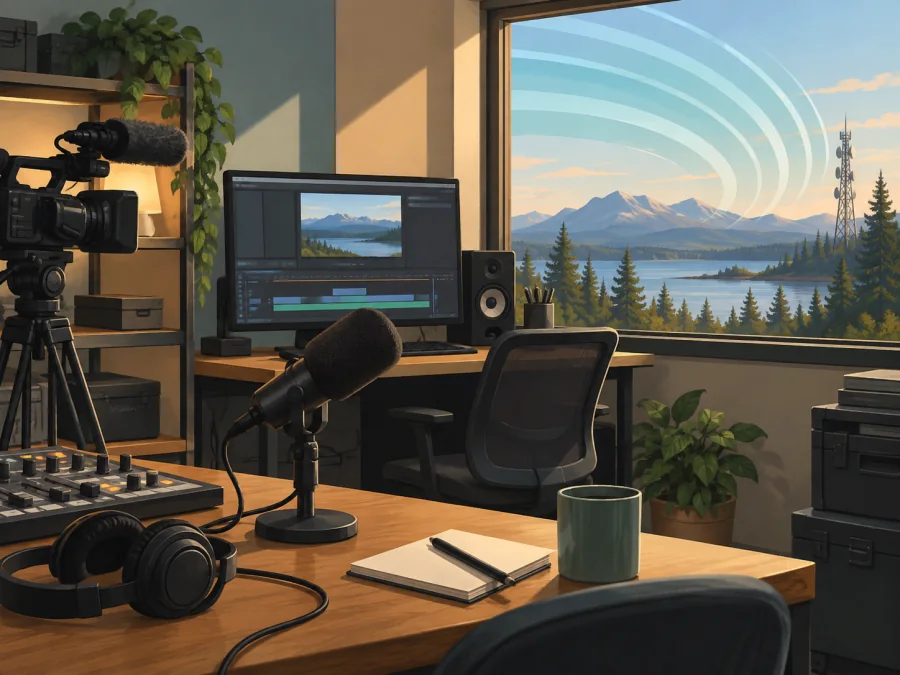</td><td><strong>Lesson ID</strong> <code>t3-l07-running-own-show</code>  <strong>Asset</strong> <code>./assets/course-visuals/generated/L39-t3-l07-running-own-show.webp</code>  <strong>Size</strong> 900 × 675px  <strong>Prompt</strong> Contemporary Canadian high-school editorial illustration, quiet documentary-inspired realism, warm natural light, restrained spruce green, teal, charcoal and ochre palette, clean composition, authentic materials and geography, designed to sit inside a readable lesson rather than function as a poster. a small community newsroom with a microphone, camera, editing desk, and broadcast signal flowing outward, emphasizing ownership and voice; no people, logos, flags, or cultural motifs. No words or labels, no border, no infographic text, no watermark. Do not imitate an Indigenous artist or style. Do not invent a named person, Nation, community, ceremony, regalia, sacred object, historical event, or official document. Avoid feathers, dreamcatchers, beadwork patterns, medicine wheels, tipis, and other generic pan-Indigenous decoration unless a reviewed source requires the actual object. </td></tr></table>

## L40 — The City Test: Pull, Push, and the Policy Gap

<table><tr><td width="42%">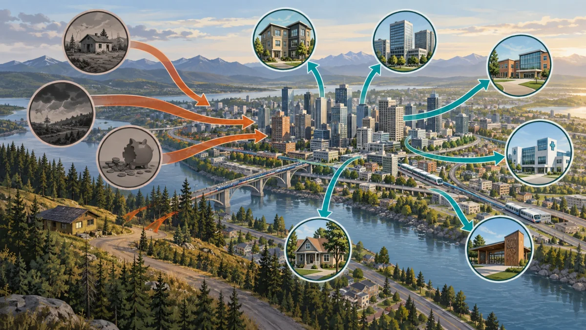</td><td><strong>Lesson ID</strong> <code>t3-l08-city-test</code>  <strong>Asset</strong> <code>./assets/course-visuals/generated/L40-t3-l08-city-test.webp</code>  <strong>Size</strong> 1200 × 676px  <strong>Prompt</strong> Contemporary Canadian high-school editorial illustration, quiet documentary-inspired realism, warm natural light, restrained spruce green, teal, charcoal and ochre palette, clean composition, authentic materials and geography, designed to sit inside a readable lesson rather than function as a poster. a city map with housing, work, education, family, health, and cultural-service points connected by routes, with both pull and push forces visible; no people, logos, flags, or named city. No words or labels, no border, no infographic text, no watermark. Do not imitate an Indigenous artist or style. Do not invent a named person, Nation, community, ceremony, regalia, sacred object, historical event, or official document. Avoid feathers, dreamcatchers, beadwork patterns, medicine wheels, tipis, and other generic pan-Indigenous decoration unless a reviewed source requires the actual object. </td></tr></table>

## L41 — Friendship Centres and Success Stories

<table><tr><td width="42%"></td><td><strong>Lesson ID</strong> <code>t3-l09-friendship-success</code>  <strong>Asset</strong> <code>./assets/course-visuals/generated/L41-t3-l09-friendship-success.webp</code>  <strong>Size</strong> 900 × 675px  <strong>Prompt</strong> Contemporary Canadian high-school editorial illustration, quiet documentary-inspired realism, warm natural light, restrained spruce green, teal, charcoal and ochre palette, clean composition, authentic materials and geography, designed to sit inside a readable lesson rather than function as a poster. a welcoming urban community centre acting as a hub for housing, employment, cultural connection, health, and youth services; no people, logos, flags, or decorative cultural motifs. No words or labels, no border, no infographic text, no watermark. Do not imitate an Indigenous artist or style. Do not invent a named person, Nation, community, ceremony, regalia, sacred object, historical event, or official document. Avoid feathers, dreamcatchers, beadwork patterns, medicine wheels, tipis, and other generic pan-Indigenous decoration unless a reviewed source requires the actual object. </td></tr></table>

## L42 — Devolution: Services by Aboriginal People

<table><tr><td width="42%">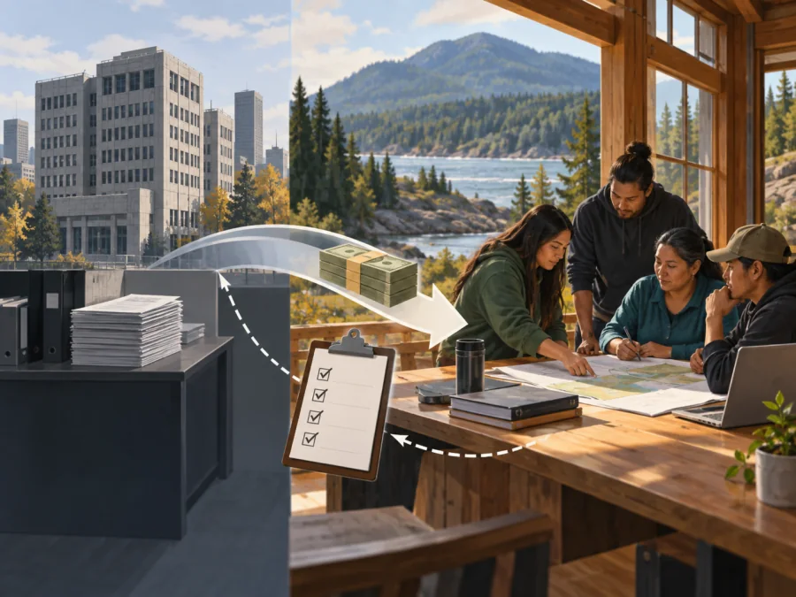</td><td><strong>Lesson ID</strong> <code>t3-l10-devolution</code>  <strong>Asset</strong> <code>./assets/course-visuals/generated/L42-t3-l10-devolution.webp</code>  <strong>Size</strong> 900 × 675px  <strong>Prompt</strong> Contemporary Canadian high-school editorial illustration, quiet documentary-inspired realism, warm natural light, restrained spruce green, teal, charcoal and ochre palette, clean composition, authentic materials and geography, designed to sit inside a readable lesson rather than function as a poster. a service program moving from a distant administrative office to a locally governed community team, with accountability and funding links kept visible; no people, logos, flags, or readable text. No words or labels, no border, no infographic text, no watermark. Do not imitate an Indigenous artist or style. Do not invent a named person, Nation, community, ceremony, regalia, sacred object, historical event, or official document. Avoid feathers, dreamcatchers, beadwork patterns, medicine wheels, tipis, and other generic pan-Indigenous decoration unless a reviewed source requires the actual object. </td></tr></table>

## L43 — What Works: Designing Services That Fit

<table><tr><td width="42%">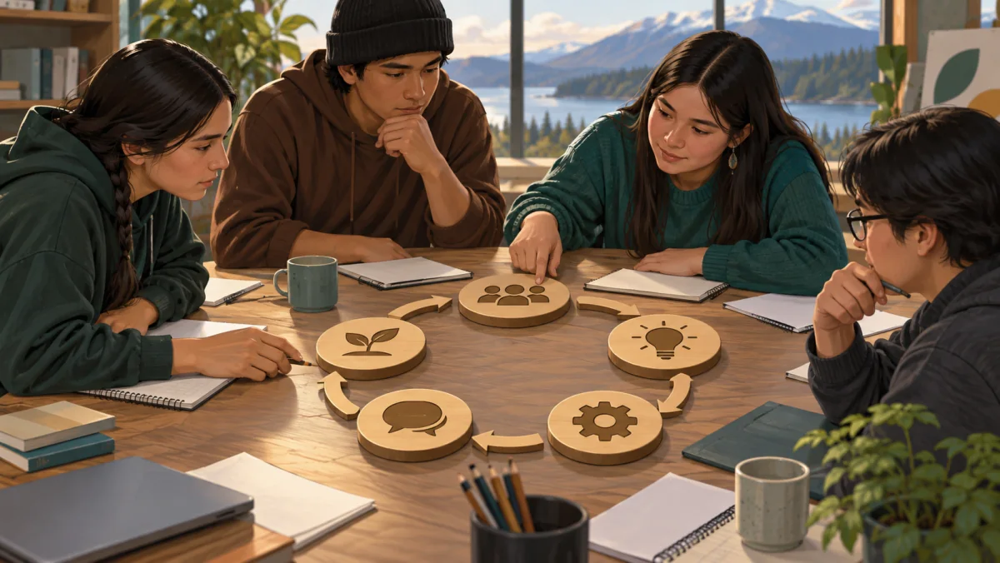</td><td><strong>Lesson ID</strong> <code>t3-l04-urban-life-services</code>  <strong>Asset</strong> <code>./assets/course-visuals/generated/L43-t3-l04-urban-life-services.webp</code>  <strong>Size</strong> 1200 × 676px  <strong>Prompt</strong> Contemporary Canadian high-school editorial illustration, quiet documentary-inspired realism, warm natural light, restrained spruce green, teal, charcoal and ochre palette, clean composition, authentic materials and geography, designed to sit inside a readable lesson rather than function as a poster. a co-design table connecting community priorities, service design, delivery, feedback, and revision in a continuous loop; no people, logos, flags, cultural motifs, or readable text. No words or labels, no border, no infographic text, no watermark. Do not imitate an Indigenous artist or style. Do not invent a named person, Nation, community, ceremony, regalia, sacred object, historical event, or official document. Avoid feathers, dreamcatchers, beadwork patterns, medicine wheels, tipis, and other generic pan-Indigenous decoration unless a reviewed source requires the actual object. </td></tr></table>

## L44 — One World, Many Peoples

<table><tr><td width="42%"></td><td><strong>Lesson ID</strong> <code>t4-l01-one-world-many-peoples</code>  <strong>Asset</strong> <code>./assets/course-visuals/generated/L44-t4-l01-one-world-many-peoples.webp</code>  <strong>Size</strong> 900 × 675px  <strong>Prompt</strong> Contemporary Canadian high-school editorial illustration, quiet documentary-inspired realism, warm natural light, restrained spruce green, teal, charcoal and ochre palette, clean composition, authentic materials and geography, designed to sit inside a readable lesson rather than function as a poster. a world map connected to several clearly distinct local landscapes and civic settings, showing shared issues without blending peoples into one culture; no people, flags, logos, or generic Indigenous motifs. No words or labels, no border, no infographic text, no watermark. Do not imitate an Indigenous artist or style. Do not invent a named person, Nation, community, ceremony, regalia, sacred object, historical event, or official document. Avoid feathers, dreamcatchers, beadwork patterns, medicine wheels, tipis, and other generic pan-Indigenous decoration unless a reviewed source requires the actual object. </td></tr></table>

## L45 — Nine Issues, One Pattern

<table><tr><td width="42%">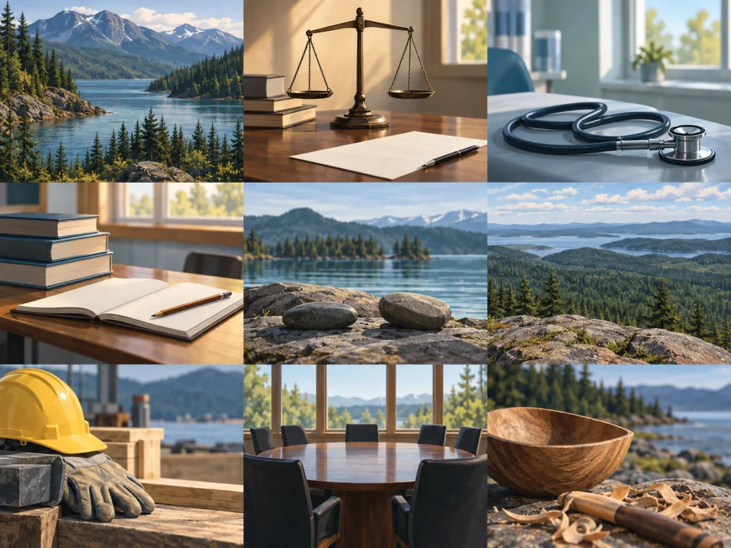</td><td><strong>Lesson ID</strong> <code>t4-l05-nine-issues</code>  <strong>Asset</strong> <code>./assets/course-visuals/generated/L45-t4-l05-nine-issues.webp</code>  <strong>Size</strong> 900 × 675px  <strong>Prompt</strong> Contemporary Canadian high-school editorial illustration, quiet documentary-inspired realism, warm natural light, restrained spruce green, teal, charcoal and ochre palette, clean composition, authentic materials and geography, designed to sit inside a readable lesson rather than function as a poster. a balanced three-by-three set of environmental, legal, health, education, language, land, economic, political, and cultural-continuity scenes, linked without ranking; no people, logos, flags, or cultural motifs. No words or labels, no border, no infographic text, no watermark. Do not imitate an Indigenous artist or style. Do not invent a named person, Nation, community, ceremony, regalia, sacred object, historical event, or official document. Avoid feathers, dreamcatchers, beadwork patterns, medicine wheels, tipis, and other generic pan-Indigenous decoration unless a reviewed source requires the actual object. </td></tr></table>

## Existing Theme 4 visuals

L46–L50 retain their existing hero and supporting images. Their original generation prompts were not supplied. The lesson-specific comparison directions remain in `image-generation-prompts.md`, and every active placement is listed in `CURRENT-IMAGE-INDEX.md`.
