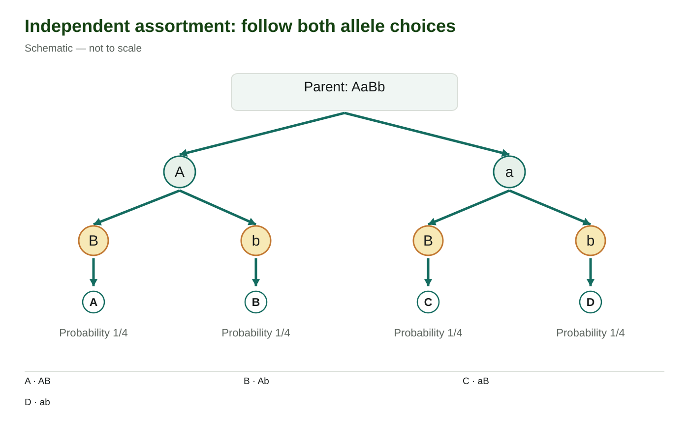

# Two-trait crosses and independent assortment

## Two traits mean two allele choices to follow

A plant breeder records both pod shape and petal markings. A cross might produce four different genotypes, yet only two groups that look different. How can that happen? To answer, we need to follow two genes through gametes and fertilisation, then apply the phenotype rule for each gene.

Start with the inheritance step from lessons 02 and 03: a gamete carries one **allele** at each studied locus, and fertilisation brings together a contribution from each parent. With two loci, one gamete carries an allele from each. In the notation AaBb, A and a are versions of one gene, while B and b are versions of another. AaBb is a diploid genotype with two allele copies per locus; AB is a **gamete combination** with one from each locus. The letter order is bookkeeping, not a drawing of where the genes sit on chromosomes.

### What makes the choices independent?

Put the A/a locus on one homologous chromosome pair and the B/b locus on a different pair. A homologous pair consists of corresponding chromosomes inherited from the two parents. Before the first meiotic division, each pair lines up across the middle of the cell. Its orientation determines which homologue will move toward which side when the pair separates.

Orienting the A/a pair one way does not force the B/b pair to take a particular orientation. Across many meioses, a chromosome carrying A can therefore enter a gamete with B or with b; the same alternatives are available alongside a. This is **independent assortment**. It concerns the relationship between different loci. Segregation still does its separate job of giving the gamete one allele at each locus.

For an AaBb parent under this model, A and a each have **probability** one half. Along either choice, B and b each have probability one half. A gamete carrying A *and* B therefore accounts for half of a half of the possibilities: 1/2 × 1/2 = 1/4. The same reasoning gives one quarter each for Ab, aB and ab. The sum is 1/4 + 1/4 + 1/4 + 1/4 = 1, so we have accounted for the whole set of possible gametes.

### Read both choices along the tree

**Independent assortment: follow both allele choices** View larger

Follow each branch from AaBb through one allele at the first locus and one at the second. Each endpoint is one haploid gamete, with probability one quarter. Schematic — not to scale.

Begin at **Parent: AaBb**. Follow the left branch to allele A, then choose the B or b branch below it. Write both letters together at the endpoint. Return to the top and repeat through a on the right. Each complete path represents one possible gamete combination; the arrows organise the choices rather than showing two separate acts of fertilisation.

The small bottom circles labelled A, B, C and D are **location labels**. They are not four additional alleles. Use the key beneath the branches: location A is AB, location B is Ab, location C is aB and location D is ab. In particular, the top allele A and the bottom location A have different jobs in the drawing. The green and gold circles help separate the two levels of choice; their colours do not encode dominance or chromosome origin.

This tree summarises possibilities across gamete production. It does not say that one meiosis must produce one gamete of every listed type, or that gametes occur in the order AB, Ab, aB, ab. The biological claim is that independent orientations make those combinations equally likely in the stated model.

## Choose the event before choosing an operation

An **event** is the outcome or group of outcomes you are asking about. “A gamete carries A and B” is one event; “an offspring shows both dominant phenotypes” is another. Write P(event) to mean the probability of that event. A **joint probability** requires both specified conditions in the same outcome. It is measured among all the gametes or all the offspring described by the question, not an unstated selected subgroup.

The **product rule** multiplies probabilities of specified independent events. You have already used it for successive offspring in lesson 03. Here, independent assortment justifies multiplying the two allele-choice probabilities within a gamete. At fertilisation, a second assumption matters: an egg and a sperm combine randomly with respect to the alleles being studied. That lets us multiply the probability of a gamete from one parent by the probability of its partner from the other parent. Together, these assumptions also allow separate single-locus offspring predictions to be combined.

Keep **phenotype** separate from genotype. Under complete dominance, AA and Aa share the dominant phenotype; aa has the recessive phenotype. The shorthand A\_ means AA or Aa, with the second allele unresolved. The underscore leaves a place at the A locus, not a place for an allele of the B gene. Apply the B/b rule separately before describing the two-trait phenotype. An uppercase letter at one gene does not dominate an allele at a different gene.

Use **addition** to collect different outcomes that cannot both describe the same offspring. For example, an offspring cannot be both AA and Aa at this locus, but either genotype can give the dominant phenotype. Their probabilities are added when calculating that phenotype's probability. Use multiplication for the required independent contributions to one outcome, then addition when several mutually exclusive outcomes meet the question. This distinction keeps a correct gamete calculation from becoming an incorrect phenotype count.

Worked example

### Four genotypes, but only two visible groups

Use a fictional plant model with two genes. H gives hooked pods and is completely dominant to h, which gives straight pods when homozygous. S gives speckled petals and is completely dominant to s, which gives plain petals when homozygous. Thus HH and Hh mean hooked, hh means straight; SS and Ss mean speckled, ss means plain. These rules describe the individual whose phenotype is scored.

The specified parents are **HhSS × hhSs**. Predict the offspring genotypes, their two-trait phenotypes, and the expected phenotype counts among 120 offspring. Use ordinary segregation, independent assortment and random fertilisation. Assume every genotype expresses the two stated traits under these conditions and that all offspring are included without phenotype-dependent loss. We know the parental genotypes from the givens; we are not inferring them from their appearance.

#### 1. Work out each parent's contributions

The HhSS parent can contribute H or h, each with probability 1/2. It contributes S with probability 1 because both copies at that locus are S. Its distinct gametes are therefore **HS and hS**, each with probability 1/2 × 1 = 1/2.

The hhSs parent always contributes h, probability 1, but contributes S or s, each with probability 1/2. Its distinct gametes are **hS and hs**, each with probability 1 × 1/2 = 1/2. Check each parent's list separately: its gamete probabilities total one. Repeating the same S or h choice on another line would not create another kind of gamete.

#### 2. Combine one gamete from each parent

Put the first parent's two gametes down the side and the second parent's two across the top. This gives a 2 × 2 table because there are two distinct choices from each parent. The size comes from the gametes, not from the number of genes or letters in the parental genotype.

Offspring from HhSS × hhSs; rows and columns are gametes

| HhSS parent ↓ / hhSs parent → | hS, probability 1/2  | hs, probability 1/2  |
|-------------------------------|----------------------|----------------------|
| HS, probability 1/2           | HhSS Probability 1/4 | HhSs Probability 1/4 |
| hS, probability 1/2           | hhSS Probability 1/4 | hhSs Probability 1/4 |

Read the upper-left cell as a fertilisation: HS meets hS. Put the H and h together at the first locus, then the two S copies together at the second, giving HhSS. Across that row, HS meets hs, giving HhSs. In the lower row, hS meets hS to give hhSS, or meets hs to give hhSs. Each offspring has two copies at each locus even though each contributing gamete had only one.

Every cell has probability 1/2 × 1/2 = 1/4 because its specified parental gametes combine independently under random fertilisation. Four equally likely cells give the genotype ratio **1 HhSS : 1 HhSs : 1 hhSS : 1 hhSs**. The total 1/4 + 1/4 + 1/4 + 1/4 = 1 checks that no possibility was omitted or counted twice.

#### 3. Group genotypes by what they express

HhSS and HhSs both have hooked pods and speckled petals. They are different genotypes in the same phenotype group, so add their probabilities: 1/4 + 1/4 = 1/2. The other two genotypes, hhSS and hhSs, both have straight pods and speckled petals, also with total probability 1/2. No cell is ss, so plain petals have probability zero in this cross.

The expected phenotype ratio is therefore **1 hooked and speckled : 1 straight and speckled**. The four-part genotype ratio and the two-part phenotype ratio answer different questions. The s allele can be inherited without a plain-petal phenotype appearing; a visible phenotype does not list every allele the individual carries.

#### 4. Check the result using the separate loci

At H, Hh × hh gives Hh or hh, each with probability 1/2. At S, SS × Ss gives SS or Ss, each with probability 1/2. The probability of the exact genotype HhSS is therefore 1/2 × 1/2 = 1/4. That agrees with its single table cell.

For the *phenotype* hooked and speckled, the H locus contributes probability 1/2, but the S locus contributes probability 1: both SS and Ss are speckled. Thus **P(hooked and speckled) = 1/2 × 1 = 1/2**. Using 1/2 for speckled would count only one of its two genotypes and answer a narrower question. The grid and product method agree when they describe the same event.

#### 5. Turn probabilities into expected counts

An **expected number** is the probability multiplied by the total number of offspring. Among 120 offspring, hooked and speckled has expected count 120 × 1/2 = 60, and straight and speckled also has expected count 60. The expected counts for hooked and plain or straight and plain are zero. The category probabilities sum to 1/2 + 1/2 + 0 + 0 = 1, and the expected counts sum to 120.

These are model expectations, not a promise of exactly 60 in each observed group. Chance affects which allowed gametes meet. It does not make an allele contribution possible that the stated parents cannot supply: a plain ss offspring would require rechecking the givens, parentage, observation or model, rather than explaining it as an ordinary fluctuation among these four allowed genotypes.

### Change one contribution and keep track of what stays

Optional guided practice. Work on paper or explain aloud; this activity is unsaved, ungraded and outside chapter progress.

Keep the same fictional phenotype rules, but replace the first parent with **Hhss**. The second parent remains **hhSs**. Before calculating, state which single-locus prediction is unchanged and which must change. Then list the gametes, predict the offspring genotypes and phenotype probabilities, and check that all the probabilities are accounted for. Explain why knowing only that a cross involves two traits would be insufficient to predict its ratio.

#### Optional hint: change the S-locus contribution only

The H-locus cross is still Hh × hh. At S, the first parent's contribution is now always s. Combine each new gamete from that parent with hS or hs from the other parent; use the two existing phenotype rules after writing the offspring genotypes.

#### Worked comparison and feedback

The H-locus prediction stays half Hh and half hh. The S-locus cross changes from SS × Ss to ss × Ss, so its offspring are now half Ss and half ss. Speckled is no longer guaranteed, because the first parent no longer supplies S to every offspring.

Hhss produces Hs and hs, each with probability 1/2. hhSs still produces hS and hs, each with probability 1/2. The combinations are Hs with hS → HhSs; Hs with hs → Hhss; hs with hS → hhSs; and hs with hs → hhss. Each has probability 1/2 × 1/2 = 1/4.

They express hooked/speckled, hooked/plain, straight/speckled and straight/plain, respectively. The phenotype probabilities are one quarter each and sum to one, giving a 1:1:1:1 expectation. Unlike the worked cross, each of these four genotype possibilities belongs to a different phenotype group.

The parental genotypes, not just the number of traits, determine these predictions. Neither parent is heterozygous at both loci. Check that your repair changed the S contributions and their phenotype grouping while retaining the justified H-locus calculation. If you kept all offspring speckled, you carried over an S contribution that the replacement parent no longer has.

## Decide whether the model justifies the product

In the standard **dihybrid cross**, both parents are heterozygous at both studied loci. With complete dominance at each locus, lesson 03's single-locus reasoning gives a 3:1 dominant-to-recessive phenotype expectation for each gene. Independent assortment lets the two expectations combine: their four relative weights are 3 × 3, 3 × 1, 1 × 3 and 1 × 1. The resulting **9:3:3:1 phenotype ratio** describes both dominant forms, the first dominant form with the second recessive, the first recessive with the second dominant, and both recessive forms. The weights total 16 equally likely gamete pairings. This result belongs to those parental genotypes and assumptions. For a different cross, derive the contributions again, as the changed-parent task required.

Independence is also more than knowing that each allele occurs in half the gametes. Those separate totals do not tell you which alleles occur *together*. The tree justified one-quarter joint combinations by using the same B/b probabilities alongside either A or a. Without that relationship, multiplying the separate half probabilities can give the wrong joint probability.

To check a supplied gamete distribution, first collect all the categories containing the allele of interest. They are mutually exclusive, so add them. Then compare the proposed product of the two single-locus probabilities with the supplied probability of their joint combination. Exact model probabilities and observed sample counts have different roles: a finite sample may vary by chance, so unequal observed counts alone do not establish that the biological loci are dependent.

### Are separate halves enough?

Optional independent practice. This model-analysis task is unsaved, ungraded and outside chapter progress.

A hypothetical gamete simulator uses a JjKk parent. J and j are alleles at one locus; K and k are alleles at another. Its **stated probabilities** are JK: 0.35, Jk: 0.15, jK: 0.15 and jk: 0.35. These are the rules built into the simulator, not counts estimated from a small trial.

A student claims, “Each allele still has probability one half, so this simulator must model independent assortment.” Check both parts of the claim. Show the single-locus totals, calculate what independence would predict for one joint gamete type, compare it with the stipulated probability, and explain what you can conclude. Would this simulator alone establish where real genes are located on a chromosome?

#### Optional hint: recover a total before checking a joint event

J appears in JK and Jk; K appears in JK and jK. Use addition for each of those totals. Then use the proposed independent model to predict J and K together, and compare that result with the simulator's JK probability.

#### Model, feedback and self-check

The probabilities form a complete distribution: 0.35 + 0.15 + 0.15 + 0.35 = 1. J has probability 0.35 + 0.15 = 0.50, and j has 0.15 + 0.35 = 0.50. K has 0.35 + 0.15 = 0.50, and k has 0.15 + 0.35 = 0.50. The first part of the student's claim is correct: the separate loci retain equal allele totals.

If J and K were independent choices, their joint probability would be P(J) × P(K) = 0.50 × 0.50 = 0.25. The simulator instead specifies P(J and K) = 0.35. These exact probabilities do not match, so the simulator does not model independent assortment of these two loci. Equality of separate totals is insufficient to establish independence of their combinations.

This is a conclusion about a supplied mathematical model. It does not establish the location of real genes or identify the cause of a biological pattern. A programmed distribution is not a chromosome observation, and a real investigation would need suitable evidence and assumptions. Check that you used the given values as probabilities, did not dismiss their difference as small-sample chance, and did not turn a failed independence claim into a chromosome-map claim.

**Linked genes** are genes on the same chromosome. Nearby loci can have allele combinations that depart from the independent model. Lessons 12 and 13 will explain crossing over, the relevant offspring classes and chromosome maps. For now, make the present decision correctly: establish the gametes and phenotype rules, justify the operation, account for the full set of outcomes, and limit the conclusion to the model and evidence supplied.

**Carry forward:** two traits do not automatically mean four phenotypes, sixteen distinct cells or one memorised ratio. Gamete formation supplies the combinations; the probability model assigns their chances; the dominance relationships determine which combinations look alike. Next, we will change those allele relationships and see why incomplete dominance and codominance change the phenotype grouping.

After lesson 06, return to the optional textbook questions 13, 15 and 16 on printed p. 595. They use the incomplete-dominance and codominance relationships that lesson will explain.
