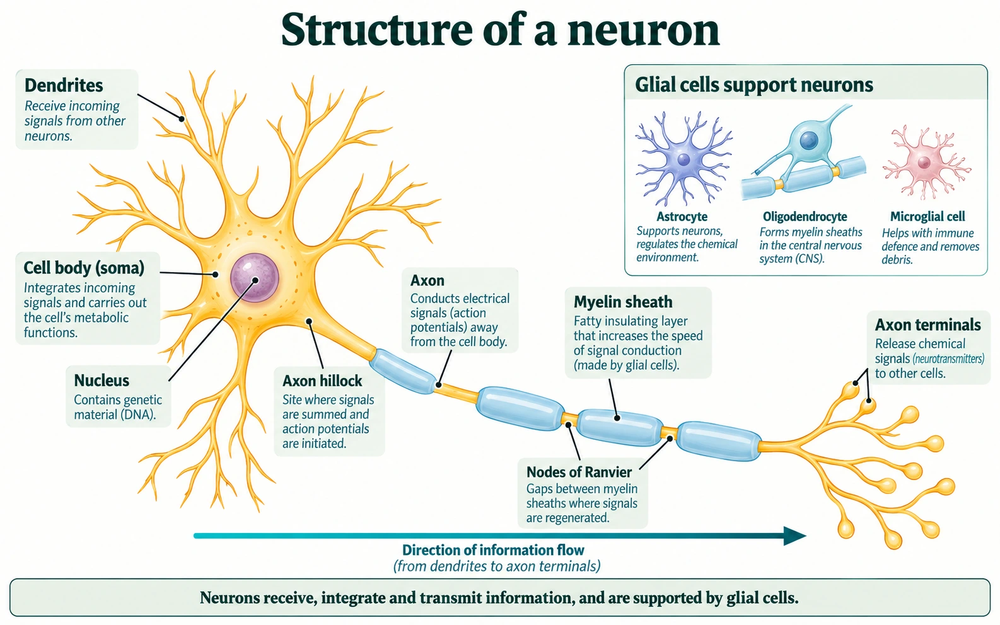
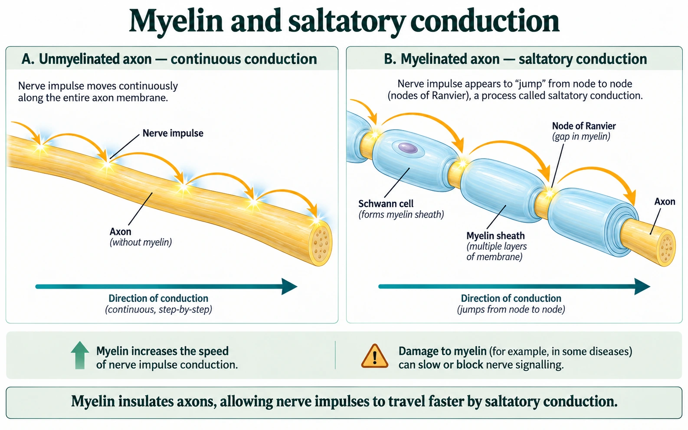

Learn · Chapter 11

# Neurons & myelin

How do the parts of a neuron help it carry information?

Learning goal

I can identify neuron parts and explain how myelin speeds nerve impulses.

Before you begin

Remember: a neuron is one cell, while a nerve contains many nerve fibres.

****How to complete this lesson** — Learn → practise → required check → finish**

1. **Start with the lesson.** Read the learning goal and “Before you begin,” then work through the explanation, diagrams and examples below. The embedded textbook is optional support: open it when you want another explanation or a closer look at a figure.
2. **Use the learning goal and starting reminder.** The learning goal above tells you what you must be able to explain. Read “Before you begin” next to connect this lesson to what you already know.
3. **Work through the online lesson in order.** Read each teaching section and study its diagrams, examples and comparisons. Select an underlined biology term when you need its meaning. Use the video or Vocabulary help when an idea is still unclear.
4. **Complete the required chapter check.** Open the check near the bottom and select Start. For multiple choice, select Check answer; a correct answer unlocks the related writing. Answer in your own words and select Save written response for every response box.
5. **Submit only when the required work is complete.** Check that every required item has been attempted and every written response is saved. Then select Submit and finish. This stops the timer, records the completed run in All My Work and updates chapter progress.
6. **Use optional practice only when it helps.** Optional source practice and Practice & Review activities can help you study, but they do not count toward the 12 required chapter checks.

**Expected work:** complete the lesson and submit the required chapter check. Use optional reading, videos and practice when they help. Drafts save automatically as you work in this browser.

Optional embedded reading

**Chapter 11 · p. 372**

[Open at p. 372](#textbook-library)

**Key terms:** dendrite · cell body (soma) · axon · myelin sheath · Schwann cell · node of Ranvier

**Vocabulary help**

Key terms

## Words for this lesson

Use these definitions when you need help with a term.

neuron
:   a nerve cell that receives and carries information

dendrite
:   a branch that receives information toward the cell body

axon
:   the extension that carries impulses away from the cell body

myelin
:   a fatty covering that insulates axons and speeds impulses

**More vocabulary for this lesson**

### Lesson vocabulary

neuron · cell body · dendrite · axon · axon terminal · synapse · myelin · node of Ranvier · action potential · saltatory conduction · effector · CNS · PNS
:   Select an underlined term for its definition. Your vocabulary writing is saved in Process Collection.

## How can one cell reach a distant muscle?

A nerve signal may need to travel from your spinal cord toward a muscle in your foot. A chain of round, identical cells would not explain the long fibres inside a nerve. Neurons have specialized shapes that let one cell receive many inputs and send information over a considerable distance.

Start with a typical multipolar neuron. **Dendrites** are branching receiving regions. The **cell body**, or soma, contains the nucleus and organelles and maintains the cell's metabolism. The **axon** carries action potentials toward its terminal branches. An **axon terminal** passes a signal to another cell at a junction called a synapse.

Read from dendrites to axon terminals. This is a simplified illustration of a typical multipolar neuron, not every neuron shape.

Look first at the large yellow cell body on the left. Trace one short branch outward: that is a dendrite. Now follow the long yellow extension to the right under the blue coverings. That continuous extension is the axon; the blue coverings are insulation around it, not separate neurons. The large horizontal arrow means the usual direction of information flow through this model.

The narrowed region where the axon begins is labelled the **axon hillock**. Signals arriving at different receiving regions can combine and influence whether an action potential begins near the start of the axon. The cell body does not consciously choose. Its membranes respond to the combined electrical effects of incoming signals.

Finish at the terminal branches. Their branching allows the neuron to communicate with more than one target. The next cell is separated from a chemical synaptic terminal by a tiny **synaptic cleft**. The electrical signal along an axon and the chemical signal across that cleft are different parts of the pathway.

## Use structure to explain function

**Question:** Why does a neuron benefit from having many short dendritic branches and one long axon? A useful answer must explain what the shape makes possible.

1. **Begin with reception.** Many dendritic branches provide a large receiving surface. This allows many synaptic contacts rather than just one input.
2. **Connect reception to integration.** Inputs influence the cell body and the region where the axon begins. Combining those effects allows the outgoing signal to depend on more than one incoming message.
3. **Connect length to distance.** A long axon allows an action potential to reach a distant target while staying on one continuous cell membrane.
4. **Account for the ending.** Terminal branches provide sites where the neuron can release chemical messengers to its target cells.

The conclusion is a structure–function explanation: branching supports receiving and distributing information; the long extension supports conduction over distance. Simply listing the four part names would leave that reasoning out.

### The structure of a neuron: recap

As you watch: Pause at each labelled structure and explain its function without looking back at the table.

Load video [Watch on YouTube](https://www.youtube.com/watch?v=A44brRGG4Ys)

Video not playing? Use the written explanation on this page.

**Follow through:** cover the labels on the neuron image and draw its main outline. Add each label only after you can explain what that part contributes to communication. Include the continuous axon beneath the myelin.

## Insulation changes how the impulse travels

The **myelin sheath** is a layered, fatty covering around many axons. It reduces electrical leakage through the covered membrane and helps a voltage change spread farther and faster along the axon. Gaps in the sheath are **nodes of Ranvier**. At these exposed regions, the membrane regenerates the action potential.

In the PNS, a **Schwann cell** wraps a segment of one axon to form myelin. In the CNS, **oligodendrocytes** form myelin. The glial-cell inset in the neuron image includes an oligodendrocyte; it is not a claim that Schwann cells make CNS myelin.

Compare where the impulse is regenerated. The arrows are a shorthand: the axon remains continuous beneath the sheath. Schwann cells shown here form peripheral myelin; CNS myelin is made by oligodendrocytes.

Compare the two panels from left to right. In the unmyelinated axon, neighbouring membrane regions regenerate the signal along the route. In the myelinated axon, the glowing gaps mark nodes where regeneration occurs. The curved arrows summarize movement of the signal between nodes. They do not show an ion jumping through the air or crossing a break in the axon.

This pattern is **saltatory conduction**. The word “jumping” describes where action potentials are regenerated. The underlying axon remains continuous, and local electrical current still travels through the regions under myelin. With other relevant conditions similar, myelin increases conduction speed. It does not make each action potential taller.

| Compare the same feature | Myelinated axon | Unmyelinated axon |
| --- | --- | --- |
| Covering | Myelin segments separated by nodes | No myelin sheath |
| Regeneration of the signal | Mainly at exposed nodes | Along neighbouring regions of axon membrane |
| Conduction | Faster when other conditions are comparable | Slower in that comparison |
| What stays continuous | The axon under the sheath | The axon along its length |

### Explain a diagram error

A student draws four separate short axons with empty spaces between them and says, “The impulse jumps across the empty spaces, so this is myelin.” Explain what must change in the drawing and why.

Your reasoning — optional practice space (not saved)

Try it before opening the model. Compare your own reasoning; this response is not automatically marked or included in chapter progress.

**Hint: separate the axon from its covering**

Where should a gap occur: in the neuron itself or in the insulation around it?

**Compare your reasoning**

Draw one continuous axon. Place separate myelin segments around it and label the exposed membrane between segments as nodes of Ranvier. Action potentials regenerate at the nodes while local current spreads along the intact axon. If the axon were actually disconnected, the diagram would not represent normal saltatory conduction.

## Predicting the effect of damage

Suppose an axon is intact but part of its myelin is damaged. First identify what has been lost: insulation. More current can leak across the affected membrane. The next region may reach threshold later, or may fail to reach it. The result can be delayed or blocked signalling. The possible body effect depends on the pathway: a sensory pathway carries information toward the CNS; a motor pathway contributes to movement.

**Multiple sclerosis (MS)** involves immune-mediated damage in the CNS, including damage to myelin and sometimes axons. Depending on the affected pathways, symptoms may include altered sensation, visual problems, weakness, fatigue, or difficulties with coordination. The course differs among people. Myelin damage explains a mechanism for disrupted communication; it does not let us diagnose a person from a single symptom.

Do not use myelin alone to predict whether an injured neuron can regenerate. Recovery depends on the location and nature of the injury and its cellular environment. We will also distinguish grey and white matter later; grey matter is more than simply “neurons without myelin.”

### Compare two different failures

In model A, a neuron's axon conducts normally, but its terminal cannot release a chemical messenger. In model B, a myelinated axon loses insulation along part of its length. Predict where communication could fail in each model. Would adding more dendritic branches necessarily repair either problem?

Your reasoning — optional practice space (not saved)

Try it before opening the model. Compare your own reasoning; this response is not automatically marked or included in chapter progress.

**Model and self-check**

In A, the electrical signal reaches the terminal, but communication to the next cell fails at chemical release. In B, conduction toward the terminal may slow or fail because insulation is lost. More dendritic branches would provide more potential input sites; they would not directly restore terminal release machinery or the missing myelin. Check that you located two different failures and linked each prediction to the damaged structure.

**Carry forward:** a neuron's shape supports receiving, integrating, conducting, and passing information. Next we will connect several neurons into a pathway and explain why a withdrawal reflex can begin before conscious awareness.

**Open chapter check: Neurons & myelin**

## Check: Neurons & myelin

Chapter check · Select Start when ready. The elapsed timer includes breaks; Submit and finish stops it. Redo preserves earlier attempts.

Start
Not started

Draw a neuron, label its basic structures, and identify their functions.

[Textbook p. 372](#textbook-library)

Written response

Up to 3200 characters. Drafts can be longer, but must fit before submission. Writing is not automatically graded.

Save written response

Submit and finish Redo activity

[Previous: Nervous communication](#lesson-01) · [Next: Pathways & reflexes](#lesson-03)

[Optional textbook practice for Neurons & myelin](#textbook-practice)
