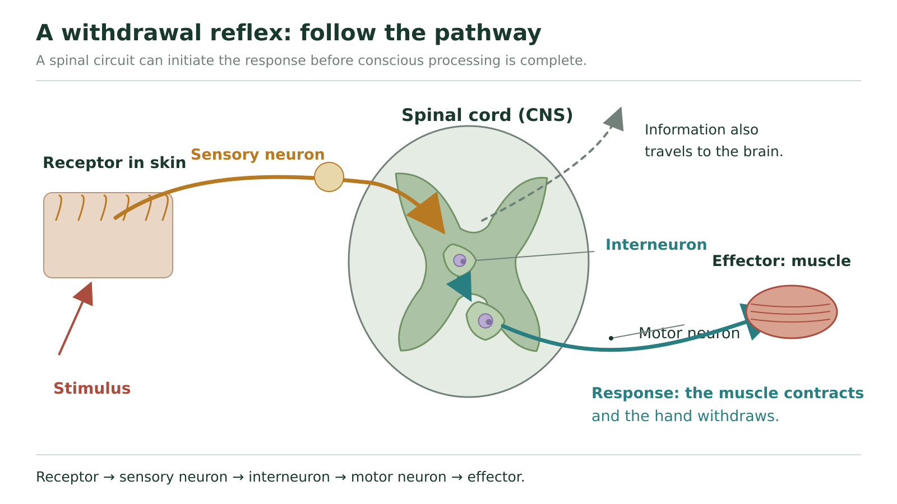

Learn · Chapter 11

# Pathways & reflexes

How does information travel from a receptor to an effector?

Learning goal

I can trace a withdrawal reflex from the receptor to the muscle.

Before you begin

Remember: sensory neurons carry information toward the CNS; motor neurons carry instructions away.

****How to complete this lesson** — Learn → practise → required check → finish**

1. **Start with the lesson.** Read the learning goal and “Before you begin,” then work through the explanation, diagrams and examples below. The embedded textbook is optional support: open it when you want another explanation or a closer look at a figure.
2. **Use the learning goal and starting reminder.** The learning goal above tells you what you must be able to explain. Read “Before you begin” next to connect this lesson to what you already know.
3. **Work through the online lesson in order.** Read each teaching section and study its diagrams, examples and comparisons. Select an underlined biology term when you need its meaning. Use the video or Vocabulary help when an idea is still unclear.
4. **Complete the required chapter check.** Open the check near the bottom and select Start. For multiple choice, select Check answer; a correct answer unlocks the related writing. Answer in your own words and select Save written response for every response box.
5. **Submit only when the required work is complete.** Check that every required item has been attempted and every written response is saved. Then select Submit and finish. This stops the timer, records the completed run in All My Work and updates chapter progress.
6. **Use optional practice only when it helps.** Optional source practice and Practice & Review activities can help you study, but they do not count toward the 12 required chapter checks.

**Expected work:** complete the lesson and submit the required chapter check. Use optional reading, videos and practice when they help. Drafts save automatically as you work in this browser.

Optional embedded reading

**Chapter 11 · pp. 370–371**

[Open at p. 370](#textbook-library)

**Key terms:** sensory neuron · interneuron · motor neuron · reflex · reflex arc

**Vocabulary help**

Key terms

## Words for this lesson

Use these definitions when you need help with a term.

stimulus
:   a change inside or outside the body

receptor
:   a structure that detects a stimulus

sensory neuron
:   a neuron carrying information from a receptor toward the CNS

motor neuron
:   a neuron carrying instructions from the CNS to an effector

**More vocabulary for this lesson**

### Lesson vocabulary

stimulus · receptor · sensory neuron · interneuron · motor neuron · effector · response · reflex · reflex arc · neuron · cell body · CNS · claim
:   Select an underlined term for its definition. Your vocabulary writing is saved in Process Collection.

## Why can your hand move before you decide to move it?

Imagine accidentally touching hot glassware. Your hand begins to withdraw before you have finished recognizing what happened. That order is possible because some processing occurs in a spinal circuit. The circuit can start motor output while information also travels toward brain regions involved in conscious perception.

Keep two questions separate: **Which way does information travel?** and **Where is it processed?** A sensory neuron is identified by its role in carrying information toward the CNS, not by whether you become conscious of that information immediately.

| Part | Job | Direction or destination |
| --- | --- | --- |
| Sensory receptor | Detects a change and begins sensory signalling | Information enters a sensory pathway |
| Sensory (afferent) neuron | Carries information from a receptor | Toward the CNS: afferent arrives |
| Interneuron | Processes or relays information between neurons | Within the brain or spinal cord |
| Motor (efferent) neuron | Carries output to an effector | Away from the CNS: efferent exits |
| Effector | Changes its activity in response | A muscle contracts or a gland secretes |

The receptor and effector are the beginning and ending structures in this model. Sensory, inter-, and motor neurons connect them. Glial cells support the neurons' environment and conduction; they do not replace one of those three pathway roles.

## Trace a withdrawal reflex, one connection at a time

Follow the spinal withdrawal circuit, then the separate path toward the brain. This is a simplified pathway, not a scale drawing or the wiring of every reflex.

Start at “stimulus,” beside the skin receptor. Follow the sensory route into the area marked **spinal cord (CNS)**. The boundary matters: the sensory neuron brings information into the CNS, and an interneuron processes it there. Follow the motor route back out to the muscle. The separate upward path carries information toward the brain; it is not a detour that must finish before the muscle responds.

### Worked explanation: withdrawal from a sharp object

1. **Detect the stimulus.** A potentially damaging stimulus activates receptors in the skin. This starts sensory signalling rather than directly ordering the muscle to move.
2. **Carry the information inward.** A sensory neuron conducts action potentials toward the spinal cord. The direction makes it afferent.
3. **Process within the spinal circuit.** The sensory neuron communicates with interneurons that influence motor neurons. Several connections allow the response to coordinate muscles; the picture is a simplified account of that circuitry.
4. **Carry output outward.** Motor neurons signal the skeletal muscles that withdraw the body part. Because their output goes to an effector, they are efferent.
5. **Explain the timing.** This route does not wait for a conscious decision in the cerebrum. Information also ascends to the brain, allowing perception of the stimulus and further action.

A **reflex** is a rapid, involuntary response to a stimulus. A **reflex arc** is the neural route producing it. The response is the movement; the arc is the connected circuit. A spinal withdrawal reflex does not mean that the brain never receives information.

### Reflex arcs: example 1

As you watch: Trace the sensory route into the CNS and the motor route to the effector. Distinguish the response from conscious awareness.

Load video [Watch on YouTube](https://www.youtube.com/watch?v=aaQWxko6qmk)

Video not playing? Use the written explanation on this page.

**Follow through:** redraw the two routes: one through the spinal circuit to the muscle, and one carrying information toward the brain. Explain why both routes can be active without waiting for a conscious decision.

### Find the break in a pathway

In a simplified withdrawal circuit, the sensory neuron is unable to conduct, while the motor neuron and muscle remain functional. Would touching the receptor still initiate the usual withdrawal through this circuit? Explain the missing connection.

Your reasoning — optional practice space (not saved)

Try it before opening the model. Compare your own reasoning; this response is not automatically marked or included in chapter progress.

**Hint: start at the receptor**

An intact effector cannot act on information that never reaches the processing circuit. Trace the route in order.

**Compare your reasoning**

The receptor may detect the stimulus, but the sensory signal cannot reach the spinal circuit through the blocked neuron. The usual sensory input therefore does not activate the motor output through this route. An intact motor neuron and muscle could still respond to a different effective input; their being intact does not bypass the missing sensory link.

## A deliberate response uses the same broad jobs

Now imagine a ball moving toward your face and deliberately moving aside. Visual information enters through a sensory pathway. Brain processing helps identify the ball and organize a suitable movement. Descending motor signals reach spinal pathways and motor neurons that activate skeletal muscles.

The broad sequence is still input, integration, output. The important difference from the simplified spinal withdrawal example is the processing route that organizes the response. Do not say “a reflex uses the spinal cord but a voluntary movement does not.” A voluntary command from the brain can travel through the spinal cord on its way to an effector.

The main patellar, or knee-jerk, reflex is a useful contrast. Stretch receptors in a muscle detect stretching. A sensory neuron can synapse directly with the motor neuron that activates that same muscle. An interneuron is not needed in that particular connection, although interneurons help coordinate other muscles. **Not every reflex arc has the identical five-box arrangement.** Pupillary reflexes use brainstem circuits, so not every reflex is spinal either.

### Reflex arcs: example 2

As you watch: Compare the example with the five components in the withdrawal pathway. Notice whether an interneuron is shown.

Load video [Watch on YouTube](https://www.youtube.com/watch?v=4WcZR_k_a0I)

Video not playing? Use the written explanation on this page.

**Follow through:** identify the receptor, input neuron, processing connection, output neuron, and effector in the example you watch. If an interneuron is not shown, explain why that does not automatically make the pathway incorrect.

## Shape and job answer different questions

**Multipolar** means many processes extend from the cell body: usually several dendrites and one axon. **Bipolar** means two main processes extend from it. In the common **unipolar** sensory arrangement taught here, one process leaves the cell body and branches into peripheral and central portions; it is often called pseudounipolar.

These describe shape. Sensory, interneuron, and motor describe function. You cannot classify a cell as “motor” merely because it is long, or decide that every drawing must look like the multipolar neuron in Lesson 2. Find the direction of information and the structures it connects.

### Two observations, two routes

A person withdraws a foot from an unexpectedly sharp surface, then looks down and deliberately steps around it. Explain the first and second responses using sensory input, processing location, motor output, and effector. Why does the first response not show that the brain was disconnected?

Your reasoning — optional practice space (not saved)

Try it before opening the model. Compare your own reasoning; this response is not automatically marked or included in chapter progress.

**Model and self-check**

The sharp stimulus activates a sensory pathway to the spinal cord, where a withdrawal circuit can activate motor neurons to the leg muscles. Information also travels toward the brain. Looking and deliberately stepping around the object involve further sensory input and brain processing; commands can descend through the spinal cord to somatic motor neurons and skeletal muscles. The earlier movement indicates that a spinal response began without waiting for conscious processing, not that no information reached the brain. Include the direction of both sensory and motor signals.

### Optional investigation: make a fair comparison

[Investigation 11.A, p. 371](#textbook-library) compares reflex responses. Before an observation, name the stimulus, predicted response, and variable you will record. Use the same observation method across trials, repeat observations, and distinguish “a response occurred” from “this circuit has been proven.” Follow your teacher's procedure for any physical test.

For example, repeated pupil-size observations under two ordinary room-light conditions could test whether the visible response changes with light level. Keep observation distance and the time allowed for adjustment consistent. A pupil becoming smaller is the observation; activity in a particular neural route is the explanation supported by your biology model.

**Carry forward:** we can now trace a pathway. Next we will explain what changes within a neuron's membrane so that it can carry an electrical signal at all.

**Open chapter check: Pathways & reflexes**

## Check: Pathways & reflexes

Chapter check · Select Start when ready. The elapsed timer includes breaks; Submit and finish stops it. Redo preserves earlier attempts.

Start
Not started

Compare the basic function of neurons and glial cells.

[Textbook p. 370](#textbook-library)

Written response

Up to 3200 characters. Drafts can be longer, but must fit before submission. Writing is not automatically graded.

Save written response

Identify the basic neural pathway that is involved as you dodge a wayward tennis ball. Compare this pathway with a withdrawal reflex.

[Textbook p. 370](#textbook-library)

Written response

Up to 3200 characters. Drafts can be longer, but must fit before submission. Writing is not automatically graded.

Save written response

Submit and finish Redo activity

[Previous: Neurons & myelin](#lesson-02) · [Next: The resting neuron](#lesson-04)

[Optional textbook practice for Pathways & reflexes](#textbook-practice)
