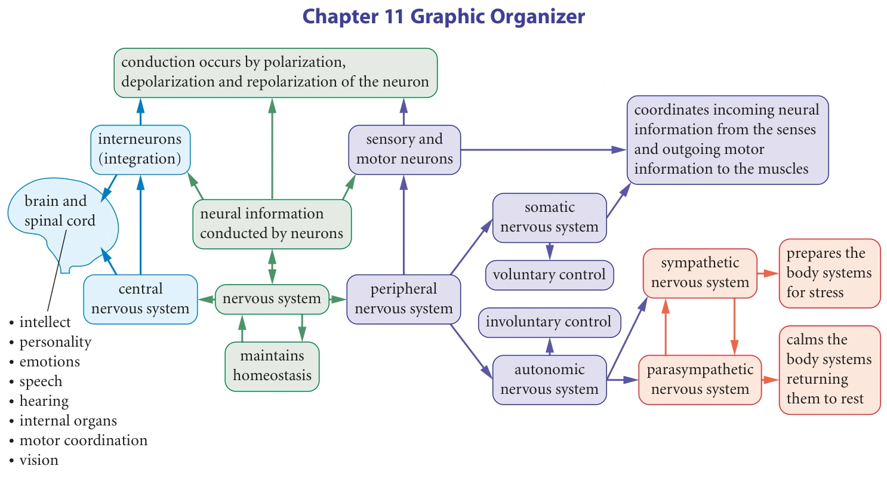
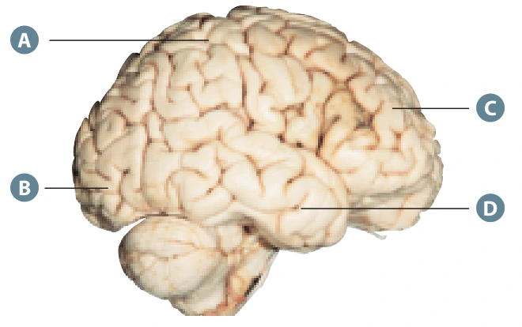
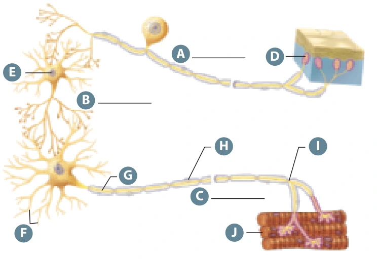
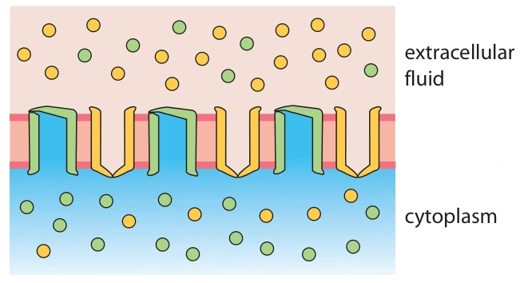
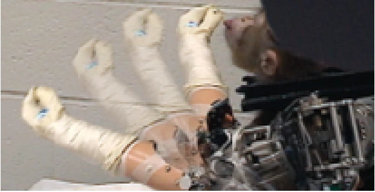

Learn · Chapter 11

# Chapter review and final check

Review the main Chapter 11 pathways, then complete the final required chapter check.

What you will show

You can connect nervous-system structures to their functions and explain one complete pathway in your own words.

What is required

Complete the final chapter check. The 22 textbook review questions below are optional extra practice.

In the textbook

**Chapter 11 review · p. 402**

[Open at p. 402](#textbook-library)

**Key terms:** neuron · action potential · synapse · CNS · PNS

**Vocabulary help**

Key terms

## Words for the review

Use these definitions when you need help with a term.

neuron
:   a nerve cell that receives and carries information

action potential
:   a rapid, all-or-none change in membrane voltage

synapse
:   a junction where a neuron communicates with another cell

response
:   what the body does after a stimulus

**More vocabulary for the review**

### Chapter review vocabulary

stimulus · receptor · sensory neuron · CNS · neuron · depolarization · threshold · action potential · myelin · synapse · neurotransmitter · PNS · effector · response · opposing effects · mechanism
:   Select an underlined term for its definition. Your vocabulary writing is saved in Process Collection.

## How to complete this section

1. **Review the pathway.** Read the chapter summary below and use the graphic organizer to trace a stimulus to a response.
2. **Explain it aloud.** Choose one pathway and name the structures, what happens at each step and how the steps connect.
3. **Complete the required check.** Open the final chapter check, select Start, answer the multiple-choice question correctly, save the written explanation and then select Submit and finish.
4. **Choose whether you need more practice.** The textbook review questions are optional. They do not affect your chapter-check progress.

**Expected written work:** answer in your own words and explain the biological connection. Written responses are saved, but they are not automatically graded.

## Rebuild the explanation without a list of isolated terms

At the beginning of the chapter, we asked how a change at one place in the body can produce a useful response elsewhere. You can now answer at three connected levels: **the system detects and responds; a pathway carries information; membranes and synapses make the pathway work.**

Use the worked review below to connect those levels. Then attempt the fresh applications before opening their models. The required final chapter check and the 22 optional textbook questions retain their separate roles. Optional practice does not add to the 12 required chapter checks.

## Worked review: explain a withdrawal from system to cell

A person accidentally touches a sharp object and rapidly withdraws the hand. Explain both the visible response and the unseen mechanism needed for it.

1. **State the stimulus and detection.** The sharp stimulus activates sensory receptors in the skin. Detection starts signalling in an afferent pathway.
2. **Follow the pathway into the CNS.** Sensory neurons carry information to the spinal cord, where interneurons contribute to the withdrawal circuit. A separate ascending route also carries information toward the brain.
3. **Explain conduction within a neuron.** Existing ion gradients and selective permeability establish resting conditions. Reaching threshold produces rapid Na⁺ entry, followed by sodium-channel inactivation and outward K⁺ movement. Neighbouring ready membrane regenerates the action potential; myelination speeds conduction by allowing regeneration at nodes.
4. **Explain a chemical junction.** An arriving action potential opens terminal Ca²⁺ channels. Ca²⁺ entry triggers vesicle fusion and transmitter release. The transmitter crosses the cleft, binds receptors, and changes the receiving cell's activity. Its inputs must produce sufficient net excitation for that neuron to fire.
5. **Follow output to the effector.** Motor neurons activate skeletal muscles. ACh at the neuromuscular junction helps trigger muscle excitation and contraction, withdrawing the hand.
6. **Explain timing and termination.** The spinal circuit can start output before conscious processing is complete. Transmitter clearance and membrane recovery help keep each message controlled rather than leaving the pathway permanently active.

Notice how each level explains the next. “The brain tells the muscle” omits the spinal processing route and the cellular mechanisms. “Na⁺ enters” explains one step but not the whole behaviour. A full answer connects the relevant levels without naming every fact in the chapter.

## Use the organizer as a map, not as a substitute for an explanation

Chapter 11 Graphic Organizer, textbook p. 401. Compare the connections with your own chapter notes before completing the review.

Start with “nervous system” near the centre. Follow its links to CNS and PNS. Then follow the peripheral motor branches to somatic and autonomic control and the autonomic subdivisions. These arrows represent organizational relationships; they do not mean that one impulse travels through all the boxes in that order.

Add two qualifications as you read. Somatic output also includes skeletal-muscle reflexes, so the “voluntary” label is a useful general association rather than an absolute rule. Sympathetic and parasympathetic pathways often oppose each other, but every target does not have an identical pair of direct effects. Use the explanations in Lesson 8 to interpret those shorthand labels.

Now connect the upper membrane-process box back to one neuron in the map. The organizer groups related concepts; your explanation must supply the causal links among them.

### Repair an incomplete explanation

A student writes: “The nerve impulse crosses the synapse, then potassium goes into the next neuron and makes it fire.” Replace this with a correct account of a typical excitatory chemical synapse, including the condition required for a new action potential.

Your reasoning — optional practice space (not saved)

Try it before opening the model. Compare your own reasoning; this response is not automatically marked or included in chapter progress.

**Hint: distinguish the gap from the membrane**

What crosses the cleft? What binds the receiving receptor? Which direction of positive-charge movement commonly produces an EPSP?

**Compare your reasoning**

The arriving action potential triggers Ca²⁺ entry and transmitter release from the presynaptic terminal. Neurotransmitter diffuses across the cleft and binds postsynaptic receptors. In a common excitatory example, receptor-linked channels allow net inward positive current, producing a depolarizing effect. The receiving neuron fires only if the combined effects of its inputs reach threshold at the trigger region. It is not the same action potential crossing the cleft, and K⁺ influx is not the standard explanation of this EPSP.

## Read the assumptions before interpreting a model

### One neuron is different from a whole muscle

A model uses one motor neuron, a fixed muscle preparation, one isolated stimulus per trial, and sufficient recovery. A stimulus of 0.5 mV produces no response; 1.0 mV produces a standard response. Under the model's all-or-none assumptions, increasing the applied stimulus to 1.5 mV does not make the neuron's individual action potential taller.

First identify the lowest *tested* effective stimulus: 1.0 mV. The exact minimum could lie between the tested values. Also distinguish **applied stimulus voltage** from **membrane threshold voltage**. A stimulus reading of 1.0 mV is not a claim that the axon's membrane threshold is +1.0 mV. The stimulus causes a membrane change; the two measurements are not interchangeable.

In a whole muscle, more recruited motor units and altered firing frequency can increase force. Therefore, a prediction from a one-neuron, single-stimulus model cannot be transferred unchanged to all contractions. State the experimental setup that supports your answer.

### The domino model has useful features and limits

A domino must be tipped enough to fall, then can trigger its neighbour. That resembles threshold and regeneration. Fallen dominoes cannot immediately fall again, which can model a need for recovery. However, a real neuron does not get all its signal energy from the initial stimulus: ion gradients maintained by ATP-dependent processes provide the stored electrochemical energy.

The model also does not explain myelin, chemical synapses, or every possible direction of propagation. Normal forward conduction is supported by the refractory state behind the impulse; stimulation in the middle of a ready axon can initially send activity in both directions. A diagram of dominoes cannot settle those biological details by itself.

### A neuron and a wire both involve charge, but work differently

| Comparison | Nerve impulse | Ordinary current in a metal wire |
| --- | --- | --- |
| Mobile charge carriers | Ions moving through and along cellular fluids | Electrons in the metal |
| Key mechanism | Selective channels change membrane voltage; action potentials regenerate | Charge movement through a conductor under electrical conditions |
| Biological features | Threshold, refractory periods, living membranes, and often chemical synapses | Those cellular mechanisms do not describe a simple wire |

The analogy helps you recognize an electrical aspect. It fails if you use it to claim that sodium travels from one end of a neuron to the other like a labelled parcel.

## Why connecting the hemispheres can also spread activity

The **corpus callosum** normally shares information between cerebral hemispheres. In some severe forms of epilepsy, abnormal activity associated with seizures can spread between hemispheres through these connections. Cutting some or all of the corpus callosum can reduce that spread in selected cases.

Explain the treatment through the normal function: a route that carries useful information can also carry spreading abnormal activity. Interrupting the route can reduce propagation, but it also changes communication between hemispheres. It does not remove every possible source of seizures or make it a general cure for all epilepsy.

This pattern of reasoning is useful beyond the final check: identify the normal connection, describe the abnormal process using it, and explain both the intended effect and the trade-off of altering the connection.

## Clinical and behavioural examples need qualified conclusions

**Memory:** frontal, temporal, hippocampal, and other networks contribute to different forms of memory. A simplified lobe question tests a major association, but memory loss in Alzheimer's disease is not explained by assigning all memory to one isolated lobe.

**Pain:** a neuron's firing threshold is not the same as a person's pain tolerance. Perception involves sensory pathways, CNS processing, attention, context, and prior experience. Threshold can be one concept in an explanation, but it cannot explain all individual differences by itself.

**Infection:** CSF can provide evidence about the tissues and spaces surrounding the CNS that is not identical to a blood sample. Blood can still provide useful clinical information. The two compartments should not be treated as interchangeable or as permanently isolated.

**Assistive technology:** recording neural activity and moving a robotic limb demonstrates a connection between signals and a device. It does not establish complete restoration of natural sensation, movement, or independent everyday function. Evaluate the actual measurements and the stated goal.

### Fresh application: distinguish input, output, and feedback

A student hears a cue, deliberately presses a small button, and notices that the finger overshoots it. The student adjusts the next attempt. Explain the sensory and motor roles, the CNS contributions to planning and coordination, and two cellular processes required along the pathway. Then predict what would change if ACh release at the finger muscle's neuromuscular junction were blocked while brain processing remained intact.

Your reasoning — optional practice space (not saved)

Try it before opening the model. Compare your own reasoning; this response is not automatically marked or included in chapter progress.

**Model and self-check**

Auditory input carries information toward the CNS. Connected brain regions interpret the cue and organize a voluntary response. Somatic motor output reaches finger skeletal muscles, while sensory feedback and cerebellar contributions help adjust accuracy. Axonal conduction requires threshold-dependent action potentials and regeneration; chemical synapses require release, diffusion, receptor binding, and clearance. If ACh release at the neuromuscular junction is blocked, the usual excitation of the muscle is reduced or absent even though a command was planned and could reach the terminal. Check for a connected pathway, distinct planning and coordination roles, two explained cellular mechanisms, and a prediction located at the affected junction.

## Choose the explanation that still needs work

If you can name parts but cannot trace a route, revisit Pathways & reflexes. If you confuse ion direction with impulse direction, revisit the resting neuron and action potentials. If you cannot predict a drug's effect, identify its normal synaptic step before reviewing Drugs at the synapse. If you can label a brain image but cannot justify a conclusion, revisit Studying the brain.

The flash cards, fill-in-the-blanks, multiple-choice, mixed, and labelling tools remain available in Practice & Review. Use retrieval to locate gaps, then return to the explanation that resolves them. Correct recognition on its own does not establish that you can explain a mechanism.

### Nervous system: final quick review

As you watch: Trace the connections among neurons, impulses, synapses, CNS, PNS and homeostasis. Use this as a final review, not a replacement for the chapter reading.

Load video [Watch on YouTube](https://www.youtube.com/watch?v=RNLceVI8jcc)

Video not playing? Use the written explanation on this page.

**After this final recap:** choose one pathway and explain it aloud from stimulus to response, including an axon and a chemical synapse. Then complete the required final check below. Written responses are saved for review and are not automatically graded.

**Open required final chapter check**

## Required final chapter check

Select Start when you are ready. Answer the multiple-choice question and select Check answer. Once it is correct, write and save the explanation that appears. Select Submit and finish to complete the check and stop the timer. You can redo it later without losing earlier attempts.

Start
Not started

### The part of the brain that connects the right and left cerebral hemispheres of the brain is called the

medulla oblongata.

thalamus.

temporal lobes.

corpus callosum.

Check answer
Explain the related idea

A person with epilepsy can have severe epileptic seizures. Explain why severing the corpus callosum is used to treat some cases of epilepsy.

[Textbook p. 402](#textbook-library)

Written response

Up to 3200 characters. Drafts can be longer, but must fit before submission. Writing is not automatically graded.

Save written response

Submit and finish Redo activity

**Open 22 optional textbook review questions**

## Optional textbook review questions

These 22 questions are extra practice and do not affect your chapter-check progress. You may work on any questions you choose and save each response separately. Only select Submit and finish if you have saved responses for all 22 questions; submitting records the set as one completed activity. The timer continues until you submit, including time away from this page.

Start
Not started

Use word processing software to create a flow diagram showing the main divisions of the nervous system. Describe the key features of each division. ICT

[Textbook p. 402](#textbook-library)

Written response

Up to 3200 characters. Drafts can be longer, but must fit before submission. Writing is not automatically graded.

Save written response

If the motor area of the right cerebral cortex was damaged in an automobile accident, which side of the body would be affected? Why?

[Textbook p. 402](#textbook-library)

Written response

Up to 3200 characters. Drafts can be longer, but must fit before submission. Writing is not automatically graded.

Save written response

If the blood supply to an area of the brain is interrupted, as in a stroke, this part of the brain can be damaged, resulting in a loss of function. In the diagram below, the letters A to D indicate specific lobes of the cerebral cortex that have been damaged due to a stroke. Name the structures that correspond to each letter and describe which brain function would be affected in each case.

diagram for Chapter 11 Review, question 3. Keep these original labels when answering.

[Textbook p. 402](#textbook-library)

Written response

Up to 3200 characters. Drafts can be longer, but must fit before submission. Writing is not automatically graded.

Save written response

Explain the functions of acetylcholine and cholinesterase in the transmission of an impulse and the functioning of the synapse.

[Textbook p. 402](#textbook-library)

Written response

Up to 3200 characters. Drafts can be longer, but must fit before submission. Writing is not automatically graded.

Save written response

A person complains of a noticeable decrease in muscle coordination after an injury to the brain. Which area of the brain is most likely affected? Explain.

[Textbook p. 402](#textbook-library)

Written response

Up to 3200 characters. Drafts can be longer, but must fit before submission. Writing is not automatically graded.

Save written response

While nailing boards onto a fence, you accidentally hit your hand with a hammer. Use word processing or graphics software to trace the path of neural transmission from the original stimulus to your response as you drop the hammer. Include the types of neurons and their functions. ICT

[Textbook p. 402](#textbook-library)

Written response

Up to 3200 characters. Drafts can be longer, but must fit before submission. Writing is not automatically graded.

Save written response

In a snowmobile accident, a person receives a severe spinal cord injury. Explain why the person loses all sensation below the injured area.

[Textbook p. 402](#textbook-library)

Written response

Up to 3200 characters. Drafts can be longer, but must fit before submission. Writing is not automatically graded.

Save written response

Examine the diagram below, and use word processing software to create a table to record  
• the structures and types of neurons indicated by the letters in the diagram  
• the functions of these structures and neurons  
Under your table, indicate the direction of neuron transmission. ICT

diagram for Chapter 11 Review, question 10. Keep these original labels when answering.

[Textbook p. 402](#textbook-library)

Written response

Up to 3200 characters. Drafts can be longer, but must fit before submission. Writing is not automatically graded.

Save written response

Compare white matter with grey matter. Identify the location of each, and describe its function.

[Textbook p. 402](#textbook-library)

Written response

Up to 3200 characters. Drafts can be longer, but must fit before submission. Writing is not automatically graded.

Save written response

Multiple sclerosis causes the myelin sheath to degenerate over time. Indicate the specific losses of myelinated nerve function caused by this condition.

[Textbook p. 402](#textbook-library)

Written response

Up to 3200 characters. Drafts can be longer, but must fit before submission. Writing is not automatically graded.

Save written response

The diagram below indicates different ion concentrations from the inside to the outside of a neuron while the neuron is at rest. Draw this diagram in your notebook, and indicate the sodium ions, potassium ions, sodium ion channels, and potassium ion channels. Also indicate the charge inside and outside the neuron. Explain how the different ion concentrations are established.

diagram for Chapter 11 Review, question 13. Keep these original labels when answering.

[Textbook p. 402](#textbook-library)

Written response

Up to 3200 characters. Drafts can be longer, but must fit before submission. Writing is not automatically graded.

Save written response

Using a diagram, explain depolarization, action potential, and repolarization of the neuron. What factors might stimulate an action potential?

[Textbook p. 402](#textbook-library)

Written response

Up to 3200 characters. Drafts can be longer, but must fit before submission. Writing is not automatically graded.

Save written response

Explain why saltatory conduction occurs in myelinated neurons but not unmyelinated neurons.

[Textbook p. 402](#textbook-library)

Written response

Up to 3200 characters. Drafts can be longer, but must fit before submission. Writing is not automatically graded.

Save written response

Explain how one neuron can inhibit the actions of another neuron.

[Textbook p. 402](#textbook-library)

Written response

Up to 3200 characters. Drafts can be longer, but must fit before submission. Writing is not automatically graded.

Save written response

In a classic experiment, the strength of a neural stimulus and the resulting muscle contraction are compared. A single motor neuron that synapses with a muscle fibre is suspended. The other end of the muscle fibre is attached to a mass. If an electrical stimulus is sufficient to cause an impulse in the neuron, the muscle will contract and lift the mass. The following data were obtained from the experiment. Analyze the data, and answer the following questions.

| Strength of stimulus (mV) | Mass lifted by muscle contraction (g) |
| --- | --- |
| 1 | 0 |
| 2 | 10 |
| 3 | ? |
| 4 | ? |

1. Define “threshold potential.” What is the minimum size of the stimulus required to reach the threshold potential for this motor neuron?
2. Explain the all-or-none response. Then predict the mass that could be lifted at 3 mV of stimuli and at 4 mV of stimuli.
3. Choose a specific example of a sensory neuron, and explain neural stimulation and impulses in terms of the threshold potential and the all-or-none response.

Check whether the question describes one neuron or many. Chapter Review question 17 uses one **motor neuron** and one muscle fibre; answer for that setup.

[Textbook p. 402](#textbook-library)

Written response

Up to 3200 characters. Drafts can be longer, but must fit before submission. Writing is not automatically graded.

Save written response

One of the tragic consequences of Alzheimer’s disease is progressive memory loss. The memory pathways in the brain are complex and involve several different areas. Name the lobe of the cerebral cortex that is most related to memory, and state three other functions of this lobe.

[Textbook p. 402](#textbook-library)

Written response

Up to 3200 characters. Drafts can be longer, but must fit before submission. Writing is not automatically graded.

Save written response

Researchers are experimenting with new technologies that could help people with missing limbs. In one experiment, electrodes implanted in the nervous tissue of a monkey were connected to an artificial hand. The monkey’s nervous system was able to direct the artificial hand to move. This photograph shows the monkey raising a piece of zucchini to its mouth using the thought-controlled robotic arm.

diagram for Chapter 11 Review, question 19. Keep these original labels when answering.

1. What area of the brain directs the movement of the robotic arm? (Assume that the structure of a monkey brain is similar to the structure of a human brain.)
2. Using a flowchart, illustrate the basic neural pathway from the sensory stimulus to the motor output.
3. Compare this artificial pathway with the actual neural pathway to a biologically functional limb.
4. What are some other potential applications for this technology?
5. Do the benefits to human life justify this form of animal research?

[Textbook p. 402](#textbook-library)

Written response

Up to 3200 characters. Drafts can be longer, but must fit before submission. Writing is not automatically graded.

Save written response

Describe a safeguard that prevents a neuron from carrying an impulse in the wrong direction. What would be the effect of an impulse travelling in both directions in a neuron?

[Textbook p. 402](#textbook-library)

Written response

Up to 3200 characters. Drafts can be longer, but must fit before submission. Writing is not automatically graded.

Save written response

One way to model the action potential is to line up several dominoes and initiate a cascade event, in which each successive domino knocks down the next domino.

1. In this model, the hand provides the initial energy. What provides the initial energy in a neural impulse?
2. The finger has to contact the first domino just hard enough to get it to fall. Which response does this represent in a real neuron?
3. Once the dominoes start to fall, they all fall in succession. What does this action represent in the real neuron?
4. The dominoes always fall in one direction. Contrast this with the direction of impulse transmission in a real neuron.
5. No matter how many times the dominoes fall, they always move at the same speed and intensity. What principle does this represent in the real neuron?

[Textbook p. 402](#textbook-library)

Written response

Up to 3200 characters. Drafts can be longer, but must fit before submission. Writing is not automatically graded.

Save written response

Meningitis is an infection of the meninges, which cover the brain and spinal cord. It is diagnosed by a spinal tap, which involves analyzing a sample of the cerebrospinal fluid. Explain why the same information could not be determined from a regular blood sample.

[Textbook p. 402](#textbook-library)

Written response

Up to 3200 characters. Drafts can be longer, but must fit before submission. Writing is not automatically graded.

Save written response

Based on what you know about threshold potential, explain why some people seem to be more tolerant of pain than others.

[Textbook p. 402](#textbook-library)

Written response

Up to 3200 characters. Drafts can be longer, but must fit before submission. Writing is not automatically graded.

Save written response

If food is not preserved properly, Clostridium botulinum bacteria can start to reproduce and release a neurotoxin called botulinum toxin. Botulinum toxin inhibits the action of acetylcholine, causing botulism. What symptoms would you expect to observe in someone suffering from botulism? Provide an explanation.

[Textbook p. 402](#textbook-library)

Written response

Up to 3200 characters. Drafts can be longer, but must fit before submission. Writing is not automatically graded.

Save written response

Submit and finish Redo activity

[Previous: Studying the brain](#lesson-11) · [Optional extension: Stress, experience and addiction](#lesson-13)

[Optional textbook practice for chapter review](#textbook-practice)
