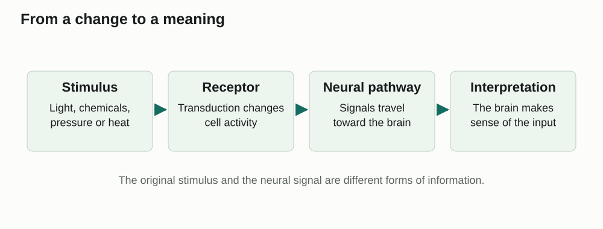

Learn · Chapter 12

# Sensory receptors, sensation and adaptation

How does a change around you become something you notice?

Learning goal

Explain how receptors detect stimuli, how the brain interprets sensory information, and why a constant stimulus can become less noticeable.

Before you begin

A sensory neuron carries information toward the central nervous system. An action potential is an electrical signal, not a picture or a sound.

**How to complete this lesson** — Learn → worked example → practise → lesson check

1.  **Learn the idea.** Start with the explanation below. Work through the example and practice before completing the lesson check.
2.  **Check the goal and starting reminder.** They identify what you should explain by the end.
3.  **Read the online lesson in order.** Follow the figures and worked example. Use a term popup or optional video when needed.
4.  **Open the required check and select Start.** Correct both selections to unlock the written explanations.
5.  **Save each written response, then Submit and finish.** Saving a draft alone does not finish the check. Completion stops the elapsed timer and records the run in All My Work.
6.  **Use optional practice as needed.** It does not increase required-check progress.

**Expected work:** two checked selections and two saved explanations in one completed required-check run.

Optional embedded reading

**Chapter 12 · pp. 406–409**

[Open at p. 406](#textbook-library)

**Key terms:** sensory receptor · sensory reception · sensation · perception · sensory adaptation

Vocabulary help

Key terms

## Words for this lesson

Use these definitions when you need help with a term.

sensory receptor  
A specialized cell or nerve ending that detects a particular type of stimulus.

sensory reception  
The detection of a stimulus by a sensory receptor.

sensation  
The conscious experience of sensory input after it reaches the brain.

perception  
The brain’s interpretation of sensory information.

More vocabulary for this lesson

### Lesson vocabulary

sensory adaptation  
Reduced responsiveness to a stimulus that remains relatively constant.

transduction  
Conversion of stimulus energy into a change that the nervous system can signal.

photoreceptor  
A sensory receptor that responds to light.

chemoreceptor  
A sensory receptor that responds to particular chemicals.

mechanoreceptor  
A sensory receptor that responds to force, movement, pressure or stretching.

thermoreceptor  
A sensory receptor that responds to temperature.

## From a change to a sensation

Imagine walking into a coffee shop. Light enters your eyes, the floor presses against your feet, and coffee molecules enter your nose. Each is a stimulus: a condition or change that a sensory receptor can detect.

Sensory reception happens when a receptor detects a stimulus. Sensation is becoming aware of the sensory information when the brain processes it. Perception is the meaning the brain gives that information. Noticing a smell is sensation; recognizing it as coffee is perception.

## How does information reach the brain?

A sensory receptor converts a stimulus into a change in electrical or chemical signalling. This conversion is called transduction. Light does not travel down the optic nerve, and sound waves do not travel down the auditory nerve. Neurons carry information about the stimulus.

**From a change to a meaning**

View larger

The original stimulus and the neural signal are different forms of information.

The brain uses the active pathway and its pattern of signals to interpret the information. Visual pathways carry information for sight; auditory pathways carry information for hearing. A stronger stimulus can change how often sensory neurons fire or how many become active. It does not simply make each action potential taller.

### Read the pathway as a change of form

Start at the stimulus box on the left and move toward the interpretation box. At the receptor, a physical or chemical input changes cell activity; after that point, the pathway carries neural information about the input. The line between boxes means “leads to,” not that a coffee molecule moves through the nerve. Conscious awareness belongs to the brain’s processing of this input; recognizing its meaning is perception. The simplified figure combines those brain processes in its last box rather than showing a separate sensation box.

A firing rate is the number of action potentials a neuron produces in a given time. Ten signals in a second is a different pattern from two signals in a second even if each signal has the same all-or-none size. Recruitment means that additional neurons become active. Rate and recruitment can therefore change the information carried without making each action potential larger. Which pathway is active also matters: an electrical signal in a visual pathway does not become a sound simply because it has the same basic electrical form as a signal in an auditory pathway.

## Match the receptor to the stimulus

| Receptor category | What stimulates it?           | An example                                    |
|-------------------|-------------------------------|-----------------------------------------------|
| Photoreceptor     | Light                         | Rods and cones in the retina                  |
| Chemoreceptor     | Particular chemicals          | Taste and olfactory receptors                 |
| Mechanoreceptor   | Pressure, stretch or movement | Skin touch receptors and inner-ear hair cells |
| Thermoreceptor    | Temperature change            | Warm and cold receptors in the skin           |

Learn each receptor category by connecting its name to a stimulus and an example. Photoreceptors detect light. Chemoreceptors respond to chemicals. Mechanoreceptors respond to pressure, stretch or movement. Thermoreceptors detect temperature changes.

Receptors also monitor conditions inside the body. Not all sensory information comes from the outside environment. Pain receptors, called nociceptors, respond to conditions that may damage tissue, including extreme heat, strong pressure and certain chemicals.

Use the table by asking what reaches the receptor, rather than naming the source object. Sunlight can stimulate photoreceptors when light reaches the retina, and it can warm skin sufficiently to stimulate thermoreceptors. The same source can therefore create different stimuli at different receptors. A body-position receptor in a muscle responds to stretch or movement, so it belongs with mechanoreceptors; receptors monitoring blood chemistry belong with chemoreceptors. Not every internal change becomes a conscious sensation before it helps regulate the body.

## Why do some sensations fade?

Do you constantly notice your clothes touching your skin? You probably noticed the contact when you got dressed, but it may no longer stand out. Sensory adaptation reduces the response to a continuing stimulus. This helps new or changing information stand out.

Attention and processing in the brain can also affect what you notice. A clock may still be ticking even when you stop noticing it. Reduced awareness does not mean the stimulus has disappeared or the receptor is damaged.

Perception also depends on context and previous experience. An optical illusion shows that the brain interprets sensory information rather than making a perfect copy of a scene.

### Separate a changed response from a changed stimulus

If a maintained input produces a smaller receptor or neural response over time, that reduced responsiveness is sensory adaptation. The response need not fall to zero. A new change can produce a stronger response again. Attention is a separate part of the explanation: a person can stop attending to information even though it continues to reach the brain. From “I no longer notice it” alone, we cannot locate how much of the change occurred in the receptors, the pathway or attention.

Consider a hypothetical observation: a pressure sensor confirms that a watch strap is still pressing with the same force, but its wearer reports noticing it less. The unchanged sensor reading rules out “there is no pressure anymore.” The report does not measure sensory-neuron activity, so it does not by itself prove where adaptation occurred. A careful conclusion is that awareness declined while pressure remained; adaptation and attention are possible contributors. This is an example of using evidence to limit an explanation.

Worked example

### From a sound to a meaning

You hear a brief tone and recognize it as a phone notification.

1.  The vibration is a stimulus. Hair cells in the inner ear are mechanoreceptors that respond to the resulting movement.
2.  The sensory pathway carries information to the brain. Becoming aware of the tone is sensation.
3.  Recognizing the tone as a notification is perception. The brain gives meaning to the information.

## Practise with support

### Follow a different sense

Sunlight warms your skin. Complete the explanation.

Which receptor category detects the temperature change?

- Choose an answer
- Photoreceptors
- Thermoreceptors
- Chemoreceptors

Check answer

You become aware that your skin feels warm. Which term fits this conscious experience?

- Choose an answer
- Sensation
- Sensory reception
- Accommodation

Check answer

## What can the two records establish?

The following records are hypothetical teaching cases, not measurements from a class or a medical test.

| Record | Stimulus and observation                                                                                                       |
|--------|--------------------------------------------------------------------------------------------------------------------------------|
| A      | An odour source is held constant. A recorded receptor response is larger at the start and smaller later, but remains present.  |
| B      | An odour source is held constant. A person reports noticing it less while reading. No receptor or nerve recording is supplied. |

Which record directly supports reduced receptor responsiveness? For each record, explain one conclusion the evidence supports and one conclusion it does not support.

A hint if you need one

Separate a recording of a receptor from a person’s report of awareness. Ask whether either record shows the stimulus disappearing.

Compare your reasoning

A directly supports reduced receptor responsiveness under a maintained stimulus, which fits sensory adaptation. Its remaining response also rules out the claim that the receptor has simply stopped all activity. It does not show whether the person notices the odour or how attention changes. B supports reduced reported awareness while the source remains constant. It does not locate the change in the receptor: adaptation and attention remain possible explanations. Neither record supports disappearance of the odour source.

### Check your explanation

- Uses the maintained stimulus in both records
- Distinguishes receptor response from reported awareness
- Identifies an evidence limit for both A and B

If you treated both records as proof of receptor failure, check what was actually measured. Reduced activity is not necessarily damage, and a report of reduced awareness is not a direct receptor measurement.

Stop and think

## Try this before opening the explanation

A student says, “I cannot smell the coffee anymore, so there are no coffee molecules left.” What is missing from the explanation?

Show the explanation

The student has not considered adaptation and attention. Reduced awareness can occur while the stimulus remains present.

Open required check · Sensory receptors, sensation and adaptation

## Explain what you have learned

This check counts toward chapter progress. Correct the 2 selections to unlock 2 written explanations. Saving writing records your response; it does not grade its accuracy.

Start

Redo this check

Not started

Required chapter check

Selection 1

### A student recognizes a familiar voice. Which part of this description is perception?

Hair cells bending

Sound waves reaching the ear

Interpreting the sound as that person’s voice

The eardrum vibrating

Check answer

Selection 2

### Which pair correctly matches a receptor with its stimulus?

Thermoreceptor — air pressure waves

Chemoreceptor — light on the retina

Mechanoreceptor — movement of inner-ear fluid

Photoreceptor — sugar in saliva

Check answer

Answer the selections correctly to unlock the writing.

Written explanations

Written explanation 1

Use a different everyday example to distinguish sensory reception, sensation and perception. Name the receptor category.

Response area

Maximum 3200 characters. Explain the biology in your own words.

Save written response

Compare after saving your own response

For a ringing bicycle bell, inner-ear mechanoreceptors respond to movement; I become aware of a sound; I interpret it as a bell warning me that a cyclist is approaching.

**Check your explanation for:**

- An appropriate stimulus and receptor
- Detection distinguished from awareness
- Meaning or interpretation identified

Written explanation 2

Explain why not noticing a constant stimulus is not proof that the sensory system has stopped working.

Response area

Maximum 3200 characters. Explain the biology in your own words.

Save written response

Compare after saving your own response

Adaptation and changes in attention can reduce awareness of a constant stimulus. Receptors and pathways may still be active, and a change in the stimulus can become noticeable.

**Check your explanation for:**

- Constant stimulus may remain
- Reduced responsiveness or attention
- New changes can still be detected

Submit and finish

Optional additional practice · Textbook Section 12.1 review, p. 409

This is optional additional practice. The question and any supporting pages are available here. It does not add to the required lesson checks.

Explain why two witnesses can interpret the same event differently.

Response area

Optional response. Select Save response to collect it. Maximum 5000 characters.

Save response

Compare with a model after making your own attempt

They may attend to different details and interpret sensory input using different experiences and expectations. Different perceptions do not by themselves establish that one person is deliberately misleading.

## From a receptor to an eye

The coffee-shop experience begins with several different inputs and ends with the brain giving their signals meaning. We can now follow one sense in detail: before the eye can convert light into neural information, how does it bring that light to the receptors?

[← Overview](#overview)[Next: Eye structures and the path of light →](#lesson-02)

[Optional textbook practice for Sensory receptors, sensation and adaptation](#textbook-practice)

## Feedback for the supported questions

### Which receptor category detects the temperature change?

Hint: Name what changes at the skin.

Answer: Thermoreceptors

Thermoreceptors detect temperature change. The light source is not the same thing as the stimulus detected in this skin example.

### You become aware that your skin feels warm. Which term fits this conscious experience?

Hint: Distinguish detection at a receptor from awareness in the brain.

Answer: Sensation

Sensation is becoming aware of the input. Reception began when the receptors detected the change.

## Feedback for the required selections

### A student recognizes a familiar voice. Which part of this description is perception?

Hint: Look for the step that gives the input meaning.

Answer: Interpreting the sound as that person’s voice

Perception assigns meaning to sensory information. Detection and transmission occur earlier.

### Which pair correctly matches a receptor with its stimulus?

Hint: Match the form of energy, not the name of the organ.

Answer: Mechanoreceptor — movement of inner-ear fluid

Movement is a mechanical stimulus. Inner-ear hair cells are mechanoreceptors.
