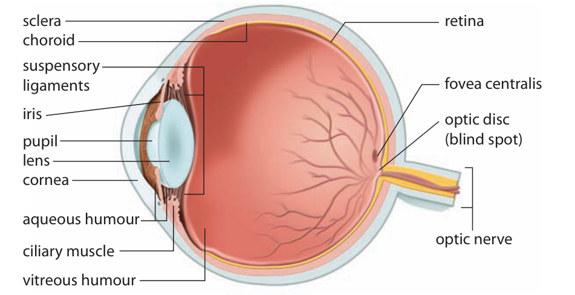

Learn · Chapter 12

# Eye structures and the path of light

Which structures guide light to the cells that detect it?

Learning goal

Identify the main eye structures and connect each structure to its role in light entry, focusing, support or signalling.

Before you begin

Photoreceptors convert light into changes in neural activity. Transparent focusing structures are not themselves photoreceptors.

**How to complete this lesson** — Learn → worked example → practise → lesson check

1.  **Learn the idea.** Start with the explanation below. Work through the example and practice before completing the lesson check.
2.  **Check the goal and starting reminder.** They identify what you should explain by the end.
3.  **Read the online lesson in order.** Follow the figures and worked example. Use a term popup or optional video when needed.
4.  **Open the required check and select Start.** Correct both selections to unlock the written explanations.
5.  **Save each written response, then Submit and finish.** Saving a draft alone does not finish the check. Completion stops the elapsed timer and records the run in All My Work.
6.  **Use optional practice as needed.** It does not increase required-check progress.

**Expected work:** two checked selections and two saved explanations in one completed required-check run.

Optional embedded reading

**Chapter 12 · pp. 410–412**

[Open at p. 410](#textbook-library)

**Key terms:** cornea · sclera · choroid · iris · pupil

Vocabulary help

Key terms

## Words for this lesson

Use these definitions when you need help with a term.

cornea  
The transparent front surface of the eye that refracts incoming light.

sclera  
The tough outer coat that protects and supports the eyeball.

choroid  
A pigmented, blood-rich layer between the sclera and retina.

iris  
The coloured ring of muscle that controls pupil diameter.

More vocabulary for this lesson

### Lesson vocabulary

pupil  
The opening in the iris through which light enters.

lens  
A transparent, flexible structure that adjusts focus on the retina.

aqueous humour  
The clear watery fluid in the front part of the eye.

vitreous humour  
The clear gel in the large cavity behind the lens.

retina  
The light-sensitive inner layer containing photoreceptors and other nerve cells.

## Follow the route before memorizing the labels

Light enters the front of the eye and travels toward the retina at the back. Follow this route: cornea → aqueous humour → pupil → lens → vitreous humour → retina. The pupil is an opening, not a solid black structure.

**The main structures of the eye**

View larger

Follow the light from the cornea at the front to the retina at the back. The optic nerve is an output pathway, not part of the incoming light route.Inquiry into Biology, Chapter 12, p. 411. [View the embedded textbook page](#textbook-library)

The cornea is the clear front surface of the eye. It does much of the bending of incoming light. Bending light is called refraction. The lens makes further adjustments to focus the light on the retina. The two humours are clear materials that light passes through; they do not detect light.

### Read the eye in two passes

In the figure, find the bulging cornea at the left and the optic nerve leaving at the right. First follow light through the central clear route. The aqueous humour is in front of the lens; the much larger vitreous region is behind it. At the iris, light passes through the pupil opening. It does not pass through the coloured iris tissue as the next transparent layer.

For a second pass, trace the curved wall at the back. The outer sclera surrounds the choroid, and the retina lines the interior. These are nested layers, not three stops that every incoming ray passes through before detection. The cross-section opens the eye so that we can see relationships; the colours distinguish tissues and do not depict their optical transparency accurately.

## Three layers, three jobs

| Layer   | Location                  | Why it matters                                                 |
|---------|---------------------------|----------------------------------------------------------------|
| Sclera  | Outside                   | Tough tissue protects and supports the eye.                    |
| Choroid | Between sclera and retina | Blood vessels nourish tissues; pigment absorbs stray light.    |
| Retina  | Inside, toward the back   | Rods and cones detect light; retinal neurons begin processing. |

The sclera is the tough outer layer. The choroid lies beneath it and contains blood vessels and pigment. The retina is the inner sensory layer containing rods and cones.

Keep the jobs separate. A cloudy surface can interfere with light reaching the retina. Damaged photoreceptors can interfere with detection even when light reaches them. To explain a vision problem, identify which step is affected: getting light in, focusing it, detecting it or carrying the information onward.

Transparency matters because an image can only form if enough light passes through the front structures with its spatial pattern preserved. Pigment has the complementary job of absorbing stray light that could otherwise scatter inside the eye. The retina must receive useful light and contain responsive receptors; a transparent lens cannot perform that sensory conversion. The nerve exit is another distinct location. Follow its label to the optic disc rather than to the fovea: the fovea specializes in detail, while the exit lacks photoreceptors.

## The iris controls amount; the lens controls focus

The iris is the coloured ring around the pupil. Its muscles change the size of the opening. In bright light, the pupil becomes smaller and less light enters. In dim light, it becomes larger and more light enters.

The lens does a different job. It changes shape to focus on objects at different distances. This adjustment is called accommodation. Walking into brighter light changes how much light should enter. Looking from a distant sign to a nearby page changes how the light must be focused.

## Connect the supporting parts to their functions

Aqueous humour is the watery fluid in the front of the eye. It provides nutrients to the cornea and lens and is continually produced and drained. Vitreous humour is the clear gel behind the lens. It helps support the eye and maintain its shape.

The optic nerve is a bundle of nerve fibres carrying visual information away from the retina. The place where it leaves the eye has no rods or cones. This is the optic disc, or blind spot. The fovea centralis is different: it contains many cones and supports sharp, detailed vision.

When you label an eye, find the cornea at the front and the optic nerve at the back first. Then locate the layers and internal structures. Use their relationships, not the position of a letter on one picture.

### Work backward from a limited observation

A hypothetical eye model produces a blurred retinal image, yet its photoreceptors respond when illuminated. The response establishes that some light is detected; it does not establish that the optics form a sharp image. First separate image formation from detection. A problem in transparent media or focusing could blur the pattern while leaving receptor responsiveness. Next ask what evidence is missing: the observation does not identify whether the cornea, lens or another optical stage caused the blur. Naming one disease would go beyond the supplied evidence.

Worked example

### Light getting in is only one step

An eye has a clear cornea and lens, but its photoreceptors are damaged.

1.  The clear cornea and lens may still allow light through and focus it on the retina.
2.  The retina contains rods and cones. Damaged receptors may not convert the light into normal signals.
3.  Light must reach the retina, but that alone does not produce vision. The receptors and the pathway carrying their information must also work.

## Practise with support

### Complete the light route

Use the sequence cornea → aqueous humour → pupil → lens → vitreous humour → retina.

Which structure changes the size of the opening in that route?

- Choose an answer
- Lens
- Optic nerve
- Iris

Check answer

Which part contains the receptors that detect the light?

- Choose an answer
- Vitreous humour
- Sclera
- Retina

Check answer

## Compare two optical models

These are two hypothetical arrangements. In both, the pupil stays the same size, the retina is responsive, and the output pathway works.

| Arrangement | Stated change                                                                                  |
|-------------|------------------------------------------------------------------------------------------------|
| A           | The lens remains clear, but its shape produces an unfocused pattern on the retina.             |
| B           | The lens has the appropriate focusing shape, but cloudiness scatters light passing through it. |

Explain how each arrangement can reduce image quality even though the pupil and receptors work. Would making the pupil larger establish that either problem had been repaired? Justify your answer.

A hint if you need one

Give the lens two separate requirements: its optical shape and its transparency. Increased entry is not proof of restored focusing or transparency.

Compare your reasoning

A has a focusing problem: the lens is clear but does not bring the pattern into proper focus. B has a transmission problem: even the appropriate shape cannot prevent cloudiness from scattering light. A larger pupil changes the amount of entering light; that alone does not show that A now focuses correctly or that B has become clear. Retinal responsiveness is necessary but does not remove either upstream limitation.

### Check your explanation

- Separates focusing from clear transmission
- Connects each stated change to retinal image quality
- Does not claim pupil enlargement repairs the lens

If you wrote only “less light,” revisit A: a clear lens can pass light yet form a blurred image. Explain the spatial pattern as well as the amount of light.

Stop and think

## Try this before opening the explanation

Which structure changes when the opening for light becomes smaller: the iris or the lens?

Show the explanation

The iris changes pupil diameter. The lens changes shape for focusing, not for closing the pupil.

Optional video support

### Vision and the eye

**As you watch:** Trace the light route. Distinguish the iris from the pupil.

Optional video. Internet access is required. The explanation below covers the idea without the video.

[Open on YouTube](https://www.youtube.com/watch?v=o0DYP-u1rNM)

Load video

#### Read the explanation

Light passes through the cornea, aqueous humour, pupil, lens and vitreous humour to reach the retina.

Open required check · Eye structures and the path of light

## Explain what you have learned

This check counts toward chapter progress. Correct the 2 selections to unlock 2 written explanations. Saving writing records your response; it does not grade its accuracy.

Start

Redo this check

Not started

Required chapter check

Selection 1

### Which route correctly follows light through the eye?

Cornea → pupil → lens → retina

Cornea → optic nerve → lens → retina

Pupil → retina → lens → cornea

Retina → lens → pupil → cornea

Check answer

Selection 2

### A diagram labels the opening in the coloured ring as “iris.” What needs correcting?

The opening is the retina; the ring is the lens

The opening is the optic nerve

The opening is the pupil; the coloured ring is the iris

Both labels refer to the cornea

Check answer

Answer the selections correctly to unlock the writing.

Written explanations

Written explanation 1

Trace a ray of light from outside the eye to the retina. Include both humours and explain the different roles of the iris and lens.

Response area

Maximum 3200 characters. Explain the biology in your own words.

Save written response

Compare after saving your own response

Light passes through the cornea, aqueous humour, pupil, lens and vitreous humour to the retina. The iris controls pupil diameter and the amount of entering light. The lens adjusts the focus on the retina.

**Check your explanation for:**

- Correct ordered optical route
- Both humours included
- Iris and lens functions distinguished

Written explanation 2

Compare the sclera, choroid and retina. Give one function for each rather than only its location.

Response area

Maximum 3200 characters. Explain the biology in your own words.

Save written response

Compare after saving your own response

The sclera protects and supports the eye; the choroid nourishes tissues and absorbs stray light; the retina contains photoreceptors and neurons that detect and process light information.

**Check your explanation for:**

- Three layers distinguished
- Protection/support
- Nourishment/pigment and photoreception

Submit and finish

Optional additional practice · Textbook Fig. 12.7 and Table 12.2, p. 411

This is optional additional practice. The question and any supporting pages are available here. It does not add to the required lesson checks.

Explain why “the pupil detects light” is inaccurate.

Response area

Optional response. Select Save response to collect it. Maximum 5000 characters.

Save response

Compare with a model after making your own attempt

The pupil allows light to enter. Rods and cones in the retina detect it.

## Why distance creates a focusing problem

The eye combines a clear route, structures that refract light, and a sensory layer that detects it. The distance from lens to retina cannot be adjusted each time you glance at a nearer object. How can a change in lens shape keep the image at the retina?

[← Previous topic](#lesson-01)[Next: Focusing, accommodation and vision problems →](#lesson-03)

[Optional textbook practice for Eye structures and the path of light](#textbook-practice)

## Feedback for the supported questions

### Which structure changes the size of the opening in that route?

Hint: The pupil is an opening within a ring of muscle.

Answer: Iris

Iris muscles change pupil size and control how much light enters.

### Which part contains the receptors that detect the light?

Hint: Clear materials let light pass; receptors detect it.

Answer: Retina

Rods and cones are in the retina. The humours transmit light and the sclera protects the eye.

## Feedback for the required selections

### Which route correctly follows light through the eye?

Hint: Start at the transparent front of the eye.

Answer: Cornea → pupil → lens → retina

This is the main route with the humours omitted for brevity. Neural signals leave the retina through the optic nerve.

### A diagram labels the opening in the coloured ring as “iris.” What needs correcting?

Hint: Separate tissue from space.

Answer: The opening is the pupil; the coloured ring is the iris

Iris names the tissue that changes the size of the opening. Pupil names the opening.
