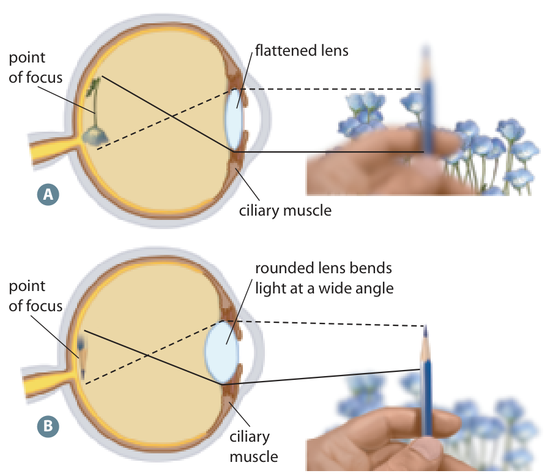
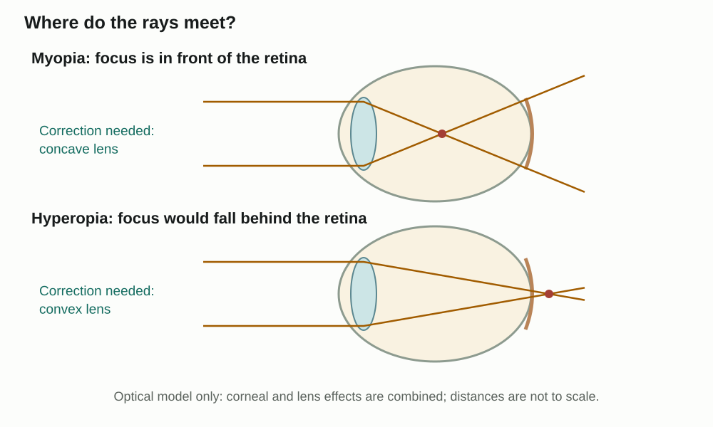

Learn · Chapter 12

# Focusing, accommodation and vision problems

How does the eye keep an image in focus as distance changes?

Learning goal

Explain accommodation and predict how common focusing problems change where light meets the retina.

Before you begin

The cornea and lens refract light. A sharp image requires the rays to meet at the retina, not in front of it or behind it.

**How to complete this lesson** — Learn → worked example → practise → lesson check

1.  **Learn the idea.** Start with the explanation below. Work through the example and practice before completing the lesson check.
2.  **Check the goal and starting reminder.** They identify what you should explain by the end.
3.  **Read the online lesson in order.** Follow the figures and worked example. Use a term popup or optional video when needed.
4.  **Open the required check and select Start.** Correct both selections to unlock the written explanations.
5.  **Save each written response, then Submit and finish.** Saving a draft alone does not finish the check. Completion stops the elapsed timer and records the run in All My Work.
6.  **Use optional practice as needed.** It does not increase required-check progress.

**Expected work:** two checked selections and two saved explanations in one completed required-check run.

Optional embedded reading

**Chapter 12 · pp. 412–414**

[Open at p. 412](#textbook-library)

**Key terms:** refraction · accommodation · ciliary muscle · suspensory ligaments · myopia

Vocabulary help

Key terms

## Words for this lesson

Use these definitions when you need help with a term.

refraction  
Bending of light as it passes between materials.

accommodation  
Adjustment of lens shape to focus on objects at different distances.

ciliary muscle  
A ring of muscle that changes the tension on the lens-supporting ligaments.

suspensory ligaments  
Fibres connecting the lens to the ciliary region.

More vocabulary for this lesson

### Lesson vocabulary

myopia  
A focusing condition in which distant light focuses in front of the retina.

hyperopia  
A focusing condition in which near images tend to focus behind the retina because the eye does not bend light enough.

astigmatism  
Unequal focusing in different directions caused by irregular curvature of the cornea or lens.

cataract  
Clouding of the eye’s lens that interferes with light transmission.

## Near and far objects need different lens shapes

When you look from a distant sign to a nearby page, the lens must bend light more strongly. The lens becomes rounder for near vision and flatter for distant vision. Accommodation is this change in lens shape.

**Accommodation: near and distant focus**

View larger

Compare the flatter lens for a distant object with the rounder lens for a nearby object. Refraction by the cornea is also essential.Inquiry into Biology, Chapter 12, p. 412. [View the embedded textbook page](#textbook-library)

The ciliary muscle is a ring of muscle around the lens. Suspensory ligaments connect the lens to the surrounding ciliary structure. For a nearby object, the muscle contracts, ligament tension decreases, and the lens becomes rounder. For a distant object, the muscle relaxes, the ligaments become taut, and the lens flattens.

Compare rays from a single point on a far object with rays from a single point on a nearby object. At the eye, far rays arrive nearly parallel; near rays are more spread apart in direction. To bring the more-diverging near rays together on the same retina, the eye needs greater converging power. “More bending” describes this optical need, not a brighter object or a larger pupil.

The accommodation figure shows a side section of a ring of ciliary muscle. Imagine looking through that ring: contraction reduces its inner diameter and brings the ligament attachments inward. That reduces the outward stretch on the lens. The lens is elastic, so reduced stretch lets it round up; the muscle does not squeeze directly on its front and back. On relaxation, the surrounding system again pulls the ligaments taut and flattens the lens. Read the figure from the ciliary region to the lens, then to the point of focus. Ligament tension is explained by this relationship even though the picture does not draw every ligament.

## Follow the pull on the lens

| Viewing | Ciliary muscle | Ligament tension | Lens                           |
|---------|----------------|------------------|--------------------------------|
| Near    | Contracts      | Decreases        | Rounder; more refractive power |
| Far     | Relaxes        | Increases        | Flatter; less refractive power |

Tension means how strongly the ligaments pull on the lens. When the ligaments pull more strongly, they stretch the lens flatter. When their pull decreases, the lens can become rounder.

This is why “the muscle contracts” is not a complete explanation. Trace all four steps: ciliary muscle → ligament tension → lens shape → bending of light.

The focused image on the retina is inverted relative to the object. The brain interprets the information so that you perceive the world upright. It does not receive a tiny picture that it physically turns over.

## Use the focal point to explain the correction

In myopia, or nearsightedness, distant objects are blurred because light focuses in front of the retina. An eyeball that is too long is one possible cause. A concave, or diverging, corrective lens spreads the incoming light slightly so the eye can focus it on the retina.

**Predict the focus before choosing the lens**

View larger

A diverging correction helps the myopia model; a converging correction helps the hyperopia model. Dots indicate model focal positions.

In hyperopia, or farsightedness, light from nearby objects tends to focus behind the retina. An eyeball that is too short is one possible cause. A convex, or converging, corrective lens bends the incoming light inward before it enters the eye.

Use the location of the focal point to explain the correction. Do not choose a lens just because its name sounds familiar.

### Follow the correction before and after the eye

Compare each left-hand eye with the corrected eye immediately to its right. The ray diagram is a simplified optical model, not a scale drawing.

Begin with the upper-left eye. Follow the rays until they meet in front of the back surface, then continue: by the time they reach the retina they are spreading apart again. In the upper-right view, the concave lens changes their directions before they enter the same eye. They enter more spread out, so the combined system brings them together farther back, at the retina.

Now use the lower row as a worked contrast. Without correction, the rays have not yet met when they reach the retina; their projected meeting point is behind it. The convex lens first turns the entering rays inward. The eye then needs less additional convergence to bring them together at its retinal surface. The correction changes the incoming directions; it does not move the retina or repair a receptor. That is why focal position predicts the needed optical effect before you choose the lens name.

## Different problems affect different structures

Astigmatism involves uneven curvature of the cornea or lens, so light is not focused evenly. A cataract is a cloudy lens, which reduces clear light transmission. Glaucoma involves damage to the optic nerve; increased pressure inside the eye is an important possible cause.

As the lens becomes less flexible with age, it becomes harder to make the rounder shape needed for near vision. This loss of focusing ability is called presbyopia.

For each example, connect the affected structure to its job. These are different mechanisms, even though each can interfere with vision.

Worked example

### Looking from far away to nearby

You stop looking at a distant clock and look down at a book.

1.  Near vision needs stronger bending of incoming light.
2.  The ciliary muscle contracts, reducing the pull of the suspensory ligaments.
3.  The lens becomes rounder. Its stronger focusing effect helps form a clear image on the retina.

## Practise with support

### Now reverse the change

You look from the book back to the distant clock.

The ciliary muscle relaxes. What happens to ligament tension?

- Choose an answer
- It decreases
- It increases

Check answer

What follows the increased pull?

- Choose an answer
- The lens flattens and bends light less strongly
- The lens rounds and bends light more strongly

Check answer

## Find the failed link

In this hypothetical model, an eye switches from a distant object to a near one. The ciliary muscle contracts and ligament tension decreases as expected, but the lens remains as flat as it was for distance. The transparent media, photoreceptors and optic nerve are stated to be functional.

Locate the first failed link in the accommodation chain. Predict the focusing consequence for the near object, and explain why a larger pupil or a normal optic nerve does not repair that link.

A hint if you need one

Follow the observed changes in order. Which expected change is specifically said not to occur?

Compare your reasoning

The first stated failure is that reduced ligament tension does not produce a rounder lens. The lens therefore lacks the increase in refractive power needed for the more-diverging near rays. In this simplified model, they would tend to meet behind the retina rather than on it, producing a blurred near image. A larger pupil changes light entry, not the missing lens-shape response. A normal optic nerve carries the available retinal information but cannot refocus the light beforehand. The case does not identify a disease or prove what caused the lens limitation.

### Check your explanation

- Locates failure after reduced tension and before increased curvature
- Links flatter lens to insufficient near convergence
- Separates optical failure from entry and neural transmission
- Keeps diagnosis within the evidence

If you blamed a muscle that failed to contract, compare that claim with the supplied observation: it did contract. A causal explanation must retain the functioning links as well as identify the failed one.

Stop and think

## Try this before opening the explanation

When the ciliary muscle contracts for near vision, what happens to the suspensory ligaments and lens?

Show the explanation

Ligament tension decreases, so the lens becomes rounder. The lens refracts light more strongly.

Optional video support

### Eye anatomy recap

**As you watch:** Track how the ciliary muscle, ligaments and lens change for a near object.

Optional video. Internet access is required. The explanation below covers the idea without the video.

[Open on YouTube](https://www.youtube.com/watch?v=MJxxFwVu1OM)

Load video

#### Read the explanation

For near vision, ciliary muscles contract, ligament tension decreases and the lens becomes rounder.

Open required check · Focusing, accommodation and vision problems

## Explain what you have learned

This check counts toward chapter progress. Correct the 2 selections to unlock 2 written explanations. Saving writing records your response; it does not grade its accuracy.

Start

Redo this check

Not started

Required chapter check

Selection 1

### A student looks from a distant tree to a nearby book. Which change supports the new focus?

Ciliary muscle relaxes; lens becomes flatter

Ciliary muscle contracts; lens becomes rounder

Pupil becomes the photoreceptor

Optic nerve shortens to move the retina

Check answer

Selection 2

### Distant rays focus in front of the retina. Which correction matches this model?

A concave lens for hyperopia

A convex lens for myopia

A concave lens for myopia

Removing the iris to treat a cataract

Check answer

Answer the selections correctly to unlock the writing.

Written explanations

Written explanation 1

Explain near accommodation as a four-step chain: muscle action, ligament tension, lens shape and optical effect.

Response area

Maximum 3200 characters. Explain the biology in your own words.

Save written response

Compare after saving your own response

The ciliary muscle contracts, suspensory-ligament tension decreases, the lens becomes rounder, and its refractive power increases to focus a nearby object on the retina.

**Check your explanation for:**

- Correct muscle action
- Correct tension and lens shape
- Near-focus consequence

Written explanation 2

Compare myopia and hyperopia using focal position and corrective lens type. Explain one correction rather than just naming it.

Response area

Maximum 3200 characters. Explain the biology in your own words.

Save written response

Compare after saving your own response

Myopia focuses distant light in front of the retina and is corrected with a concave lens. Hyperopia focuses behind the retina without sufficient accommodation and is corrected with a convex lens. The concave lens spreads rays so they meet farther back.

**Check your explanation for:**

- Front versus behind
- Concave versus convex
- Mechanism of one correction

Submit and finish

Optional additional practice · Textbook Section 12.2 review, p. 418

This is optional additional practice. The question and any supporting pages are available here. It does not add to the required lesson checks.

Why might reduced lens elasticity make reading small nearby print harder?

Response area

Optional response. Select Save response to collect it. Maximum 5000 characters.

Save response

Compare with a model after making your own attempt

The lens cannot become sufficiently rounded for near focus. The problem is accommodation, not necessarily loss of photoreceptors.

## A focused image is still light

A focused image requires enough refraction for the object’s distance and the retina’s position. Even a perfectly focused image is still light. Next, we will follow how rods and cones change that input into information that can leave the eye.

[← Previous topic](#lesson-02)[Next: The retina, rods and cones →](#lesson-04)

[Optional textbook practice for Focusing, accommodation and vision problems](#textbook-practice)

## Feedback for the supported questions

### The ciliary muscle relaxes. What happens to ligament tension?

Hint: A distant object needs a flatter lens.

Answer: It increases

Relaxation allows the suspensory ligaments to become more taut.

### What follows the increased pull?

Hint: Trace tension → shape → focusing effect.

Answer: The lens flattens and bends light less strongly

Greater ligament tension stretches the lens flatter, reducing its focusing power for distant vision.

## Feedback for the required selections

### A student looks from a distant tree to a nearby book. Which change supports the new focus?

Hint: Follow muscle action to ligament tension, then lens shape.

Answer: Ciliary muscle contracts; lens becomes rounder

Near accommodation reduces ligament tension and allows the lens to round.

### Distant rays focus in front of the retina. Which correction matches this model?

Hint: Does the correction need more or less initial convergence?

Answer: A concave lens for myopia

A concave lens diverges the rays before they enter the eye.
