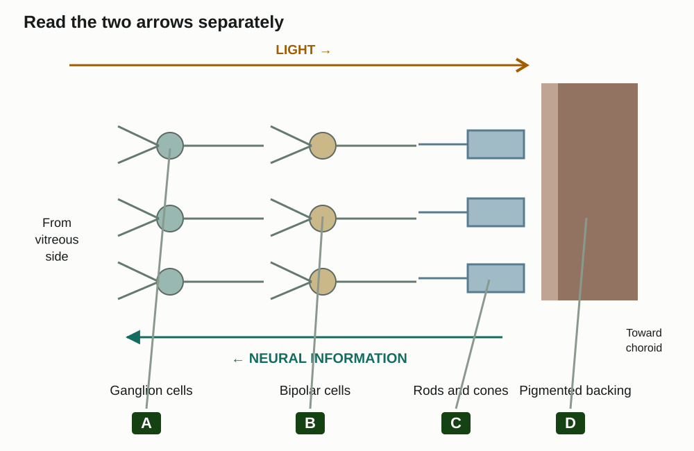
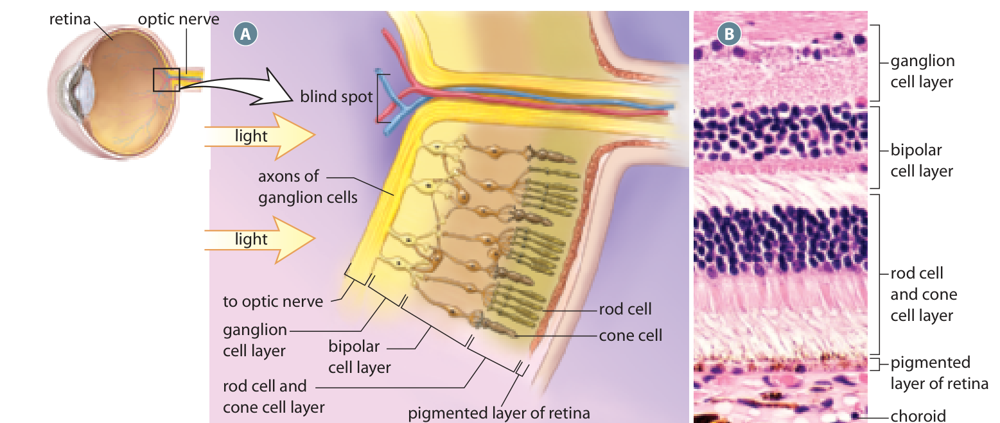

Learn · Chapter 12

# The retina, rods and cones

Why does light travel one way through the retina while information travels back the other way?

Learning goal

Compare rods and cones, trace retinal signalling, and explain the fovea, blind spot and visual interpretation.

Before you begin

The retina is the detecting and processing layer. The optic nerve carries neural information away from the eye.

**How to complete this lesson** — Learn → worked example → practise → lesson check

1.  **Learn the idea.** Start with the explanation below. Work through the example and practice before completing the lesson check.
2.  **Check the goal and starting reminder.** They identify what you should explain by the end.
3.  **Read the online lesson in order.** Follow the figures and worked example. Use a term popup or optional video when needed.
4.  **Open the required check and select Start.** Correct both selections to unlock the written explanations.
5.  **Save each written response, then Submit and finish.** Saving a draft alone does not finish the check. Completion stops the elapsed timer and records the run in All My Work.
6.  **Use optional practice as needed.** It does not increase required-check progress.

**Expected work:** two checked selections and two saved explanations in one completed required-check run.

Optional embedded reading

**Chapter 12 · pp. 414–418**

[Open at p. 414](#textbook-library)

**Key terms:** rod · cone · fovea centralis · blind spot · bipolar cell

Vocabulary help

Key terms

## Words for this lesson

Use these definitions when you need help with a term.

rod  
A photoreceptor especially sensitive in dim light.

cone  
A photoreceptor supporting colour and fine detail in brighter light.

fovea centralis  
The central retinal region with many cones that provides especially sharp vision.

blind spot  
The optic-disc location without rods or cones where nerve fibres leave the eye.

More vocabulary for this lesson

### Lesson vocabulary

bipolar cell  
A retinal neuron linking photoreceptors with ganglion-cell pathways.

ganglion cell  
A retinal neuron whose axon contributes to the optic nerve.

rhodopsin  
A light-sensitive rod pigment containing opsin and retinal, a vitamin A derivative.

optic nerve  
A bundle of nerve fibres carrying visual information away from the retina.

## Rods and cones work best in different conditions

| Feature                  | Rods                               | Cones                                  |
|--------------------------|------------------------------------|----------------------------------------|
| Most useful illumination | Dim light                          | Brighter light                         |
| Colour discrimination    | No                                 | Yes                                    |
| Fine detail              | Lower acuity                       | Higher acuity, especially at the fovea |
| Distribution             | Numerous outside the central fovea | Densest at the fovea                   |

Rods are very sensitive to light. They help you see in dim conditions, but they do not allow colour discrimination. Many rods lie away from the centre of the retina and contribute to peripheral vision.

Cones need brighter light and provide colour vision and fine detail. They are especially concentrated in the fovea centralis. This is why reading small print in good light depends strongly on cones. Different cone types respond best to different ranges of wavelengths; the brain compares their activity to distinguish colours.

### Use light level and location together

Imagine a hypothetical scene containing a very faint patch beside a bright, detailed coloured sign. In adequate light, looking directly at the sign places its image on the cone-rich fovea and supports fine detail. When illumination becomes too low for effective cone vision, that advantage does not turn cones into rods. Rod-rich regions outside the central fovea are better suited to detecting faint light, but their response does not supply the same fine colour detail. Location and illumination must both fit the task.

This explains why “the fovea always sees best” is incomplete. Best for reading fine print in good light differs from most sensitive to a faint light. Likewise, “rods give black-and-white vision” does not mean they send a black-and-white photograph along the nerve; rod-driven pathways contribute information about light differences without the cone comparisons needed for colour discrimination.

## Follow two routes through the retina

The retina contains photoreceptors, bipolar cells and ganglion cells. Bipolar cells pass information between photoreceptors and ganglion cells. The axons of ganglion cells join to form the optic nerve.

**Different directions: light and information**

View larger

Light passes ganglion and bipolar layers to reach photoreceptors. Information returns through bipolar pathways to ganglion cells. Cell numbers and connections are schematic.

**The retina in cross-section**

View larger

The photoreceptor layer lies toward the pigmented backing. Ganglion-cell axons gather into the optic nerve.Inquiry into Biology, Chapter 12, p. 415. [View the embedded textbook page](#textbook-library)

Incoming light passes through the ganglion-cell layer and then the bipolar-cell layer before reaching rods and cones near the pigmented layer. The neural information then follows a different route: rods and cones → bipolar cells → ganglion cells → optic nerve.

On the diagram, first trace the light arrow. Then trace the information arrow. Light reaching a ganglion-cell layer is not the same as that layer detecting the light.

Orient the cross-section before comparing it with the schematic. In the coloured drawing, the yellow light arrows approach from the interior, vitreous side. They point through the inner neuronal layers toward the rods and cones next to the pigmented backing. In the adjacent micrograph, locate the labelled ganglion, bipolar and rod/cone layers, then the pigmented layer and choroid. The micrograph shows tissue organization; the drawn arrows explain routes that a still photograph cannot show. The diagram's small set of connections is a teaching simplification, not an exact count of cells or a promise that every receptor connects to just one bipolar cell.

## Light changes photoreceptor signalling

Rods contain a light-sensitive pigment called rhodopsin. It is made of the protein opsin and retinal, which is derived from vitamin A. When light is absorbed, retinal changes shape and starts a series of changes inside the receptor.

The photoreceptor becomes more negative inside, a change called hyperpolarization. It releases less neurotransmitter. Bipolar cells respond to this change, and the information is passed to ganglion cells. Ganglion-cell action potentials carry information along the optic nerve.

The important sequence is light absorption → changed photoreceptor signalling → changed activity in the retinal pathway. Rods and cones do not send action potentials down the optic nerve themselves. Different retinal pathways respond differently to the change in transmitter release.

### A decrease can carry information

A photoreceptor has activity before the light changes. Light-induced hyperpolarization changes that starting state and reduces its transmitter release. A receiving bipolar pathway responds to the change. Different bipolar pathways can respond in different directions, so do not replace this explanation with “less transmitter turns every downstream neuron off” or “every bipolar cell becomes more active.” The important point is that a change in release can carry information, including a decrease.

Work through a simple comparison. In darkness, a model rod releases transmitter at its starting rate. Light is then absorbed and its release decreases. That is evidence of a light response, not evidence that the rod has failed to detect light. The later ganglion-cell pattern depends on the retinal circuit. Ganglion-cell axons carry action potentials out of the eye; the receptor's change in voltage is not itself an action potential travelling through the entire route.

## From the retina to a visual experience

The fovea has many cones and provides high visual detail. The blind spot has no rods or cones, so it cannot detect light. These are different locations with different functions.

Visual information travels from the retina along the optic nerve, through brain pathways that include the thalamus, and to the visual cortex in the occipital lobe. The brain combines information about colour, shape, movement and depth.

The two eyes view a scene from slightly different positions. Comparing those views supports depth perception; this is binocular vision. A colour-vision deficiency can make some colours difficult to distinguish because particular cone responses are missing or altered. It does not necessarily remove all colour vision.

One additional pathway landmark is the optic chiasm, where some optic-nerve fibres cross to the opposite side. Beyond it, the bundles are called optic tracts. This partial crossing helps organize information from the two eyes by visual field before later processing. It does not mean that all fibres cross or that light crosses between the eyes. The simplified retinal diagram stops at the optic nerve; it cannot be used to locate the chiasm or infer its crossing pattern.

Worked example

### Separate incoming light from outgoing information

Trace a simplified three-layer retina.

1.  Incoming light passes the ganglion-cell layer, then the bipolar-cell layer, before reaching rods and cones.
2.  Rods and cones detect the light and change their signalling. Information passes to bipolar cells and then ganglion cells.
3.  Ganglion-cell axons form the optic nerve. This route carries neural information, not light.

## Practise with support

### Fill the two routes

Choose the missing stage in each route.

Incoming light: ganglion-cell layer → \_\_\_\_ → rods and cones.

- Choose an answer
- Bipolar-cell layer
- Sclera
- Optic nerve

Check answer

Neural information: rods and cones → bipolar cells → \_\_\_\_ → optic nerve.

- Choose an answer
- Pigmented layer
- Ganglion cells
- Cornea

Check answer

## Read a response that becomes smaller

This hypothetical record describes one simplified retinal pathway. The numbers are arbitrary relative transmitter-release units, not measured human values.

| Condition                 | Photoreceptor release | Ganglion-cell output in this particular pathway                                   |
|---------------------------|-----------------------|-----------------------------------------------------------------------------------|
| Before the light increase | 100 units             | A baseline pattern of action potentials                                           |
| After the light increase  | 40 units              | A changed frequency of action potentials; individual signal height stays the same |

A student says the smaller release proves that the photoreceptor detected less light, and that the optic nerve must carry smaller action potentials. Correct both inferences using the record. What could you not infer about every other retinal pathway?

A hint if you need one

Match the direction of the light change to the direction of the receptor response. Keep release amount, firing frequency and action-potential height separate.

Compare your reasoning

The stated light increase is followed by reduced photoreceptor release, consistent with light-induced hyperpolarization. Reduced release is the receptor response here, not evidence of reduced light detection. The record explicitly says ganglion-cell action-potential height is unchanged; the output pattern changes in frequency. The two observations concern different cells and different quantities. We cannot infer that every bipolar or ganglion pathway changes in the same direction because retinal circuits respond differently, and this record describes only one pathway.

### Check your explanation

- Uses the given light increase rather than reversing it
- Explains a decrease in receptor release as a signal change
- Separates receptor release from ganglion action-potential height
- Limits the conclusion to the stated pathway

If you wrote “all neurons are inhibited,” return to the difference between the receptor and the receiving circuit. This record supplies a changed output, and the lesson does not give every circuit the same response rule.

Stop and think

## Try this before opening the explanation

Which retinal cells contribute axons to the optic nerve?

Show the explanation

Ganglion cells. Bipolar cells link retinal pathways, and rods and cones transduce light.

Optional video support

### Rods and visual pigments

**As you watch:** Identify the role of rods in dim light, without treating rods as the optic nerve.

Optional video. Internet access is required. The explanation below covers the idea without the video.

[Open on YouTube](https://www.youtube.com/watch?v=nnCrnWOiKG4)

Load video

#### Read the explanation

Rhodopsin contains opsin and retinal. Photoreceptors change transmitter release; ganglion-cell axons carry action potentials toward the brain.

Open required check · The retina, rods and cones

## Explain what you have learned

This check counts toward chapter progress. Correct the 2 selections to unlock 2 written explanations. Saving writing records your response; it does not grade its accuracy.

Start

Redo this check

Not started

Required chapter check

Selection 1

### Which sequence follows the principal retinal information pathway?

Photoreceptor → iris → ciliary muscle

Photoreceptor → bipolar cell → ganglion cell

Ganglion cell → lens → photoreceptor

Pupil → choroid → ganglion cell

Check answer

Selection 2

### Why is the optic disc a blind spot?

It lacks rods and cones

The lens focuses every image there

Its aqueous humour is opaque

It contains only cones

Check answer

Answer the selections correctly to unlock the writing.

Written explanations

Written explanation 1

Trace light and neural information through the simplified three-layer retina. Explain why their directions differ.

Response area

Maximum 3200 characters. Explain the biology in your own words.

Save written response

Compare after saving your own response

Light enters from the vitreous side past ganglion and bipolar layers to rods and cones. After transduction, information travels through bipolar pathways to ganglion cells, whose axons form the optic nerve.

**Check your explanation for:**

- Optical direction correct
- Neural direction correct
- Ganglion-cell axons identified

Written explanation 2

Compare the fovea centralis with the blind spot. Include the receptors present or absent and the consequence for vision.

Response area

Maximum 3200 characters. Explain the biology in your own words.

Save written response

Compare after saving your own response

The fovea has a dense cone population supporting sharp central vision. The optic disc has no rods or cones because fibres leave as the optic nerve, so light falling there is not detected.

**Check your explanation for:**

- Fovea and cones
- Optic disc and absence of receptors
- Consequences linked to structure

Submit and finish

Optional additional practice · Textbook Fig. 12.17, p. 416; Section 12.2 review, p. 418

This is optional additional practice. The question and any supporting pages are available here. It does not add to the required lesson checks.

Explain how someone can have a functioning optic nerve but still have impaired vision.

Response area

Optional response. Select Save response to collect it. Maximum 5000 characters.

Save response

Compare with a model after making your own attempt

The cornea or lens may fail to form a clear image, photoreceptors may be damaged, or visual processing may be impaired. A working nerve does not replace the other steps.

## From light to movement

The retina distinguishes the arrival of light, a graded receptor response, and action potentials in the output neurons. Hearing uses another receptor input: movement. We will follow how air-pressure changes reach the inner-ear cells that convert them.

[← Previous topic](#lesson-03)[Next: Ear structures and sound transmission →](#lesson-05)

[Optional textbook practice for The retina, rods and cones](#textbook-practice)

## Feedback for the supported questions

### Incoming light: ganglion-cell layer → \_\_\_\_ → rods and cones.

Hint: Think about the middle retinal layer.

Answer: Bipolar-cell layer

Light passes through the bipolar-cell layer before reaching the photoreceptors.

### Neural information: rods and cones → bipolar cells → \_\_\_\_ → optic nerve.

Hint: Which cells send their axons into the optic nerve?

Answer: Ganglion cells

Ganglion cells receive information from the retinal circuit, and their axons form the optic nerve.

## Feedback for the required selections

### Which sequence follows the principal retinal information pathway?

Hint: Start with the cell that transduces light.

Answer: Photoreceptor → bipolar cell → ganglion cell

Information flows from photoreceptors through retinal circuits to ganglion cells.

### Why is the optic disc a blind spot?

Hint: Ask which cells are missing at the nerve exit.

Answer: It lacks rods and cones

No photoreceptors occupy the location where ganglion axons leave.
