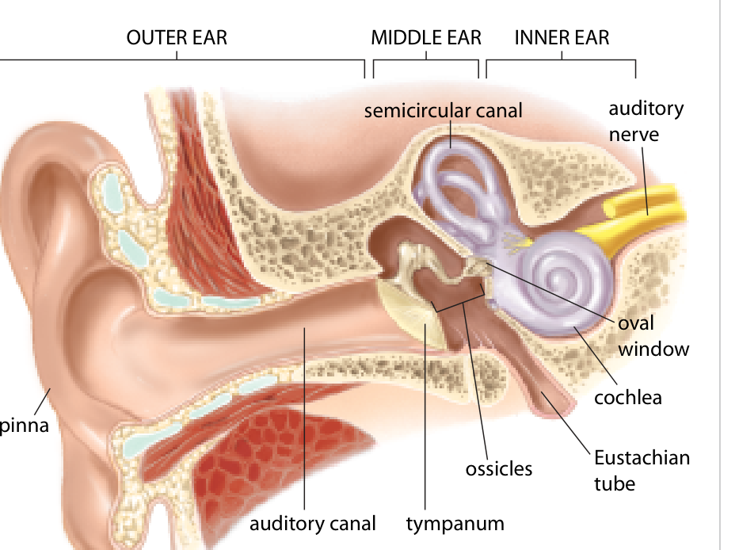
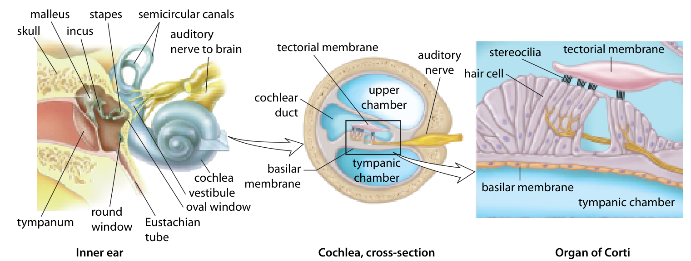

Learn · Chapter 12

# Ear structures and sound transmission

Where does a sound vibration become a neural message?

Learning goal

Trace sound through the outer, middle and inner ear and explain the role of hair cells in the organ of Corti.

Before you begin

Sound is a mechanical wave. Mechanoreceptors convert movement into changes that sensory neurons can signal.

**How to complete this lesson** — Learn → worked example → practise → lesson check

1.  **Learn the idea.** Start with the explanation below. Work through the example and practice before completing the lesson check.
2.  **Check the goal and starting reminder.** They identify what you should explain by the end.
3.  **Read the online lesson in order.** Follow the figures and worked example. Use a term popup or optional video when needed.
4.  **Open the required check and select Start.** Correct both selections to unlock the written explanations.
5.  **Save each written response, then Submit and finish.** Saving a draft alone does not finish the check. Completion stops the elapsed timer and records the run in All My Work.
6.  **Use optional practice as needed.** It does not increase required-check progress.

**Expected work:** two checked selections and two saved explanations in one completed required-check run.

Optional embedded reading

**Chapter 12 · pp. 419–421**

[Open at p. 419](#textbook-library)

**Key terms:** pinna · auditory canal · tympanum · ossicles · oval window

Vocabulary help

Key terms

## Words for this lesson

Use these definitions when you need help with a term.

pinna  
The visible outer-ear flap that helps collect and direct sound.

auditory canal  
The passage carrying sound toward the tympanum.

tympanum  
The eardrum, which vibrates in response to sound pressure.

ossicles  
The malleus, incus and stapes: three bones of the middle ear.

More vocabulary for this lesson

### Lesson vocabulary

oval window  
The membrane-covered opening where stapes movement transfers energy into inner-ear fluid.

cochlea  
The coiled inner-ear structure containing the hearing apparatus.

organ of Corti  
The sensory organ for hearing on the basilar membrane in the cochlea.

basilar membrane  
A cochlear membrane whose vibration moves the hearing apparatus.

Eustachian tube  
A passage linking the middle ear with the throat region to help equalize air pressure.

## Sound starts as a pressure wave

A vibrating object creates small changes in air pressure called sound waves. The pinna, the visible outside part of the ear, helps collect sound and direct it into the auditory canal.

**Outer, middle and inner ear**

View larger

Locate the air-filled middle ear and the fluid-filled inner ear before tracing the conducting structures.Inquiry into Biology, Chapter 12, p. 420. [View the embedded textbook page](#textbook-library)

The waves reach the tympanum, or eardrum, and make it vibrate. At this stage, the message is still mechanical movement. The eardrum has not turned the sound into an action potential.

## The middle ear passes on the vibration

The eardrum moves three small bones called the ossicles: the malleus, incus and stapes. These bones transmit and concentrate the vibration. The stapes pushes against the oval window, a membrane-covered opening into the inner ear.

The Eustachian tube connects the middle ear to the throat region. It helps equalize air pressure on the two sides of the eardrum so that the eardrum can move properly. It is not the pathway carrying sound information to the brain.

### Why a small contact can move the inner-ear fluid

The eardrum receives pressure over a larger area than the stapes footplate contacts at the oval window. The linked ossicles act as a lever system and transfer force to that smaller contact. Pressure is force per area, so concentrating the force contributes to greater pressure at the fluid boundary. This helps transfer an air-driven vibration into the fluid-filled inner ear. It is not the creation of extra energy or an action potential becoming bigger.

Locate those relationships in the ear figure: the broad tympanum separates the canal from the middle-ear space; the ossicle chain ends at the smaller oval window. The Eustachian tube branches from the middle-ear space toward the throat. It helps keep average air pressure on the two sides of the tympanum similar rather than providing another route to the receptors. A membrane held under an abnormal pressure difference cannot vibrate as freely.

## Hair cells convert movement into a signal

The cochlea is a coiled, fluid-filled structure in the inner ear. Movement at the oval window creates pressure waves in this fluid. These waves move the basilar membrane, which supports the organ of Corti, the sensory organ for hearing.

**Inside the cochlea**

View larger

Follow the magnification from the cochlea to the organ of Corti. Relative movement of the basilar and tectorial structures bends hair-cell projections.Inquiry into Biology, Chapter 12, p. 421. [View the embedded textbook page](#textbook-library)

The organ of Corti contains hair cells. Their tiny projections are called stereocilia. Movement of the basilar membrane relative to the nearby tectorial membrane bends these projections. Bending changes the hair cells’ electrical activity and neurotransmitter release to auditory nerve fibres.

The auditory nerve then carries action potentials toward brain regions involved in hearing, including the temporal lobe. The round window allows displacement as pressure waves move through the cochlear fluid. Keep the oval window, where vibration enters, separate from the round window.

### Follow magnification, then relative movement

The three panels in the cochlear figure change scale. The first locates the coiled cochlea and its windows. The arrow to the middle panel means “look inside this enlarged section,” not that fluid jumps between separate organs. The final panel enlarges the organ of Corti on the basilar membrane. Find the hair-cell bodies, their stereocilia and the nearby tectorial membrane. As the basilar membrane moves, these structures move relative to one another, bending the bundles; if the whole apparatus moved together without relative displacement, that picture alone would not explain bundle bending.

Fluid resists compression. When the stapes pushes inward at the oval window, the system needs a compliant boundary that can move as fluid is displaced. The round-window membrane supplies that movement; it is not an uncovered hole admitting air. Find it at the base of the cochlea in the left panel, not on the lower edge of the magnified cross-section.

### Names on the detailed cochlear view

If you use the detailed labeling view, connect its extra names to these same spaces. The upper chamber is the scala vestibuli and the lower tympanic chamber is the scala tympani; both contain perilymph. Between them is the cochlear duct, or scala media, containing endolymph and the organ of Corti. The basilar membrane forms the floor beneath the sensory apparatus. These names locate the spaces; they do not add a new sensory route or make the fluid itself a receptor.

## Track the change in the message

Follow the sequence in order: air-pressure waves → eardrum vibration → ossicle movement → oval-window movement → cochlear fluid movement → bending of hair-cell projections → auditory nerve signals.

1.  **Air pressure waves**Pinna and canal guide the input.
2.  **Membrane and bone vibration**Tympanum and ossicles transfer energy.
3.  **Fluid and membrane movement**Oval window and cochlea move.
4.  **Hair-cell transduction**Stereocilia bend; cell signalling changes.
5.  **Neural transmission**Sensory neurons carry action potentials.
6.  **Auditory processing**Brain pathways support sound perception.

The pinna, eardrum and ossicles help sound energy reach the receptors. The hair cells perform the sensory conversion, or transduction. The auditory nerve carries the resulting information. Sound waves themselves do not travel along the nerve.

Worked example

### Locate the first affected step

Fluid in the middle ear reduces how well the eardrum and ossicles move.

1.  The problem affects mechanical transmission before the receptors.
2.  Less vibration can reach the oval window and cochlear fluid.
3.  Hair-cell stimulation may be reduced even if the hair cells and auditory nerve are not damaged.

## Practise with support

### Movement becomes neural information

Follow the energy through the hearing pathway.

Immediately after the stapes moves the oval window, what happens?

- Choose an answer
- Light reaches the retina
- The auditory nerve carries sound waves
- Pressure waves move through cochlear fluid

Check answer

Which event performs the sensory conversion?

- Choose an answer
- Bending of hair-cell projections changes cell signalling
- The Eustachian tube equalizes pressure
- The pinna collects sound

Check answer

## Compare input failure with conversion failure

These are hypothetical pathway records, not diagnostic test results. The same sound input is supplied in both.

| Case | Given evidence                                                                                                         |
|------|------------------------------------------------------------------------------------------------------------------------|
| A    | Ossicle motion and subsequent cochlear motion are reduced. Hair cells can respond when suitable motion reaches them.   |
| B    | Suitable cochlear motion reaches the sensory apparatus, but damaged hair cells do not change their signaling normally. |

Identify the first stated limitation in each case and trace its consequence for auditory information. Explain why “the auditory nerve must be damaged” is not established by either record.

A hint if you need one

A weak later response can result from inadequate earlier input. Ask whether the evidence actually tests the nerve.

Compare your reasoning

In A, reduced mechanical conduction means less movement reaches otherwise responsive hair cells, so the receptor input can be reduced without receptor damage. In B, motion reaches the apparatus but the hair cells do not convert it normally into changes in signaling, so transduction is the stated limitation. Both can reduce useful information reaching the auditory nerve. Neither case establishes that nerve fibres are damaged; they may receive too little or abnormal receptor input. The evidence locates a limitation, but does not rule out every additional problem.

### Check your explanation

- Distinguishes conducting structures from sensory cells
- Traces a next-step consequence in both cases
- Does not infer nerve damage merely from reduced information

If you classified both cases as receptor damage, follow the explicit evidence in A: its hair cells can respond. The question concerns where the chain first fails, not simply whether the person hears poorly.

Stop and think

## Try this before opening the explanation

At what point does this route involve a sensory receptor rather than only a conducting structure?

Show the explanation

The hair cells of the organ of Corti transduce movement. The eardrum and ossicles conduct mechanical energy to them.

Optional video support

### Hearing: from sound to a signal

**As you watch:** Name the point where mechanical movement is converted into an electrical response.

Optional video. Internet access is required. The explanation below covers the idea without the video.

[Open on YouTube](https://www.youtube.com/watch?v=Ie2j7GpC4JU)

Load video

#### Read the explanation

The tympanum and ossicles conduct vibration. Fluid and basilar-membrane movement bend cochlear hair cells, which influence auditory neurons.

Optional video support

### The hearing pathway

**As you watch:** Follow the sequence from the outer ear into the cochlea.

Optional video. Internet access is required. The explanation below covers the idea without the video.

[Open on YouTube](https://www.youtube.com/watch?v=T8lKKlnnC6M)

Load video

#### Read the explanation

The pinna and auditory canal collect sound; the tympanum, ossicles and oval window transmit its energy toward cochlear fluid.

Open required check · Ear structures and sound transmission

## Explain what you have learned

This check counts toward chapter progress. Correct the 2 selections to unlock 2 written explanations. Saving writing records your response; it does not grade its accuracy.

Start

Redo this check

Not started

Required chapter check

Selection 1

### Which structure immediately transfers ossicle movement into the inner-ear fluid?

Oval window

Pinna

Eustachian tube

Optic disc

Check answer

Selection 2

### Where does hearing transduction occur?

At the outer surface of the sclera

In the pinna’s cartilage

Inside the Eustachian tube’s air

In hair cells of the cochlear sensory apparatus

Check answer

Answer the selections correctly to unlock the writing.

Written explanations

Written explanation 1

Trace sound energy from the pinna to auditory-nerve activity. State where mechanical movement becomes a neural signal.

Response area

Maximum 3200 characters. Explain the biology in your own words.

Save written response

Compare after saving your own response

Pinna → auditory canal → tympanum → malleus → incus → stapes → oval window → cochlear fluid and basilar-membrane movement → hair-cell bending → auditory sensory neurons. Hair cells transduce the movement and communicate with neurons that generate action potentials.

**Check your explanation for:**

- Ordered structures
- Mechanical stages distinguished
- Hair-cell transduction identified

Written explanation 2

Explain why the Eustachian tube is important even though it is not on the main route from the pinna to the organ of Corti.

Response area

Maximum 3200 characters. Explain the biology in your own words.

Save written response

Compare after saving your own response

The tube links the middle ear to the throat region and helps equalize air pressure across the tympanum. That supports normal membrane vibration rather than directly carrying sound to the cochlea.

**Check your explanation for:**

- Middle-ear pressure
- Throat connection
- Not the main conduction route

Submit and finish

Optional additional practice · Textbook comprehension questions on p. 421

This is optional additional practice. The question and any supporting pages are available here. It does not add to the required lesson checks.

Explain the role of the round window without calling it an opening that lets sound-filled air into the inner ear.

Response area

Optional response. Select Save response to collect it. Maximum 5000 characters.

Save response

Compare with a model after making your own attempt

The membrane can move as cochlear fluid is displaced, providing pressure relief. The inner ear is fluid-filled.

## One route and many different sounds

The conducting structures bring movement to hair cells, and hair cells change the information reaching auditory neurons. That gives us the route for hearing. The next question is how different patterns of sound produce different patterns within that same route.

[← Previous topic](#lesson-04)[Next: Pitch, loudness and hearing impairment →](#lesson-06)

## Reading the detailed cochlear diagram

Detailed cochlear chambers: L, scala vestibuli, is the upper vestibular canal; M, scala media, is the middle cochlear duct containing endolymph and the organ of Corti; R, scala tympani, is the lower tympanic canal. The upper and lower canals contain perilymph. The round window (S) is a membrane at the base of the cochlea that allows pressure displacement; it is not the lower wall of this enlarged cross-section.

[Optional textbook practice for Ear structures and sound transmission](#textbook-practice)

## Feedback for the supported questions

### Immediately after the stapes moves the oval window, what happens?

Hint: The inner ear is fluid-filled.

Answer: Pressure waves move through cochlear fluid

Oval-window movement creates fluid pressure waves in the cochlea.

### Which event performs the sensory conversion?

Hint: Choose the receptor event rather than a supporting structure.

Answer: Bending of hair-cell projections changes cell signalling

Hair cells transduce movement into changed electrical and chemical signalling, which affects auditory nerve fibres.

## Feedback for the required selections

### Which structure immediately transfers ossicle movement into the inner-ear fluid?

Hint: Follow the final ossicle.

Answer: Oval window

The stapes moves at the oval window, creating pressure changes in cochlear fluid.

### Where does hearing transduction occur?

Hint: Look for the receptor rather than a conducting structure.

Answer: In hair cells of the cochlear sensory apparatus

Hair-cell bending changes electrical activity and transmitter release to sensory neurons.
