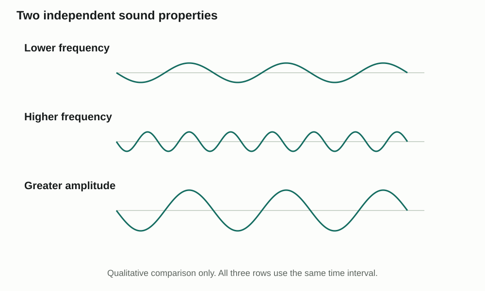
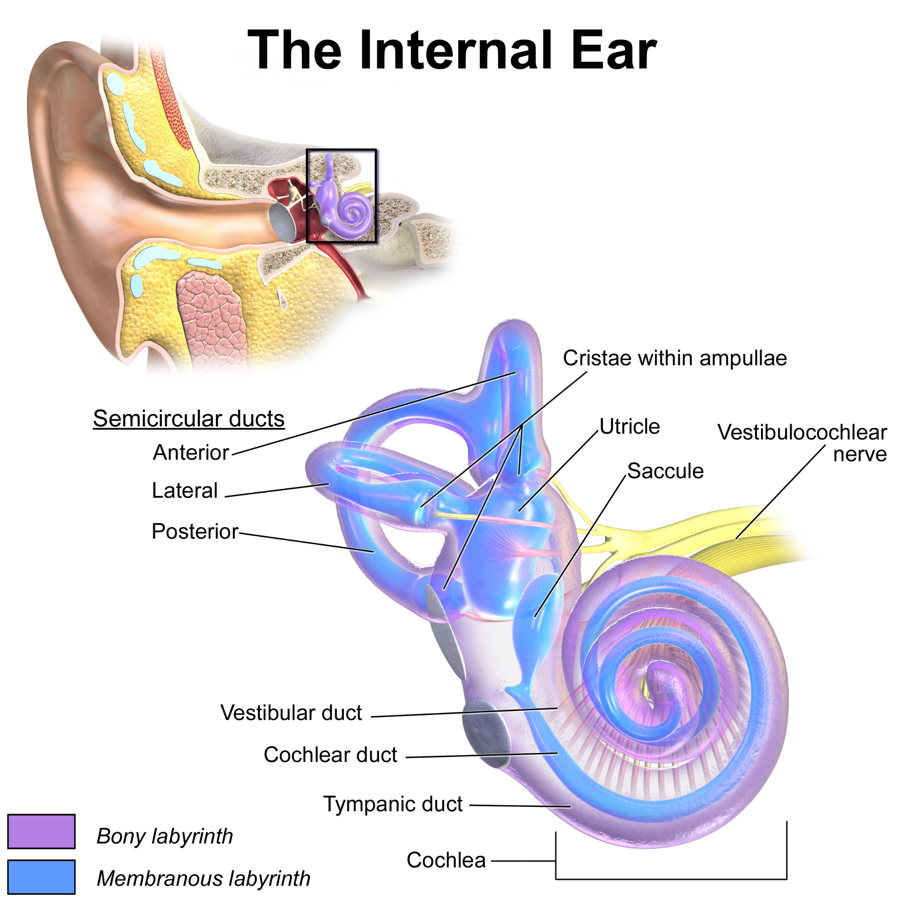

Learn · Chapter 12

# Pitch, loudness and hearing impairment

How can the same ear distinguish a quiet low note from a loud high note?

Learning goal

Distinguish frequency from amplitude, explain cochlear place coding, and connect hearing technologies to the step they support.

Before you begin

Hair cells respond to movement in the cochlea. Different parts of the hearing pathway can fail for different reasons.

**How to complete this lesson** — Learn → worked example → practise → lesson check

1.  **Learn the idea.** Start with the explanation below. Work through the example and practice before completing the lesson check.
2.  **Check the goal and starting reminder.** They identify what you should explain by the end.
3.  **Read the online lesson in order.** Follow the figures and worked example. Use a term popup or optional video when needed.
4.  **Open the required check and select Start.** Correct both selections to unlock the written explanations.
5.  **Save each written response, then Submit and finish.** Saving a draft alone does not finish the check. Completion stops the elapsed timer and records the run in All My Work.
6.  **Use optional practice as needed.** It does not increase required-check progress.

**Expected work:** two checked selections and two saved explanations in one completed required-check run.

Optional embedded reading

**Chapter 12 · pp. 421–424**

[Open at p. 421](#textbook-library)

**Key terms:** frequency · amplitude · pitch · conductive hearing loss · sensorineural hearing loss

Vocabulary help

Key terms

## Words for this lesson

Use these definitions when you need help with a term.

frequency  
The number of wave cycles per second, measured in hertz.

amplitude  
The size of a wave’s oscillation; in sound it relates to intensity.

pitch  
The perceptual quality associated mainly with sound frequency.

conductive hearing loss  
Hearing impairment involving reduced transmission through the outer or middle ear.

More vocabulary for this lesson

### Lesson vocabulary

sensorineural hearing loss  
Hearing impairment involving inner-ear sensory cells or neural pathways.

cochlear implant  
A device that can provide electrical stimulation to the auditory nerve in selected cases.

## Pitch and loudness are different

Frequency is the number of wave cycles each second. It is measured in hertz, or Hz. A higher frequency is usually heard as a higher pitch. A whistle and a low drum note differ in pitch.

**Frequency is not amplitude**

View larger

More cycles in the same time indicate higher frequency. A larger wave excursion indicates greater amplitude. These are illustrative waves, not recorded measurements.

Amplitude describes the size of the pressure change in a sound wave. A larger amplitude is usually heard as a louder sound. Turning up a recorded note can make it louder without changing its pitch. When comparing wave diagrams, check that they show the same time interval and use the same scale.

Read the horizontal direction in the wave picture as equal time intervals, and the vertical excursion from each middle line as pressure change on the same illustrative scale. Compare the first two rows for cycle spacing; compare the first and third for excursion. The drawing gives no numbered axes, so it supports a qualitative comparison rather than a measured frequency or sound level. Greater amplitude is associated with greater loudness, but equal amplitudes at different frequencies do not guarantee identical perceived loudness in a real listener.

When actual times are supplied, divide cycles by seconds. For the guided values below, 4 cycles ÷ 0.01 s = 400 cycles/s = 400 Hz; 8 cycles ÷ 0.01 s = 800 Hz. The same interval makes the second frequency twice the first. This arithmetic measures stimulus frequency. It does not say that an auditory neuron fires once for every cycle, or that 800 Hz is twice as loud as 400 Hz.

## Different pitches stimulate different places

Different parts of the basilar membrane respond most strongly to different frequencies. High-frequency sounds produce the greatest movement near the base of the cochlea, close to the oval window. Low-frequency sounds produce the greatest movement farther along, toward the apex.

Greater sound amplitude produces more movement and changes activity in auditory nerve fibres. A louder sound does not make each action potential taller. The nervous system uses patterns of firing and the number of active fibres to represent intensity.

### Locate the active place along the coil

Use the cochlear spiral at the lower right to locate the broad outer base and the inner tip of the coil. The image gives anatomical context; it does not show measured frequency responses.

Find the cochlea below the balance loops. Its broad basal end is near the entry from the middle ear; following the spiral inward brings you toward its tip, the apex. The basilar membrane extends along this coiled structure. “Near the base” and “near the apex” are positions along that membrane, not higher and lower points on the screen.

| Base near the oval window       | Farther along the membrane           | Apex at the far end            |
|---------------------------------|--------------------------------------|--------------------------------|
| Higher-frequency peak responses | Intermediate peak-response locations | Lower-frequency peak responses |

Read this location strip from entry toward the end of the cochlear coil

The membrane's mechanical properties vary along its length, so different sound frequencies produce their greatest motion at different places. Hair cells at the most strongly moving place change their input to the corresponding nerve fibres. The brain can use which pathways are active as information about frequency. This is place coding. The sound does not acquire its pitch because the nerve signal has a taller peak, and high and low tones do not require separate entrances to the ear.

## Locate the problem in the hearing pathway

| Problem location                     | What fails?                          | Relevant support                                                          |
|--------------------------------------|--------------------------------------|---------------------------------------------------------------------------|
| Outer or middle ear                  | Mechanical conduction to the cochlea | Treating the conduction problem; amplification may help.                  |
| Inner-ear hair cells                 | Transduction of movement             | Amplification may help some cases; it does not replace all lost function. |
| Selected severe inner-ear impairment | Usable hair-cell input is limited    | A cochlear implant may stimulate auditory nerve fibres electrically.      |

Conductive hearing loss results when sound is not transmitted effectively through the outer or middle ear. For example, a blockage in the auditory canal can reduce the movement reaching the eardrum.

Sensorineural hearing loss involves damage to hair cells, auditory nerve fibres or related neural pathways. The sound may reach the cochlea, but its conversion or transmission is affected. A cochlear implant can bypass damaged hair-cell transduction and stimulate auditory nerve fibres; it still needs a functioning neural pathway.

### Compare strengthening input with bypassing a step

Consider two simplified cases. In the first, surviving hair cells can still respond, but useful sound input is weak. Amplification increases the acoustic input, which can produce more effective movement and receptor stimulation. It uses the remaining transduction pathway; it does not regrow missing cells. That explains why amplification can help some sensorineural losses as well as some conduction problems.

In the second case, damaged receptor function gives little useful input while some auditory nerve fibres remain functional. A cochlear implant uses a microphone and processing system to convert sound information into electrical stimulation of those fibres. It changes how the pathway receives information by bypassing some hair-cell function. A nerve response still does not establish complete natural hearing: the remaining pathway, pattern of stimulation and learning to interpret that pattern all matter. These cases explain principles, not which device a real person should choose.

## Explain what the evidence actually shows

Compare two sound waves by asking two separate questions: Which has more cycles in the same time? Which has the larger amplitude? The answers tell you about pitch and loudness, respectively.

In a hearing case, identify the structure described as damaged before predicting the result. A blocked canal and damaged hair cells can both reduce hearing, but they affect different steps.

Use the provided diagrams and cases for these activities. Do not raise headphone volume or expose yourself to loud sounds to test hearing.

Worked example

### Separate a louder note from a higher note

A recorded tone becomes louder while its frequency stays constant.

1.  Frequency has not changed, so its pitch stays approximately the same.
2.  The larger pressure variation means the wave amplitude has increased.
3.  The nervous system represents the stronger input through activity patterns, not taller individual action potentials.

## Practise with support

### Compare two described waves

These are invented comparison values, not a hearing test: A has 4 cycles in 0.01 s; B has 8 cycles in 0.01 s. They have equal amplitudes.

Which sound has the higher pitch?

- Choose an answer
- A
- B
- They must have the same pitch

Check answer

What does equal amplitude support in this simplified comparison?

- Choose an answer
- B must be twice as loud
- Identical pitch regardless of frequency
- Similar loudness, not identical pitch

Check answer

## Use the location before choosing an explanation

In a hypothetical cochlear model, the region near the apex has damaged hair cells while basal hair cells remain responsive. Assume the outer and middle ear conduct sound normally and the remaining neural pathway functions. Tone X has a low frequency and tone Y a higher frequency. They are supplied at comparable, safe model input levels; no listening test is required.

Which tone is more likely to lose useful receptor information in this model? Trace the reason from frequency through peak-motion location to neural input. Would amplifying both tones prove that missing receptor function was restored?

A hint if you need one

Use the base-to-apex location strip. Distinguish a change in acoustic input from replacement of damaged cells.

Compare your reasoning

The low-frequency tone X is more likely to lose useful receptor information because its strongest basilar-membrane motion is toward the damaged apical region. Tone Y is associated more strongly with the responsive basal region in this simplified comparison. Amplification changes input strength; it does not restore absent hair cells. Surviving function could still contribute, so the case does not establish the exact degree of hearing or guarantee that no amplification could help. The prediction is tied to the stated regional damage, not a diagnosis from a tone alone.

### Check your explanation

- Connects low frequency with the apex
- Follows motion to receptor change to neural information
- Separates amplification from cell restoration
- Acknowledges surviving function and model limits

If you chose Y only because it is “higher,” locate high frequency anatomically. Higher pitch is associated with the basal region, not the screen position or the amount of damage.

Stop and think

## Try this before opening the explanation

Which cochlear region is more strongly associated with high frequencies: base near the oval window or apex farther away?

Show the explanation

The base near the oval window. Lower frequencies peak farther along toward the apex.

Optional video support

### Pitch and loudness

**As you watch:** Distinguish pitch from loudness using the stimulus rather than everyday labels.

Optional video. Internet access is required. The explanation below covers the idea without the video.

[Open on YouTube](https://www.youtube.com/watch?v=LkGOGzpbrCk)

Load video

#### Read the explanation

Pitch relates to frequency; loudness relates to intensity. Different basilar-membrane regions respond most strongly to different frequencies.

Optional video support

### Hearing loss and the sensory pathway

**As you watch:** Separate a sound-conduction problem from a receptor or neural problem.

Optional video. Internet access is required. The explanation below covers the idea without the video.

[Open on YouTube](https://www.youtube.com/watch?v=98-6WfdumZY)

Load video

#### Read the explanation

Conductive hearing impairment affects sound transmission in the outer or middle ear. Sensorineural impairment affects receptor or neural function.

Open required check · Pitch, loudness and hearing impairment

## Explain what you have learned

This check counts toward chapter progress. Correct the 2 selections to unlock 2 written explanations. Saving writing records your response; it does not grade its accuracy.

Start

Redo this check

Not started

Required chapter check

Selection 1

### The amplitude of a tone increases while its frequency stays constant. What should mainly change?

Pitch increases while loudness stays similar

Loudness increases while pitch stays similar

The sound becomes light

Pitch becomes zero

Check answer

Multiple choice

### High-frequency sounds most strongly stimulate which region of the cochlea?

The Eustachian tube’s throat opening

The pupil

The cochlear base near the oval window

The far apex only

Check answer

Answer the selections correctly to unlock the writing.

Written explanations

Written explanation 1

Explain why “high sound” is ambiguous. Use frequency, amplitude, pitch and loudness correctly in your answer.

Response area

Maximum 3200 characters. Explain the biology in your own words.

Save written response

Compare after saving your own response

High may refer to frequency and perceived pitch, or to amplitude and perceived loudness. A loud low-frequency sound is possible, so the two properties must be described separately.

**Check your explanation for:**

- Frequency and pitch linked
- Amplitude and loudness linked
- Independent variation explained

Written explanation 2

A case states that hair cells are badly damaged but some auditory nerve fibres still work. Explain the principle behind an implant without promising a guaranteed outcome.

Response area

Maximum 3200 characters. Explain the biology in your own words.

Save written response

Compare after saving your own response

An implant can bypass some damaged hair-cell function and stimulate remaining nerve fibres electrically. Useful perception depends on the remaining pathway and adaptation; it does not regrow hair cells or reproduce all natural hearing.

**Check your explanation for:**

- Bypasses receptor damage
- Requires functional neural pathway
- Limits acknowledged

Submit and finish

Optional additional practice · Textbook Investigation 12.B, pp. 422–423

This is optional additional practice. The question and any supporting pages are available here. It does not add to the required lesson checks.

Design a fair comparison of ability to distinguish two pitches. Name one variable to change and two to control. Do not perform a loudness test.

Response area

Optional response. Select Save response to collect it. Maximum 5000 characters.

Save response

Compare with a model after making your own attempt

Change frequency while controlling sound level and background noise. Use the same equipment and a teacher-approved safe protocol; device limitations affect interpretation.

## When hair cells report position

Frequency changes where the cochlea responds most strongly; amplitude changes the strength and pattern of the response. Nearby inner-ear hair cells serve a different purpose. We will now ask how rotation, straight-line acceleration and gravity bend those cells instead of producing hearing.

[← Previous topic](#lesson-05)[Next: Balance, body position and proprioception →](#lesson-07)

[Optional textbook practice for Pitch, loudness and hearing impairment](#textbook-practice)

## Feedback for the supported questions

### Which sound has the higher pitch?

Hint: Compare cycle counts over the same time.

Answer: B

B has more cycles in the same interval, so its frequency and expected pitch are higher.

### What does equal amplitude support in this simplified comparison?

Hint: Amplitude and frequency describe different wave properties.

Answer: Similar loudness, not identical pitch

Equal amplitudes support a similar-loudness comparison here. The cycle counts still differ, so pitch differs.

## Feedback for the required selections

### The amplitude of a tone increases while its frequency stays constant. What should mainly change?

Hint: Which property counts cycles per second?

Answer: Loudness increases while pitch stays similar

Amplitude and frequency are separate wave properties.

### High-frequency sounds most strongly stimulate which region of the cochlea?

Hint: Think of position along the basilar membrane.

Answer: The cochlear base near the oval window

The high-frequency end is closest to the oval window.
