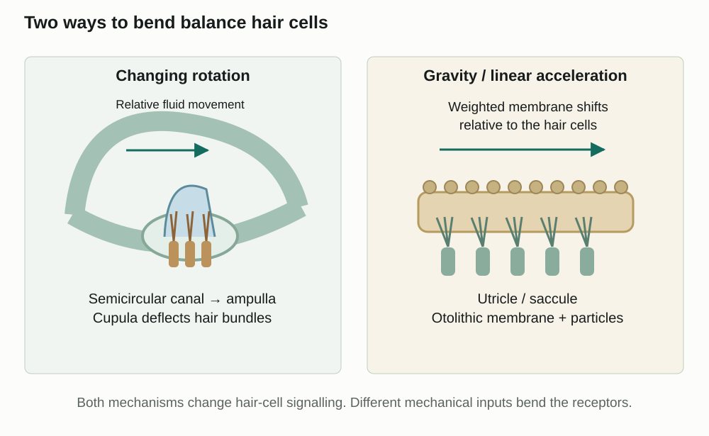

Learn · Chapter 12

# Balance, body position and proprioception

Why do turning, tilting and travelling in a lift stimulate different balance structures?

Learning goal

Compare semicircular canals with the utricle and saccule, then explain how vision and proprioception help maintain balance.

Before you begin

Inner-ear hair cells are mechanoreceptors. Their projections bend when surrounding structures move.

**How to complete this lesson** — Learn → worked example → practise → lesson check

1.  **Learn the idea.** Start with the explanation below. Work through the example and practice before completing the lesson check.
2.  **Check the goal and starting reminder.** They identify what you should explain by the end.
3.  **Read the online lesson in order.** Follow the figures and worked example. Use a term popup or optional video when needed.
4.  **Open the required check and select Start.** Correct both selections to unlock the written explanations.
5.  **Save each written response, then Submit and finish.** Saving a draft alone does not finish the check. Completion stops the elapsed timer and records the run in All My Work.
6.  **Use optional practice as needed.** It does not increase required-check progress.

**Expected work:** two checked selections and two saved explanations in one completed required-check run.

Optional embedded reading

**Chapter 12 · pp. 424–425**

[Open at p. 424](#textbook-library)

**Key terms:** semicircular canals · ampulla · cupula · utricle · saccule

Vocabulary help

Key terms

## Words for this lesson

Use these definitions when you need help with a term.

semicircular canals  
Three inner-ear loops that detect changes in rotational head movement.

ampulla  
The enlarged region of a semicircular canal containing its sensory apparatus.

cupula  
The gelatinous structure over hair cells in a semicircular-canal ampulla.

utricle  
An otolith organ responding to head position and linear acceleration, especially in the horizontal plane.

More vocabulary for this lesson

### Lesson vocabulary

saccule  
An otolith organ responding to head position and linear acceleration, especially vertically.

otoliths  
Small calcium-carbonate particles that weight the sensory membrane in the otolith organs.

proprioceptor  
A receptor providing information about body position and movement from muscles, tendons or joints.

## Balance receptors detect movement

The cochlea is used for hearing. Nearby vestibular structures provide information about head movement and position. Both systems use hair cells, but different movements bend their projections.

**Different balance mechanisms**

View larger

The canal cupula is distinct from the otolithic membrane containing calcium-carbonate particles. This is a comparison of mechanisms, not a dissection view.

When your head starts turning, the semicircular canals move with it. The fluid inside briefly lags behind. This relative movement bends a jelly-like structure called the cupula, which bends hair-cell projections and changes their signals.

The cupula sits in an enlarged region of a canal called the ampulla. The canals lie in different planes, allowing the system to detect changes in rotation in different directions. This contribution to balance is called rotational equilibrium.

### Compare the unbent and bent states

The left pair shows cupula deflection during rotation; the right pair shows the weighted otolithic membrane in different head positions. Read each upper state against the state immediately below it.

In the left pair, locate the tall transparent cupula around the bundle tips. The lower cupula leans relative to the hair-cell base; the bundles bend with it. It is the soft covering and bundles that deflect, not the entire bony loop folding. At the start of a turn, the canal walls move with the head while fluid initially lags relative to them. That difference in motion supplies the force on the cupula.

Now compare the right-hand pair. The small particles along the top add mass to a membrane lying over many hair cells. When the head tilts, gravity shifts that weighted layer relative to the cells below it. The lower drawing shows bent bundles, even though a head can subsequently be held in that tilted position. The particles belong to the otolithic membrane in this pair, not inside the cupula on the left.

## Why stopping can still feel like movement

When your head stops turning, the fluid may continue moving briefly relative to the canals. The cupula and hair-cell projections can still bend, so the brain may receive signals of movement after the turn has stopped.

The key is relative movement: movement of the fluid compared with the canal. The rigid bony canal does not have to bend to produce the signal. Use this described case to explain the mechanism; do not deliberately make yourself dizzy.

| Stage                    | Canal and fluid relationship                                           | Interpretation                                                                                  |
|--------------------------|------------------------------------------------------------------------|-------------------------------------------------------------------------------------------------|
| Turn begins              | The canal wall starts moving; fluid lags relative to it                | The cupula is deflected and bundle signaling changes                                            |
| Turn stops               | The canal wall stops; fluid can continue moving briefly relative to it | The cupula can be deflected in the opposite direction                                           |
| Relative motion subsides | The transient fluid-to-wall motion declines                            | The movement-related deflection declines; this does not mean all vestibular signaling is absent |

A described turn through time

The movement being sensed is a change in rotation. Do not use the canal signal as a simple speedometer for indefinite steady travel. Also distinguish a transient turn from a held tilt: gravity can continue to act on a weighted otolithic membrane while the head remains still in a particular orientation.

## Straight-line movement and gravity use a different structure

The utricle and saccule detect straight-line acceleration and head position relative to gravity. Their hair-cell projections contact a jelly-like otolithic membrane. Tiny calcium-carbonate particles, called otoliths or otoconia, add weight to the membrane.

Gravity or straight-line acceleration shifts this weighted membrane relative to the hair cells. Their projections bend and signalling changes. The utricle is especially sensitive to horizontal acceleration; the saccule is especially sensitive to vertical acceleration.

Keep the two mechanisms separate: fluid movement bends a cupula during changes in rotation; gravity or straight-line acceleration shifts a weighted otolithic membrane. Information about position relative to gravity contributes to gravitational equilibrium.

Acceleration is a change in velocity: speeding up, slowing down or changing direction. For a straight-line example, the beginning of an elevator's upward journey differs from its later steady-speed portion. In the beginning, upward acceleration adds a changing mechanical influence on the otolith organs. During steady upward motion, that extra acceleration is absent, although gravity still acts. “Moving upward” alone is therefore not a complete description of the relevant stimulus.

## The brain combines several sources of information

Balance also uses vision and proprioception. Proprioceptors in muscles, tendons and joints provide information about body position and movement. They help you know where a limb is without looking at it.

The brain combines these signals with vestibular information to adjust posture and coordinate movement. Removing one source of information does not remove all the others, but it leaves less information to compare.

All balance activities here use diagrams and described situations. No spinning, blindfolded standing or other physical balance test is required.

### Work through a disagreement between signals

Consider a hypothetical passenger who has just stopped turning. A stable view of the room and pressure through the feet indicate that the body is no longer turning relative to the floor. Meanwhile, residual fluid movement briefly deflects a canal cupula. Visual and body-position information therefore support one estimate, while vestibular input still carries a movement-related change. The brain must combine them; that mismatch can disturb the perceived estimate of motion. We have explained how disagreement can arise without claiming that every report of dizziness has this cause.

Proprioceptors report changes in muscle, tendon and joint conditions. They do not replace the eyes' view of the room, but they add information about where the body parts are. The sensory systems provide complementary evidence rather than identical copies. We use written situations here, not spinning or balance tests.

Worked example

### Classify straight-line acceleration

An elevator starts moving upward while a passenger keeps their head facing forward.

1.  The described change is vertical straight-line acceleration, not head rotation.
2.  The saccule is especially relevant. Acceleration shifts its weighted otolithic membrane relative to hair cells.
3.  Bending the hair-cell projections changes signalling about the movement.

## Practise with support

### Compare turning with moving straight

Use the structure that matches each kind of movement.

Your head starts turning to look over your shoulder. Which mechanism fits?

- Choose an answer
- A weighted membrane in the saccule detects a sound wave
- Fluid movement bends a cupula in a semicircular canal
- The cochlea detects head rotation

Check answer

A vehicle starts moving straight forward. Which structure is especially relevant?

- Choose an answer
- Utricle
- Cochlea
- Optic disc

Check answer

## Do the words moving and accelerating mean the same thing?

This is a hypothetical timeline. The passenger faces forward with the same head orientation throughout, and the elevator never rotates.

| Interval | Stated movement                                          |
|----------|----------------------------------------------------------|
| A        | The elevator increases its upward speed                  |
| B        | It continues upward at a steady speed in a straight line |
| C        | It slows while still travelling upward                   |

Compare the changing-motion stimulus in A, B and C. Which otolith organ is especially relevant? Explain why B does not imply that gravity or all vestibular signaling disappears, and why C need not involve head rotation.

A hint if you need one

A change in speed can be positive or negative while travel remains in the same direction. Keep acceleration separate from head orientation relative to gravity.

Compare your reasoning

A has upward acceleration because upward speed increases. B has no additional straight-line acceleration from a change of speed, although gravity continues to act on the weighted membrane. C has acceleration opposite the upward motion because speed decreases; it is still a straight-line change. The saccule is especially relevant to these vertical acceleration changes. None requires canal rotation, and absence of an extra acceleration in B is not absence of gravity or of all vestibular information.

### Check your explanation

- Identifies speed increase, steady speed and slowing separately
- Names the saccule for vertical acceleration
- Keeps gravity-related information in B
- Does not equate slowing with rotation

If you put all three intervals in one category because the elevator travels upward, look at what changes between moments. The direction of travel alone does not identify acceleration.

Stop and think

## Try this before opening the explanation

What distinguishes an otolithic membrane from a canal cupula?

Show the explanation

The otolithic membrane contains calcium-carbonate particles that add mass and support detection of gravity and linear acceleration. A semicircular-canal cupula responds to relative fluid movement during rotation.

Optional video support

### Balance and head movement

**As you watch:** Compare the stimulus for semicircular canals with the stimulus for the utricle and saccule.

Optional video. Internet access is required. The explanation below covers the idea without the video.

[Open on YouTube](https://www.youtube.com/watch?v=ryGMI3SpxCE)

Load video

#### Read the explanation

Semicircular canals respond to changes in rotation. Weighted otolithic membranes in the utricle and saccule respond to linear acceleration and head tilt.

Open required check · Balance, body position and proprioception

## Explain what you have learned

This check counts toward chapter progress. Correct the 2 selections to unlock 2 written explanations. Saving writing records your response; it does not grade its accuracy.

Start

Redo this check

Not started

Required chapter check

Selection 1

### Which structure is most directly associated with detecting a change in head rotation?

Cochlear organ of Corti

Lens

Thyroid gland

Semicircular canals

Check answer

Selection 2

### A lift begins moving upward. Which structure is particularly relevant?

Pinna

Fovea

Anterior pituitary

Saccule

Check answer

Answer the selections correctly to unlock the writing.

Written explanations

Written explanation 1

Compare the mechanism for a change in rotation with the mechanism for linear acceleration. Include the receptor, surrounding structure and source of movement.

Response area

Maximum 3200 characters. Explain the biology in your own words.

Save written response

Compare after saving your own response

Rotation changes relative canal-fluid movement and deflects the cupula, bending hair cells. Linear acceleration shifts a weighted otolithic membrane in the utricle or saccule relative to hair cells. Both mechanisms alter sensory signalling.

**Check your explanation for:**

- Canal/cupula mechanism
- Otolith-organ membrane mechanism
- Hair-cell bending in both

Written explanation 2

Explain why balance can become less reliable when visual information disagrees with vestibular information.

Response area

Maximum 3200 characters. Explain the biology in your own words.

Save written response

Compare after saving your own response

The brain normally combines vision, vestibular signals and proprioception. Conflicting signals make its estimate of motion and position less consistent, which can disturb perceived balance.

**Check your explanation for:**

- Multiple sensory sources
- Integration by the brain
- Conflict linked to perception

Submit and finish

Optional additional practice · Textbook Fig. 12.24, p. 425

This is optional additional practice. The question and any supporting pages are available here. It does not add to the required lesson checks.

Compare a head turn, a head tilt held in place, and acceleration forward. Which structures provide the most relevant information?

Response area

Optional response. Select Save response to collect it. Maximum 5000 characters.

Save response

Compare with a model after making your own attempt

A changing turn involves the semicircular canals. Sustained tilt and forward acceleration involve the otolith organs; the utricle is especially relevant to horizontal acceleration.

## Adding chemical and contact information

The body combines changing-motion signals, gravity-related information, vision and proprioception to estimate position. Other sensory systems add chemical identity and the detailed pattern of contact with the surroundings. Their receptors face a similar challenge: which features of a stimulus can their signals distinguish?

[← Previous topic](#lesson-06)[Next: Taste, smell, touch and temperature →](#lesson-08)

[Optional textbook practice for Balance, body position and proprioception](#textbook-practice)

## Feedback for the supported questions

### Your head starts turning to look over your shoulder. Which mechanism fits?

Hint: The change is rotation.

Answer: Fluid movement bends a cupula in a semicircular canal

Relative fluid movement in a semicircular canal bends the cupula and hair-cell projections.

### A vehicle starts moving straight forward. Which structure is especially relevant?

Hint: Horizontal acceleration differs from a turn.

Answer: Utricle

The utricle helps detect horizontal linear acceleration through movement of its weighted otolithic membrane.

## Feedback for the required selections

### Which structure is most directly associated with detecting a change in head rotation?

Hint: Separate rotation from straight-line movement.

Answer: Semicircular canals

Rotational changes deflect the canal cupula through relative fluid movement.

### A lift begins moving upward. Which structure is particularly relevant?

Hint: Identify the plane and type of movement.

Answer: Saccule

The saccule contributes strongly to detection of vertical linear acceleration.
