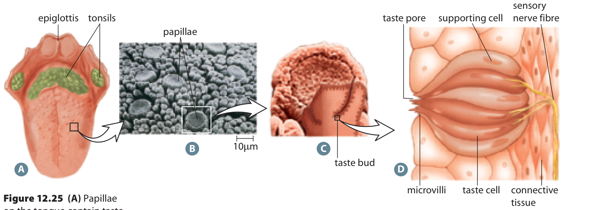
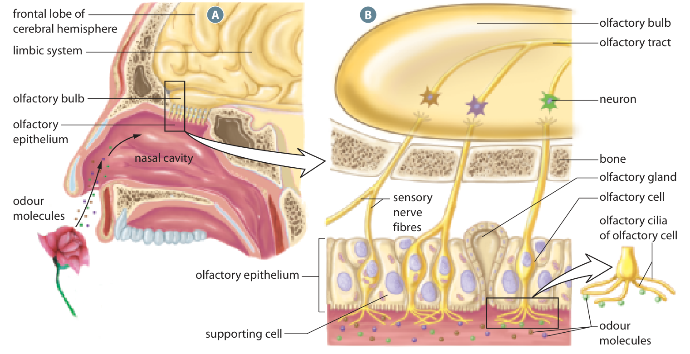

Learn · Chapter 12

# Taste, smell, touch and temperature

How do the remaining senses combine to describe your surroundings?

Learning goal

Explain taste and olfactory transduction in general terms, connect receptor distribution to touch discrimination, and plan a fair sensory investigation.

Before you begin

A receptor responds to a stimulus; the brain interprets its message. One experience can combine several sensory systems.

**How to complete this lesson** — Learn → worked example → practise → lesson check

1.  **Learn the idea.** Start with the explanation below. Work through the example and practice before completing the lesson check.
2.  **Check the goal and starting reminder.** They identify what you should explain by the end.
3.  **Read the online lesson in order.** Follow the figures and worked example. Use a term popup or optional video when needed.
4.  **Open the required check and select Start.** Correct both selections to unlock the written explanations.
5.  **Save each written response, then Submit and finish.** Saving a draft alone does not finish the check. Completion stops the elapsed timer and records the run in All My Work.
6.  **Use optional practice as needed.** It does not increase required-check progress.

**Expected work:** two checked selections and two saved explanations in one completed required-check run.

Optional embedded reading

**Chapter 12 · pp. 425–429**

[Open at p. 425](#textbook-library)

**Key terms:** taste bud · umami · olfactory receptor · olfactory bulb · receptive field

Vocabulary help

Key terms

## Words for this lesson

Use these definitions when you need help with a term.

taste bud  
A structure containing taste receptor cells.

umami  
A basic taste associated with glutamate and related savoury compounds.

olfactory receptor  
A sensory receptor in the nasal region that responds to odour molecules.

olfactory bulb  
A brain structure receiving early olfactory input from receptor neurons.

More vocabulary for this lesson

### Lesson vocabulary

receptive field  
The region where stimulation can influence the activity of a particular sensory neuron.

nociceptor  
A sensory receptor responding to potentially damaging conditions.

## Taste begins with dissolved chemicals

Chemicals from food dissolve in saliva and reach receptor cells in taste buds. These chemoreceptors change their signalling when stimulated. Sensory pathways carry the information to the brain, where taste is experienced.

**From tongue surface to taste receptor cells**

View larger

Taste buds contain receptor cells that respond to dissolved chemicals. They are not exclusive sweet, sour, salty, bitter or umami regions.Inquiry into Biology, Chapter 12, p. 426. [View the embedded textbook page](#textbook-library)

The five basic tastes are sweet, sour, salty, bitter and umami. Receptors for different tastes are distributed across the tongue. The tongue is not divided into separate regions that can each detect only one taste.

### Move from a surface bump to the responding cell

Read the taste figure from left to right. The tongue view locates the surface; the next images enlarge the papillae, the bumps that contain taste buds. The final drawing shows several elongated cells inside a taste bud. Locate the taste pore at the exposed side and the microvilli projecting toward it. Dissolved chemicals reach these receptor-cell surfaces; a whole papilla is not one receptor cell, and a taste bud is not one sensory neuron.

At the other side of the taste cells, locate the sensory nerve fibre. Receptor-cell stimulation changes communication to sensory neurons, which carry information into taste pathways in the brain. This connects chemical contact to neural signaling without implying that dissolved food travels down the nerve. Taste information passes through brainstem and thalamic pathways before cortical processing; detailed clinical localization is not needed to explain the basic conversion.

## Smell adds to flavour

Odour molecules enter the nose, dissolve in mucus and reach olfactory receptors. These receptors respond to particular chemicals. Their neurons send signals to the olfactory bulb and then to other brain regions involved in smell.

**The olfactory sensory region**

View larger

Odour molecules reach receptors in the nasal region; their neurons send input toward the olfactory bulb.Inquiry into Biology, Chapter 12, p. 427. [View the embedded textbook page](#textbook-library)

Taste and smell both use chemoreceptors, but they begin in different places. Flavour combines taste with smell, texture and temperature. A person may still detect sweetness while reduced smell makes a familiar food seem less flavourful.

A lock-and-key comparison can help you remember that receptors respond to particular molecules. A smell can involve a combination of active receptors, rather than one separate receptor for every possible odour.

In the smell figure, first find the olfactory epithelium high in the nasal cavity. Epithelium means a lining tissue. The enlarged view shows receptor neurons with cilia extending toward the mucus and odour molecules. Follow their fibres through the bone toward the olfactory bulb above. The drawing's colours separate example inputs and pathways; they are not actual odour colours or proof that each whole smell has only one receptor type. The two senses share chemical detection, while their starting cells, locations and early pathways differ.

## Why are fingertips more precise than your back?

Touch receptors are not spread evenly through the skin. Fingertips and lips provide more detailed touch information than many areas of the back. Receptor density and the size of receptive fields help explain this difference.

A receptive field is the area where a stimulus can affect a particular sensory neuron. Smaller fields make it easier to distinguish nearby points of contact. Receptor number, receptive fields and brain processing all contribute to touch precision.

Thermoreceptors detect temperature changes. Nociceptors respond to potentially damaging conditions, including strong mechanical forces, extreme temperatures and some chemicals. Pain is not simply another name for pressure.

### Make receptive-field size visible

The table is an intentionally simplified spatial model, not a map of a real person's skin. Positions 1 to 8 are equally spaced locations along a strip of skin. A repeated letter means stimulation at those positions feeds the same modeled sensory channel. Different letters mean separate channels. Real fields can overlap, and the brain also processes their activity; the table isolates only the effect of field size.

| Arrangement and position | 1   | 2   | 3   | 4   | 5   | 6   | 7   | 8   |
|--------------------------|-----|-----|-----|-----|-----|-----|-----|-----|
| Broader fields           | A   | A   | A   | A   | B   | B   | B   | B   |
| Smaller fields           | C   | C   | D   | D   | E   | E   | F   | F   |

The same skin positions under two field arrangements

Work through two contacts at positions 2 and 3. In the broader-field row, both influence A. The channel identity alone does not separate their locations. In the smaller-field row, position 2 influences C and position 3 influences D. Two spatially distinct channel identities now give the nervous system more information for distinguishing the contacts. This is why field size helps explain precision; it is not proof that every pair within a real field must always feel like one point.

The same reasoning warns against counting receptors alone. Many receptors whose information is heavily combined need not provide the same spatial precision as more separately represented inputs. Field arrangement and brain processing matter alongside density. Nor does better discrimination require taller action potentials.

## Plan a fair comparison

A testable question identifies what you will compare and what you will measure. For example: does the smallest separation reported as two contacts differ between a fingertip and the forearm?

The manipulated variable is what you deliberately change: the body region. The responding variable is what you measure: the smallest separation reported as two contacts. Controlled variables are conditions kept the same, such as contact method, pressure and reporting instructions. Repeated trials help reveal inconsistent results.

A prediction states what you expect before observations. A result states what was actually observed. In this activity, you will plan a comparison, not perform a physical test or invent results. No sharp objects, extreme temperatures, tasting or exposure to unknown substances is required.

### Make sure the result actually tests discrimination

Keeping pressure constant is important, but a fair plan must also prevent the answer from being obvious for another reason. If every trial uses two contacts, someone can always answer “two” without distinguishing them. A written design can mix one-contact and two-contact trials in an unpredictable order and record both kinds of responses. Instructions and response criteria should be the same across compared regions. These are planning ideas; do not perform the procedure here.

Suppose a hypothetical record shows perfect reports of “two” on two-contact trials, but the same person also says “two” on most one-contact trials. The apparent success on the first group cannot establish precise discrimination. The other group exposes a response pattern compatible with guessing or expectation. Repeating the same biased design many times would make the pattern more consistent without removing the bias. This is why evidence quality concerns how results were obtained as well as how many results exist.

Worked example

### Model a complete investigation plan

Plan only: compare touch discrimination on a fingertip and the forearm. Do not perform the test.

1.  Question: Does the smallest separation reported as two contacts differ between these body regions?
2.  Prediction: The fingertip will distinguish closer contacts because its sensory representation is generally more precise.
3.  Manipulated variable: body region. Responding variable: the smallest separation reported as two contacts, measured in millimetres.
4.  Controls: use the same contact method, pressure, contact duration and instructions. Plan repeated trials with the same participant and more than one participant before making broad conclusions.
5.  Safety and evidence: this is a written plan only. No physical testing or sharp objects are required. A completed data table would need real observations; a prediction is not a result.

## Practise with support

### Complete part of a second plan

A written plan compares the palm with the forearm. The question concerns the smallest separation reported as two contacts.

What is the manipulated variable?

- Choose an answer
- Smallest reported separation
- Whether the prediction is correct
- Body region

Check answer

The plan changes both body region and contact pressure. What needs fixing?

- Choose an answer
- Change the pressure even more
- Keep pressure consistent so the region comparison is fair
- Record the prediction as the result

Check answer

## Does a high success count settle the question?

These invented records illustrate a design issue. Each trial allows only one of two responses, “one” or “two”; no other response is possible. They are not actual measurements and no physical test should be carried out.

| Supplied trial type | Number of trials | Correct reports   |
|---------------------|------------------|-------------------|
| One contact         | 20               | 3 reports of one  |
| Two nearby contacts | 20               | 18 reports of two |

A researcher claims that 18 correct reports prove very fine spatial discrimination.

Evaluate the claim using both rows. Explain a plausible alternative to excellent discrimination, and identify what a better record would need to establish before you attributed the result to receptive-field size.

A hint if you need one

If only 3 of the one-contact trials were reported correctly, what was reported on the other 17? Does the participant tend to give the same response?

Compare your reasoning

On 17 of 20 one-contact trials the report was incorrect. Together with 18 reports of two on two-contact trials, this suggests a tendency to answer “two,” which could explain the apparent success without accurate discrimination. The record does not prove the reason for that tendency, but it defeats the claim that the two-contact row alone establishes fine precision. A better record needs reliable distinction across both trial types, clear separation distances and consistent procedures, with repeated observations. Even then, performance alone would not measure receptive-field size directly; receptor organization and processing are possible contributors.

### Check your explanation

- Uses both 3/20 and 18/20 rather than selecting one row
- Offers a response tendency as an alternative, not a proven diagnosis
- Specifies the missing evidence for a discrimination claim
- Avoids treating behavior as a direct receptor-size measurement

If you counted only correct two-contact trials, the one-contact condition is the recovery check. It asks whether the same answer is being given even when two contacts are absent.

### Stop and think

Why should a comparison of two body regions keep contact pressure consistent?

Compare your explanation

Changing pressure and body region together makes it unclear which change caused the result. Keeping pressure consistent makes the comparison fairer.

Open required check · Taste, smell, touch and temperature

## Explain what you have learned

This check counts toward chapter progress. Correct the 2 selections to unlock 2 written explanations. Saving writing records your response; it does not grade its accuracy.

Start

Redo this check

Not started

Required chapter check

Selection 1

### Why does food need to dissolve in saliva for taste detection?

The tongue contains only photoreceptors

Dissolved chemicals can interact with taste receptor cells

Saliva sends light to the fovea

Saliva converts every taste into sound

Check answer

Selection 2

### Which explanation best links dense touch representation to precise discrimination?

Larger action potentials always give finer detail

Small receptive fields and neural representation help separate nearby contacts

Every body region has identical receptor density

The back has no sensory receptors

Check answer

Answer the selections correctly to unlock the writing.

Written explanations

Written explanation 1

Explain how taste and smell both use chemoreception but start at different structures. Then connect them to flavour.

Response area

Maximum 3200 characters. Explain the biology in your own words.

Save written response

Compare after saving your own response

Dissolved food chemicals stimulate taste receptor cells in taste buds. Odour molecules stimulate olfactory receptors and signals reach the olfactory bulb. The brain combines these inputs with texture and temperature to produce flavour perception.

**Check your explanation for:**

- Taste stimulus and structure
- Olfactory stimulus and structure
- Integration into flavour

Written explanation 2

Plan, but do not perform, a fair touch-discrimination investigation. Include a question, prediction, changed variable, measured response, two controls and one safety requirement.

Response area

Maximum 3200 characters. Explain the biology in your own words.

Save written response

Compare after saving your own response

Question: does touch discrimination differ by body region? Prediction: fingertips permit finer discrimination. Change region; measure correct discrimination using a teacher-approved method. Control contact pressure and instructions; repeat trials. Use only approved safe blunt materials under supervision, and do not invent results.

**Check your explanation for:**

- Testable question and prediction
- Changed and measured variables
- Controls, repeated trials and safety

Submit and finish

Optional additional practice · Textbook Section 12.3 review, p. 429

This is optional additional practice. The question and any supporting pages are available here. It does not add to the required lesson checks.

Explain why the texture, temperature and smell of a food can matter even when its sugar concentration does not change.

Response area

Optional response. Select Save response to collect it. Maximum 5000 characters.

Save response

Compare with a model after making your own attempt

Flavour is an integrated perception. Non-taste sensory information can change the experience while sweetness remains similar.

## From touch to evidence

Different receptor systems contribute different kinds of information to one experience. A good explanation follows the mechanism, while a good investigation separates what was measured from what is merely predicted. The chapter review will bring those two habits together: locate the affected step and limit the conclusion to the evidence.

[← Previous topic](#lesson-07)[Next: Chapter review and final check →](#lesson-09)

[Optional textbook practice for Taste, smell, touch and temperature](#textbook-practice)

## Feedback for the supported questions

### What is the manipulated variable?

Hint: Identify what the plan deliberately changes.

Answer: Body region

The plan changes which body region is considered. The smallest reported separation is the measured response.

### The plan changes both body region and contact pressure. What needs fixing?

Hint: More than one changing factor makes the result harder to explain.

Answer: Keep pressure consistent so the region comparison is fair

Keeping pressure consistent helps isolate the effect of body region. Repeated trials can then help assess consistency.

## Feedback for the required selections

### Why does food need to dissolve in saliva for taste detection?

Hint: Identify the kind of receptor.

Answer: Dissolved chemicals can interact with taste receptor cells

Taste is chemoreception: substances must reach receptor cells in a usable form.

### Which explanation best links dense touch representation to precise discrimination?

Hint: Avoid explaining acuity only with impulse height.

Answer: Small receptive fields and neural representation help separate nearby contacts

Touch precision depends on receptor distribution, receptive fields and processing.
