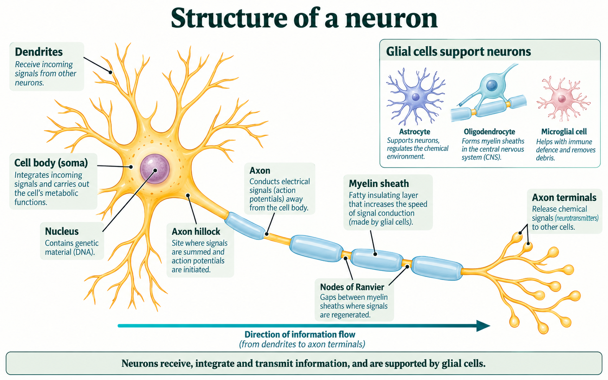
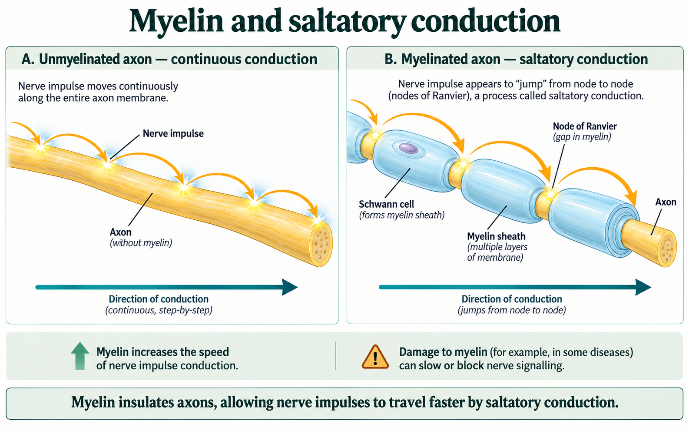

# Neurons and myelin

## One cell can communicate over a long distance

A command that helps move a foot may need to travel a long way from the spinal cord to the muscle. How can a living cell receive information at one region and pass it on at another, distant region?

A neuron has specialized structures for receiving, conducting and transmitting information. We will start with a typical multipolar neuron, which has many branches near its cell body. Other neurons have different shapes, so learn what each structure contributes rather than assuming every neuron looks exactly like this one.

Look at the branching region on the left of the drawing. Follow the cell into the long extension and continue to the smaller branches at the far right. The arrow below the cell shows the usual direction of information flow in this example.

## Connect each structure with its job

**Dendrites** are branching extensions that usually receive information. Their many branches provide a large surface over which the cell can receive inputs. Information arriving at these regions can influence what happens nearer the cell body.

The **cell body**, also called the **soma**, contains the nucleus and most of the cell's organelles. It carries out the cell's life processes and helps process incoming information. A neuron remains a living cell even when we draw it as part of a signalling pathway.

The **axon** is the extension that conducts impulses toward the transmitting end. Some axons extend more than a metre. A long axon allows one cell to carry information to a distant region instead of requiring a new cell at every small step along that distance.

The **axon hillock** is the region where the cell body narrows toward the axon. In this drawing, the nearby starting region connects the combined effects of incoming information with whether an impulse begins in the axon. We will return to that decision when we study how inputs combine.

An **action potential** is a brief, all-or-none change in the voltage across the axon membrane. Voltage here compares the electrical state inside the cell with the state outside. An active region can bring the neighbouring membrane to the point where another action potential begins. Repeated regeneration carries the signal along the axon. We will explain the ions and membrane channels that make this possible after we have established the pathway.

At the far end, **axon terminals** communicate with another neuron or an effector. At a chemical **synapse**, the terminal releases a chemical messenger that affects the receiving cell. The small gap between the cells is the **synaptic cleft**. The full synapse includes the sending region, gap and receiving region; it is more than an empty space.

Return to the figure. Find a dendrite, the cell body, the continuous axon and an axon terminal. For each, say what would be missing from the pathway if that structure could not perform its job. This turns a label into an explanation of structure and function.

## Myelin changes how the signal travels

Many axons have a fatty insulating covering called the **myelin sheath**. The covering reduces current loss through the wrapped membrane and allows electrical change to spread rapidly between exposed regions. The gaps between myelin segments are **nodes of Ranvier**.

Read the two panels below as a comparison of the conducting pattern. In the left panel, follow successive neighbouring regions of an unmyelinated axon. In the right panel, follow the yellow axon underneath the blue coverings, then locate the exposed nodes between those coverings.

In the unmyelinated axon, successive neighbouring membrane regions regenerate the impulse. In the myelinated axon, action potentials are regenerated at the nodes, while the electrical change spreads beneath the myelin between them. This is **saltatory conduction**, often described as a signal “jumping” from node to node.

The jumping description refers to where the action potentials are regenerated. The axon has not been cut into pieces, and the signal does not cross empty space from one disconnected cell fragment to another. The yellow axon continues through each blue myelin segment in the drawing.

Under comparable conditions, this pattern allows a myelinated axon to conduct faster than an unmyelinated one. Faster signalling concerns the time needed to carry information along the axon. It does not mean that the myelin itself is an action potential or that adding more myelin makes each individual action potential taller.

## Which cells make the covering?

Myelin is made by glial cells. In the PNS, **Schwann cells** form the myelin around axon segments. In the CNS, **oligodendrocytes** make myelin. The wrapped cells shown in the conduction comparison are a peripheral example. Do not transfer the Schwann-cell label to every myelinated axon in the brain.

Many myelinated axons together contribute to the pale appearance of **white matter**. Grey matter contains many cell bodies, dendrites, synapses and unmyelinated parts of axons. We will use brain and spinal-cord cross-sections later to locate these tissues. The important point here is that myelin is a covering on axons, not a name for an entirely different kind of cell that performs every nervous-system job.

Damage to myelin can slow or disrupt signalling. In multiple sclerosis, damage to CNS myelin can affect communication along involved pathways. The consequences depend on which pathways are affected, so problems with sensation, movement or coordination can differ. Use the structure-function connection rather than treating the name of a disorder as a complete explanation of every symptom.

## Work through two different failures

Suppose a simplified pathway has one neuron passing information to a second cell. In the intact pathway, an impulse travels along the axon, reaches a terminal and is followed by a chemical message to the receiving cell.

Now compare two hypothetical changes:

| Change | What the record says still works |
|---|---|
| Myelin is damaged along part of the axon | The axon is continuous, but conduction along that region is slower or disrupted |
| Terminal release fails | The impulse reaches the terminal, but the chemical message is not released there |

The first change concerns conduction along the axon. The covering no longer supports the normal fast pattern in that region. If an impulse is delayed or fails to continue, the message cannot reach the far end normally.

The second change is at the handover to another cell. The record specifically says the impulse reaches the terminal, so failure to reach that point is not the explanation. The missing event is chemical release. The receiving cell can miss the message even though conduction along the first axon occurred.

Both changes can disrupt the overall response, but they interrupt different jobs. Locate the changed structure, identify its normal function, then connect the missing function with the observed result. Avoid beginning with a vague conclusion such as “the neuron does not work.”

### Explain a drawing error

A student's diagram notes are shown below. Use the actual myelin comparison to evaluate them.

| Student's note | Your task |
|---|---|
| “At each node, the axon ends. The impulse crosses the empty gap to the next axon piece.” | Identify the incorrect structural claim and replace it with the correct relationship |
| “The blue covering is the electrical signal.” | Explain what the covering is and where the signal is regenerated |

Save a correction that explains the biology, then open the comparison.

**Hint:** follow the yellow structure through a blue segment. Then identify what is absent at a node: the axon or its insulating covering?

**Model correction:** the axon is continuous. A node is an exposed region between myelin segments, not a cut between separate axon pieces. Electrical change spreads along the axon beneath the covering, and an action potential is regenerated at the next node. The blue region represents myelin made by a glial cell. It supports the conduction pattern but is not itself the electrical signal.

**Check your explanation:** name the continuous structure, identify the gap correctly, and explain regeneration rather than repeating the word “jump.”

### Decide whether a proposed repair addresses the problem

Use these hypothetical records. No disease diagnosis is required.

| Record | Problem | Proposed change |
|---|---|---|
| A | A neuron receives an adequate input, but its impulse is disrupted along a region with damaged myelin | Give the receiving region more dendritic branches |
| B | The impulse reaches the terminal normally, but the terminal does not release its chemical message | Increase the amount of myelin on the already functioning axon |

Would either proposed change directly repair the stated missing function? Explain each answer using the location and job of the relevant structures. Save your first explanation before comparing it with the model.

**Hint:** identify the confirmed working stage first. A change to that stage does not automatically repair a different stage farther along the pathway.

**Model explanation:** more dendritic branches would change the receiving surface in record A. The record already supplies adequate input and identifies disrupted axonal conduction, so extra branches do not directly repair the damaged insulation. More myelin in record B addresses conduction along an axon that already carries the impulse to the terminal. It does not directly restore the missing release step. These are predictions within the stated models, not a claim that one repair procedure is appropriate for an actual person.

**Check your explanation:** distinguish receiving, conduction and transmission to another cell; use the information about what still works; and explain why each proposed change targets the wrong job.

## From one neuron to a pathway

You can now trace information through a typical neuron and explain why its structures matter. Dendrites provide receiving regions, the cell body maintains the cell and helps integrate inputs, the axon conducts information, and terminals pass it to another cell. Myelin supports faster conduction while leaving a continuous axon beneath the covering.

A response usually depends on a connected pathway of cells. Next, we will follow information from a receptor toward the CNS and back to an effector, and examine why a withdrawal movement can begin before conscious awareness of the stimulus.
