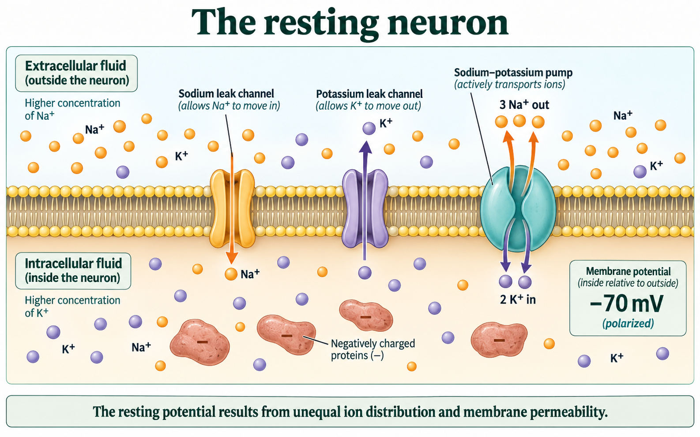

# The resting neuron

## A neuron can be ready without firing

A neuron can remain quiet and still be ready to carry a signal. Its membrane separates two solutions containing charged particles. The conditions on the two sides are different. How can that difference prepare the neuron for an action potential?

An **ion** is an atom or group of atoms with an electrical charge. Sodium ions, Na⁺, and potassium ions, K⁺, each carry one positive charge. The superscript plus sign describes charge; it does not mean that sodium and potassium are the same substance. Current in a metal wire involves electrons moving through the conductor. Neural propagation depends on ions moving across the axon membrane and repeated regeneration along living membrane. Both involve moving charge, but the charge carriers and signalling mechanisms differ. The axon membrane separates the fluid inside the neuron from the extracellular fluid outside it.

**Membrane potential** is the voltage inside a cell relative to the voltage outside. Imagine one tiny measuring electrode inside an axon and a reference electrode outside. A meter compares their readings. If the outside reference is treated as 0 mV and the meter reads −70 mV, the inside is 70 millivolts more negative than the outside. A millivolt is one thousandth of a volt. The reading is a difference between two places, not a count of the ions in one place.

**Reading the same inside-minus-outside measurement**

| Outside reference | Inside reading | Meaning |
| --- | --- | --- |
| 0 mV | −70 mV | The inside is more negative than outside |
| 0 mV | −60 mV | The inside is still more negative, but the difference is smaller |
| 0 mV | 0 mV | No voltage difference at that moment |
| 0 mV | +30 mV | The inside is more positive than outside |

Read down the inside-reading column while holding the outside reference fixed. Moving from −70 toward 0 makes the inside less negative. This is **depolarization**. A small depolarization is a voltage change; it does not by itself prove that a full action potential occurred. We will distinguish them in the next lesson.

### A complete voltage comparison

**Question:** A hypothetical recording changes from −70 mV to −60 mV. Has the inside become positive? Has it depolarized?

First identify the reference: both readings compare inside with the same outside reference. Next compare the numbers: −60 is closer to zero than −70. The change is +10 mV, so the inside has become less negative. It has depolarized. Finally check the sign of the ending value: −60 is still negative. The inside has *not* become positive relative to the outside. “More positive than before” and “positive relative to outside” are different claims.

In a resting neuron, the membrane is not currently producing an action potential. A commonly used resting value is about −70 mV. This is an example value, not a promise that every kind of neuron has the same resting voltage. Rest is an actively maintained condition, not an absence of ion movement.

## What separates the charges?

Three ideas must stay distinct: **concentration** describes how much of a substance is present in a given volume; **movement** describes particles crossing or travelling within a region; **voltage** describes an electrical difference. Changing the movement of a relatively small number of ions near the membrane can change voltage without exchanging the entire contents of the cell.

There is a higher concentration of K⁺ inside a resting neuron and a higher concentration of Na⁺ outside. A difference in concentration across the membrane is a **concentration gradient**. If a suitable channel is open, the concentration difference favours net K⁺ movement outward and net Na⁺ movement inward. Electrical attraction also matters: a negative interior attracts positive ions. For K⁺, that inward electrical attraction opposes its outward concentration tendency. Ion movement reflects both influences.

The membrane is **selectively permeable**: some substances cross more easily than others. An ion cannot simply pass through the lipid part of the membrane as if the boundary were absent. Protein channels provide pathways. At rest, K⁺ leak channels make the membrane more permeable to K⁺ than to Na⁺. As positive K⁺ leaves, the inside becomes more negative. Large negatively charged molecules remain inside rather than passing out through these channels. The increasing electrical attraction helps oppose further net K⁺ loss.

The resulting resting voltage depends on the gradients and the membrane's relative permeability to different ions. Do not picture all positive ions outside and all negative ions inside. Both fluids contain positive and negative ions; a small separation of charge near the membrane is enough to create a voltage difference.

**Figure 6.** Use the diagram to connect ion distribution, leak channels, the sodium–potassium pump, and the resting potential of about −70 mV.

Read Figure 6 in three passes. First find the membrane running horizontally across the drawing: extracellular fluid is above it and intracellular fluid below it. The orange Na⁺ symbols are more numerous outside; the purple K⁺ symbols are more numerous inside. These symbols show relative distribution, not an exact measurement of concentration.

Next follow the two leak-channel arrows. The Na⁺ arrow goes inward and the K⁺ arrow goes outward. These are different ions moving through different channels. The greater resting permeability to K⁺ matters more than the apparent arrow thickness. Finally find the large negative proteins inside and the −70 mV label. The proteins contribute to the intracellular charge conditions; the voltage label reports the combined membrane state.

## Keeping the gradients available

If ions keep leaking, their concentration differences need maintenance. The **sodium–potassium pump** uses energy from ATP, a molecule that transfers usable energy in cells, to move three Na⁺ out for every two K⁺ moved in. This movement is active transport: it maintains the unequal distributions rather than simply following their concentration gradients.

Return to the pump at the right of Figure 6. The label “3 Na⁺ out” and three orange Na⁺ particles show the outward pump transfer; “2 K⁺ in” and two purple K⁺ particles show the inward transfer. The arrows show direction; their drawn number is not the count of ions transported. The pump therefore transfers one more positive charge outward than inward per cycle. Its major continuing role is to maintain the Na⁺ and K⁺ gradients on which electrical signalling depends. It works while the neuron is resting and while it is active. It is not a switch that waits for an impulse to finish.

A leak channel is a passage through which ions move passively, according to their electrochemical conditions. A pump is an energy-using transport protein. They work at the same membrane, but they are not interchangeable explanations.

### One changed pathway, two time scales

**Question:** In a hypothetical membrane model, extra Na⁺ leak channels open briefly while the usual gradients and pump remain present. What is the immediate direction of the voltage change?

Start from the given high Na⁺ concentration outside and negative interior. Both favour Na⁺ entry through the newly available channels. Na⁺ brings positive charge inside, so the interior becomes less negative: the membrane depolarizes. We can predict this direction without knowing the exact final voltage. We cannot conclude that all Na⁺ has moved inside or that the pump reversed. Opening channels changed permeability; it did not instantly exchange the two solutions.

### Read a different voltage change

The following readings are from an illustrative model with the outside reference fixed at 0 mV. At A the inside reads −65 mV; at B it reads −80 mV. State which reading is more negative, describe the change, and decide whether a net outward movement of K⁺ would be consistent with its direction. Explain why this does not tell you the exact K⁺ concentration.

**Your explanation**

[In-place response field]

Hint

Place −80 and −65 in numerical order. Then ask whether moving positive charge outward would make the inside more or less negative.

Compare with the model after your attempt

B is more negative. The change from −65 to −80 mV is −15 mV; the membrane has become more polarized, or hyperpolarized relative to the starting value. Net K⁺ movement outward removes positive charge, so it is consistent with this direction. The voltage reading does not count K⁺ ions, and other membrane movements may also contribute. It therefore cannot provide an exact K⁺ concentration.

**Check your reasoning:** State the reference, compare the signed values correctly, link outward positive charge to a more negative interior, and distinguish voltage from concentration.

**If your answer differs:** If you called −80 “higher” because 80 is larger than 65, return to the minus signs. If you named an ion solely from the voltage, qualify your answer: the movement given is consistent with the change, but voltage alone does not uniquely identify the ion.

### When maintenance stops

In a hypothetical isolated membrane model, the sodium–potassium pumps stop using ATP. At that instant the ion gradients are still present, and the leak channels remain open. A student predicts, “All ion movement stops immediately, and the next reading must be exactly 0 mV.” Explain two problems with this prediction. Then predict what becomes harder to maintain over a longer interval. No exact timing or voltage is supplied.

**Your explanation**

[In-place response field]

Hint

Separate the active pump from passive channels. Also separate the conditions already present from the ability to maintain them.

Compare with the model after your attempt

Stopping the pump does not close the leak channels. Ions can continue moving through open channels while electrochemical gradients remain. The pre-existing unequal concentrations and charge separation also do not vanish instantly, so an immediate exact 0 mV reading is not justified. Over time, continuing leakage without active maintenance erodes the ion gradients and disrupts the normal resting conditions and reliable signalling. The model supports that trend, not a specific time or final voltage.

**Check your reasoning:** Distinguish pump and channels; retain initial gradients; give a time-dependent prediction with a stated limit.

**If your answer differs:** If you predicted an instant reset, draw a line between “transport stops” and “gradients disappear.” Those are different events. If you predicted no effect ever, explain what would replace the ions that continue leaking.

A resting neuron is ready because it has maintained ion gradients and selective membrane pathways. Those conditions store electrochemical potential that can drive rapid ion movement when channel permeability changes. Next we will follow one membrane region as that change becomes an action potential, then explain how the event is regenerated along an axon.
