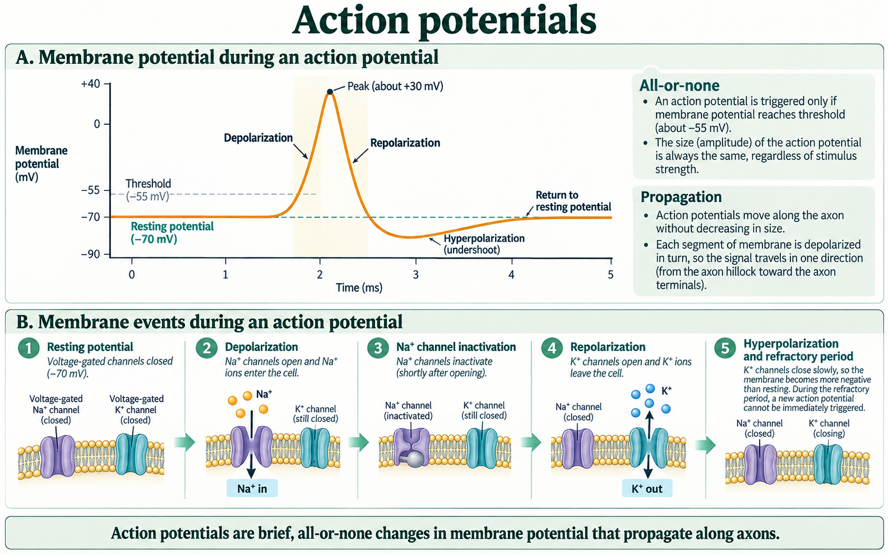
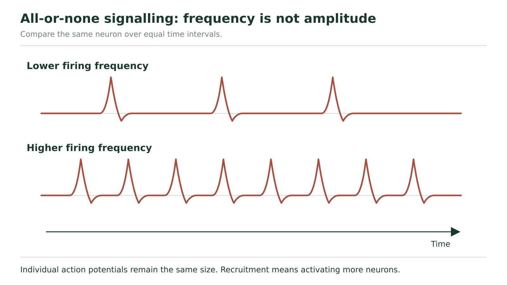

# Action potentials

## A small change and a full firing event

Why can one stimulus change a neuron's voltage without producing an impulse, while another starts a signal that travels along the axon? Keep one small patch of axon membrane in view first. We are following its voltage over time, not yet following a signal from one end of the axon to the other.

At rest the inside is negative relative to outside. A stimulus can depolarize the membrane: for example, it may change from −70 to −62 mV. In the model used here, the **threshold** is −55 mV. The −62 mV change remains below threshold and does not initiate an action potential. It is still a real voltage change.

When depolarization reaches threshold, enough **voltage-gated Na⁺ channels** open to start a rapid, self-reinforcing rise. “Voltage-gated” means that their opening depends on membrane voltage. Na⁺ enters because of its electrochemical gradient. Its positive charge depolarizes the membrane further, opening more of these channels. This regenerative sequence produces the rising phase of an **action potential**.

Under the same normal conditions, reaching threshold produces a full action potential; remaining below it does not. This is the **all-or-none response**. A small subthreshold depolarization is not a small action potential. Threshold and resting potential vary among neurons; −55 and −70 mV are the stated values for this model.

**Two hypothetical trials at one rested membrane region**

| Trial | Starting voltage | Voltage reached by the initial stimulus | Interpretation |
| --- | --- | --- | --- |
| A | −70 mV | −62 mV | Depolarized by 8 mV, still below −55 mV threshold |
| B | −70 mV | −55 mV | Threshold reached; regenerative event begins |

### Does trial B make the inside positive immediately?

First compare −55 with zero. It is still negative. Reaching threshold marks the start of the regenerative rise, not its positive peak. Next follow the mechanism: Na⁺ entry continues to bring positive charge in. The membrane can later cross 0 mV and become positive inside. Therefore, “threshold reached” and “inside positive” occur at different points. A graph lets us distinguish them instead of treating the entire impulse as one instant.

## Read the voltage graph, then explain its shape

**Figure 7.** Follow membrane-potential changes through depolarization, repolarization, and hyperpolarization, then connect them with membrane events.

Start with the upper graph in Figure 7. The horizontal axis is **time in milliseconds** at one membrane region. It is not distance along the axon. The vertical axis is **inside-relative-to-outside membrane potential in millivolts**. Find the resting line near −70 mV and the threshold line near −55 mV. The curve's peak is labelled about +30 mV in this drawing; use that displayed value rather than substituting the peak from another graph.

During the steep rising region, Na⁺ entry makes the inside increasingly positive. Near the peak, the Na⁺ channels become **inactivated**: they cannot immediately reopen to start another event. Meanwhile, delayed voltage-gated K⁺ channels are open. K⁺ moves outward, carrying positive charge out. The inside becomes more negative again. This falling phase is **repolarization**.

K⁺ channels do not all close immediately when the curve crosses the resting line. Continued outward K⁺ movement can take voltage below the resting level. This is **hyperpolarization**, also called the undershoot. As those channels close and ordinary resting permeability again dominates, voltage returns toward rest. The Na⁺ channels also recover from inactivation.

Now read the small membrane panels below the graph. Connect inward Na⁺ arrows with the rising curve and outward K⁺ arrows with the falling curve. An arrow represents ion movement across that local membrane, not an ion travelling from cell body to terminal. Only a small fraction of the cell's ions crosses during an individual action potential. Na⁺ remains more concentrated outside and K⁺ inside overall: the concentration gradients do not reverse when the voltage changes sign.

The sodium–potassium pump continues maintaining those gradients. It does not switch on at the peak to push the voltage down. Rapid channel changes explain the rapid rise and fall; ATP-dependent transport maintains the conditions needed over time.

### One voltage can occur during two different phases

**Question:** A hypothetical recording passes −40 mV while rising and later passes −40 mV while falling. Are the membrane events identical?

The value tells us the inside-minus-outside voltage, but not whether it is changing up or down. On the rising limb, increasing Na⁺ entry drives further depolarization. On the falling limb, Na⁺ channels are inactivated and K⁺ efflux drives repolarization. We therefore need the direction of change and the position in the sequence, not only the voltage value. Identical readings at different times do not prove identical channel states.

## Why the membrane cannot immediately repeat the event

The **refractory period** is recovery associated with a firing event. During the **absolute refractory period**, enough Na⁺ channels are inactivated that another action potential cannot be initiated at that same region, even by a strong stimulus. This begins during the action potential; it is not only a period after the undershoot.

Later, during the **relative refractory period**, Na⁺ channels have recovered enough to support another event, but continued K⁺ permeability and a more negative voltage can make reaching threshold harder. A stronger-than-usual stimulus may succeed. Thus the figure's phrase “cannot be immediately triggered” describes the absolute limitation; do not extend that claim to every moment of recovery. An undershoot alone does not mark all of the absolute refractory period.

This distinction explains two observations: firing events cannot follow one another at unlimited frequency, and a stimulus effective at rest may fail during recovery. Returning to a numerical resting value is not the only requirement; channel state matters too.

### Explain the response to a second stimulus

Use this hypothetical model: the resting value is −70 mV and threshold is −55 mV. At time A, an initial stimulus brings a rested membrane to −60 mV and then fades. At time B, another trial reaches −55 mV and produces a full action potential. Immediately during its absolute refractory period, a second, stronger stimulus produces no new action potential. Explain each of the three outcomes. Do not assume a stronger stimulus always succeeds.

**Your explanation**

[In-place response field]

Hint

For A and B compare voltage with threshold. For the last outcome, ask whether the Na⁺ channels are ready to open again.

Compare with the model after your attempt

At A the membrane depolarizes, but −60 mV remains below −55 mV, so the regenerative event does not start. At B threshold is reached and Na⁺ entry triggers the all-or-none action potential. During the absolute refractory period the relevant Na⁺ channels are inactivated, so an additional stronger stimulus cannot initiate another action potential at that region. Voltage distance from threshold and channel availability are separate constraints.

**Check your reasoning:** Explain a real subthreshold voltage change, the threshold-triggered rise, and the channel-state reason for absolute refractoriness.

**If your answer differs:** If your last answer says “it should fire because the stimulus is stronger,” use the stipulated absolute refractory condition. A stronger input can matter during relative recovery, not override the absolute phase.

Having explained the event at one place, we can now ask how the next place is activated.

## A wave is regenerated along the membrane

When Na⁺ enters an active region, the local electrical change drives current into neighbouring resting regions inside the continuous axon. That local current depolarizes the next region. If it brings that region to threshold, its own voltage-gated Na⁺ channels open and regenerate the action potential there. The second region supplies its own event; it does not merely receive a weakening copy of the first peak.

Local current can spread in both directions. In normal propagation from the initiating region toward the terminals, membrane just behind the advancing event is refractory, while membrane ahead is ready to respond. That difference favours continued forward propagation. The explanation concerns the normal travelling event, not a claim that electrical current can only spread one way.

**Three neighbouring regions during normal propagation**

| Region just behind | Region currently active | Region just ahead |
| --- | --- | --- |
| Recovering; Na⁺ channels not yet fully available | Na⁺ entry produces an action potential and local current | Local current depolarizes a ready region toward threshold |

In an **unmyelinated axon**, neighbouring regions of membrane regenerate the event in succession. In a **myelinated axon**, the sheath reduces current loss across the covered membrane. Local electrical change spreads under the insulation to a **node of Ranvier**, a gap in the sheath where many voltage-gated channels are available. Action potentials are regenerated at these nodes. This is **saltatory conduction**.

The axon itself remains continuous beneath the sheath. “Jumping from node to node” describes where the full events are regenerated, not an axon broken into pieces and not Na⁺ ions jumping across empty space. No single sodium ion has to travel the full axon length to carry the message.

### Why myelin loss can disrupt a signal

In a simplified axon model, suppose one normally insulated region loses its insulation while the axon remains physically continuous. Local current can now leak across more membrane before reaching the next node. The next node may reach threshold later, or may fail to reach it. The prediction is slower or less reliable propagation, depending on the damage. “The axon is still connected” is not enough to guarantee normal electrical signalling, and “myelin damaged” does not justify one identical outcome in every neuron.

## How can stimulus strength be signalled if each spike is all-or-none?

Separate three quantities. **Amplitude** is the size of one action potential's voltage excursion. **Frequency** is the number of action potentials in a stated time. **Recruitment** is a change in how many neurons are active. A stronger stimulus can increase firing frequency in a neuron and can recruit additional neurons in a pathway. Neither explanation requires each action potential in a given normally functioning neuron to become taller.

**Figure 8.** Compare equal time intervals. The number of impulses changes while the height of each action potential remains the same.

In Figure 8, compare the same horizontal time interval in the two traces. Count peaks rather than comparing the total coloured area. The stronger-stimulus trace has more events packed into that interval, while the peak heights stay the same. This figure shows frequency; it does not by itself count the number of different neurons participating.

### Choose the right denominator

In hypothetical recordings from the same neuron, condition A gives 4 action potentials in 0.20 s, and condition B gives 6 in 0.20 s. A has 4 ÷ 0.20 = 20 events/s; B has 6 ÷ 0.20 = 30 events/s. B therefore has higher frequency. If B instead gave 6 events in 0.40 s, its frequency would be 15 events/s: more counted events over a longer interval would not mean faster firing. Count and time must be interpreted together.

### Separate rate, height and recruitment

These are illustrative recordings, not measured biological data. Each counted action potential has the same amplitude. In condition R, each of 2 active neurons produces 5 action potentials in 0.25 s. In condition S, each of 4 active neurons produces 8 action potentials in 0.50 s. Compare the firing frequency per active neuron and the number of active neurons. Is “every neuron fires faster in S” supported? Explain why a bigger total event count would not establish a taller action potential.

**Your explanation**

[In-place response field]

Hint

Calculate events divided by seconds for one neuron in each condition before comparing neuron counts.

Compare with the model after your attempt

Each active neuron in R fires at 5 ÷ 0.25 = 20 events/s. Each active neuron in S fires at 8 ÷ 0.50 = 16 events/s. Thus the active neurons in S fire more slowly in this record, even though more neurons are active: 4 rather than 2. S shows greater recruitment, not greater per-neuron frequency. Amplitude is stipulated to be unchanged. Adding events across time or across neurons changes a count, not the height of an individual action potential.

**Check your reasoning:** Give both rates with units, distinguish 2 from 4 participating neurons, reject the unsupported faster-firing claim, and keep amplitude separate.

**If your answer differs:** If you used 8 versus 5 alone, equalize the time basis. If you multiplied by neuron count before calculating a rate, explain that you have measured population events, not the frequency of one neuron.

The action potential is a regenerative membrane event: channels produce its rise and fall, recovery limits repetition, and local current recruits the next membrane region. Stimulus information can be carried by patterns of full events rather than their height. When those events reach an axon terminal, a new problem appears: how can information cross the gap to another cell?
