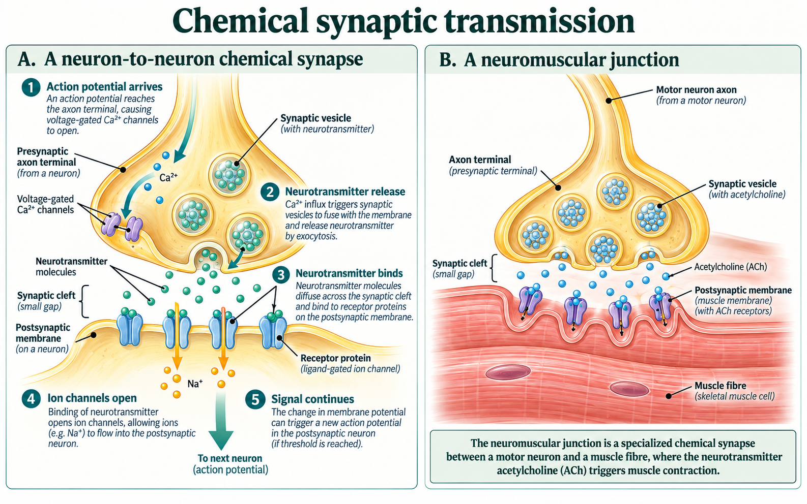
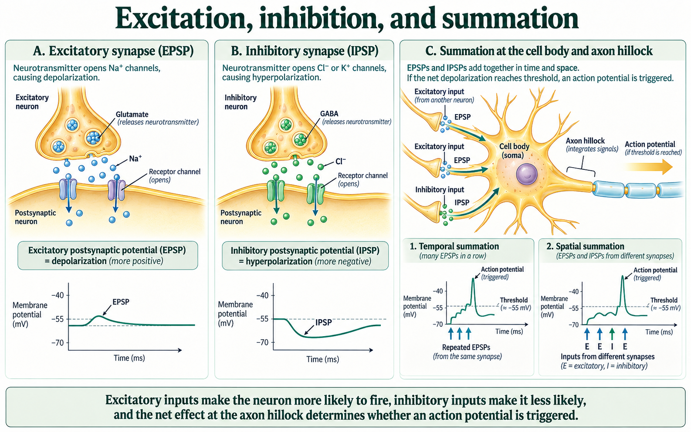
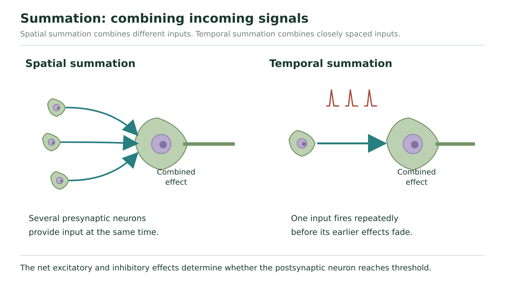

# Synapses and summation

## The arriving impulse is not yet a message in the next cell

An action potential can reach an axon terminal without guaranteeing that the next neuron fires. To understand why, follow the handover between cells. A **synapse** is a communication junction. In the chemical synapses studied here, the sending terminal and receiving membrane are separated by a small **synaptic cleft**.

**Presynaptic** means on the sending side; **postsynaptic** means on the receiving side. These words identify the two roles at one junction. A neuron receiving information at one synapse may send information at another. A chemical synapse between a motor neuron and a muscle cell is a **neuromuscular junction**.

The action potential is an electrical change in the presynaptic membrane. It does not jump across the cleft as the same action potential. The sending cell releases a **neurotransmitter**, a chemical messenger. That messenger affects the receiving cell's membrane, which may or may not later reach the conditions for its own action potential.

## Follow the causal handover

The arriving action potential depolarizes the terminal membrane. Voltage-gated calcium channels open, allowing **Ca²⁺** to enter the terminal. Calcium is an ion carrying two positive charges. Here its important job is to trigger the release machinery. It is not the chemical messenger that diffuses across the cleft to carry this message.

Inside the terminal, small membrane-bound sacs called **vesicles** contain neurotransmitter. Calcium entry triggers vesicles to fuse with the presynaptic membrane. Their contents are released outside the cell by **exocytosis**. Neurotransmitter then diffuses across the cleft and binds to matching **receptor proteins** on the postsynaptic membrane.

Binding changes ion-channel activity in the receiving membrane. Ion movement changes the postsynaptic voltage and therefore the likelihood of an action potential. Arrival, release and receptor activation are separate steps: a signal can fail at one even when an earlier step succeeds.

**Figure 9.** Trace chemical transmission at a neuron-to-neuron synapse and compare it with a neuromuscular junction.

In Figure 9 A, begin with the action-potential arrow entering the terminal. Find the Ca²⁺ arrow across its membrane, then a vesicle joining that membrane. Follow the small transmitter symbols into the cleft and down to the receptor proteins. Finally follow the receiving-cell ion arrows. They cross a different membrane from the presynaptic calcium arrows.

Figure 9 B keeps the sending motor-neuron terminal but replaces the receiving neuron with a muscle fibre. The vesicles contain acetylcholine, abbreviated **ACh**. At a skeletal neuromuscular junction, ACh activates receptors that excite the muscle membrane and help initiate contraction. ACh is the transmitter; muscle contraction is the resulting effector response.

The chemical signal also needs an ending. Neurotransmitter can leave the cleft by diffusion, be taken up into cells by **reuptake**, or be broken down by enzymes, depending on the transmitter and synapse. **Cholinesterase** breaks down acetylcholine. Removing available ACh lets its receptor stimulation end. Reuptake and enzyme breakdown are different mechanisms, even though both help control the message's duration.

### Which step failed?

Two hypothetical synapses receive normal action potentials. At synapse X, no Ca²⁺ entry is detected and no transmitter appears in the cleft. At synapse Y, Ca²⁺ entry and release occur normally, but the postsynaptic receptors cannot be activated by the released transmitter. Neither produces the expected postsynaptic effect.

At X, the chain fails before release: without the calcium trigger, normal arrival does not produce the expected vesicle fusion. At Y, the message crosses the cleft, but the receiving step fails. It would be wrong to conclude “no transmitter was released” merely because the postsynaptic cell did not respond. The observations locate different bottlenecks in the same sequence.

## A chemical input can help or oppose firing

An **excitatory postsynaptic potential**, or **EPSP**, makes an action potential more likely. In the simple example here, a receptor opens channels that allow net positive charge into the receiving cell. The inside depolarizes toward the voltage needed for firing. An EPSP is a local, graded voltage change: its size can vary. It is not automatically a full action potential.

An **inhibitory postsynaptic potential**, or **IPSP**, makes firing less likely. In the hyperpolarizing examples here, opening K⁺ channels lets positive charge leave, or opening appropriate Cl⁻ channels lets negative charge enter. The inside becomes more negative. Inhibition is defined by its effect on firing probability; these are examples of how it can occur.

**Figure 10.** Compare EPSPs and IPSPs, then relate them to temporal and spatial summation at the axon hillock.

Use panels A and B of Figure 10 to trace the receptor-to-ion-to-voltage connection. A shows Na⁺ entry and an upward local deflection; B shows Cl⁻ entry and a downward deflection. The horizontal axes are time and the vertical axes are membrane voltage. The two local traces begin at different displayed values. They are not measurements from one shared starting condition.

Only the summation plots in panel C explicitly identify the firing threshold of the initiating region. Do not use a dashed reference line in A or B as a universal rule that every local membrane crossing that voltage must fire. We will use one clearly stated starting voltage and threshold in the numerical model below. Read A and B for the direction of their local effects.

A transmitter's name alone does not determine excitation or inhibition everywhere. Its effect depends on the receptor and target cell. Acetylcholine excites skeletal muscle at the neuromuscular junction, while its effects at other targets need their own context. Always identify which synapse and receptor response a question describes.

## Combine inputs that still overlap

A neuron receives many inputs through its dendrites and cell body. Their local effects spread toward the region where the axon begins. **Summation** is their combined influence on membrane voltage. If the net influence brings the initiating region to threshold, an action potential starts in the axon.

**Spatial summation** combines effects arriving from different input locations. **Temporal summation** combines repeated effects from one input when they arrive close enough in time that an earlier effect has not faded. Inputs separated by a long interval need not add, even if their individual sizes are unchanged.

**Figure 11.** Spatial summation combines different inputs; temporal summation combines repeated inputs close together in time.

In Figure 11, the left side brings several presynaptic inputs toward one receiving cell. That is a change across locations. On the right, repeated input reaches the receiving cell before earlier effects have faded. That is a timing relationship. Both pictures concern the combined postsynaptic effect, not a taller action potential made by joining several smaller action potentials.

### A deliberately simplified summation model

For this model only, start at −70 mV and set threshold at −55 mV. The changes listed below are the effective contributions at the initiating region at the same moment. Add them directly; ignore decay during that instant. Real neurons do not always combine every synapse as simple arithmetic.

| Input | Effective change | Source |
| --- | --- | --- |
| E 1 | +6 mV | One excitatory input |
| E 2 | +5 mV | A second excitatory input |
| E 3 | +4 mV | A third excitatory input |
| I | −3 mV | An inhibitory input |

First combine E 1, E 2 and E 3: +6 +5 +4 = +15 mV. Add the change to the starting voltage: −70 +15 = −55 mV. Threshold is reached, so the model predicts an action potential. Now include I at the same moment: the net change is +12 mV, giving −58 mV. That remains below threshold. The inhibitory contribution changed the final voltage, not the threshold value. The first case is spatial summation because different inputs combine.

If one input instead contributes +5 mV three times before its earlier effects fade, the model total is again +15 mV, but the explanation is temporal summation. If each +5 mV effect has faded completely before the next arrives, the voltage reaches only −65 mV each time. Adding three past events that no longer overlap would be the wrong model.

### Change the timing, not the transmitter

Use a simplified neuron starting at −70 mV with threshold −55 mV. One excitatory input contributes an effective +8 mV at the initiating region. In record A, a second +8 mV contribution arrives while the first is still fully present. In record B, the first effect has completely faded before the second arrives. Predict firing for each and identify the kind of summation being tested.

**Your explanation**

[In-place response field]

Hint

Keep the +8 mV size fixed. Ask which contributions are present together rather than adding everything that happened earlier.

Compare with the model after your attempt

A combines +8 and +8 to give −54 mV, reaching the −55 mV threshold, so an action potential is predicted. B reaches −62 mV during each isolated input and returns to rest between them; it does not reach threshold. This tests temporal summation because the same input repeats with different spacing. It does not test a change in the action potential's height.

**Check your reasoning:** Use the stated overlap, calculate both voltages, compare with threshold, and identify timing as the changed condition.

**If your answer differs:** If you predict firing in both, you counted a faded contribution in B. If you predict a “double-size impulse” in A, separate the summed graded inputs from the all-or-none event they can trigger.

### Combine a new location with inhibition

A different hypothetical neuron starts at −68 mV; threshold is −53 mV. At one instant, input P contributes +9 mV and input Q contributes +7 mV at the initiating region. A third input R, from a different presynaptic neuron, contributes −4 mV at that same instant. Decide whether firing is predicted with all three inputs. Then predict the effect of preventing R's postsynaptic receptors from responding, while P and Q stay unchanged. Explain why the change can increase firing although one input has been removed.

**Your explanation**

[In-place response field]

Hint

Identify which input opposes firing. Compute the net change before and after removing only that contribution.

Compare with the model after your attempt

With all three inputs, the change is +9 +7 −4 = +12 mV, so voltage reaches −56 mV, below −53 mV threshold. Without R's effect, the change is +16 mV and voltage reaches −52 mV, so firing is predicted. R was inhibitory; removing its postsynaptic effect removes opposition to depolarization. This is a spatial input comparison and an example of why fewer active synaptic effects need not mean less firing.

**Check your reasoning:** State both net changes and voltages, apply the new threshold, and explain the inhibitory contribution rather than merely reporting the arithmetic.

**If your answer differs:** If you kept the previous example’s −55 mV threshold, reread the givens. If you assumed every removed input reduces firing, distinguish excitatory from inhibitory effects.

## Keep the messenger, receptor and cleanup roles separate

**Named chemicals in a defined context**

| Chemical | What to explain | Important limit |
| --- | --- | --- |
| Acetylcholine | Excites skeletal muscle at a neuromuscular junction; also used in autonomic and CNS pathways | Its effect is not identical at every target |
| Cholinesterase | Enzyme that breaks down acetylcholine and helps end its stimulation | It is not the neurotransmitter that carries the message |
| Norepinephrine | Neurotransmitter used in the CNS and many sympathetic connections | Predict the effect from the stated receptor and organ, not its name alone |
| GABA | A major inhibitory transmitter in the CNS; the figure shows a hyperpolarizing example | Use the particular receptor response given in a problem |

Dopamine participates in pathways associated with movement and reward; serotonin participates in regulation including mood and sensory processing; endorphins participate in pain-modulating pathways. These are broad functional connections, not explanations of an individual's behaviour from one chemical level. Glutamate is another common excitatory-transmitter example. Learn the specific sending, receiving and removal steps before attaching a broad effect to a chemical's name.

The handover is therefore conditional. Arrival can trigger release; release can activate receptors; receptor effects combine with other inputs; only the resulting conditions determine whether the next neuron fires. Next we will change individual steps and use evidence to predict what follows.
