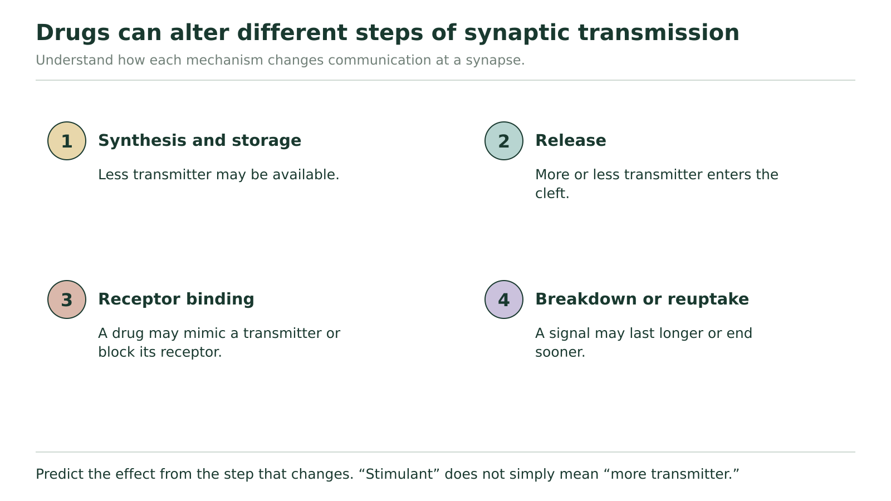

# Drugs at the synapse

## Change one link and trace its consequences

A substance that changes a synapse does not simply turn the entire nervous system up or down. Its effect depends on the step it changes and on what the affected synapse normally does. Our question is: how can observations about release, receptors and clearance support a specific prediction?

Begin with the normal chemical pathway: an action potential arrives; Ca²⁺ enters the terminal; vesicles release transmitter; transmitter diffuses across the cleft; receptors change postsynaptic ion movement; clearance helps end the effect. A useful prediction names the altered step, explains what changes next, then connects that change with the receiving cell's response.

**Trace the signal before predicting the output**

| Sending side | Across the gap | Receiving side | Signal ending |
| --- | --- | --- | --- |
| Action potential → Ca²⁺ entry → vesicle release | Available transmitter diffuses across cleft | Receptor activation → changed ion movement → excitatory or inhibitory influence | Reuptake, enzyme breakdown or diffusion reduces transmitter availability |

The arrows mean that each event makes the next event possible under the stated conditions. A failure at release and a failure at receptor activation can both remove the postsynaptic effect, but they leave different evidence in the cleft.

**Figure 12.** Locate the changed step first, then predict the effect on the signal. Use it to organize the changes that can occur at a synapse.

Use Figure 12 as a set of locations on the pathway above. “Synthesis and storage” concerns the supply available for release. “Release” concerns what enters the cleft. “Receptor binding” concerns whether the receiving cell can respond. “Breakdown or reuptake” concerns how quickly available transmitter is removed. The four cards are not four inevitable effects of every drug.

An **agonist** activates a receptor and can mimic an effect of its usual transmitter. An **antagonist** blocks receptor activation. Whether either makes a neuron more likely to fire depends on whether the affected receptor normally produces an excitatory or inhibitory influence.

### A receptor blocker at an excitatory synapse

Consider a hypothetical substance B that blocks the postsynaptic receptors at an excitatory synapse. It does not change action-potential arrival, Ca²⁺ entry, transmitter release, or clearance. Normally this input helps depolarize the receiving neuron toward threshold.

Start at the changed site: the receptors cannot be activated. Transmitter can still enter the cleft and diffuse to the receiving membrane, but its usual receptor-triggered ion movement is reduced or absent. This input therefore supplies less depolarization. All other inputs being equal, the receiving neuron is less likely to reach threshold. We have not proved it can never fire: other excitatory inputs could still be sufficient.

A cleft measurement showing normal release would fit this explanation. It would contradict the claim that B works only by preventing release. A postsynaptic nonresponse by itself would not separate those two explanations.

### Move the same kind of blocker to an inhibitory synapse

Now specify a different target: B blocks receptors whose normal effect is inhibitory, while all other conditions are unchanged. Blocking them removes an influence that normally opposes firing. The receiving neuron can become more likely to reach threshold. It is the normal receptor effect that reversed the prediction, not a reversal of the substance's blocking action. “A receptor is blocked” does not always mean “the pathway fires less.”

### Use two observations to locate the bottleneck

Two hypothetical conditions both remove the normal excitatory response to an arriving action potential. All unspecified steps remain functional.

| Condition | Transmitter after normal presynaptic stimulation | Receiving membrane when transmitter is directly made available in this model |
| --- | --- | --- |
| X | None appears in the cleft | Normal response occurs |
| Y | Normal amount appears in the cleft | No normal response occurs |

Which condition supports a release-side failure, and which supports failure of receptor activation or its postsynaptic response? Explain what each observation contributes. These are supplied model observations, not instructions for an experiment.

**Your explanation**

[In-place response field]

Hint

Ask whether the message arrives in the gap, then whether the receiving machinery can respond when message availability is bypassed.

Compare with the model after your attempt

X supports a release-side failure: no transmitter follows presynaptic stimulation, yet the receiving membrane responds when transmitter is available. Y supports a receiving-side failure: the message reaches the cleft, but it does not produce the normal effect even when made available directly. Y does not by itself distinguish the receptor protein from every downstream receiving mechanism. The two observations narrow the location more strongly than “no response” alone.

**Check your reasoning:** Use both observations for each condition and distinguish supported location from an exact molecular diagnosis.

**If your answer differs:** If you name receptor blockade for X, reconcile that with its normal response to supplied transmitter. If you name failed release for Y, explain why normal transmitter is observed in its cleft.

## Changing the ending changes how long an influence lasts

Reuptake returns a released transmitter to a cell. Enzyme breakdown converts a transmitter to products that no longer activate its receptor in the same way. Slowing the relevant removal process can keep transmitter available for longer. It does not automatically create a larger presynaptic action potential or make every target more excited.

For acetylcholine, cholinesterase contributes to breakdown. If its action is disrupted, ACh can remain available longer at affected synapses. At a skeletal neuromuscular junction this can prolong or disrupt normal stimulation rather than allowing the usual precisely timed ending. At another ACh target, first establish the receptor and physiological role before predicting the output. A mechanism statement alone is not a full prediction of a person's symptoms.

### The same clearance change, different synaptic effects

In this hypothetical comparison, one normal release occurs at each of two synapses. Removing transmitter normally returns both postsynaptic responses toward baseline. A new condition slows only transmitter reuptake; receptors remain responsive over the comparison interval. Synapse E normally provides an excitatory input. Synapse I normally provides an inhibitory input. Predict how the duration of transmitter availability changes at each. Then explain why the change need not have the same effect on the two receiving neurons' likelihood of firing. Finally identify one fact you would still need before predicting a whole organ's response.

**Your explanation**

[In-place response field]

Hint

The change in removal is the same in E and I. Keep that fact separate from the different signs of their normal postsynaptic effects.

Compare with the model after your attempt

Slower reuptake leaves released transmitter available longer at both synapses. Under the given responsive-receptor conditions, E's excitatory influence can last longer and make threshold more likely to be reached. I's inhibitory influence can last longer and make threshold less likely to be reached. The action potential's amplitude is not the quantity being changed. To predict a whole organ's response, we would need information such as which cells or circuit are targeted, their other inputs and how their output controls that organ. More available transmitter is not a complete organism-level explanation.

**Check your reasoning:** Separate clearance duration from excitatory/inhibitory consequence, preserve the stated assumptions, and identify a relevant missing circuit or target fact.

**If your answer differs:** If both predictions say “more stimulation,” replace that phrase with the actual receptor effect at E and I. If you name a guaranteed organ response, identify the missing connection between these cells and that organ.

## Use a hypothesis at the right scale

The cocaine example in the optional source questions describes reduced dopamine reuptake. You can explain the stated synaptic mechanism by tracing availability and receptor effects. Moving from that mechanism to a claim about addiction also requires evidence about learning, repeated experience, brain circuits and behaviour. A proposed explanation is a **hypothesis** to examine, not proof that one outcome must happen to every person after one exposure.

“Stimulant” and “depressant” are broad descriptions of effects on nervous-system activity. They do not identify one universal release or receptor mechanism. Caffeine is a familiar stimulant example; its name alone is not a substitute for specifying the mechanism a particular question asks you to explain. No substance-use experiment or personal disclosure is needed for these reasoning tasks.

The optional nervous-system organization tree is a useful return task after the next lesson. Its branching pattern separates central/peripheral, sensory/motor, somatic/autonomic and the two autonomic divisions. Use the organizational meaning of each branch rather than guessing from the number of letters.

We can now predict a changed synaptic message by tracing a defined intervention through a defined target. Next, follow those messages into the peripheral pathways that control different effectors. The organ matters just as much as the chemical step.
