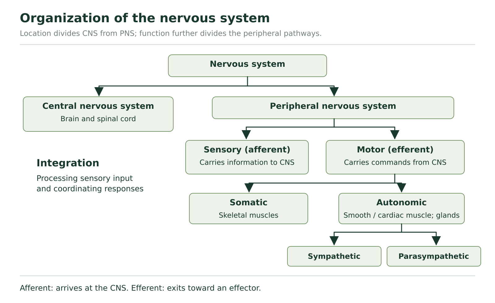
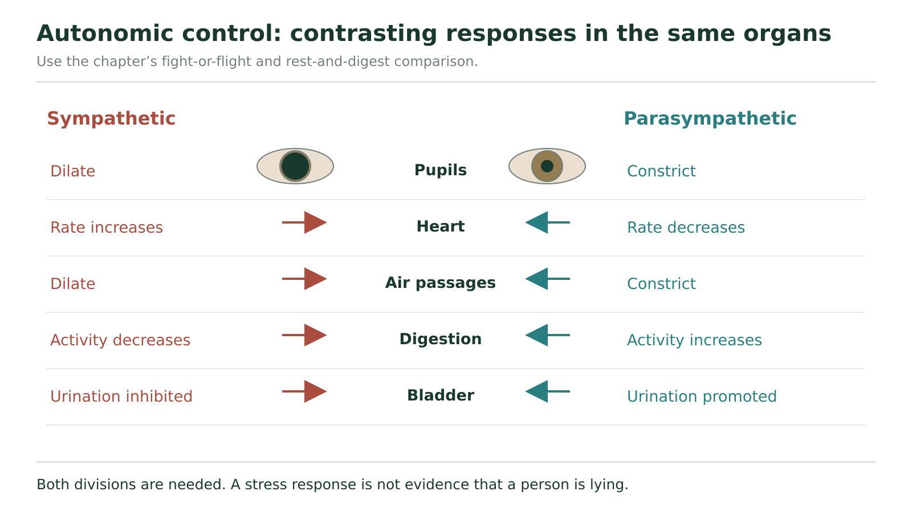
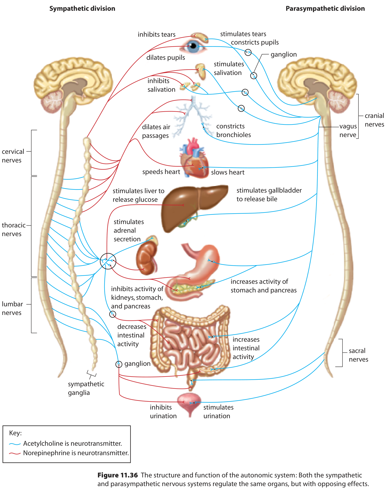

# Peripheral control

## One situation, different output pathways

You hurry up a short staircase and reach for a door. Skeletal muscles move your legs and hand, while your heart and other organs adjust their activity. Which parts of this response belong to somatic control, and which to autonomic control? Start by identifying the effector, rather than deciding that every response during a chosen activity must itself be voluntary.

The **peripheral nervous system**, or PNS, links the brain and spinal cord with receptors, muscles and glands. Sensory pathways carry information *toward* the CNS; motor pathways carry information *away* from it. Those words describe direction. The human PNS includes 12 pairs of cranial nerves associated with the brain and 31 pairs of spinal nerves associated with the spinal cord. Nerves can contain fibres with different functions; the name of one nerve does not by itself tell us that every fibre carries the same kind of signal.

**Figure 13.** Read down from nervous system to CNS and PNS, then follow the sensory and motor branches. The autonomic branch divides further into sympathetic and parasympathetic systems.

Read Figure 13 one branching level at a time. The first division is by location: CNS versus PNS. The next peripheral division is by direction: sensory versus motor. Under motor, classify output by target: somatic skeletal-muscle control versus autonomic smooth-muscle, cardiac-muscle and gland control. Finally the autonomic branch separates into sympathetic and parasympathetic divisions. These branching levels answer different questions.

## Classify the target before using voluntary or involuntary

**Somatic motor pathways** control skeletal muscles. These include consciously directed movement, such as reaching for a door, and skeletal-muscle reflexes, such as withdrawing from a sharp object. The broader somatic system also carries sensory information from structures such as skin, muscles and joints. It is therefore useful to say which side of the pathway you mean.

**Autonomic motor pathways** regulate cardiac muscle, smooth muscle and glands, usually without a conscious instruction for each adjustment. Smooth muscle occurs in structures such as digestive organs and blood-vessel walls. A faster heartbeat during activity is an autonomic adjustment; the leg muscles lifting the body use somatic motor output. Both can occur within one coordinated response.

### Classify the staircase response

First identify each effector. The muscles moving the legs are skeletal muscles, so their motor control is somatic. The heart is cardiac muscle, so its autonomic regulation belongs to the autonomic system. Now consider a different cause: if a skeletal muscle contracts during a rapid withdrawal reflex, its target has not changed. That output remains somatic even though the movement did not wait for a conscious decision. “Involuntary” alone does not distinguish a skeletal reflex from an autonomic response.

### Use direction and target separately

Classify the three connections in this hypothetical record: A carries information from a skin receptor toward the spinal cord; B carries output to a skeletal muscle during withdrawal; C carries output that changes digestive smooth-muscle activity. For each, identify sensory or motor direction. For B and C, also identify somatic or autonomic motor control. Explain why the two classification questions are different.

**Your explanation**

[In-place response field]

Hint

First ask toward or away from the CNS. Only then ask which type of effector receives a motor output.

Compare with the model after your attempt

A is sensory because it carries information toward the CNS. B is motor and somatic because its output reaches skeletal muscle, even during a reflex. C is motor and autonomic because its output regulates smooth muscle. Direction classifies the information route; target classifies the motor pathway. One word cannot replace both decisions.

**Check your reasoning:** Correctly classify all three directions and both motor targets, with the reflex qualification.

**If your answer differs:** If B became autonomic only because withdrawal is involuntary, return to the skeletal-muscle target. If A became motor because it can eventually lead to movement, classify the described connection, not the final response.

## Autonomic balance is organ-specific

The **sympathetic division** helps coordinate responses to acute challenge, often called “fight or flight.” Heart activity can increase, air passages widen, pupils dilate and the liver releases glucose. At the same time, digestive activity and bladder emptying can decrease. These changes are coordinated, but their directions differ because the organs have different jobs.

The **parasympathetic division** supports functions often described as “rest and digest.” It can slow the heart, constrict pupils and increase digestive activity and urination. The two divisions often have opposing effects on a shared target. They provide continuing regulation; returning toward a resting condition is not achieved by switching the nervous system off.

**Figure 14.** Compare the two responses organ by organ. Use the textbook’s Figure 11.36 for the larger organ list required by review question 4.

In Figure 14 compare one organ across the two columns before moving to another. Contrast the heart with the digestive system: the sympathetic effect increases heart activity but decreases digestive activity. Thus “sympathetic means every organ speeds up” fails even within this simple comparison.

Figure 11.36, p. 398, retained for Section 11.3 review question 4. It shows the specific organ list and the source’s transmitter key.

For the larger organ map, start at the heart in the centre. The sympathetic side says “speeds heart”; the parasympathetic side says “slows heart.” Then read the transmitter key: blue lines represent acetylcholine at the depicted connection; red lines represent norepinephrine. Trace the sympathetic route through its ganglion, a collection of nerve-cell bodies outside the CNS. Notice that the colours can change between connections. Do not label every segment of the sympathetic pathway “norepinephrine.”

The diagram also connects sympathetic output with adrenal secretion. In this response, the adrenal glands can release epinephrine and norepinephrine into the bloodstream as hormones. A hormone travels in blood to responsive targets; a neurotransmitter is released at a synapse. The same chemical name can occur in both contexts, so specify the route.

**Read only the organ effects actually supplied in the larger map**

| Target | Sympathetic side | Parasympathetic side |
| --- | --- | --- |
| Pupil and salivary glands | Pupil dilation; inhibited salivation | Pupil constriction; stimulated salivation |
| Air passages and heart | Dilation; faster heart activity | Bronchiole constriction; slower heart activity |
| Stomach, pancreas and intestines | Reduced activity in the displayed comparison | Increased activity |
| Bladder output | Urination inhibited | Urination stimulated |
| Liver, adrenal glands and kidneys | Glucose release; adrenal secretion; inhibited kidney activity in this schematic | No matching direct effect is labelled for these three targets |

The parasympathetic label beside the liver region specifically names the *gallbladder* releasing bile. Do not convert it into an unlabelled claim about liver glucose release. Likewise, a blank opposite an organ does not justify inventing the exact reverse of the sympathetic entry. Use “not specified by this figure” when the evidence does not supply that comparison. “Urination inhibited” is a net output; it does not mean every bladder wall and outlet muscle changes in the same way.

## A body response does not uniquely identify its cause

A polygraph can record changes in heart rate, blood pressure, breathing and sweating. Such measurements can reflect autonomic activity. They do not directly record whether a statement is true. Different situations can produce overlapping physiological responses, so interpreting the cause requires more than observing a change.

### Evaluate a claim from a supplied record

These values are hypothetical teaching data, not clinical ranges or a validated test.

| Condition | Heart rate, beats/min | Breathing rate, breaths/min |
| --- | --- | --- |
| Quiet baseline | 72 | 14 |
| After climbing stairs | 96 | 20 |
| While answering a difficult question | 94 | 19 |

A reader claims, “The question caused a rise similar to the staircase condition, so the speaker must be lying.” Identify the observation, evaluate the claim and supply a different explanation consistent with the record. Then explain why the staircase condition can involve somatic and autonomic output together.

**Your explanation**

[In-place response field]

Hint

Similar measurements can have different causes. Separate what was measured from what the reader inferred.

Compare with the model after your attempt

Both later conditions have higher recorded heart and breathing rates than baseline. The record does not measure truthfulness, so it cannot establish lying. Effort, challenge or stress during the question could be an alternative explanation; the staircase row itself shows a different context associated with a similar change. Climbing uses somatic output to skeletal muscles, while autonomic regulation adjusts cardiac and other internal activity. Similar final values do not imply the same whole pathway or cause.

**Check your reasoning:** Quote a numerical comparison, distinguish observation from inference, propose a plausible alternative without claiming it is proved, and classify the two output types.

**If your answer differs:** If your answer declares the speaker truthful instead, that is also unsupported. The correct limit is that these measurements alone do not settle truthfulness.

The PNS connects central processing with many targets. Classifying direction, effector and autonomic division explains more than simply calling an activity voluntary or involuntary. Next we will look at the CNS itself: how its tissues carry and process information, and how those delicate tissues are protected.
