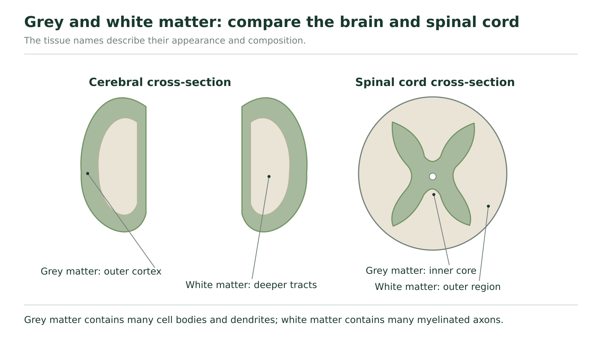
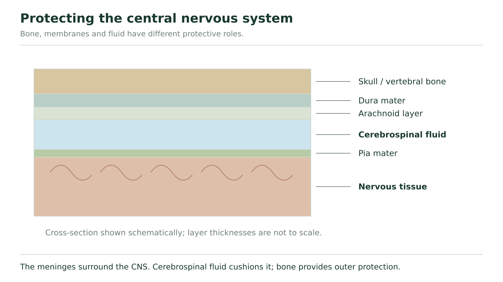

# Central control

## The same tissue types, different arrangements

The spinal cord is both a route for communication with the brain and a place where some circuits process information locally. How can a spinal pathway stop carrying information to the brain while a local circuit remains intact? First identify the tissues and connections involved.

The **CNS** comprises the brain and spinal cord. **Grey matter** contains many neuron cell bodies, dendrites, synapses and unmyelinated parts of axons, together with supporting cells. These regions provide many sites of local processing and communication between cells. **White matter** contains many myelinated axons grouped into tracts. These tracts connect regions, while the myelin supports efficient conduction.

Grey and white matter are descriptions of tissue composition, not two mutually exclusive kinds of whole neuron. A neuron's cell body can lie in grey matter while its axon contributes to a white-matter tract.

**Figure 15.** Compare tissue composition and position. The spinal cord’s grey core is not the same arrangement as the outer cerebral cortex.

Read the cerebral and spinal cross-sections separately in Figure 15. The outer cerebral cortex is grey matter, with white matter deeper inside. In the spinal cross-section, find the grey butterfly-shaped core and the surrounding white matter. You cannot identify tissue solely by a universal “inside is white” rule. The arrangement differs between these two structures. The diagram is simplified and does not show every deeper grey-matter region in the brain.

## Communication through the cord and processing within it

Ascending spinal pathways carry information toward the brain. Descending pathways carry information from the brain toward spinal circuits and motor output. At a local withdrawal circuit, incoming sensory information can activate an interneuron and motor neuron within the spinal cord. The circuit and the long-distance communication routes are connected, but they have different jobs.

**A deliberately simplified pathway map**

| Route | Connections | Job |
| --- | --- | --- |
| Ascending | Body receptor → sensory entry at a lower level → ascending cord route → brain | Communicates the incoming information to the brain |
| Descending | Brain → descending cord route → lower-level motor circuit → muscle | Allows a brain-organized command to influence that muscle |
| Local | Sensory entry → local interneuron → local motor neuron → muscle | Can initiate the modelled reflex without waiting for conscious processing |

### Predict only what the interrupted route requires

In a hypothetical model, both ascending and descending tracts are interrupted above a particular local withdrawal circuit. Its receptor, sensory entry, interneuron, motor neuron and muscle remain intact.

Trace the ascending route: the incoming information reaches the lower circuit but encounters the interruption before it can continue to the brain. Trace the descending route: the brain-organized command cannot cross the interrupted section to reach the lower circuit. Now trace the local circuit: none of its stipulated connections crosses that interruption. The model therefore allows its reflex response to occur even though those long-distance connections fail. This predicts the named pathways only; it is not a clinical prediction of every reflex or sensation after a spinal injury.

In general, a higher interruption can separate the brain from more lower body regions than a lower interruption, because more pathways enter below it. Actual effects depend on the tracts and regions affected. Position alone does not justify certainty about a real person's complete abilities.

### Change only the direction affected

Use the same three-route map. In a new model, only the ascending route from the lower sensory entry is interrupted. The descending route and local reflex circuit remain intact. Predict whether the represented sensory information can reach the brain, whether a brain-organized motor command can reach the lower motor circuit, and whether the modelled local reflex can operate. Give a route-based reason for each.

**Your explanation**

[In-place response field]

Hint

Do not carry the worked example's two-way interruption into this new case. Mark only the ascending connection as interrupted.

Compare with the model after your attempt

The represented sensory information cannot continue to the brain along the interrupted ascending route. A brain-organized motor command can still reach the lower motor circuit through the intact descending route. The local reflex can operate because its specified connections remain intact. The absence of one direction of long-distance communication does not logically remove every other pathway.

**Check your reasoning:** Three explicit predictions, each supported by the actual connections given.

**If your answer differs:** If all three functions disappeared in your answer, reread “only.” The case changes one route, not the entire cord.

## Separate the tissue from its protective structures

A **vertebra** is a bone in the spinal column; the **spinal cord** is nervous tissue inside the protected canal. They are not two names for the same structure. The skull surrounds the brain. Bone provides an outer physical protection, but the CNS also has membranes and fluid around it.

The **meninges** are three enclosing tissue layers: the dura mater, arachnoid and pia mater. **Cerebrospinal fluid**, or CSF, is present in spaces within the brain and around the CNS. It cushions the delicate tissue and contributes to its surrounding fluid environment.

**Figure 16.** The layer thicknesses are schematic. The drawing separates the mechanical protection of bone, membranes and fluid.

Read Figure 16 from the outside inward: bone, dura mater, arachnoid, the fluid-containing space, pia mater and nervous tissue. The fluid space shown is between the arachnoid and pia. The drawing exaggerates layer thickness so the relationships are visible; it is not a scale measurement. Bone surrounds, membranes enclose and fluid cushions. Those are related but distinct protective functions.

These layers help explain why damage to a bone and damage to nervous tissue need to be described separately. The nervous tissue carries and processes signals; the surrounding structures protect the conditions in which it works.

## A capillary barrier solves a different problem

The brain also needs control over what passes from blood into its tissue. The **blood–brain barrier** depends on tightly joined cells lining brain capillaries, together with their specialized transport properties. Capillaries are tiny blood vessels. The barrier limits many substances while allowing needed exchange, including oxygen and nutrients. It is selective, not an impermeable wall around a brain with no blood supply.

This microscopic blood-to-tissue boundary is not the meninges. Nor is it the same mechanism as CSF cushioning. One limits chemical passage; the other supports mechanical protection and the fluid environment. The brain needs a continuing supply of oxygen and nutrients because its cells require energy, including ATP used to maintain ion gradients. Protection cannot mean preventing every useful substance from reaching those cells.

### Match an observation with the kind of protection

If a question asks how delicate brain tissue is cushioned against movement, trace the structures surrounding it and identify CSF. If it asks why a particular substance in blood does not readily enter brain tissue, examine selective exchange at capillaries. Naming “the protective layers” for both questions misses the different mechanisms.

### Evaluate two protective-system models

Two simplified models are supplied. Model A places a soft object in a fluid-filled container and compares its movement with an otherwise similar container without fluid. Model B compares passage of substances across a selective boundary: substance X crosses readily, while substance Y does not. Which model illustrates a CSF-related protective function, and which illustrates the idea behind selective blood-to-brain exchange? State one thing each model cannot establish about a real CNS. These are description-based tasks, not instructions to perform an investigation.

**Your explanation**

[In-place response field]

Hint

Identify the measured relationship: cushioning/movement or selective passage. Then distinguish an analogy from complete biological evidence.

Compare with the model after your attempt

A illustrates fluid cushioning, a CSF-related function. It cannot reproduce all the brain's anatomy, fluid circulation or injury responses. B illustrates selective passage, the kind of distinction relevant to the blood–brain barrier. It does not identify the actual transport mechanisms or prove that a particular real chemical crosses brain capillaries. Neither model shows that meninges are the blood–brain barrier.

**Check your reasoning:** Match both mechanisms and give a relevant limitation for each, without treating analogy as a complete experiment on a brain.

**If your answer differs:** If you selected a model merely because it contains a barrier or liquid, connect its actual observation to the biological job. A container wall and a capillary lining are not equivalent simply because both surround something.

The CNS processes information locally and communicates between regions, while several protective systems maintain suitable conditions around it. We can now use these relationships to examine the brain's major structures and how they cooperate in a response.
