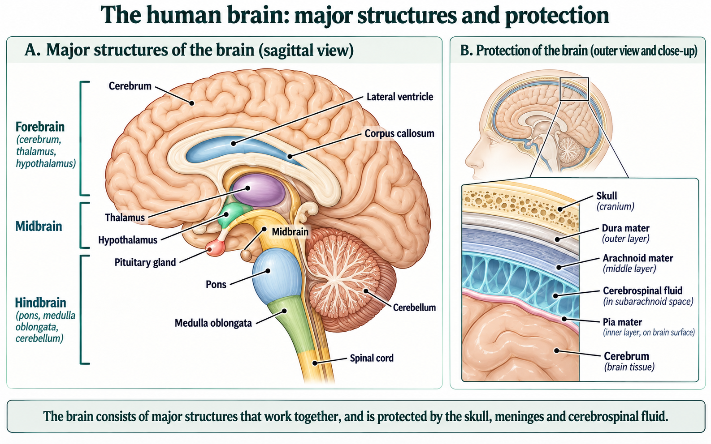
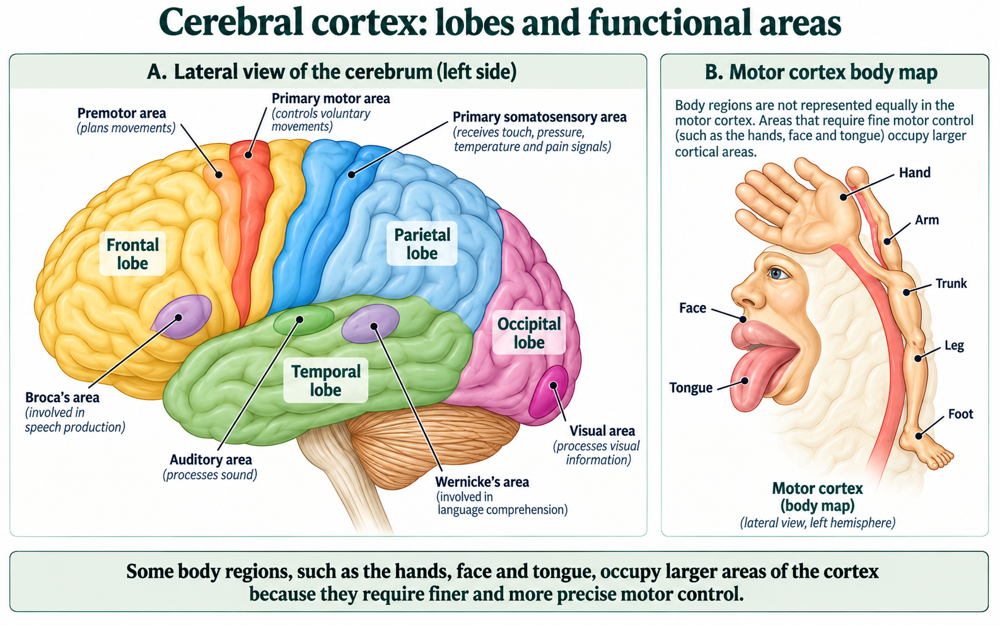
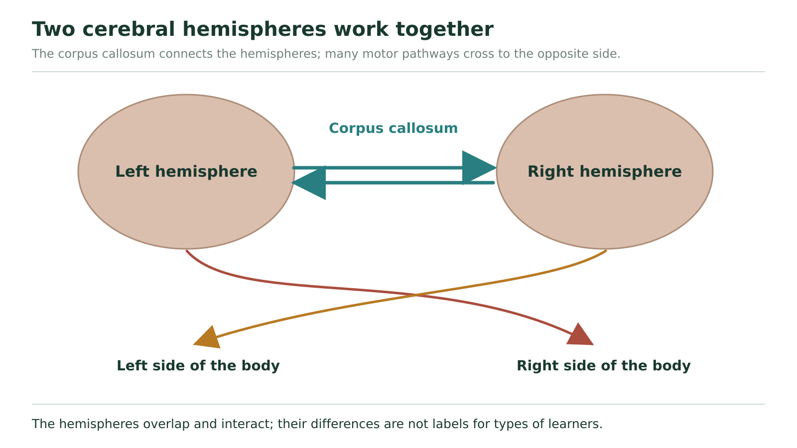

# The brain

## Find your viewpoint before finding a structure

Picking up a cup requires seeing its position, organizing a movement, sending motor output and adjusting the hand as it moves. No single brain label explains that entire task. We will locate the main structures, connect each with a job, and then use them together in a pathway.

A **lateral view** shows the side of the brain's outer surface. A **sagittal section** reveals internal structures along a front-to-back plane; the drawing below presents a near-midline view. **Anterior** means toward the front, and **posterior** toward the back. In this sagittal drawing the front is on the left, the folded cerebellum is toward the lower right, and the spinal cord continues downward from the brainstem.

**Figure 17.** Identify the major brain structures in sagittal view and connect them with the protective roles of the skull, meninges, and cerebrospinal fluid.

In Figure 17 A, use the pointer labels to locate structures. First find the large cerebrum, then the cerebellum behind the brainstem. Follow the spinal cord upward to the medulla, pons and midbrain. Next locate the thalamus above the midbrain and the hypothalamus just below the thalamus. The broad brackets at the left list organizational regions; their horizontal heights are not precise anatomical boundaries. The thalamus and hypothalamus belong to the *forebrain*, even where their drawn height lies beside the midbrain bracket.

**Three broad regions and the structures we will use**

| Region | Main structures in this lesson | Overall contribution |
| --- | --- | --- |
| Forebrain | Cerebrum, thalamus and hypothalamus | Complex processing, sensory relay and regulation of internal conditions |
| Midbrain | Upper brainstem region above the pons | Relay and functions involving visual/auditory information and eye movement |
| Hindbrain | Cerebellum, pons and medulla oblongata | Coordination, relay and important automatic functions |

In Figure 17 B, locate skull, meninges and CSF outside the nervous tissue. These are protective surroundings, not extra lobes of the cerebrum. The tiny anatomical boundaries are simplified; use the labelled relationships, not apparent layer thicknesses, to interpret them.

## Structures contribute different kinds of control

The **cerebellum** helps coordinate movement, balance and fine motor control. It uses information about the body's position and movement to help adjust motor activity. This is why “a command was sent” and “the movement was smooth and accurately directed” are different accomplishments.

The **medulla oblongata** connects the brain with the spinal cord and contains centres involved in automatic regulation of breathing, heart activity and blood pressure, as well as swallowing and coughing. The **pons**, above it, relays information among brain regions and contributes to functions including breathing and sleep/arousal. The **midbrain**, above the pons, participates in relay, visual and auditory functions and eye movement. Automatic control and communication continue while a person performs a deliberate task.

The **thalamus** is an important relay for sensory and other information between brain regions. The **hypothalamus** helps regulate internal conditions, including temperature, hunger and thirst, and coordinates autonomic and endocrine responses. Its connection with the **pituitary gland** links nervous control with hormone signalling. These structures are beneath the large cerebral hemispheres in the internal view, not visible as separate outer lobes in a lateral surface view.

Homeostatic functions involve coordinated networks. Temperature regulation, water balance and thirst, energy-related hunger, heart activity, blood pressure and breathing illustrate the range. Do not infer that one listed structure carries out each entire pathway alone.

## The cerebral surface is a folded processing layer

The **cerebrum** consists of left and right hemispheres. Its outer **cerebral cortex** is grey matter. Folding increases the surface area that fits within the skull. The cortex participates in perception, thought, memory, language and planned actions; its areas work in connected networks.

**Figure 18.** Locate the lobes and key functional areas of the cerebral cortex, then compare them with the motor cortex body map.

Figure 18 A is a lateral view of the left side. Here the front is to the left and the back to the right. Find the yellow **frontal lobe** at the front, the blue **parietal lobe** behind it, the green **temporal lobe** below, and the pink **occipital lobe** at the back. Colour identifies regions in this drawing; the living brain does not have those four paint colours.

The frontal lobe participates in reasoning, planning, aspects of memory and personality, and control of voluntary movement. The parietal lobe processes body-sensation and position information. The temporal lobe participates in hearing, language and memory. The occipital lobe is especially associated with visual processing. These are useful functional associations, not sealed compartments with no interaction.

For language, locate **Broca's area** in the frontal region and **Wernicke's area** toward the posterior temporal region in the figure. Broca's area is associated particularly with producing and organizing speech; Wernicke's area with language comprehension. These classic areas are usually discussed in the language-dominant hemisphere, commonly the left, and operate within broader networks. Damage can affect production or understanding in different ways; a two-label map does not justify predicting complete language loss in every person.

## A large hand on a cortex map is not a large physical hand

Find the red primary motor strip in the frontal lobe, just in front of the blue primary somatosensory strip in the parietal lobe. The **primary motor area** contributes to controlling movement. The **primary somatosensory area** receives and processes body-sensation information. Their closeness does not make them the same function.

Figure 18 B is a motor-cortex body map. The hand, face and tongue occupy disproportionately large representations because their movements require detailed control. A large drawn body part indicates a relatively large cortical representation, not the physical size of that body part or the amount of muscle force it produces. The sensory map is also uneven, but it concerns sensory representation rather than motor control.

### Explain a coordinated cup movement

Light from the scene supplies visual information; occipital processing contributes to locating the cup. Connected processing, including frontal regions, helps plan the chosen movement. Motor-cortex output influences pathways that carry commands toward the hand's skeletal muscles. Body-position and touch information provides feedback, and the cerebellum contributes to coordinating and adjusting the movement. Brainstem centres continue supporting functions such as breathing throughout.

This is a simplified cooperative account, not a strict single-file route through every named structure. “The cerebellum picks up the cup” would omit planning, output and sensory information. “The motor cortex alone does everything” would omit the information and adjustments needed for a well-directed movement.

### Interpret a cortical representation

A schematic motor map devotes a larger region to the fingers than to the trunk. A learner concludes, “Finger muscles must be physically larger and stronger than trunk muscles.” Evaluate that inference. Then explain why identifying the corresponding body-sensation area would require the somatosensory map rather than simply relabelling the motor strip.

**Your explanation**

[In-place response field]

Hint

Ask what size represents in this particular diagram. It is a map of cortical allocation, not a photograph of muscles.

Compare with the model after your attempt

The inference is unsupported. A larger finger representation indicates a relatively large allocation for fine motor control, not larger muscles or greater force. A somatosensory map concerns representation of sensory information from body regions. It lies in the parietal sensory area, whereas the primary motor strip lies in the frontal lobe. Both are uneven body maps, but their functions are different.

**Check your reasoning:** Distinguish cortical area from muscle size/force and identify the two regions and functions.

**If your answer differs:** If you used “more important” without explanation, replace it with the relevant demand: fine movement control for the motor map, sensory processing for the sensory map.

## Communication between sides and crossing toward the body

The **corpus callosum** is a bundle of nerve fibres connecting the cerebral hemispheres. It lets information be shared between them. Many major motor pathways from the cortex cross on their way toward the opposite side of the body, including important crossings in the brainstem. These are two different connections.

**Figure 19.** The horizontal connection represents communication through the corpus callosum. Crossing pathways illustrate the opposite-side motor relationship described in the textbook.

In Figure 19, trace the horizontal connection between hemispheres: that represents the corpus callosum. Then trace a crossing motor route from one hemisphere toward the opposite body side. Do not substitute one arrow for the other. Communication between hemispheres is not the same thing as the crossing of a descending motor pathway.

### Apply a stated motor-pathway model

Suppose a diagram specifies that a motor command begins in the right cerebral motor cortex, crosses once in the brainstem and reaches left-side skeletal muscles. A disruption before that crossing would affect the represented left-side output. The reasoning comes from following the actual crossing, not from a rule that every right-side nervous structure controls the left side. A change after the crossing would need its own location-based trace.

Some functions show stronger association with one hemisphere, but complex tasks involve cooperation. The existence of functional differences does not sort students into fixed “left-brained” and “right-brained” learner types.

### Distinguish two missing functions

Use these hypothetical records, with all unstated functions assumed intact. In A, visual information about a target is available, a planned motor command reaches the muscle, and the limb moves, but the modelled coordination and adjustment process is disrupted. In B, the motor and coordination pathways remain intact, but a connection carrying information between the two cerebral hemispheres is interrupted. Which structure's taught role is most directly relevant in each model? Explain why the records do not identify the same problem, and state one limit on applying them to an actual person.

**Your explanation**

[In-place response field]

Hint

Separate adjustment of movement from transfer between hemispheres. Use the record's confirmed working stages.

Compare with the model after your attempt

A points to the cerebellum's coordination and adjustment role in this simplified comparison. B points to the corpus callosum's interhemispheric communication role. A already has an arriving command and movement, so its named missing job is coordination rather than simple command transmission. B concerns exchange between hemispheres, not the crossing of a motor tract to a body side. Real difficulties can involve wider networks and several causes; these stipulated records do not provide a clinical diagnosis.

**Check your reasoning:** Match both roles, use working-stage evidence, distinguish interhemispheric communication from motor crossing, and state the model limit.

**If your answer differs:** If both answers were “cerebrum,” locate the more specific missing operation. If one observation became a definite diagnosis, restore the supplied-model boundary.

## Use a structure name to support an explanation

A useful answer locates a structure, states its contribution and connects that contribution to the observation. For the cup movement, that means visual information, planning, motor output and adjustment working together. A list of labels becomes an explanation only when the relationships are supplied.

Optional: other connected forebrain structures

The hippocampus participates in learning and memory, the amygdala in emotion-related processing, and basal ganglia in functions including movement control. The reticular formation is a network in the brainstem associated with arousal and information processing. These examples reinforce that broad experiences such as memory and emotion are not stored in one isolated lobe. They are additional context, not replacements for the main structures above.

How do we know that a structure contributes to a function? Next we will compare the evidence from anatomy, injuries, stimulation and imaging, including what each method can and cannot establish.
