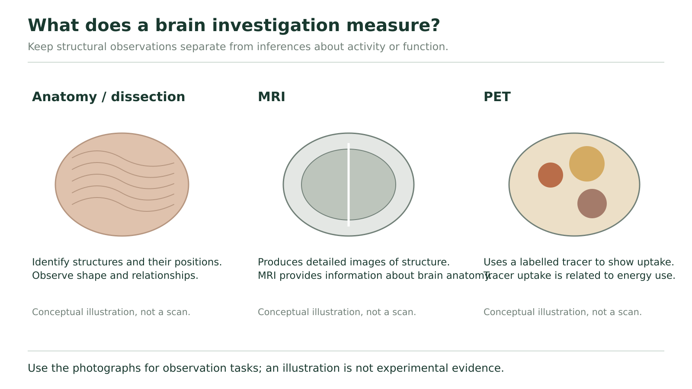

# Studying the brain

## Choose a method that can answer the question

A detailed picture of a brain can show anatomy without telling you exactly what its owner was thinking. A record of changing activity can reveal a relationship with a task without proving that one region performs the whole task alone. To interpret an investigation, ask four questions: What was measured? What comparison was made? What conclusion follows? What remains uncertain?

**Anatomy and dissection** reveal structures and their positions. A surface view can show cortical folds; a section can reveal internal structures such as the corpus callosum. Seeing a structure does not directly show its activity at that moment. Photographs and models can support identification without requiring a learner to perform a dissection.

**Injury or lesion studies** compare a damaged region with changes in function. Historical observations after Phineas Gage's frontal injury contributed to questions about frontal-lobe function and behaviour. However, an injury can affect several tissues and their connections, and the observer may have limited evidence about the person's earlier state. One case supports investigation; it does not prove every function of a region or diagnose another person.

**Stimulation** changes activity at a selected site and observes what follows. Wilder Penfield's work linked stimulation of cortical areas with movements, sensations and reported experiences. This adds an intervention rather than relying only on a naturally occurring injury. Still, a response can involve connected regions, so stimulating one site does not show that an entire experience is stored only there.

### Observation, inference and limit

Consider a hypothetical classroom record: stimulation at site P is followed by a finger movement on three trials; stimulation at nearby site Q is not followed by that movement. The stimulus conditions are otherwise stated to be the same.

The observation is the different movement response at P and Q. A supported inference is that activating P can influence the motor pathway for that movement under the tested conditions. The nearby comparison makes “any stimulation anywhere produces the same movement” less plausible. The record does not establish that P alone plans the movement, that Q has no function, or that every person's functional map is identical. It also does not report what happens when P is inactive, so it does not by itself prove that P is necessary for all versions of the movement.

**Match the measurement to the kind of question**

| Method | Information obtained | A limit to remember |
| --- | --- | --- |
| EEG | Electrical activity recorded with electrodes at the scalp over time | Not a detailed anatomical photograph or a direct transcript of thought |
| CT | X-ray measurements reconstructed into cross-sectional structural images | A structural difference alone does not explain every functional consequence |
| MRI | Signals produced using magnetic fields and radiofrequency energy, yielding detailed tissue images | An anatomical image is not automatically a measurement of task-related activity |
| PET | Distribution of a radioactive tracer; meaning depends on the tracer and comparison | A tracer-related signal is an indirect measure, not the thought itself |

A conventional plain skull X-ray is different from a CT scan. CT uses X-rays and can be useful for imaging the head; it is inaccurate to say that all X-ray technology is useless for studying the brain. MRI does not use X-rays. Functional MRI is a specialized method that uses blood-oxygen-related changes to infer activity, so distinguish it from the structural MRI comparison here. [More about CT](https://www.nibib.nih.gov/science-education/science-topics/computed-tomography-ct) and [MRI](https://www.nibib.nih.gov/science-education/science-topics/magnetic-resonance-imaging-mri).

### Choose evidence and limit the conclusion

A research team asks two different questions: A, “Where is a particular internal structure relative to nearby tissue?” and B, “How does recorded brain electrical activity change from a quiet interval to a task interval?” Choose a suitable method from the table for each. Explain what it supplies and name one conclusion it would not establish by itself.

**Your explanation**

[In-place response field]

Hint

Match position with anatomical information and change over time with the stated electrical measurement. A method can be useful without answering every question.

Compare with the model after your attempt

A structural MRI or CT image can help locate the internal structure relative to neighbouring tissue. It would not by itself reveal the person's exact thought or prove the structure's complete function. EEG matches B because it records electrical activity over time, allowing the two intervals to be compared. That record alone does not supply a detailed anatomical image or establish that the task is the only cause of any difference.

**Check your reasoning:** Choose a justified structural method for A and EEG for B; identify both measurement and limitation.

**If your answer differs:** If you selected a scan simply because it looks detailed, state which variable it actually measures. Several methods can contribute to one investigation, but their outputs are not interchangeable.

## Read an actual image with its caption

**Figure 20.** These three drawings compare types of evidence; they are not generated substitutes for actual scans or laboratory observations.

Figure 20 organizes types of evidence. Its three drawings are conceptual comparisons, not actual scans. Use them to keep structural observation and tracer-related activity inference distinct. For an image-reading task, we need the actual image and its stated key.

Textbook Figure 11.32, printed page 394. Read the original task labels and colour explanation alongside the source image.

The four source panels are labelled Hearing, Seeing, Speaking and Thinking. First identify the task label, then read the colour explanation in the caption. In this particular display, red, orange and yellow represent the caption's high, medium and low activity categories. Those are this display's categories, not a universal colour scale used by every scan. The caption does not give a numerical key for every displayed colour.

In this textbook PET example, a glucose-related radioactive tracer provides information associated with energy use. Neurons and supporting cells need energy for ongoing activity; the image uses tracer-related differences as evidence about activity. It does not photograph individual action potentials. Other PET tracers can be used to study other processes, so “PET always means the same glucose measurement” would be too broad. [PET and tracer measurements](https://www.nibib.nih.gov/science-education/science-topics/nuclear-medicine).

### Compare Hearing with Seeing without reading a mind

Start with an observation: the coloured pattern in the Hearing panel is distributed differently from the pattern in Seeing. In the Seeing panel, the prominent warm-coloured cluster is toward the rear of the displayed brain outline; in Hearing, prominent coloured regions appear farther toward the lower middle. These are visible differences in the source display.

Connect the observation to the stated measurement: the source interprets the different colours as different activity levels associated with the named tasks. The rear cluster in the Seeing panel is consistent with the occipital lobe's visual-processing role. It is not evidence that only the occipital lobe works during vision. Nor does it identify the exact object being seen.

Finally inspect what is missing: the crop gives no participant count, trial variability, numerical tracer values or full control condition. We can interpret the illustration at the stated level, but cannot calculate an effect size, prove a universal map, or diagnose a person from these four pictures.

### A comparison can disappear even when an image remains

The following is a hypothetical dataset, not numbers extracted from Figure 11.32. An investigator reports a normalized tracer-related index from the same defined region; higher index means more tracer-related signal under this model. Quiet comparison trials give 10, 11 and 9 arbitrary units. Task trials give 15, 14 and 16 units. A later report publishes only one task value, 15, without the quiet values.

For the full record, calculate each condition's mean and give a cautious task-related conclusion. Identify one alternative influence or missing design detail. Then explain why the isolated value 15 cannot support the same within-study comparison. Do not claim that 15 is a disease threshold.

**Your explanation**

[In-place response field]

Hint

Each mean is the sum divided by three. Ask what the comparison values contribute that one task value lacks.

Compare with the model after your attempt

The quiet mean is (10+11+9)÷3 =10 arbitrary units. The task mean is (15+14+16)÷3 =15 units. The observed mean is higher during the task in this hypothetical record, consistent with a task-associated increase in the measured signal. We would still need details such as consistent measurement settings, participant/sample information, task order or other concurrent activity before making a strong causal claim. A lone 15 has no supplied baseline, variability or normal-range context, so it cannot show how much this condition changed relative to that study's quiet condition. It is not a diagnostic threshold.

**Check your reasoning:** Compute both means with units, state the measured association, name a relevant limit, and explain the missing comparison.

**If your answer differs:** If your conclusion says “the task caused all of this region’s activity,” separate higher signal from exclusive cause. If you labelled 15 abnormal, identify the absent reference that would be required for that claim.

Some source review questions ask about nutrient needs or protective fluids. Connect those to mechanisms already taught: ATP-dependent maintenance requires energy; bone, meninges and CSF provide different protective roles; blood-to-brain exchange is selective. CSF surrounds the CNS and is a different sampling compartment from blood. A sample from one compartment is not automatically equivalent to a sample from another; the choice and interpretation of actual medical tests require clinical evidence.

An effective investigation matches method with question and keeps observation, inference and uncertainty visible. In the chapter review, use that same discipline to join membrane events, synaptic communication and whole-system pathways.
