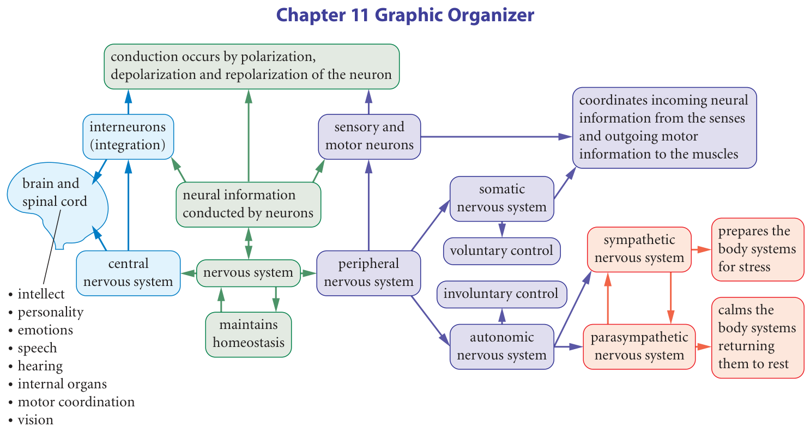

# Chapter review and final check

## Build one explanation across three scales

How does a detected change become a coordinated response? Answer at three linked scales: the body pathway, the membrane of each signalling cell, and the junction between cells. Naming one scale cannot replace the others. “The motor neuron carries a message” identifies a route; it does not yet explain its electrical event or how it activates an effector.

Chapter 11 Graphic Organizer, textbook p. 401. Compare the connections with your own chapter notes before completing the review.

Start at “nervous system” in the graphic organizer. Follow the CNS and PNS branches, then use the neural-conduction branch to connect the system map with cell processes. The somatic branch's “voluntary control” is a useful shorthand for many actions, but somatic output also controls skeletal-muscle reflexes. Add that qualification when using the organizer. Similarly, sympathetic and parasympathetic effects depend on the organ; their balance is continuing regulation, not an on/off switch for the body.

### Explain a withdrawal without skipping the membrane or synapse

Use this simplified case: a potentially harmful stimulus at a finger activates a sensory pathway, a local spinal circuit recruits a motor neuron, and the appropriate skeletal muscle contracts to withdraw the hand. The represented pathway is intact.

**1. Detection and direction.** A receptor detects the stimulus and changes signalling in the sensory pathway. Information travels toward the spinal cord, so this is sensory input. The stimulus itself does not flow down the nerve. The nerve contains bundled axons that carry related electrical signals.

**2. The membrane event.** Each firing axon begins from maintained ion gradients and selective membrane permeability. Sufficient depolarization reaches threshold. Na⁺ entry drives a regenerative rise; Na⁺-channel inactivation and K⁺ efflux contribute to the fall. Recovery constrains immediate repeat firing. Local current brings the next ready region to threshold. In myelinated axons the event is regenerated at nodes while electrical change spreads under the sheath.

**3. The cellular handover.** At a chemical synapse, arriving depolarization opens terminal Ca²⁺ channels. Calcium entry triggers vesicle fusion and transmitter release. The transmitter crosses the cleft, binds receptors and changes postsynaptic ion movement. Excitatory and inhibitory effects combine; firing is conditional on the resulting voltage and channel state. The impulse is not the same electrical event simply jumping across the cleft.

**4. Integration and output.** In the spinal withdrawal model, local interneuron connections can activate the motor pathway before conscious awareness. An ascending pathway also carries information toward the brain. Motor output travels to skeletal muscle, so this is somatic output even though the initial withdrawal is not deliberately chosen.

**5. Effector and ending.** At the skeletal neuromuscular junction, acetylcholine activates the muscle membrane and contributes to contraction. Cholinesterase helps end ACh's signal by breaking it down. The hand's movement reduces contact with the stimulus. This explains a response, while the separate ascending route allows further brain processing.

The chain includes structure, event and consequence at each step. A weakness anywhere could change the final response, so “no movement” alone does not identify where the failure occurred.

### Find the missing link from supplied evidence

In a hypothetical pathway, a sensory signal reaches the spinal circuit and a motor action potential reaches the terminal beside a muscle. The muscle membrane responds normally when its ACh receptors are directly activated in the model. During usual motor stimulation, however, no ACh is detected in the cleft. Which link is most directly implicated? Explain why damaged myelin along the motor axon and an unresponsive muscle membrane do not fit the stated evidence as the immediate missing link. Name one further observation that would help distinguish possible causes within the implicated stage.

**Your explanation**

[In-place response field]

Hint

Find the last confirmed event and the next missing one. The evidence narrows a region, not necessarily one protein.

Compare with the model after your attempt

The failure is at or before terminal transmitter release after the arriving motor action potential. Its arrival shows that the represented axonal conduction succeeded. The normal response to direct receptor activation argues against failure of the tested receiving-membrane machinery. Within the terminal, absent Ca²⁺ entry, unavailable transmitter or failed vesicle fusion could still be investigated. Observing whether Ca²⁺ enters during arrival would help distinguish an early release trigger from later release machinery. These are proposed observations within a model, not laboratory instructions.

**Check your reasoning:** Use all three observations, locate release rather than the whole neuron, and propose a discriminating observation without claiming an exact diagnosis.

**If your answer differs:** If you named one molecule with certainty, identify the observation that distinguishes it from the remaining terminal possibilities. If you selected the muscle, account for its normal response in the supplied comparison.

## Keep stimulus setting, membrane threshold and muscle output distinct

A **membrane threshold** is the membrane-voltage condition at which a regenerative action potential is initiated. The voltage or intensity setting of an external stimulator is a different quantity. A statement such as “the smallest tested effective stimulus was 2 mV” does not mean that the axon's membrane threshold was +2 mV.

A table with one tested setting that fails and a larger one that succeeds gives a bound, not necessarily an exact threshold. Under a consistent, monotonic model, a failure at 1 mV and success at 2 mV place the effective stimulus threshold above 1 and at or below 2 mV;2 mV is the smallest successful setting *tested*. Settings between them were not measured.

The original single-motor-neuron/single-fibre review model also holds other conditions fixed. In that model, a stronger above-threshold stimulus does not make the neuron's individual action potential larger. Do not transfer the model to a whole muscle without considering recruitment, firing frequency and other conditions affecting force.

### Separate a changed population from a changed spike

This hypothetical record compares two stimulus settings in a model pathway. All action potentials have the same amplitude, and all trials last 0.50 s.

| Setting | Active motor neurons | Events per active neuron | Recorded model output |
| --- | --- | --- | --- |
| A | 2 | 5 | 4 arbitrary force units |
| B | 4 | 5 | 7 arbitrary force units |

Compare frequency per active neuron, recruitment and output. Explain why increased output is consistent with an unchanged individual action-potential amplitude. Can the two rows prove an exact linear force-per-neuron law or establish the membrane threshold? Explain.

**Your explanation**

[In-place response field]

Hint

The time and events per neuron are unchanged. Count active neurons separately, and avoid inferring a mechanism that was not measured.

Compare with the model after your attempt

Both settings produce 5÷0.50=10 events/s per active neuron. Recruitment increases from 2 to 4 active neurons and the recorded output increases from 4 to 7 force units. More participating motor pathways can produce greater output without taller individual spikes; the premise explicitly fixes amplitude. Two output rows do not establish an exact linear law, and they contain no membrane-voltage measurements from which to identify threshold. The record supports the stated comparison, not every possible input-output rule.

**Check your reasoning:** Calculate both rates, identify recruitment rather than rate/amplitude change, and state both inference limits.

**If your answer differs:** If you called B “twice as strong because there are twice as many neurons,” check the actual output and avoid inventing a proportionality law. If you changed spike height, return to the stipulated identical amplitudes.

## Use the right connection in the final check

The corpus callosum connects the cerebral hemispheres. A seizure involves abnormal electrical activity in brain networks; in some cases, activity can spread between hemispheres through connecting pathways. Interrupting callosal connections can limit that spread in selected cases. It does not necessarily remove the site where a seizure begins or guarantee that all seizures stop. This is a structure-to-communication explanation, not a recommendation about an individual's treatment. [NINDS: epilepsy and seizures](https://www.ninds.nih.gov/node/647).

For the final written explanation, connect the structure with its ordinary job, then explain how interrupting that connection can change spread. Do not replace the reasoning with “the brain stops working” or confuse the corpus callosum with the crossing of motor pathways to opposite body sides.

## Keep the limits of review models visible

**One lobe and memory:** memory involves connected regions, including temporal and frontal contributions and other structures. A prompt asking for a lobe is a simplified comparison of functions; it does not establish that all memory is stored in one lobe. Explain the particular role you mean rather than making a universal claim.

**A robotic arm:** the photograph shows a device, not a complete wiring diagram. In a model with recorded motor-related brain signals controlling a machine, distinguish biological signals from the controller and the device's motors. An artificial arm is not made to move by the robot's own skeletal muscles. Any proposed flowchart should label which links are supplied by the question and which are model assumptions.

**A domino chain:** one local event triggering the next can help model propagation, and an adequate initial push can help model threshold. But a real neuron maintains electrochemical gradients using cellular energy; its signal depends on membrane channels and recovery. Dominoes do not represent neurotransmitter receptors, selective membrane permeability or every detail of refractory behaviour. State the useful correspondence and the limitation.

**Protective fluid and blood:** the meninges surround the CNS; CSF and blood are different compartments; selective barriers help maintain distinct environments. A question about CSF evidence should not be answered by calling the meninges the blood–brain barrier or claiming that blood tests can never provide useful medical information.

**Pain and thresholds:** a neuron's threshold helps explain whether it fires, but a person's pain experience is not determined by one universal threshold value. Detection, signalling and brain processing are different levels. A higher tolerance reported by one person cannot be converted directly into a measured membrane threshold.

**A reduced acetylcholine effect:** when a question stipulates that effective ACh signalling at a skeletal neuromuscular junction is reduced, trace that change to less reliable muscle excitation and impaired contraction. The mechanistic prediction must stay within the stipulated target and process. A short classroom case is not enough for a diagnosis or a prediction of every symptom.

## Check an explanation before you call it complete

Use this short review of your own reasoning: Did you name the stimulus and responding structure? Did you distinguish the direction of information? Did you connect membrane events with synaptic handover? If an observation was supplied, did you use it rather than simply list terms? If the conditions changed, did your prediction change at the affected link? Did you state what the evidence leaves unresolved?

Complete the existing required final check using its own controls. Written responses are saved work, not automatic proof of scientific correctness. The optional source questions remain optional practice; choose the ones that address a gap in your understanding. If a response asks for a diagram or table, make the relationships clear in the response or use the course's established directions for that form of work.

The chapter's central answer is now connected: receptors detect changes, neuronal membranes regenerate electrical signals, chemical synapses transfer and integrate influences, central pathways organize responses, and peripheral output reaches specific effectors. A strong explanation follows that connection and uses evidence to decide which part changed.
